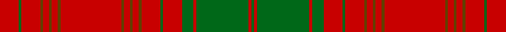

This page is one **sett** — a single exact thread-count. It belongs to the [tartan](/setts/r13g2r13dy2r4dy2r4dy2r42dy2r4dy2r4dy2r13g2r13g8r2g36r2g2/)
(the same proportion at any scale), whose colour order is pattern [GRGRGRGRGRGRGRGRGRGRGR](/stripes/grgrgrgrgrgrgrgrgrgrgr/).

Part of the [Unidentified Cant](/tartans/unidentified-cant/) tartan — the named design grouping this sett with its other cloths.

Sourced from register-of-tartans.  It is a [22 stripe tartan](/stripes/stripes22/).

Original link https://www.tartanregister.gov.uk/tartanDetails.aspx?ref=4283

## Also known as

This cloth is also recorded under:

- Unidentified Cant #01
- Unidentified Cant #03
- Unidentified Cant #04
- Unidentified Cant #05
- Unidentified Cant #06
- Unidentified Cant #07
- Unidentified Cant #08
- Unidentified Cant #09
- Unidentified Cant #10
- Unidentified Cant #11
- Unidentified Cant #12
- Unidentified Cant #13
- Unidentified Cant #14

## Register references

External register numbers recorded for this tartan.

- Scottish Register of Tartans: [4283](https://www.tartanregister.gov.uk/tartanDetails.aspx?ref=4283)
- Scottish Tartans Authority (ITI): 5865

## Thread count
R/26 Ga4 R26 T4 R8 T4 R8 T4 R84 T4 R8 T4 R8 T4 R26 Ga4 R26 Ga16 R4 Ga72 R4 Ga/4

One full sett is **674 threads**.

## Palette

Palette: <strong>Tartan Register</strong>
<table><thead><tr><th>Colour</th><th>Threads</th><th>Shade</th><th>Base</th><th>OKLCh</th></tr></thead><tbody><tr><td>R/</td><td style="text-align:right;font-variant-numeric:tabular-nums">26</td><td><code style="background-color:#C80000;">#C80000</code> <small style="color:#888">#C80000</small></td><td>R <code style="background-color:#CC0000;">#CC0000</code></td><td><small style="color:#888">oklch(52.3% 0.215 29.2)</small></td></tr><tr><td>Ga</td><td style="text-align:right;font-variant-numeric:tabular-nums">4</td><td><code style="background-color:#006818;">#006818</code> <small style="color:#888">#006818</small></td><td>G <code style="background-color:#006100;">#006100</code></td><td><small style="color:#888">oklch(45.0% 0.142 145.0)</small></td></tr><tr><td>R</td><td style="text-align:right;font-variant-numeric:tabular-nums">26</td><td><code style="background-color:#C80000;">#C80000</code> <small style="color:#888">#C80000</small></td><td>R <code style="background-color:#CC0000;">#CC0000</code></td><td><small style="color:#888">oklch(52.3% 0.215 29.2)</small></td></tr><tr><td>T</td><td style="text-align:right;font-variant-numeric:tabular-nums">4</td><td><code style="background-color:#604000;">#604000</code> <small style="color:#888">#604000</small></td><td>G <code style="background-color:#006100;">#006100</code></td><td><small style="color:#888">oklch(39.8% 0.083 76.8)</small></td></tr><tr><td>R</td><td style="text-align:right;font-variant-numeric:tabular-nums">8</td><td><code style="background-color:#C80000;">#C80000</code> <small style="color:#888">#C80000</small></td><td>R <code style="background-color:#CC0000;">#CC0000</code></td><td><small style="color:#888">oklch(52.3% 0.215 29.2)</small></td></tr><tr><td>T</td><td style="text-align:right;font-variant-numeric:tabular-nums">4</td><td><code style="background-color:#604000;">#604000</code> <small style="color:#888">#604000</small></td><td>G <code style="background-color:#006100;">#006100</code></td><td><small style="color:#888">oklch(39.8% 0.083 76.8)</small></td></tr><tr><td>R</td><td style="text-align:right;font-variant-numeric:tabular-nums">8</td><td><code style="background-color:#C80000;">#C80000</code> <small style="color:#888">#C80000</small></td><td>R <code style="background-color:#CC0000;">#CC0000</code></td><td><small style="color:#888">oklch(52.3% 0.215 29.2)</small></td></tr><tr><td>T</td><td style="text-align:right;font-variant-numeric:tabular-nums">4</td><td><code style="background-color:#604000;">#604000</code> <small style="color:#888">#604000</small></td><td>G <code style="background-color:#006100;">#006100</code></td><td><small style="color:#888">oklch(39.8% 0.083 76.8)</small></td></tr><tr><td>R</td><td style="text-align:right;font-variant-numeric:tabular-nums">84</td><td><code style="background-color:#C80000;">#C80000</code> <small style="color:#888">#C80000</small></td><td>R <code style="background-color:#CC0000;">#CC0000</code></td><td><small style="color:#888">oklch(52.3% 0.215 29.2)</small></td></tr><tr><td>T</td><td style="text-align:right;font-variant-numeric:tabular-nums">4</td><td><code style="background-color:#604000;">#604000</code> <small style="color:#888">#604000</small></td><td>G <code style="background-color:#006100;">#006100</code></td><td><small style="color:#888">oklch(39.8% 0.083 76.8)</small></td></tr><tr><td>R</td><td style="text-align:right;font-variant-numeric:tabular-nums">8</td><td><code style="background-color:#C80000;">#C80000</code> <small style="color:#888">#C80000</small></td><td>R <code style="background-color:#CC0000;">#CC0000</code></td><td><small style="color:#888">oklch(52.3% 0.215 29.2)</small></td></tr><tr><td>T</td><td style="text-align:right;font-variant-numeric:tabular-nums">4</td><td><code style="background-color:#604000;">#604000</code> <small style="color:#888">#604000</small></td><td>G <code style="background-color:#006100;">#006100</code></td><td><small style="color:#888">oklch(39.8% 0.083 76.8)</small></td></tr><tr><td>R</td><td style="text-align:right;font-variant-numeric:tabular-nums">8</td><td><code style="background-color:#C80000;">#C80000</code> <small style="color:#888">#C80000</small></td><td>R <code style="background-color:#CC0000;">#CC0000</code></td><td><small style="color:#888">oklch(52.3% 0.215 29.2)</small></td></tr><tr><td>T</td><td style="text-align:right;font-variant-numeric:tabular-nums">4</td><td><code style="background-color:#604000;">#604000</code> <small style="color:#888">#604000</small></td><td>G <code style="background-color:#006100;">#006100</code></td><td><small style="color:#888">oklch(39.8% 0.083 76.8)</small></td></tr><tr><td>R</td><td style="text-align:right;font-variant-numeric:tabular-nums">26</td><td><code style="background-color:#C80000;">#C80000</code> <small style="color:#888">#C80000</small></td><td>R <code style="background-color:#CC0000;">#CC0000</code></td><td><small style="color:#888">oklch(52.3% 0.215 29.2)</small></td></tr><tr><td>Ga</td><td style="text-align:right;font-variant-numeric:tabular-nums">4</td><td><code style="background-color:#006818;">#006818</code> <small style="color:#888">#006818</small></td><td>G <code style="background-color:#006100;">#006100</code></td><td><small style="color:#888">oklch(45.0% 0.142 145.0)</small></td></tr><tr><td>R</td><td style="text-align:right;font-variant-numeric:tabular-nums">26</td><td><code style="background-color:#C80000;">#C80000</code> <small style="color:#888">#C80000</small></td><td>R <code style="background-color:#CC0000;">#CC0000</code></td><td><small style="color:#888">oklch(52.3% 0.215 29.2)</small></td></tr><tr><td>Ga</td><td style="text-align:right;font-variant-numeric:tabular-nums">16</td><td><code style="background-color:#006818;">#006818</code> <small style="color:#888">#006818</small></td><td>G <code style="background-color:#006100;">#006100</code></td><td><small style="color:#888">oklch(45.0% 0.142 145.0)</small></td></tr><tr><td>R</td><td style="text-align:right;font-variant-numeric:tabular-nums">4</td><td><code style="background-color:#C80000;">#C80000</code> <small style="color:#888">#C80000</small></td><td>R <code style="background-color:#CC0000;">#CC0000</code></td><td><small style="color:#888">oklch(52.3% 0.215 29.2)</small></td></tr><tr><td>Ga</td><td style="text-align:right;font-variant-numeric:tabular-nums">72</td><td><code style="background-color:#006818;">#006818</code> <small style="color:#888">#006818</small></td><td>G <code style="background-color:#006100;">#006100</code></td><td><small style="color:#888">oklch(45.0% 0.142 145.0)</small></td></tr><tr><td>R</td><td style="text-align:right;font-variant-numeric:tabular-nums">4</td><td><code style="background-color:#C80000;">#C80000</code> <small style="color:#888">#C80000</small></td><td>R <code style="background-color:#CC0000;">#CC0000</code></td><td><small style="color:#888">oklch(52.3% 0.215 29.2)</small></td></tr><tr><td>Ga/</td><td style="text-align:right;font-variant-numeric:tabular-nums">4</td><td><code style="background-color:#006818;">#006818</code> <small style="color:#888">#006818</small></td><td>G <code style="background-color:#006100;">#006100</code></td><td><small style="color:#888">oklch(45.0% 0.142 145.0)</small></td></tr></tbody></table>

## Compared to the master

This cloth is one sett of its design; the master sett (the exemplar the design is anchored on) is below for comparison.

<figure style="margin:0"><figcaption style="color:#888;font-size:smaller">this sett</figcaption></figure>
<figure style="margin:0"><figcaption style="color:#888;font-size:smaller"><a href="/setts/db80r56dg3r56dg88r64db3r4dg3r4db3r64/">master sett →</a></figcaption></figure>

## Nearest tartans

The nearest existing variants by ΔTartan distance, with this tartan at the top so the swatches line up against it.

ΔTartan

Tartan

Sett

—

<a href="/ttd/edit/#slug=r13g2r13dy2r4dy2r4dy2r42dy2r4dy2r4dy2r13g2r13g8r2g36r2g2~x2">Unidentified Cant #05</a> <a class="nn-out" href="/variants/s22/r13g2r13dy2r4dy2r4dy2r42dy2r4dy2r4dy2r13g2r13g8r2g36r2g2~x2/" title="open its dictionary page">↗</a>

1.12

<a href="/ttd/edit/#slug=r20g2r2g2r2g2r19db1ly1r2db4r2ly1db1r2g18r2db1ly1r19~x2&amp;base=r13g2r13dy2r4dy2r4dy2r42dy2r4dy2r4dy2r13g2r13g8r2g36r2g2~x2">Munro</a> <a class="nn-out" href="/variants/s20/r20g2r2g2r2g2r19db1ly1r2db4r2ly1db1r2g18r2db1ly1r19~x2/" title="open its dictionary page">↗</a>

1.18

<a href="/ttd/edit/#slug=g19r7g7r7g7r14db3r3g19r3db3r66db7r14~x2&amp;base=r13g2r13dy2r4dy2r4dy2r42dy2r4dy2r4dy2r13g2r13g8r2g36r2g2~x2">MacGillivray</a> <a class="nn-out" href="/variants/s14/g19r7g7r7g7r14db3r3g19r3db3r66db7r14~x2/" title="open its dictionary page">↗</a>

1.21

<a href="/ttd/edit/#slug=r26g3r3g3r3g3r26db1ly1r3db6r3ly1db1r3g26r3db1ly1r13~x4&amp;base=r13g2r13dy2r4dy2r4dy2r42dy2r4dy2r4dy2r13g2r13g8r2g36r2g2~x2">Munro</a> <a class="nn-out" href="/variants/s20/r26g3r3g3r3g3r26db1ly1r3db6r3ly1db1r3g26r3db1ly1r13~x4/" title="open its dictionary page">↗</a>

1.31

<a href="/ttd/edit/#slug=r3g12r2g1r1g1r4db3r1db3r28db1r3db2~x2&amp;base=r13g2r13dy2r4dy2r4dy2r42dy2r4dy2r4dy2r13g2r13g8r2g36r2g2~x2">Ross 5</a> <a class="nn-out" href="/variants/s14/r3g12r2g1r1g1r4db3r1db3r28db1r3db2~x2/" title="open its dictionary page">↗</a>

1.35

<a href="/ttd/edit/#slug=r5g25r5g2r2g2r8db6r2db6r62g2r5g5~x2&amp;base=r13g2r13dy2r4dy2r4dy2r42dy2r4dy2r4dy2r13g2r13g8r2g36r2g2~x2">Ross 4</a> <a class="nn-out" href="/variants/s14/r5g25r5g2r2g2r8db6r2db6r62g2r5g5~x2/" title="open its dictionary page">↗</a>

1.36

<a href="/ttd/edit/#slug=r24g4r2g2r2g2r12g24r1k1r24k1r1k1r6~x2&amp;base=r13g2r13dy2r4dy2r4dy2r42dy2r4dy2r4dy2r13g2r13g8r2g36r2g2~x2">MacDonell of Keppoch</a> <a class="nn-out" href="/variants/s15/r24g4r2g2r2g2r12g24r1k1r24k1r1k1r6~x2/" title="open its dictionary page">↗</a>

1.37

<a href="/variants/s32/g9r2g3r20g2r1g2r2g20r2g3r2g2r22g3ly1r3~x2/">Hebrides, Outer</a>

1.40

<a href="/ttd/edit/#slug=dg19r7dg7r7dg7r14db3r3dg19r3db3r66db7r14~x2&amp;base=r13g2r13dy2r4dy2r4dy2r42dy2r4dy2r4dy2r13g2r13g8r2g36r2g2~x2">MacGillivray #3</a> <a class="nn-out" href="/variants/s14/dg19r7dg7r7dg7r14db3r3dg19r3db3r66db7r14~x2/" title="open its dictionary page">↗</a>

1.43

<a href="/variants/s14/r54g6r5g6r10g3r2g18~x2/">Kyle (Green)</a>

1.46

<a href="/ttd/edit/#slug=w8r83g7r5g7r7g28r7g28r7g7r5g7r83w4r4w8&amp;base=r13g2r13dy2r4dy2r4dy2r42dy2r4dy2r4dy2r13g2r13g8r2g36r2g2~x2">Rothesay (Red)</a> <a class="nn-out" href="/variants/s17/w8r83g7r5g7r7g28r7g28r7g7r5g7r83w4r4w8/" title="open its dictionary page">↗</a>

## Neighbour map

Every grey dot is one of 14360 variants placed by the first two principal components of the ΔTartan feature space (44% of its variance). Red is this tartan; blue dots are its nearest — click one to open its page.

<svg viewBox="0 0 640 380" role="img" style="max-width:100%;height:auto;border:1px solid #e0e0e0;border-radius:4px;display:block" xmlns="http://www.w3.org/2000/svg"><image href="/nn/cloud.v1.png" width="640" height="380"/><a href="/variants/s20/r20g2r2g2r2g2r19db1ly1r2db4r2ly1db1r2g18r2db1ly1r19~x2/"><circle cx="440.0" cy="101.4" r="4" fill="#3465a4"><title>Munro</title></circle></a><a href="/variants/s14/g19r7g7r7g7r14db3r3g19r3db3r66db7r14~x2/"><circle cx="444.4" cy="136.7" r="4" fill="#3465a4"><title>MacGillivray</title></circle></a><a href="/variants/s20/r26g3r3g3r3g3r26db1ly1r3db6r3ly1db1r3g26r3db1ly1r13~x4/"><circle cx="425.9" cy="92.2" r="4" fill="#3465a4"><title>Munro</title></circle></a><a href="/variants/s14/r3g12r2g1r1g1r4db3r1db3r28db1r3db2~x2/"><circle cx="468.0" cy="113.6" r="4" fill="#3465a4"><title>Ross 5</title></circle></a><a href="/variants/s14/r5g25r5g2r2g2r8db6r2db6r62g2r5g5~x2/"><circle cx="481.2" cy="107.1" r="4" fill="#3465a4"><title>Ross 4</title></circle></a><a href="/variants/s15/r24g4r2g2r2g2r12g24r1k1r24k1r1k1r6~x2/"><circle cx="466.8" cy="125.2" r="4" fill="#3465a4"><title>MacDonell of Keppoch</title></circle></a><a href="/variants/s32/g9r2g3r20g2r1g2r2g20r2g3r2g2r22g3ly1r3~x2/"><circle cx="406.0" cy="104.1" r="4" fill="#3465a4"><title>Hebrides, Outer</title></circle></a><a href="/variants/s14/dg19r7dg7r7dg7r14db3r3dg19r3db3r66db7r14~x2/"><circle cx="438.0" cy="129.2" r="4" fill="#3465a4"><title>MacGillivray #3</title></circle></a><a href="/variants/s14/r54g6r5g6r10g3r2g18~x2/"><circle cx="503.5" cy="143.5" r="4" fill="#3465a4"><title>Kyle (Green)</title></circle></a><a href="/variants/s17/w8r83g7r5g7r7g28r7g28r7g7r5g7r83w4r4w8/"><circle cx="440.0" cy="108.5" r="4" fill="#3465a4"><title>Rothesay (Red)</title></circle></a><circle cx="465.1" cy="121.4" r="5" fill="#c00000"/></svg>

ID: /variants/s22/r13g2r13dy2r4dy2r4dy2r42dy2r4dy2r4dy2r13g2r13g8r2g36r2g2~x2/
