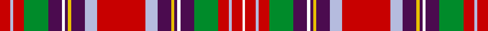

This page is one **sett** — a single exact thread-count. It belongs to the [tartan](/setts/r14lb4r14g32dp18w4dp4ly4dp18lb16r64lb16dp18ly4dp4w4dp18g32r14lb4r14w3/)
(the same proportion at any scale), whose colour order is pattern [RWRGBWBYBWRWBYBWBGRWRW](/stripes/rwrgbwbybwrwbybwbgrwrw/).

Sourced from register-of-tartans.  It is a [22 stripe tartan](/stripes/stripes22/).

Original link https://www.tartanregister.gov.uk/tartanDetails.aspx?ref=4644

## Register references

External register numbers recorded for this tartan.

- Scottish Register of Tartans: [4644](https://www.tartanregister.gov.uk/tartanDetails.aspx?ref=4644)
- Scottish Tartans Authority (ITI): 1324
- Scottish Tartans World Register: 1324

## Thread count
R/14 LB4 R14 G32 DP18 W4 DP4 LY4 DP18 LB16 R64 LB16 DP18 LY4 DP4 W4 DP18 G32 R14 LB4 R14 W/3

One full sett is **629 threads**.

## Palette
<table><thead><tr><th>Colour</th><th>Shade</th><th>OKLCh</th></tr></thead><tbody><tr><td>B</td><td><code style="background-color:#B5BBDE;">#B5BBDE</code> <small style="color:#888">#B5BBDE</small></td><td><small style="color:#888">oklch(79.9% 0.050 277.6)</small></td></tr><tr><td>DG</td><td><code style="background-color:#053819;">#053819</code> <small style="color:#888">#053819</small></td><td><small style="color:#888">oklch(30.0% 0.075 151.3)</small></td></tr><tr><td>DP</td><td><code style="background-color:#4B0B4F;">#4B0B4F</code> <small style="color:#888">#4B0B4F</small></td><td><small style="color:#888">oklch(30.1% 0.125 325.4)</small></td></tr><tr><td>G</td><td><code style="background-color:#008B2A;">#008B2A</code> <small style="color:#888">#008B2A</small></td><td><small style="color:#888">oklch(55.4% 0.170 145.9)</small></td></tr><tr><td>LB</td><td><code style="background-color:#00FCFC;">#00FCFC</code> <small style="color:#888">#00FCFC</small></td><td><small style="color:#888">oklch(89.7% 0.153 194.8)</small></td></tr><tr><td>R</td><td><code style="background-color:#C80000;">#C80000</code> <small style="color:#888">#C80000</small></td><td><small style="color:#888">oklch(52.3% 0.215 29.2)</small></td></tr><tr><td>Ra</td><td><code style="background-color:#C80000;">#C80000</code> <small style="color:#888">#C80000</small></td><td><small style="color:#888">oklch(52.3% 0.215 29.2)</small></td></tr><tr><td>W</td><td><code style="background-color:#FCFCFC;">#FCFCFC</code> <small style="color:#888">#FCFCFC</small></td><td><small style="color:#888">oklch(99.1% 0.000 89.9)</small></td></tr><tr><td>Wa</td><td><code style="background-color:#FCFCFC;">#FCFCFC</code> <small style="color:#888">#FCFCFC</small></td><td><small style="color:#888">oklch(99.1% 0.000 89.9)</small></td></tr><tr><td>Y</td><td><code style="background-color:#DCBC32;">#DCBC32</code> <small style="color:#888">#DCBC32</small></td><td><small style="color:#888">oklch(80.0% 0.150 95.2)</small></td></tr><tr><td>Ya</td><td><code style="background-color:#E8C000;">#E8C000</code> <small style="color:#888">#E8C000</small></td><td><small style="color:#888">oklch(81.9% 0.168 93.7)</small></td></tr></tbody></table>

# Sample pattern

ID: /variants/s22/r14lb4r14g32dp18w4dp4ly4dp18lb16r64lb16dp18ly4dp4w4dp18g32r14lb4r14w3~r2109032-w4000000-ly3307090/
