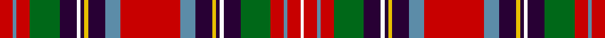

This page is one **sett** — a single exact thread-count. It belongs to the [tartan](/setts/r14t4r14g32dp18w4dp4ly4dp18t16r64t16dp18ly4dp4w4dp18g32r14t4r14w3/)
(the same proportion at any scale), whose colour order is pattern [RBRGBWBYBBRBBYBWBGRBRW](/stripes/rbrgbwbybbrbbybwbgrbrw/).

Sourced from register-of-tartans.  It is a [22 stripe tartan](/stripes/stripes22/).

Original link https://www.tartanregister.gov.uk/tartanDetails.aspx?ref=4644

## Register references

External register numbers recorded for this tartan.

- Scottish Register of Tartans: [4644](https://www.tartanregister.gov.uk/tartanDetails.aspx?ref=4644)
- Scottish Tartans Authority (ITI): 1324
- Scottish Tartans World Register: 1324

## Thread count
Ra/14 B4 Ra14 G32 DP18 Wa4 DP4 Ya4 DP18 B16 Ra64 B16 DP18 Ya4 DP4 Wa4 DP18 G32 Ra14 B4 Ra14 Wa/3

One full sett is **629 threads**.

## Palette

Palette: <strong>Tartan Register</strong> <small style="color:#888">(6 of 9 colours)</small>
<table><thead><tr><th>Colour</th><th>Threads</th><th>Shade</th><th>Base</th><th>OKLCh</th></tr></thead><tbody><tr><td>Ra/</td><td style="text-align:right;font-variant-numeric:tabular-nums">14</td><td><code style="background-color:#C80000;">#C80000</code> <small style="color:#888">#C80000</small></td><td>R <code style="background-color:#CC0000;">#CC0000</code></td><td><small style="color:#888">oklch(52.3% 0.215 29.2)</small></td></tr><tr><td>B</td><td style="text-align:right;font-variant-numeric:tabular-nums">4</td><td><code style="background-color:#5C8CA8;">#5C8CA8</code> <small style="color:#888">#5C8CA8</small></td><td>B <code style="background-color:#2A418A;">#2A418A</code></td><td><small style="color:#888">oklch(61.7% 0.067 235.0)</small></td></tr><tr><td>Ra</td><td style="text-align:right;font-variant-numeric:tabular-nums">14</td><td><code style="background-color:#C80000;">#C80000</code> <small style="color:#888">#C80000</small></td><td>R <code style="background-color:#CC0000;">#CC0000</code></td><td><small style="color:#888">oklch(52.3% 0.215 29.2)</small></td></tr><tr><td>G</td><td style="text-align:right;font-variant-numeric:tabular-nums">32</td><td><code style="background-color:#006818;">#006818</code> <small style="color:#888">#006818</small></td><td>G <code style="background-color:#006100;">#006100</code></td><td><small style="color:#888">oklch(45.0% 0.142 145.0)</small></td></tr><tr><td>DP</td><td style="text-align:right;font-variant-numeric:tabular-nums">18</td><td><code style="background-color:#280034;">#280034</code> <small style="color:#888">#280034</small></td><td>B <code style="background-color:#2A418A;">#2A418A</code></td><td><small style="color:#888">oklch(20.5% 0.100 316.9)</small></td></tr><tr><td>Wa</td><td style="text-align:right;font-variant-numeric:tabular-nums">4</td><td><code style="background-color:#FCFCFC;">#FCFCFC</code> <small style="color:#888">#FCFCFC</small></td><td>W <code style="background-color:#F7F7F7;">#F7F7F7</code></td><td><small style="color:#888">oklch(99.1% 0.000 89.9)</small></td></tr><tr><td>DP</td><td style="text-align:right;font-variant-numeric:tabular-nums">4</td><td><code style="background-color:#280034;">#280034</code> <small style="color:#888">#280034</small></td><td>B <code style="background-color:#2A418A;">#2A418A</code></td><td><small style="color:#888">oklch(20.5% 0.100 316.9)</small></td></tr><tr><td>Ya</td><td style="text-align:right;font-variant-numeric:tabular-nums">4</td><td><code style="background-color:#E8C000;">#E8C000</code> <small style="color:#888">#E8C000</small></td><td>Y <code style="background-color:#F2BF00;">#F2BF00</code></td><td><small style="color:#888">oklch(81.9% 0.168 93.7)</small></td></tr><tr><td>DP</td><td style="text-align:right;font-variant-numeric:tabular-nums">18</td><td><code style="background-color:#280034;">#280034</code> <small style="color:#888">#280034</small></td><td>B <code style="background-color:#2A418A;">#2A418A</code></td><td><small style="color:#888">oklch(20.5% 0.100 316.9)</small></td></tr><tr><td>B</td><td style="text-align:right;font-variant-numeric:tabular-nums">16</td><td><code style="background-color:#5C8CA8;">#5C8CA8</code> <small style="color:#888">#5C8CA8</small></td><td>B <code style="background-color:#2A418A;">#2A418A</code></td><td><small style="color:#888">oklch(61.7% 0.067 235.0)</small></td></tr><tr><td>Ra</td><td style="text-align:right;font-variant-numeric:tabular-nums">64</td><td><code style="background-color:#C80000;">#C80000</code> <small style="color:#888">#C80000</small></td><td>R <code style="background-color:#CC0000;">#CC0000</code></td><td><small style="color:#888">oklch(52.3% 0.215 29.2)</small></td></tr><tr><td>B</td><td style="text-align:right;font-variant-numeric:tabular-nums">16</td><td><code style="background-color:#5C8CA8;">#5C8CA8</code> <small style="color:#888">#5C8CA8</small></td><td>B <code style="background-color:#2A418A;">#2A418A</code></td><td><small style="color:#888">oklch(61.7% 0.067 235.0)</small></td></tr><tr><td>DP</td><td style="text-align:right;font-variant-numeric:tabular-nums">18</td><td><code style="background-color:#280034;">#280034</code> <small style="color:#888">#280034</small></td><td>B <code style="background-color:#2A418A;">#2A418A</code></td><td><small style="color:#888">oklch(20.5% 0.100 316.9)</small></td></tr><tr><td>Ya</td><td style="text-align:right;font-variant-numeric:tabular-nums">4</td><td><code style="background-color:#E8C000;">#E8C000</code> <small style="color:#888">#E8C000</small></td><td>Y <code style="background-color:#F2BF00;">#F2BF00</code></td><td><small style="color:#888">oklch(81.9% 0.168 93.7)</small></td></tr><tr><td>DP</td><td style="text-align:right;font-variant-numeric:tabular-nums">4</td><td><code style="background-color:#280034;">#280034</code> <small style="color:#888">#280034</small></td><td>B <code style="background-color:#2A418A;">#2A418A</code></td><td><small style="color:#888">oklch(20.5% 0.100 316.9)</small></td></tr><tr><td>Wa</td><td style="text-align:right;font-variant-numeric:tabular-nums">4</td><td><code style="background-color:#FCFCFC;">#FCFCFC</code> <small style="color:#888">#FCFCFC</small></td><td>W <code style="background-color:#F7F7F7;">#F7F7F7</code></td><td><small style="color:#888">oklch(99.1% 0.000 89.9)</small></td></tr><tr><td>DP</td><td style="text-align:right;font-variant-numeric:tabular-nums">18</td><td><code style="background-color:#280034;">#280034</code> <small style="color:#888">#280034</small></td><td>B <code style="background-color:#2A418A;">#2A418A</code></td><td><small style="color:#888">oklch(20.5% 0.100 316.9)</small></td></tr><tr><td>G</td><td style="text-align:right;font-variant-numeric:tabular-nums">32</td><td><code style="background-color:#006818;">#006818</code> <small style="color:#888">#006818</small></td><td>G <code style="background-color:#006100;">#006100</code></td><td><small style="color:#888">oklch(45.0% 0.142 145.0)</small></td></tr><tr><td>Ra</td><td style="text-align:right;font-variant-numeric:tabular-nums">14</td><td><code style="background-color:#C80000;">#C80000</code> <small style="color:#888">#C80000</small></td><td>R <code style="background-color:#CC0000;">#CC0000</code></td><td><small style="color:#888">oklch(52.3% 0.215 29.2)</small></td></tr><tr><td>B</td><td style="text-align:right;font-variant-numeric:tabular-nums">4</td><td><code style="background-color:#5C8CA8;">#5C8CA8</code> <small style="color:#888">#5C8CA8</small></td><td>B <code style="background-color:#2A418A;">#2A418A</code></td><td><small style="color:#888">oklch(61.7% 0.067 235.0)</small></td></tr><tr><td>Ra</td><td style="text-align:right;font-variant-numeric:tabular-nums">14</td><td><code style="background-color:#C80000;">#C80000</code> <small style="color:#888">#C80000</small></td><td>R <code style="background-color:#CC0000;">#CC0000</code></td><td><small style="color:#888">oklch(52.3% 0.215 29.2)</small></td></tr><tr><td>Wa/</td><td style="text-align:right;font-variant-numeric:tabular-nums">3</td><td><code style="background-color:#FCFCFC;">#FCFCFC</code> <small style="color:#888">#FCFCFC</small></td><td>W <code style="background-color:#F7F7F7;">#F7F7F7</code></td><td><small style="color:#888">oklch(99.1% 0.000 89.9)</small></td></tr></tbody></table>

## Nearest tartans

The nearest existing variants by ΔTartan distance, with this tartan at the top so the swatches line up against it.

ΔTartan

Tartan

Sett

—

<a href="/ttd/edit/#slug=r14t4r14g32dp18w4dp4ly4dp18t16r64t16dp18ly4dp4w4dp18g32r14t4r14w3">Wilson's No.004</a> <a class="nn-out" href="/variants/s22/r14t4r14g32dp18w4dp4ly4dp18t16r64t16dp18ly4dp4w4dp18g32r14t4r14w3/" title="open its dictionary page">↗</a>

0.82

<a href="/ttd/edit/#slug=ri5b6ri2b9ri4r6ri4k5lo2k2lo2k5w5k5r23ri1k2ri1r5ri4~x2&amp;base=r14t4r14g32dp18w4dp4ly4dp18t16r64t16dp18ly4dp4w4dp18g32r14t4r14w3">Westwood Red Anderson (Fashion)</a> <a class="nn-out" href="/variants/s20/ri5b6ri2b9ri4r6ri4k5lo2k2lo2k5w5k5r23ri1k2ri1r5ri4~x2/" title="open its dictionary page">↗</a>

0.91

<a href="/variants/s22/r32t10k16ly2k3w3k3g23r13k3r3w2~x2/">Wilson's No.073</a>

0.97

<a href="/ttd/edit/#slug=r8k3o15k1w3k1o8k1w3k1r19k2ly2k2g2k2r2k2~x2&amp;base=r14t4r14g32dp18w4dp4ly4dp18t16r64t16dp18ly4dp4w4dp18g32r14t4r14w3">Canadian Dental Association (Corp.)</a> <a class="nn-out" href="/variants/s18/r8k3o15k1w3k1o8k1w3k1r19k2ly2k2g2k2r2k2~x2/" title="open its dictionary page">↗</a>

0.98

<a href="/variants/s28/r8w2r8o15ly1k15o8k1g1k1o8r8w2k2r3~x2/">Unidentified Scarlett #14</a>

0.98

<a href="/ttd/edit/#slug=r44g25k2w6k2ly3k16t12r6t12k16ly3k2w6r44w6k2ly3k16t12r6t12k16ly3k2w6k2g22~x2&amp;base=r14t4r14g32dp18w4dp4ly4dp18t16r64t16dp18ly4dp4w4dp18g32r14t4r14w3">Wilson's No.017</a> <a class="nn-out" href="/variants/s28/r44g25k2w6k2ly3k16t12r6t12k16ly3k2w6r44w6k2ly3k16t12r6t12k16ly3k2w6k2g22~x2/" title="open its dictionary page">↗</a>

1.02

<a href="/ttd/edit/#slug=r30w2t4k4ly2k2w6k2t11k15ly3g20r14w4r4k2r8~x2&amp;base=r14t4r14g32dp18w4dp4ly4dp18t16r64t16dp18ly4dp4w4dp18g32r14t4r14w3">Wilson's No.156</a> <a class="nn-out" href="/variants/s17/r30w2t4k4ly2k2w6k2t11k15ly3g20r14w4r4k2r8~x2/" title="open its dictionary page">↗</a>

1.05

<a href="/variants/s22/r8y7k8lo2k1lb3k1dg19k1r8y3r8~x2/">Norwich No.001</a>

1.08

<a href="/ttd/edit/#slug=w2r3k2r8g16k2w2k2ly1k10t6r32t6k10ly1k2w2k2g16r8k2r3w1~x4&amp;base=r14t4r14g32dp18w4dp4ly4dp18t16r64t16dp18ly4dp4w4dp18g32r14t4r14w3">Stewart</a> <a class="nn-out" href="/variants/s23/w2r3k2r8g16k2w2k2ly1k10t6r32t6k10ly1k2w2k2g16r8k2r3w1~x4/" title="open its dictionary page">↗</a>

1.16

<a href="/ttd/edit/#slug=k3r1ly1k2r16dp2r1ly1r2dp15r1k15w1g15r2ly1r1g2r16k2ly1r1k3~x2&amp;base=r14t4r14g32dp18w4dp4ly4dp18t16r64t16dp18ly4dp4w4dp18g32r14t4r14w3">Hay or Leith Clan Tartan</a> <a class="nn-out" href="/variants/s23/k3r1ly1k2r16dp2r1ly1r2dp15r1k15w1g15r2ly1r1g2r16k2ly1r1k3~x2/" title="open its dictionary page">↗</a>

1.16

<a href="/ttd/edit/#slug=k5w4r19t12k2t2k2t12k20ly3g26r19t5r20t5r19g26ly3k20t12k2t2k2t12r19w4k5r5~x2&amp;base=r14t4r14g32dp18w4dp4ly4dp18t16r64t16dp18ly4dp4w4dp18g32r14t4r14w3">Wilson's No.043</a> <a class="nn-out" href="/variants/s28/k5w4r19t12k2t2k2t12k20ly3g26r19t5r20t5r19g26ly3k20t12k2t2k2t12r19w4k5r5~x2/" title="open its dictionary page">↗</a>

## Neighbour map

Every grey dot is one of 14360 variants placed by the first two principal components of the ΔTartan feature space (44% of its variance). Red is this tartan; blue dots are its nearest — click one to open its page.

<svg viewBox="0 0 640 380" role="img" style="max-width:100%;height:auto;border:1px solid #e0e0e0;border-radius:4px;display:block" xmlns="http://www.w3.org/2000/svg"><image href="/nn/cloud.v1.png" width="640" height="380"/><a href="/variants/s20/ri5b6ri2b9ri4r6ri4k5lo2k2lo2k5w5k5r23ri1k2ri1r5ri4~x2/"><circle cx="138.1" cy="65.9" r="4" fill="#3465a4"><title>Westwood Red Anderson (Fashion)</title></circle></a><a href="/variants/s22/r32t10k16ly2k3w3k3g23r13k3r3w2~x2/"><circle cx="119.9" cy="81.8" r="4" fill="#3465a4"><title>Wilson's No.073</title></circle></a><a href="/variants/s18/r8k3o15k1w3k1o8k1w3k1r19k2ly2k2g2k2r2k2~x2/"><circle cx="171.5" cy="64.6" r="4" fill="#3465a4"><title>Canadian Dental Association (Corp.)</title></circle></a><a href="/variants/s28/r8w2r8o15ly1k15o8k1g1k1o8r8w2k2r3~x2/"><circle cx="146.5" cy="77.4" r="4" fill="#3465a4"><title>Unidentified Scarlett #14</title></circle></a><a href="/variants/s28/r44g25k2w6k2ly3k16t12r6t12k16ly3k2w6r44w6k2ly3k16t12r6t12k16ly3k2w6k2g22~x2/"><circle cx="109.5" cy="49.1" r="4" fill="#3465a4"><title>Wilson's No.017</title></circle></a><a href="/variants/s17/r30w2t4k4ly2k2w6k2t11k15ly3g20r14w4r4k2r8~x2/"><circle cx="154.2" cy="86.4" r="4" fill="#3465a4"><title>Wilson's No.156</title></circle></a><a href="/variants/s22/r8y7k8lo2k1lb3k1dg19k1r8y3r8~x2/"><circle cx="117.6" cy="85.7" r="4" fill="#3465a4"><title>Norwich No.001</title></circle></a><a href="/variants/s23/w2r3k2r8g16k2w2k2ly1k10t6r32t6k10ly1k2w2k2g16r8k2r3w1~x4/"><circle cx="186.8" cy="42.0" r="4" fill="#3465a4"><title>Stewart</title></circle></a><a href="/variants/s23/k3r1ly1k2r16dp2r1ly1r2dp15r1k15w1g15r2ly1r1g2r16k2ly1r1k3~x2/"><circle cx="178.1" cy="62.7" r="4" fill="#3465a4"><title>Hay or Leith Clan Tartan</title></circle></a><a href="/variants/s28/k5w4r19t12k2t2k2t12k20ly3g26r19t5r20t5r19g26ly3k20t12k2t2k2t12r19w4k5r5~x2/"><circle cx="102.2" cy="93.3" r="4" fill="#3465a4"><title>Wilson's No.043</title></circle></a><circle cx="148.5" cy="71.8" r="5" fill="#c00000"/></svg>

ID: /variants/s22/r14t4r14g32dp18w4dp4ly4dp18t16r64t16dp18ly4dp4w4dp18g32r14t4r14w3/
