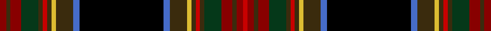

This is one **variant** — a specific cloth: this exact thread count and colourway, with its own
provenance below. It is one weaving of the [sett](/setts/r3dy2r5dg8dy2ri2dy2ly2dy8b3k39b3dy8ly2dy2ri2dy2dg8r5dy2r3ri2/) (the scale-free proportion — the
same cloth at any scale or shade), whose colour order is pattern [RGRGGRGYGBKBGYGRGGRGRR](/stripes/rgrggrgygbkbgygrggrgrr/).

Part of the [GRM](/tartans/g/gr/grm/) tartan — the named design grouping this sett with its other cloths.

Sourced from register-of-tartans.  It is a [22 stripe tartan](/stripes/stripes22/).

Original link [https://www.tartanregister.gov.uk/tartanDetails.aspx?ref=1551](https://www.tartanregister.gov.uk/tartanDetails.aspx?ref=1551)

Dataset <small>— provenance for this record, inherited from the source manifest</small>

<dl class="dataset-prov">
<dt>source</dt><dd><a href="/sources/register-of-tartans/">Scottish Register of Tartans</a></dd>
<dt>data captured from</dt><dd><a href="https://github.com/thetartan/tartan-database/blob/master/data/register-of-tartans/data.csv">https://github.com/thetartan/tartan-database/blob/master/data/register-of-tartans/data.csv</a></dd>
<dt>data date</dt><dd>01/11/2000 <small>(this record)</small></dd>
<dt>licence</dt><dd><a href="https://www.tartanregister.gov.uk/copyright">Crown copyright</a></dd>
</dl>

Capture chain <small>— the hands this data passed through, oldest first; each capture carries its own licence</small>

<ol class="capture-chain">
<li><a href="https://www.tartanregister.gov.uk/">Scottish Register of Tartans</a> · <a href="https://www.tartanregister.gov.uk/copyright">Crown copyright</a> <small>the living register — still published by National Records of Scotland</small></li>
<li><a href="https://github.com/thetartan/tartan-database">thetartan/tartan-database</a> <small>2016-2017</small> · <a href="https://creativecommons.org/licenses/by-nc-nd/4.0/">CC BY-NC-ND 4.0</a> <small>Levko Kravets's frozen compilation — the capture we vendored, and where its CC licence text came from</small></li>
<li>this dictionary <small>captured 2026-06-10 · commit 5bf86c7566</small> <small>each re-capture is a git commit to data/sources</small></li>
</ol>

## Register references

External register numbers recorded for this tartan.

- Scottish Register of Tartans: [1551](https://www.tartanregister.gov.uk/tartanDetails.aspx?ref=1551)
- Scottish Tartans Authority (ITI): 4080

## Thread count
R/6 DY4 R10 DG16 DY4 Ri4 DY4 LY4 DY16 B6 K78 B6 DY16 LY4 DY4 Ri4 DY4 DG16 R10 DY4 R6 Ri/4

One full sett is **450 threads**.

## Palette
<table><thead><tr><th>Colour</th><th>Shade</th><th>OKLCh</th></tr></thead><tbody><tr><td>B</td><td><code style="background-color:#466CC8;">#466CC8</code> <small style="color:#888">#466CC8</small></td><td><small style="color:#888">oklch(55.1% 0.149 265.0)</small></td></tr><tr><td>DG</td><td><code style="background-color:#053819;">#053819</code> <small style="color:#888">#053819</small></td><td><small style="color:#888">oklch(30.0% 0.075 151.3)</small></td></tr><tr><td>DR</td><td><code style="background-color:#501400;">#501400</code> <small style="color:#888">#501400</small></td><td><small style="color:#888">oklch(29.1% 0.094 38.4)</small></td></tr><tr><td>R</td><td><code style="background-color:#880000;">#880000</code> <small style="color:#888">#880000</small></td><td><small style="color:#888">oklch(39.4% 0.162 29.2)</small></td></tr><tr><td>K</td><td><code style="background-color:#000000;">#000000</code> <small style="color:#888">#000000</small></td><td><small style="color:#888">oklch(0.0% 0.000 0.0)</small></td></tr><tr><td>W</td><td><code style="background-color:#E8CCB8;">#E8CCB8</code> <small style="color:#888">#E8CCB8</small></td><td><small style="color:#888">oklch(86.3% 0.042 57.7)</small></td></tr><tr><td>LY</td><td><code style="background-color:#DCBC32;">#DCBC32</code> <small style="color:#888">#DCBC32</small></td><td><small style="color:#888">oklch(80.0% 0.150 95.2)</small></td></tr><tr><td>R</td><td><code style="background-color:#A00048;">#A00048</code> <small style="color:#888">#A00048</small></td><td><small style="color:#888">oklch(45.4% 0.182 5.3)</small></td></tr><tr><td>R</td><td><code style="background-color:#C80000;">#C80000</code> <small style="color:#888">#C80000</small></td><td><small style="color:#888">oklch(52.3% 0.215 29.2)</small></td></tr><tr><td>DY</td><td><code style="background-color:#3A2B0D;">#3A2B0D</code> <small style="color:#888">#3A2B0D</small></td><td><small style="color:#888">oklch(30.0% 0.049 82.0)</small></td></tr><tr><td>W</td><td><code style="background-color:#FCFCFC;">#FCFCFC</code> <small style="color:#888">#FCFCFC</small></td><td><small style="color:#888">oklch(99.1% 0.000 89.9)</small></td></tr></tbody></table>

# Sample pattern

## Nearest tartan variants

The nearest existing variants by ΔTartan distance, with this cloth at the top so the swatches line up against it.

ΔTartan

Threads

Variant

Sett

—

450

<a href="/variants/s22/r3dy2r5dg8dy2ri2dy2ly2dy8b3k39b3dy8ly2dy2ri2dy2dg8r5dy2r3ri2~x2~r1606028-ri2109032/">GRM</a>

<a href="/ttd/edit/#slug=do28r3k2n2k2r3n8o2k8o5k3ly2k2o3k1~x2~o2503076-ly3104101&amp;base=r3dy2r5dg8dy2ri2dy2ly2dy8b3k39b3dy8ly2dy2ri2dy2dg8r5dy2r3ri2~x2~r1606028-ri2109032" title="compare in the TTD">3.34</a>

238

<a href="/variants/s15/do28r3k2n2k2r3n8ly2k8ly5k3lyi2k2ly3k1~x2~ly2503076-lyi3104101/">Caithness</a>

<a href="/ttd/edit/#slug=dy28r3k2n2k2r3n8o2k8o5k3ly2k2o3k1~x2~o2503076-ly3104101&amp;base=r3dy2r5dg8dy2ri2dy2ly2dy8b3k39b3dy8ly2dy2ri2dy2dg8r5dy2r3ri2~x2~r1606028-ri2109032" title="compare in the TTD">3.35</a>

238

<a href="/variants/s15/dy28r3k2n2k2r3n8ly2k8ly5k3lyi2k2ly3k1~x2~ly2503076-lyi3104101/">Caithness (District)</a>

<a href="/ttd/edit/#slug=y10k2w3k6dy4k2lb8k2dy4k6lb3lg49ly4k42dy42y6dy6y6dy6y8~lb3203246-lg2702249&amp;base=r3dy2r5dg8dy2ri2dy2ly2dy8b3k39b3dy8ly2dy2ri2dy2dg8r5dy2r3ri2~x2~r1606028-ri2109032" title="compare in the TTD">3.44</a>

420

<a href="/variants/s20/y10k2w3k6dy4k2lb8k2dy4k6lb3lg49ly4k42dy42y6dy6y6dy6y8~lb3203246-lg2702249/">Whisky</a>

<a href="/ttd/edit/#slug=lr6k2dr40k16db6k2db4k2n4k2lb2k2n4db7k2n6db1dr4~x2~db1404245&amp;base=r3dy2r5dg8dy2ri2dy2ly2dy8b3k39b3dy8ly2dy2ri2dy2dg8r5dy2r3ri2~x2~r1606028-ri2109032" title="compare in the TTD">3.54</a>

428

<a href="/variants/s18/lr6k2dr40k16db6k2db4k2n4k2lb2k2n4db7k2n6db1dr4~x2~db1404245/">Breeding</a>

<a href="/ttd/edit/#slug=db41r2k42w2g41r3y2r3g3r31k3y2r3k5r3y2k3r31db3r3y2r3~x2&amp;base=r3dy2r5dg8dy2ri2dy2ly2dy8b3k39b3dy8ly2dy2ri2dy2dg8r5dy2r3ri2~x2~r1606028-ri2109032" title="compare in the TTD">3.62</a>

844

<a href="/variants/s22/db41r2k42w2g41r3y2r3g3r31k3y2r3k5r3y2k3r31db3r3y2r3~x2/">Hay or Leith</a>

<a href="/ttd/edit/#slug=lr6k2dr40k16db6k2db4k2n4k2lb2k2n4db7k2n6db1dr4~x2&amp;base=r3dy2r5dg8dy2ri2dy2ly2dy8b3k39b3dy8ly2dy2ri2dy2dg8r5dy2r3ri2~x2~r1606028-ri2109032" title="compare in the TTD">3.72</a>

428

<a href="/variants/s18/lr6k2dr40k16db6k2db4k2n4k2lb2k2n4db7k2n6db1dr4~x2/">Breeding (Name)</a>

<a href="/ttd/edit/#slug=k2g2k1g2k1g2k1g12db4k3db3k3db3k3db4dp24r2~x2&amp;base=r3dy2r5dg8dy2ri2dy2ly2dy8b3k39b3dy8ly2dy2ri2dy2dg8r5dy2r3ri2~x2~r1606028-ri2109032" title="compare in the TTD">3.73</a>

280

<a href="/variants/s17/k2g2k1g2k1g2k1g12db4k3db3k3db3k3db4dp24r2~x2/">Rendell, Charles</a>

<a href="/ttd/edit/#slug=dt24ly1r2dg2r2ly1k24dg24w2dt2w2dg24k24ly1r2dg2r2ly1dt24dg2~x2~dt1204274-ly3307090-dg1802166&amp;base=r3dy2r5dg8dy2ri2dy2ly2dy8b3k39b3dy8ly2dy2ri2dy2dg8r5dy2r3ri2~x2~r1606028-ri2109032" title="compare in the TTD">3.74</a>

620

<a href="/variants/s20/db24ly1r2dg2r2ly1k24dg24w2db2w2dg24k24ly1r2dg2r2ly1db24dg2~x2~db1204274-ly3307090-dg1802166/">Smithsonian</a>

<a href="/ttd/edit/#slug=dr64t12k16lo2k4lb3g32dr8k4dr3lb2~x2&amp;base=r3dy2r5dg8dy2ri2dy2ly2dy8b3k39b3dy8ly2dy2ri2dy2dg8r5dy2r3ri2~x2~r1606028-ri2109032" title="compare in the TTD">3.77</a>

468

<a href="/variants/s11/dr64t12k16lo2k4lb3g32dr8k4dr3lb2~x2/">Stewart/Stuart, Royal (No black line)</a>

<a href="/ttd/edit/#slug=k3r1y1k2r16dp2r1y1r2db15r1k15w1g15r2y1r1g2r16k2y1r1k3~x2&amp;base=r3dy2r5dg8dy2ri2dy2ly2dy8b3k39b3dy8ly2dy2ri2dy2dg8r5dy2r3ri2~x2~r1606028-ri2109032" title="compare in the TTD">3.84</a>

408

<a href="/variants/s23/k3r1y1k2r16dp2r1y1r2db15r1k15w1g15r2y1r1g2r16k2y1r1k3~x2/">Hay, or Leith</a>

## Neighbour map

Every grey dot is one of 13621 variants placed by the first two principal components of the ΔTartan feature space (42% of its variance). Red is this tartan; blue dots are its nearest — click one to open its page. The map is a flat projection of a many-dimensional space — [how to read it](/posts/neighbourhood-maps/).

<svg viewBox="0 0 640 380" role="img" style="max-width:100%;height:auto;border:1px solid #e0e0e0;border-radius:4px;display:block" xmlns="http://www.w3.org/2000/svg"><image href="/nn/cloud.v1.png" width="640" height="380"/><a href="/variants/s15/do28r3k2n2k2r3n8ly2k8ly5k3lyi2k2ly3k1~x2~ly2503076-lyi3104101/"><circle cx="166.8" cy="61.7" r="4" fill="#3465a4"><title>Caithness</title></circle></a><a href="/variants/s15/dy28r3k2n2k2r3n8ly2k8ly5k3lyi2k2ly3k1~x2~ly2503076-lyi3104101/"><circle cx="165.3" cy="61.9" r="4" fill="#3465a4"><title>Caithness (District)</title></circle></a><a href="/variants/s20/y10k2w3k6dy4k2lb8k2dy4k6lb3lg49ly4k42dy42y6dy6y6dy6y8~lb3203246-lg2702249/"><circle cx="80.3" cy="42.7" r="4" fill="#3465a4"><title>Whisky</title></circle></a><a href="/variants/s18/lr6k2dr40k16db6k2db4k2n4k2lb2k2n4db7k2n6db1dr4~x2~db1404245/"><circle cx="203.4" cy="41.8" r="4" fill="#3465a4"><title>Breeding</title></circle></a><a href="/variants/s22/db41r2k42w2g41r3y2r3g3r31k3y2r3k5r3y2k3r31db3r3y2r3~x2/"><circle cx="124.2" cy="46.1" r="4" fill="#3465a4"><title>Hay or Leith</title></circle></a><a href="/variants/s18/lr6k2dr40k16db6k2db4k2n4k2lb2k2n4db7k2n6db1dr4~x2/"><circle cx="200.7" cy="40.3" r="4" fill="#3465a4"><title>Breeding (Name)</title></circle></a><a href="/variants/s17/k2g2k1g2k1g2k1g12db4k3db3k3db3k3db4dp24r2~x2/"><circle cx="145.7" cy="68.9" r="4" fill="#3465a4"><title>Rendell, Charles</title></circle></a><a href="/variants/s20/db24ly1r2dg2r2ly1k24dg24w2db2w2dg24k24ly1r2dg2r2ly1db24dg2~x2~db1204274-ly3307090-dg1802166/"><circle cx="142.3" cy="67.4" r="4" fill="#3465a4"><title>Smithsonian</title></circle></a><a href="/variants/s11/dr64t12k16lo2k4lb3g32dr8k4dr3lb2~x2/"><circle cx="159.1" cy="53.4" r="4" fill="#3465a4"><title>Stewart/Stuart, Royal (No black line)</title></circle></a><a href="/variants/s23/k3r1y1k2r16dp2r1y1r2db15r1k15w1g15r2y1r1g2r16k2y1r1k3~x2/"><circle cx="104.7" cy="42.6" r="4" fill="#3465a4"><title>Hay, or Leith</title></circle></a><circle cx="130.3" cy="46.8" r="5" fill="#c00000"/><text x="320" y="376" text-anchor="middle" font-size="11" fill="#999">ground</text><text x="11" y="190" text-anchor="middle" font-size="11" fill="#999" transform="rotate(-90 11 190)">complexity</text></svg>

ID: /variants/s22/r3dy2r5dg8dy2ri2dy2ly2dy8b3k39b3dy8ly2dy2ri2dy2dg8r5dy2r3ri2~x2~r1606028-ri2109032/
