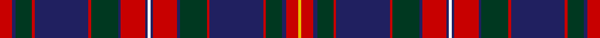

This page is one **sett** — a single exact thread-count. It belongs to the [tartan](/setts/r9db3dg12r2db40r2dg20db2r18db2w2db2r18db2dg20r2db40r2dg12db3r9ly2/)
(the same proportion at any scale), whose colour order is pattern [RBGRBRGBRBWBRBGRBRGBRY](/stripes/rbgrbrgbrbwbrbgrbrgbry/).

Part of the [Kormylo](/tartans/kormylo/) tartan — the named design grouping this sett with its other cloths.

Sourced from register-of-tartans.  It is a [22 stripe tartan](/stripes/stripes22/).

Original link https://www.tartanregister.gov.uk/tartanDetails.aspx?ref=4991

## Register references

External register numbers recorded for this tartan.

- Scottish Register of Tartans: [4991](https://www.tartanregister.gov.uk/tartanDetails.aspx?ref=4991)
- Scottish Tartans Authority (ITI): 6314
- Scottish Tartans World Register: 3012

## Thread count
R/18 DB6 DG24 R4 DB80 R4 DG40 DB4 R36 DB4 W4 DB4 R36 DB4 DG40 R4 DB80 R4 DG24 DB6 R18 Y/4

One full sett is **874 threads**.

## Palette

Palette: <strong>Tartan Register</strong>
<table><thead><tr><th>Colour</th><th>Threads</th><th>Shade</th><th>Base</th><th>OKLCh</th></tr></thead><tbody><tr><td>R/</td><td style="text-align:right;font-variant-numeric:tabular-nums">18</td><td><code style="background-color:#C80000;">#C80000</code> <small style="color:#888">#C80000</small></td><td>R <code style="background-color:#CC0000;">#CC0000</code></td><td><small style="color:#888">oklch(52.3% 0.215 29.2)</small></td></tr><tr><td>DB</td><td style="text-align:right;font-variant-numeric:tabular-nums">6</td><td><code style="background-color:#202060;">#202060</code> <small style="color:#888">#202060</small></td><td>B <code style="background-color:#2A418A;">#2A418A</code></td><td><small style="color:#888">oklch(28.9% 0.111 276.9)</small></td></tr><tr><td>DG</td><td style="text-align:right;font-variant-numeric:tabular-nums">24</td><td><code style="background-color:#003820;">#003820</code> <small style="color:#888">#003820</small></td><td>G <code style="background-color:#006100;">#006100</code></td><td><small style="color:#888">oklch(30.0% 0.070 158.3)</small></td></tr><tr><td>R</td><td style="text-align:right;font-variant-numeric:tabular-nums">4</td><td><code style="background-color:#C80000;">#C80000</code> <small style="color:#888">#C80000</small></td><td>R <code style="background-color:#CC0000;">#CC0000</code></td><td><small style="color:#888">oklch(52.3% 0.215 29.2)</small></td></tr><tr><td>DB</td><td style="text-align:right;font-variant-numeric:tabular-nums">80</td><td><code style="background-color:#202060;">#202060</code> <small style="color:#888">#202060</small></td><td>B <code style="background-color:#2A418A;">#2A418A</code></td><td><small style="color:#888">oklch(28.9% 0.111 276.9)</small></td></tr><tr><td>R</td><td style="text-align:right;font-variant-numeric:tabular-nums">4</td><td><code style="background-color:#C80000;">#C80000</code> <small style="color:#888">#C80000</small></td><td>R <code style="background-color:#CC0000;">#CC0000</code></td><td><small style="color:#888">oklch(52.3% 0.215 29.2)</small></td></tr><tr><td>DG</td><td style="text-align:right;font-variant-numeric:tabular-nums">40</td><td><code style="background-color:#003820;">#003820</code> <small style="color:#888">#003820</small></td><td>G <code style="background-color:#006100;">#006100</code></td><td><small style="color:#888">oklch(30.0% 0.070 158.3)</small></td></tr><tr><td>DB</td><td style="text-align:right;font-variant-numeric:tabular-nums">4</td><td><code style="background-color:#202060;">#202060</code> <small style="color:#888">#202060</small></td><td>B <code style="background-color:#2A418A;">#2A418A</code></td><td><small style="color:#888">oklch(28.9% 0.111 276.9)</small></td></tr><tr><td>R</td><td style="text-align:right;font-variant-numeric:tabular-nums">36</td><td><code style="background-color:#C80000;">#C80000</code> <small style="color:#888">#C80000</small></td><td>R <code style="background-color:#CC0000;">#CC0000</code></td><td><small style="color:#888">oklch(52.3% 0.215 29.2)</small></td></tr><tr><td>DB</td><td style="text-align:right;font-variant-numeric:tabular-nums">4</td><td><code style="background-color:#202060;">#202060</code> <small style="color:#888">#202060</small></td><td>B <code style="background-color:#2A418A;">#2A418A</code></td><td><small style="color:#888">oklch(28.9% 0.111 276.9)</small></td></tr><tr><td>W</td><td style="text-align:right;font-variant-numeric:tabular-nums">4</td><td><code style="background-color:#FCFCFC;">#FCFCFC</code> <small style="color:#888">#FCFCFC</small></td><td>W <code style="background-color:#F7F7F7;">#F7F7F7</code></td><td><small style="color:#888">oklch(99.1% 0.000 89.9)</small></td></tr><tr><td>DB</td><td style="text-align:right;font-variant-numeric:tabular-nums">4</td><td><code style="background-color:#202060;">#202060</code> <small style="color:#888">#202060</small></td><td>B <code style="background-color:#2A418A;">#2A418A</code></td><td><small style="color:#888">oklch(28.9% 0.111 276.9)</small></td></tr><tr><td>R</td><td style="text-align:right;font-variant-numeric:tabular-nums">36</td><td><code style="background-color:#C80000;">#C80000</code> <small style="color:#888">#C80000</small></td><td>R <code style="background-color:#CC0000;">#CC0000</code></td><td><small style="color:#888">oklch(52.3% 0.215 29.2)</small></td></tr><tr><td>DB</td><td style="text-align:right;font-variant-numeric:tabular-nums">4</td><td><code style="background-color:#202060;">#202060</code> <small style="color:#888">#202060</small></td><td>B <code style="background-color:#2A418A;">#2A418A</code></td><td><small style="color:#888">oklch(28.9% 0.111 276.9)</small></td></tr><tr><td>DG</td><td style="text-align:right;font-variant-numeric:tabular-nums">40</td><td><code style="background-color:#003820;">#003820</code> <small style="color:#888">#003820</small></td><td>G <code style="background-color:#006100;">#006100</code></td><td><small style="color:#888">oklch(30.0% 0.070 158.3)</small></td></tr><tr><td>R</td><td style="text-align:right;font-variant-numeric:tabular-nums">4</td><td><code style="background-color:#C80000;">#C80000</code> <small style="color:#888">#C80000</small></td><td>R <code style="background-color:#CC0000;">#CC0000</code></td><td><small style="color:#888">oklch(52.3% 0.215 29.2)</small></td></tr><tr><td>DB</td><td style="text-align:right;font-variant-numeric:tabular-nums">80</td><td><code style="background-color:#202060;">#202060</code> <small style="color:#888">#202060</small></td><td>B <code style="background-color:#2A418A;">#2A418A</code></td><td><small style="color:#888">oklch(28.9% 0.111 276.9)</small></td></tr><tr><td>R</td><td style="text-align:right;font-variant-numeric:tabular-nums">4</td><td><code style="background-color:#C80000;">#C80000</code> <small style="color:#888">#C80000</small></td><td>R <code style="background-color:#CC0000;">#CC0000</code></td><td><small style="color:#888">oklch(52.3% 0.215 29.2)</small></td></tr><tr><td>DG</td><td style="text-align:right;font-variant-numeric:tabular-nums">24</td><td><code style="background-color:#003820;">#003820</code> <small style="color:#888">#003820</small></td><td>G <code style="background-color:#006100;">#006100</code></td><td><small style="color:#888">oklch(30.0% 0.070 158.3)</small></td></tr><tr><td>DB</td><td style="text-align:right;font-variant-numeric:tabular-nums">6</td><td><code style="background-color:#202060;">#202060</code> <small style="color:#888">#202060</small></td><td>B <code style="background-color:#2A418A;">#2A418A</code></td><td><small style="color:#888">oklch(28.9% 0.111 276.9)</small></td></tr><tr><td>R</td><td style="text-align:right;font-variant-numeric:tabular-nums">18</td><td><code style="background-color:#C80000;">#C80000</code> <small style="color:#888">#C80000</small></td><td>R <code style="background-color:#CC0000;">#CC0000</code></td><td><small style="color:#888">oklch(52.3% 0.215 29.2)</small></td></tr><tr><td>Y/</td><td style="text-align:right;font-variant-numeric:tabular-nums">4</td><td><code style="background-color:#E8C000;">#E8C000</code> <small style="color:#888">#E8C000</small></td><td>Y <code style="background-color:#F2BF00;">#F2BF00</code></td><td><small style="color:#888">oklch(81.9% 0.168 93.7)</small></td></tr></tbody></table>

## Nearest tartans

The nearest existing variants by ΔTartan distance, with this tartan at the top so the swatches line up against it.

ΔTartan

Tartan

Sett

—

<a href="/ttd/edit/#slug=r9db3dg12r2db40r2dg20db2r18db2w2db2r18db2dg20r2db40r2dg12db3r9ly2~x2">Kormylo (Personal)</a> <a class="nn-out" href="/variants/s22/r9db3dg12r2db40r2dg20db2r18db2w2db2r18db2dg20r2db40r2dg12db3r9ly2~x2/" title="open its dictionary page">↗</a>

0.97

<a href="/ttd/edit/#slug=r4k1db8k1lo3k2db4lo6db4w3k2db20k4r21k1lo3~x2&amp;base=r9db3dg12r2db40r2dg20db2r18db2w2db2r18db2dg20r2db40r2dg12db3r9ly2~x2">Westmeath County Crest (Fashion)</a> <a class="nn-out" href="/variants/s16/r4k1db8k1lo3k2db4lo6db4w3k2db20k4r21k1lo3~x2/" title="open its dictionary page">↗</a>

1.09

<a href="/ttd/edit/#slug=r4db6r2db2r4db6r3k4lo2k2lo2k4g2k4r22db1g2db1r6db3~x2&amp;base=r9db3dg12r2db40r2dg20db2r18db2w2db2r18db2dg20r2db40r2dg12db3r9ly2~x2">Anderson of Kinnedear Red</a> <a class="nn-out" href="/variants/s20/r4db6r2db2r4db6r3k4lo2k2lo2k4g2k4r22db1g2db1r6db3~x2/" title="open its dictionary page">↗</a>

1.12

<a href="/ttd/edit/#slug=db40k8r4k4r8k4r4k8dg40k8r4k4r8k4r4k8db40ly3~x2&amp;base=r9db3dg12r2db40r2dg20db2r18db2w2db2r18db2dg20r2db40r2dg12db3r9ly2~x2">Griffiths of Llangynin (Personal)</a> <a class="nn-out" href="/variants/s18/db40k8r4k4r8k4r4k8dg40k8r4k4r8k4r4k8db40ly3~x2/" title="open its dictionary page">↗</a>

1.12

<a href="/ttd/edit/#slug=g20k1g1k6w1k6dp1k1dp4r3dp14r3dp4k1dp1k6w1k6g1k1g8~x2&amp;base=r9db3dg12r2db40r2dg20db2r18db2w2db2r18db2dg20r2db40r2dg12db3r9ly2~x2">New Hampshire District Tartan</a> <a class="nn-out" href="/variants/s21/g20k1g1k6w1k6dp1k1dp4r3dp14r3dp4k1dp1k6w1k6g1k1g8~x2/" title="open its dictionary page">↗</a>

1.19

<a href="/ttd/edit/#slug=db16g3db3g3db3g16db3g3db3g3db16m15db1ly3db1m15db16g15db3g3db3g15db16m15b1m3b1m15~x2&amp;base=r9db3dg12r2db40r2dg20db2r18db2w2db2r18db2dg20r2db40r2dg12db3r9ly2~x2">Cairns of Finavon</a> <a class="nn-out" href="/variants/s28/db16g3db3g3db3g16db3g3db3g3db16m15db1ly3db1m15db16g15db3g3db3g15db16m15b1m3b1m15~x2/" title="open its dictionary page">↗</a>

1.19

<a href="/ttd/edit/#slug=g16db3g3db3g3db16m15db1ly3db1m15db16g15db3g3db3g15db16m15b1m3b1m15db16g3db3g3db3~x2&amp;base=r9db3dg12r2db40r2dg20db2r18db2w2db2r18db2dg20r2db40r2dg12db3r9ly2~x2">Cairns of Finavon (Name)</a> <a class="nn-out" href="/variants/s28/g16db3g3db3g3db16m15db1ly3db1m15db16g15db3g3db3g15db16m15b1m3b1m15db16g3db3g3db3~x2/" title="open its dictionary page">↗</a>

1.19

<a href="/variants/s26/dp22k2dp2k2dp2k18g8lb2g8k16dp15dp1k2dp2~x2/">Scottish Heritage Preservation</a>

1.26

<a href="/variants/s29/db15ki1db1ki1db1ki7r8ki1ly3ki1r8ki7db8ki1k3ki1db8ki7r8ki1ly3ki1r8ki7db1ki1db1ki1db9~x4/">Dryer</a>

1.26

<a href="/ttd/edit/#slug=r3db21r3dg7r7db8r3dg21r3db3r3dg21r3db8r6dg7r3db21r3db3t1~x2&amp;base=r9db3dg12r2db40r2dg20db2r18db2w2db2r18db2dg20r2db40r2dg12db3r9ly2~x2">MacIntyre of Littleport</a> <a class="nn-out" href="/variants/s21/r3db21r3dg7r7db8r3dg21r3db3r3dg21r3db8r6dg7r3db21r3db3t1~x2/" title="open its dictionary page">↗</a>

1.28

<a href="/ttd/edit/#slug=w2db2r18db2dg20r2db40r2dg12db3r9ly2~x2&amp;base=r9db3dg12r2db40r2dg20db2r18db2w2db2r18db2dg20r2db40r2dg12db3r9ly2~x2">Kormylo (Personal)</a> <a class="nn-out" href="/variants/s12/w2db2r18db2dg20r2db40r2dg12db3r9ly2~x2/" title="open its dictionary page">↗</a>

## Neighbour map

Every grey dot is one of 14360 variants placed by the first two principal components of the ΔTartan feature space (44% of its variance). Red is this tartan; blue dots are its nearest — click one to open its page.

<svg viewBox="0 0 640 380" role="img" style="max-width:100%;height:auto;border:1px solid #e0e0e0;border-radius:4px;display:block" xmlns="http://www.w3.org/2000/svg"><image href="/nn/cloud.v1.png" width="640" height="380"/><a href="/variants/s16/r4k1db8k1lo3k2db4lo6db4w3k2db20k4r21k1lo3~x2/"><circle cx="223.5" cy="106.6" r="4" fill="#3465a4"><title>Westmeath County Crest (Fashion)</title></circle></a><a href="/variants/s20/r4db6r2db2r4db6r3k4lo2k2lo2k4g2k4r22db1g2db1r6db3~x2/"><circle cx="286.9" cy="106.5" r="4" fill="#3465a4"><title>Anderson of Kinnedear Red</title></circle></a><a href="/variants/s18/db40k8r4k4r8k4r4k8dg40k8r4k4r8k4r4k8db40ly3~x2/"><circle cx="212.4" cy="130.3" r="4" fill="#3465a4"><title>Griffiths of Llangynin (Personal)</title></circle></a><a href="/variants/s21/g20k1g1k6w1k6dp1k1dp4r3dp14r3dp4k1dp1k6w1k6g1k1g8~x2/"><circle cx="186.9" cy="99.9" r="4" fill="#3465a4"><title>New Hampshire District Tartan</title></circle></a><a href="/variants/s28/db16g3db3g3db3g16db3g3db3g3db16m15db1ly3db1m15db16g15db3g3db3g15db16m15b1m3b1m15~x2/"><circle cx="211.8" cy="128.5" r="4" fill="#3465a4"><title>Cairns of Finavon</title></circle></a><a href="/variants/s28/g16db3g3db3g3db16m15db1ly3db1m15db16g15db3g3db3g15db16m15b1m3b1m15db16g3db3g3db3~x2/"><circle cx="211.8" cy="128.5" r="4" fill="#3465a4"><title>Cairns of Finavon (Name)</title></circle></a><a href="/variants/s26/dp22k2dp2k2dp2k18g8lb2g8k16dp15dp1k2dp2~x2/"><circle cx="268.7" cy="121.8" r="4" fill="#3465a4"><title>Scottish Heritage Preservation</title></circle></a><a href="/variants/s29/db15ki1db1ki1db1ki7r8ki1ly3ki1r8ki7db8ki1k3ki1db8ki7r8ki1ly3ki1r8ki7db1ki1db1ki1db9~x4/"><circle cx="180.4" cy="120.2" r="4" fill="#3465a4"><title>Dryer</title></circle></a><a href="/variants/s21/r3db21r3dg7r7db8r3dg21r3db3r3dg21r3db8r6dg7r3db21r3db3t1~x2/"><circle cx="258.4" cy="138.6" r="4" fill="#3465a4"><title>MacIntyre of Littleport</title></circle></a><a href="/variants/s12/w2db2r18db2dg20r2db40r2dg12db3r9ly2~x2/"><circle cx="248.8" cy="120.7" r="4" fill="#3465a4"><title>Kormylo (Personal)</title></circle></a><circle cx="248.6" cy="103.9" r="5" fill="#c00000"/></svg>

ID: /variants/s22/r9db3dg12r2db40r2dg20db2r18db2w2db2r18db2dg20r2db40r2dg12db3r9ly2~x2/
