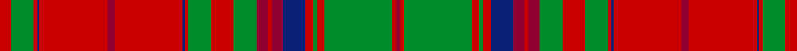

This is one **variant** — a specific cloth: this exact thread count and colourway, with its own
provenance below. It is one weaving of the [sett](/setts/ri6g12ri2db1ri36r4ri36db1ri2g12ri12g12r6ri2r6db12ri4g2ri4g36ri2r2/) (the scale-free proportion — the
same cloth at any scale or shade), whose colour order is pattern [RGRBRRRBRGRGRRRBRGRGRR](/stripes/rgrbrrrbrgrgrrrbrgrgrr/).

Part of the [MacDougall](/tartans/m/ma/macdougall-6/) tartan — the named design grouping this sett with its other cloths.

Sourced from logan-1831.  It is a [22 stripe tartan](/stripes/stripes22/).

Original link [/posts/logans-scottish-gael/](/posts/logans-scottish-gael/)

## Provenance

<figure class="logan-scan">

<figcaption>Logan, The Scottish Gaël (1831), vol. II p. 405 — page-scan crop (280,1297)–(535,2116)</figcaption>
</figure>

James Logan recorded the **MacDougall** sett in 1831, on page 405 of the *Table of Clan Tartans* in *The Scottish Gaël* — the earliest systematic published collection of clan setts. Logan gives the stripe widths in eighths of an inch, measured across the cloth and reflected about each end (a half-sett):

> 3 red · 6 green · 1 red · ½ blue · 18 red · 2 crimson · 18 red · ½ blue · 1 red · 6 green · 6 red · 6 green · 3 crimson · 1 red · 3 crimson · 6 blue · 2 red · 1 green · 2 red · 18 green · 1 red · 1 crimson

Rendered at 8 threads to the eighth-inch that is `R/24 G48 R8 B4 R144 C16 R144 B4 R8 G48 R48 G48 C24 R8 C24 B48 R16 G8 R16 G144 R8 C/8` — the eighths are the captured data, and the threadcount is derived from them at that stated factor. How many threads an eighth of cloth held depends on the weave's density, so the factor is a display calibration, not Logan's count; the sett's identity lives in the proportions, which the eighths record directly. Logan named his colours rather than dyeing to a standard, so the palette here is the Dictionary's modern reading of his names.

See [Logan's Scottish Gaël](/posts/logans-scottish-gael/) for the full table and method.

## Related setts

Later records of the **MacDougall** name adjusted Logan's counts: [MacDougall](/variants/s11/dp4g8db6dp8r6g2r2g2r24g1r3~x2/); [MacDougall (Kinloch Anderson)](/variants/s15/ri7r5dr5ri31k9dr4r3ri5r3dr4g30ri4r3dr5ri5~x2~ri2209032-r2208029/); [MacDougall #11](/variants/s15/r6dr3w3r4g33dr3w3r4w3dr3db9r33dr3w4r4~x2/); [MacDougall #2](/variants/s24/lb1r5ri2rii3g24rii5g2rii5db11r3ri2rii2ri2r3g11rii11g11rii2db2rii25r3ri2rii5lb1~x2~r1707016-ri2208029-rii2209032/). Compare their thread counts with Logan's above.

Dataset <small>— provenance for this record, inherited from the source manifest</small>

<dl class="dataset-prov">
<dt>source</dt><dd><a href="/sources/logan-1831/">Logan, The Scottish Gaël (1831)</a></dd>
<dt>data captured from</dt><dd><a href="https://archive.org/details/scotishgalorcel02logagoog">https://archive.org/details/scotishgalorcel02logagoog</a></dd>
<dt>data date</dt><dd>1831 <small>(this record)</small></dd>
<dt>licence</dt><dd>Public domain</dd>
</dl>

Capture chain <small>— the hands this data passed through, oldest first; each capture carries its own licence</small>

<ol class="capture-chain">
<li>James Logan, The Scottish Gaël (first edition) <small>1831</small> · Public domain <small>the printed Table of Clan Tartans, vol. II pp. 401-408, plus the Duke of Sussex plate</small></li>
<li><a href="https://archive.org/details/scotishgalorcel02logagoog">Internet Archive scan</a> <small>the digitised first edition the transcription was made from, cross-checked against the OCR</small></li>
<li><a href="/posts/logans-scottish-gael/">Tartan Dictionary transcription — Logan's Scottish Gaël</a> <small>2026-06</small> · <a href="https://creativecommons.org/licenses/by-sa/4.0/">CC BY-SA 4.0</a> <small>by-eye transcription of the Table of Clan Tartans and the Duke of Sussex plate — depths in eighths of an inch, rendered at 8 threads per eighth (a display calibration anchored by the Register's Abercrombie ×8 stripe-for-stripe match); method and match report in the linked post</small></li>
<li>this dictionary <small>each re-capture is a git commit to data/sources</small></li>
</ol>

## Thread count
Ri/24 G48 Ri8 DB4 Ri144 R16 Ri144 DB4 Ri8 G48 Ri48 G48 R24 Ri8 R24 DB48 Ri16 G8 Ri16 G144 Ri8 R/8

One full sett is **1664 threads**.

## Palette
<table><thead><tr><th>Colour</th><th>Shade</th><th>OKLCh</th></tr></thead><tbody><tr><td>DB</td><td><code style="background-color:#082077;">#082077</code> <small style="color:#888">#082077</small></td><td><small style="color:#888">oklch(30.0% 0.149 265.1)</small></td></tr><tr><td>R</td><td><code style="background-color:#900030;">#900030</code> <small style="color:#888">#900030</small></td><td><small style="color:#888">oklch(41.6% 0.166 13.6)</small></td></tr><tr><td>G</td><td><code style="background-color:#008B2A;">#008B2A</code> <small style="color:#888">#008B2A</small></td><td><small style="color:#888">oklch(55.4% 0.170 145.9)</small></td></tr><tr><td>R</td><td><code style="background-color:#C80000;">#C80000</code> <small style="color:#888">#C80000</small></td><td><small style="color:#888">oklch(52.3% 0.215 29.2)</small></td></tr></tbody></table>

# Sample pattern

## Nearest tartan variants

The nearest existing variants by ΔTartan distance, with this cloth at the top so the swatches line up against it.

ΔTartan

Threads

Variant

Sett

—

1664

<a href="/variants/s22/ri6g12ri2db1ri36r4ri36db1ri2g12ri12g12r6ri2r6db12ri4g2ri4g36ri2r2~x4~ri2109032-r1707016/">MacDougall</a>

<a href="/ttd/edit/#slug=ri12r2ri2g2ri4g2ri4db12r6ri2r6g12ri12g12ri2db1ri36r4~x2~ri2008029-r1707016&amp;base=ri6g12ri2db1ri36r4ri36db1ri2g12ri12g12r6ri2r6db12ri4g2ri4g36ri2r2~x4~ri2109032-r1707016" title="compare in the TTD">2.31</a>

500

<a href="/variants/s18/ri12r2ri2g2ri4g2ri4db12r6ri2r6g12ri12g12ri2db1ri36r4~x2~ri2008029-r1707016/">MacCoul</a>

<a href="/ttd/edit/#slug=ri12r2ri2g2ri4g2ri4db12r6ri2r6g12ri12g12ri2db1ri36r4~x2~ri2109032-r1807008&amp;base=ri6g12ri2db1ri36r4ri36db1ri2g12ri12g12r6ri2r6db12ri4g2ri4g36ri2r2~x4~ri2109032-r1707016" title="compare in the TTD">2.39</a>

500

<a href="/variants/s18/ri12r2ri2g2ri4g2ri4db12r6ri2r6g12ri12g12ri2db1ri36r4~x2~ri2109032-r1807008/">MacCoul Clan Tartan</a>

<a href="/ttd/edit/#slug=g8r4g1r1g1r24dp8g4r1g1r1g4r8g1r1g1r1dp8g8r2g4~x2&amp;base=ri6g12ri2db1ri36r4ri36db1ri2g12ri12g12r6ri2r6db12ri4g2ri4g36ri2r2~x4~ri2109032-r1707016" title="compare in the TTD">2.60</a>

344

<a href="/variants/s21/g8r4g1r1g1r24dp8g4r1g1r1g4r8g1r1g1r1dp8g8r2g4~x2/">Matheson Dress</a>

<a href="/ttd/edit/#slug=r5g10r2db2r30dp3r2w1r2dp3r30db2r2g10r10g10dp4r2dp4db10r4g2r4g30r2dp3w1~x2&amp;base=ri6g12ri2db1ri36r4ri36db1ri2g12ri12g12r6ri2r6db12ri4g2ri4g36ri2r2~x4~ri2109032-r1707016" title="compare in the TTD">2.69</a>

748

<a href="/variants/s27/r5g10r2db2r30dp3r2w1r2dp3r30db2r2g10r10g10dp4r2dp4db10r4g2r4g30r2dp3w1~x2/">MacDougall Clan Tartan</a>

<a href="/ttd/edit/#slug=g10r2db2r30dp3r2w1r2dp3r30db2r2g10r10g10dp4r2dp4db10r4g2r4g30r2dp3w1~x2&amp;base=ri6g12ri2db1ri36r4ri36db1ri2g12ri12g12r6ri2r6db12ri4g2ri4g36ri2r2~x4~ri2109032-r1707016" title="compare in the TTD">2.69</a>

718

<a href="/variants/s26/g10r2db2r30dp3r2w1r2dp3r30db2r2g10r10g10dp4r2dp4db10r4g2r4g30r2dp3w1~x2/">MacDougal</a>

<a href="/ttd/edit/#slug=r5g10r2db2r30dr3r2w1r2dr3r30db2r2g10r10g10dr4r2dr4db10r4g2r4g30r2dr3w1~x2&amp;base=ri6g12ri2db1ri36r4ri36db1ri2g12ri12g12r6ri2r6db12ri4g2ri4g36ri2r2~x4~ri2109032-r1707016" title="compare in the TTD">2.71</a>

748

<a href="/variants/s27/r5g10r2db2r30dr3r2w1r2dr3r30db2r2g10r10g10dr4r2dr4db10r4g2r4g30r2dr3w1~x2/">MacDougall D</a>

<a href="/ttd/edit/#slug=r6t2r2g24r2g2r2t8r2lb1r32t2r2t1r6~x2&amp;base=ri6g12ri2db1ri36r4ri36db1ri2g12ri12g12r6ri2r6db12ri4g2ri4g36ri2r2~x4~ri2109032-r1707016" title="compare in the TTD">2.73</a>

352

<a href="/variants/s15/r6t2r2g24r2g2r2t8r2lb1r32t2r2t1r6~x2/">Drummond</a>

<a href="/ttd/edit/#slug=r24w1dp2r4g32r4dp2w1r4dp6r4w1dp2r32g2o3g6~x2~r2109032-o2307033&amp;base=ri6g12ri2db1ri36r4ri36db1ri2g12ri12g12r6ri2r6db12ri4g2ri4g36ri2r2~x4~ri2109032-r1707016" title="compare in the TTD">2.74</a>

460

<a href="/variants/s17/r24w1dp2r4g32r4dp2w1r4dp6r4w1dp2r32g2ri3g6~x2~r2109032-ri2307033/">Dalziel #2</a>

<a href="/ttd/edit/#slug=ri24w1db2ri4g32ri4db2w1ri4db6ri4w1db2ri32g2r3g6~x2~ri2008029-r1707016&amp;base=ri6g12ri2db1ri36r4ri36db1ri2g12ri12g12r6ri2r6db12ri4g2ri4g36ri2r2~x4~ri2109032-r1707016" title="compare in the TTD">2.76</a>

460

<a href="/variants/s17/ri24w1db2ri4g32ri4db2w1ri4db6ri4w1db2ri32g2r3g6~x2~ri2008029-r1707016/">Dalziel</a>

<a href="/ttd/edit/#slug=r24w1db2r4g32r4db2w1r4db6r4w1db2r32g2dr3g6~x2~r1908029&amp;base=ri6g12ri2db1ri36r4ri36db1ri2g12ri12g12r6ri2r6db12ri4g2ri4g36ri2r2~x4~ri2109032-r1707016" title="compare in the TTD">2.79</a>

460

<a href="/variants/s17/r24w1db2r4g32r4db2w1r4db6r4w1db2r32g2dr3g6~x2~r1908029/">Dalzell</a>

## Neighbour map

Every grey dot is one of 13621 variants placed by the first two principal components of the ΔTartan feature space (42% of its variance). Red is this tartan; blue dots are its nearest — click one to open its page.

<svg viewBox="0 0 640 380" role="img" style="max-width:100%;height:auto;border:1px solid #e0e0e0;border-radius:4px;display:block" xmlns="http://www.w3.org/2000/svg"><image href="/nn/cloud.v1.png" width="640" height="380"/><a href="/variants/s18/ri12r2ri2g2ri4g2ri4db12r6ri2r6g12ri12g12ri2db1ri36r4~x2~ri2008029-r1707016/"><circle cx="370.8" cy="107.5" r="4" fill="#3465a4"><title>MacCoul</title></circle></a><a href="/variants/s18/ri12r2ri2g2ri4g2ri4db12r6ri2r6g12ri12g12ri2db1ri36r4~x2~ri2109032-r1807008/"><circle cx="367.2" cy="105.8" r="4" fill="#3465a4"><title>MacCoul Clan Tartan</title></circle></a><a href="/variants/s21/g8r4g1r1g1r24dp8g4r1g1r1g4r8g1r1g1r1dp8g8r2g4~x2/"><circle cx="319.1" cy="120.8" r="4" fill="#3465a4"><title>Matheson Dress</title></circle></a><a href="/variants/s27/r5g10r2db2r30dp3r2w1r2dp3r30db2r2g10r10g10dp4r2dp4db10r4g2r4g30r2dp3w1~x2/"><circle cx="289.8" cy="70.7" r="4" fill="#3465a4"><title>MacDougall Clan Tartan</title></circle></a><a href="/variants/s26/g10r2db2r30dp3r2w1r2dp3r30db2r2g10r10g10dp4r2dp4db10r4g2r4g30r2dp3w1~x2/"><circle cx="283.7" cy="72.2" r="4" fill="#3465a4"><title>MacDougal</title></circle></a><a href="/variants/s27/r5g10r2db2r30dr3r2w1r2dr3r30db2r2g10r10g10dr4r2dr4db10r4g2r4g30r2dr3w1~x2/"><circle cx="293.2" cy="72.0" r="4" fill="#3465a4"><title>MacDougall D</title></circle></a><a href="/variants/s15/r6t2r2g24r2g2r2t8r2lb1r32t2r2t1r6~x2/"><circle cx="396.2" cy="100.2" r="4" fill="#3465a4"><title>Drummond</title></circle></a><a href="/variants/s17/r24w1dp2r4g32r4dp2w1r4dp6r4w1dp2r32g2ri3g6~x2~r2109032-ri2307033/"><circle cx="353.3" cy="82.5" r="4" fill="#3465a4"><title>Dalziel #2</title></circle></a><a href="/variants/s17/ri24w1db2ri4g32ri4db2w1ri4db6ri4w1db2ri32g2r3g6~x2~ri2008029-r1707016/"><circle cx="345.3" cy="81.3" r="4" fill="#3465a4"><title>Dalziel</title></circle></a><a href="/variants/s17/r24w1db2r4g32r4db2w1r4db6r4w1db2r32g2dr3g6~x2~r1908029/"><circle cx="347.6" cy="83.1" r="4" fill="#3465a4"><title>Dalzell</title></circle></a><circle cx="336.3" cy="95.4" r="5" fill="#c00000"/><text x="320" y="376" text-anchor="middle" font-size="11" fill="#999">ground</text><text x="11" y="190" text-anchor="middle" font-size="11" fill="#999" transform="rotate(-90 11 190)">complexity</text></svg>

ID: /variants/s22/ri6g12ri2db1ri36r4ri36db1ri2g12ri12g12r6ri2r6db12ri4g2ri4g36ri2r2~x4~ri2109032-r1707016/
