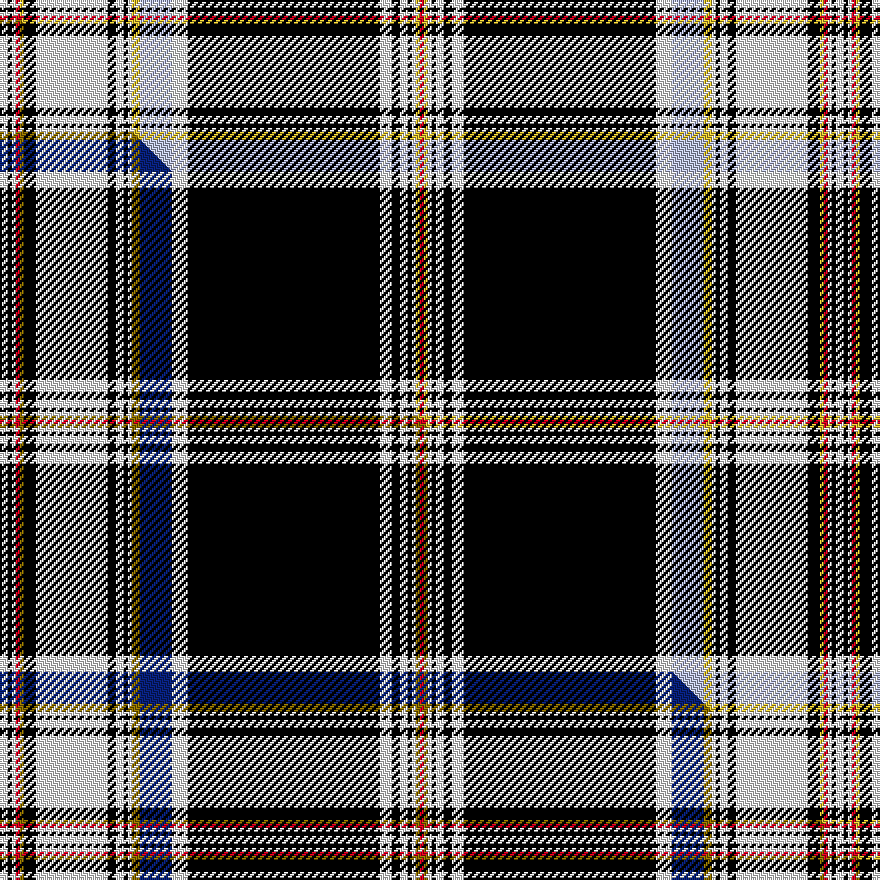

This is one **variant** — a specific cloth: this exact thread count and colourway, with its own
provenance below. It is one weaving of the [sett](/setts/w2k1w1r1ly1k3w18k2w2k1w1ly2lb8w4k48w3k2w2k1w1ly1r1/) (the scale-free proportion — the
same cloth at any scale or shade), whose colour order is pattern [RYWKWKWKWWYWKWKWKYRWKW](/stripes/rywkwkwkwwywkwkwkyrwkw/).

Part of the [Normandy Bay Myth](/tartans/normandy-bay-myth/) tartan — the named design grouping this sett with its other cloths.

Sourced from tartans-authority.  It is a [22 stripe tartan](/stripes/stripes22/).

Original link [https://www.tartanregister.gov.uk/tartanDetails.aspx?ref=10747](https://www.tartanregister.gov.uk/tartanDetails.aspx?ref=10747)

Dataset <small>— provenance for this record, inherited from the source manifest</small>

<dl class="dataset-prov">
<dt>source</dt><dd><a href="/sources/tartans-authority/">Scottish Tartans Authority</a></dd>
<dt>data captured from</dt><dd><a href="https://github.com/thetartan/tartan-database/blob/master/data/tartans-authority/data.csv">https://github.com/thetartan/tartan-database/blob/master/data/tartans-authority/data.csv</a></dd>
<dt>data date</dt><dd>11/11/2012 <small>(this record)</small></dd>
<dt>licence</dt><dd><a href="https://creativecommons.org/licenses/by-nc-nd/4.0/">CC BY-NC-ND 4.0</a></dd>
</dl>

Capture chain <small>— the hands this data passed through, oldest first; each capture carries its own licence</small>

<ol class="capture-chain">
<li><a href="https://www.tartansauthority.com/">Scottish Tartans Authority</a> <small>the heritage body's archive — its tartan-ferret record browser is retired (links repaired to the SRT, above)</small></li>
<li><a href="https://github.com/thetartan/tartan-database">thetartan/tartan-database</a> <small>2016-2017</small> · <a href="https://creativecommons.org/licenses/by-nc-nd/4.0/">CC BY-NC-ND 4.0</a> <small>Levko Kravets's frozen compilation — the capture we vendored, and where its CC licence text came from</small></li>
<li>this dictionary <small>captured 2026-06-10 · commit 5bf86c7566</small> <small>each re-capture is a git commit to data/sources</small></li>
</ol>

## Register references

External register numbers recorded for this tartan.

- Scottish Register of Tartans: [10747](https://www.tartanregister.gov.uk/tartanDetails?ref=10747)
- Scottish Tartans Authority (ITI): 10747

## Thread count
W/4 K2 W2 R2 LY2 K6 W36 K4 W4 K2 W2 LY4 LB16 W8 K96 W6 K4 W4 K2 W2 LY2 R/2

One full sett is **418 threads**.

## Palette
<table><thead><tr><th>Colour</th><th>Shade</th><th>OKLCh</th></tr></thead><tbody><tr><td>LB</td><td><code style="background-color:#B5BBDE;">#B5BBDE</code> <small style="color:#888">#B5BBDE</small></td><td><small style="color:#888">oklch(79.9% 0.050 277.6)</small></td></tr><tr><td>K</td><td><code style="background-color:#000000;">#000000</code> <small style="color:#888">#000000</small></td><td><small style="color:#888">oklch(0.0% 0.000 0.0)</small></td></tr><tr><td>W</td><td><code style="background-color:#F7F7F7;">#F7F7F7</code> <small style="color:#888">#F7F7F7</small></td><td><small style="color:#888">oklch(97.6% 0.000 89.9)</small></td></tr><tr><td>R</td><td><code style="background-color:#D60020;">#D60020</code> <small style="color:#888">#D60020</small></td><td><small style="color:#888">oklch(55.2% 0.224 25.5)</small></td></tr><tr><td>LY</td><td><code style="background-color:#DCBC32;">#DCBC32</code> <small style="color:#888">#DCBC32</small></td><td><small style="color:#888">oklch(80.0% 0.150 95.2)</small></td></tr></tbody></table>

# Sample pattern

## Compared to the master

This cloth is one sett of its design; the master sett (the exemplar the design is anchored on) is below for comparison.

Its **ΔTartan distance** from the master is **0.10** — the same measure the nearest-tartans table ranks by (0 is identical; a re-scale of the same cloth is near 0, a recolour or a different proportion further).

<figure class="master-compare" style="margin:0">

this sett
master sett ★

<figcaption style="color:#888;font-size:smaller">One weave of this sett against the <a href="/setts/w2k1w1r1y1k3w18k2w2k1w1y2db8w4k48w3k2w2k1w1y1r1/">master sett ★</a>, split on the diagonal: a shared proportion runs seamlessly across it with only the shades shifting; a different proportion breaks on it.</figcaption>
</figure>

## Nearest tartan variants

The nearest existing variants by ΔTartan distance, with this cloth at the top so the swatches line up against it.

ΔTartan

Threads

Variant

Sett

—

418

<a href="/variants/s22/w2k1w1r1ly1k3w18k2w2k1w1ly2lb8w4k48w3k2w2k1w1ly1r1~x2/">Normandy Bay Myth (Fashion)</a>

<a href="/ttd/edit/#slug=w2k1w1r1y1k3w18k2w2k1w1y2db8w4k48w3k2w2k1w1y1r1~x2&amp;base=w2k1w1r1ly1k3w18k2w2k1w1ly2lb8w4k48w3k2w2k1w1ly1r1~x2" title="compare in the TTD">0.10</a>

418

<a href="/variants/s22/w2k1w1r1y1k3w18k2w2k1w1y2db8w4k48w3k2w2k1w1y1r1~x2/">Normandy Bay Myth</a>

<a href="/ttd/edit/#slug=dr3ly1k4dr1k4dr1k41dr1k4dr1k4o15ly1o3ly2o3ly3o1ly6k1w2~x2&amp;base=w2k1w1r1ly1k3w18k2w2k1w1ly2lb8w4k48w3k2w2k1w1ly1r1~x2" title="compare in the TTD">3.55</a>

398

<a href="/variants/s21/dr3ly1k4dr1k4dr1k41dr1k4dr1k4o15ly1o3ly2o3ly3o1ly6k1w2~x2/">New Star</a>

<a href="/ttd/edit/#slug=k30n33k1ly1k1n8k1ly2k1n3k1ly3w2k1ly7~x2&amp;base=w2k1w1r1ly1k3w18k2w2k1w1ly2lb8w4k48w3k2w2k1w1ly1r1~x2" title="compare in the TTD">3.84</a>

306

<a href="/variants/s15/k30n33k1ly1k1n8k1ly2k1n3k1ly3w2k1ly7~x2/">Black Onyx</a>

<a href="/ttd/edit/#slug=dp60ly2w2k2dp2lyi2dp8w8lyi12dp10k2ly5dp5w2ly2w2dp5ly5dp5k5w12~ly2602166-lyi3307090&amp;base=w2k1w1r1ly1k3w18k2w2k1w1ly2lb8w4k48w3k2w2k1w1ly1r1~x2" title="compare in the TTD">3.86</a>

244

<a href="/variants/s21/dp60y2w2k2dp2ly2dp8w8ly12dp10k2y5dp5w2y2w2dp5y5dp5k5w12~y2602166-ly3307090/">Lions Club</a>

<a href="/ttd/edit/#slug=dp3ly1k4dp1k4dp1k41dp1k4dp1k4dr15ly1dr3ly2dr3ly3dr1ly6k1w2~x2&amp;base=w2k1w1r1ly1k3w18k2w2k1w1ly2lb8w4k48w3k2w2k1w1ly1r1~x2" title="compare in the TTD">3.92</a>

398

<a href="/variants/s21/dp3ly1k4dp1k4dp1k41dp1k4dp1k4dr15ly1dr3ly2dr3ly3dr1ly6k1w2~x2/">New Star (Fashion)</a>

## Neighbour map

Every grey dot is one of 13621 variants placed by the first two principal components of the ΔTartan feature space (42% of its variance). Red is this tartan; blue dots are its nearest — click one to open its page.

<svg viewBox="0 0 640 380" role="img" style="max-width:100%;height:auto;border:1px solid #e0e0e0;border-radius:4px;display:block" xmlns="http://www.w3.org/2000/svg"><image href="/nn/cloud.v1.png" width="640" height="380"/><a href="/variants/s22/w2k1w1r1y1k3w18k2w2k1w1y2db8w4k48w3k2w2k1w1y1r1~x2/"><circle cx="277.3" cy="14.0" r="4" fill="#3465a4"><title>Normandy Bay Myth</title></circle></a><a href="/variants/s21/dr3ly1k4dr1k4dr1k41dr1k4dr1k4o15ly1o3ly2o3ly3o1ly6k1w2~x2/"><circle cx="276.0" cy="14.0" r="4" fill="#3465a4"><title>New Star</title></circle></a><a href="/variants/s15/k30n33k1ly1k1n8k1ly2k1n3k1ly3w2k1ly7~x2/"><circle cx="259.2" cy="63.8" r="4" fill="#3465a4"><title>Black Onyx</title></circle></a><a href="/variants/s21/dp60y2w2k2dp2ly2dp8w8ly12dp10k2y5dp5w2y2w2dp5y5dp5k5w12~y2602166-ly3307090/"><circle cx="288.3" cy="31.5" r="4" fill="#3465a4"><title>Lions Club</title></circle></a><a href="/variants/s21/dp3ly1k4dp1k4dp1k41dp1k4dp1k4dr15ly1dr3ly2dr3ly3dr1ly6k1w2~x2/"><circle cx="289.5" cy="16.7" r="4" fill="#3465a4"><title>New Star (Fashion)</title></circle></a><circle cx="283.2" cy="14.0" r="5" fill="#c00000"/><text x="320" y="376" text-anchor="middle" font-size="11" fill="#999">ground</text><text x="11" y="190" text-anchor="middle" font-size="11" fill="#999" transform="rotate(-90 11 190)">complexity</text></svg>

ID: /variants/s22/w2k1w1r1ly1k3w18k2w2k1w1ly2lb8w4k48w3k2w2k1w1ly1r1~x2/
