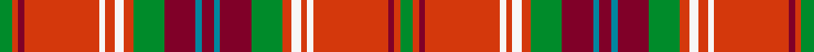

This page is one **sett** — a single exact thread-count. It belongs to the [tartan](/setts/g4ri2r2ri24w2ri3w3ri3g10r10t2r4t2r10g10ri3w3ri2w2ri24r2ri2g4/)
(the same proportion at any scale), whose colour order is pattern [GRRRWRWRGRBRBRGRWRWRRRG](/stripes/grrrwrwrgrbrbrgrwrwrrrg/).

Sourced from register-of-tartans.  It is a [23 stripe tartan](/stripes/stripes23/).

Original link https://www.tartanregister.gov.uk/tartanDetails.aspx?ref=5343

2 attestations — the source records this cloth was collapsed from (oldest owns this page)

<ul>
<li>01/01/2002 — Trost (register-of-tartans, <a href="https://www.tartanregister.gov.uk/tartanDetails.aspx?ref=5343">record</a>)  <em>A tartan as a birthday present from his colleagues for a senior member of staff (probably the boss) at Trost GmbH in Stuttgart-Wangen. Organised through the Scottish Tartans Authority's and designed by Robin Elliot of A Elliot Fine Fabrics with colour input from Trost. The red needs a tinge of orange. See the sample. (Pantone 17-1462 is about it.)</em></li>
<li>2002 — Trost (Corporate) (tartans-authority, <a href="http://www.tartansauthority.com/tartan-ferret/display/3811/">record</a>)  <em>A tartan as a birthday present from his colleagues for a senior member of staff (probably the boss) at Trost GmbH in Stuttgart-Wangen. Organised through the STA and designed by Robin Elliot of A Elliot Fine Fabrics with colour input from Trost.</em></li>
</ul>

## Register references

External register numbers recorded for this tartan.

- Scottish Register of Tartans: [5343](https://www.tartanregister.gov.uk/tartanDetails.aspx?ref=5343)
- Scottish Tartans Authority (ITI): 3811

## Thread count
G/8 Ri4 R4 Ri48 W4 Ri6 W6 Ri6 G20 R20 T4 R8 T4 R20 G20 Ri6 W6 Ri4 W4 Ri48 R4 Ri4 G/8

One full sett is **516 threads**.

## Palette
<table><thead><tr><th>Colour</th><th>Shade</th><th>OKLCh</th></tr></thead><tbody><tr><td>T</td><td><code style="background-color:#00879F;">#00879F</code> <small style="color:#888">#00879F</small></td><td><small style="color:#888">oklch(57.4% 0.102 216.1)</small></td></tr><tr><td>R</td><td><code style="background-color:#800028;">#800028</code> <small style="color:#888">#800028</small></td><td><small style="color:#888">oklch(38.2% 0.152 14.5)</small></td></tr><tr><td>G</td><td><code style="background-color:#008B2A;">#008B2A</code> <small style="color:#888">#008B2A</small></td><td><small style="color:#888">oklch(55.4% 0.170 145.9)</small></td></tr><tr><td>W</td><td><code style="background-color:#F7F7F7;">#F7F7F7</code> <small style="color:#888">#F7F7F7</small></td><td><small style="color:#888">oklch(97.6% 0.000 89.9)</small></td></tr><tr><td>LO</td><td><code style="background-color:#FF9C34;">#FF9C34</code> <small style="color:#888">#FF9C34</small></td><td><small style="color:#888">oklch(77.9% 0.161 61.8)</small></td></tr><tr><td>R</td><td><code style="background-color:#D4380C;">#D4380C</code> <small style="color:#888">#D4380C</small></td><td><small style="color:#888">oklch(57.5% 0.198 34.5)</small></td></tr></tbody></table>

# Sample pattern

ID: /variants/s23/g4ri2r2ri24w2ri3w3ri3g10r10t2r4t2r10g10ri3w3ri2w2ri24r2ri2g4~x2~ri2308036-r1506019/
