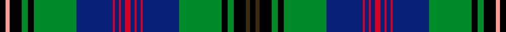

This page is one **sett** — a single exact thread-count. It belongs to the [tartan](/setts/k3dy2k6g3k3g21db18r1db2r1db2r3db2r1db2r1db18g21k3g3k6lr2k3/)
(the same proportion at any scale), whose colour order is pattern [KGKGKGBRBRBRBRBRBGKGKYK](/stripes/kgkgkgbrbrbrbrbrbgkgkyk/).

Part of the [Wood](/tartans/wood/) tartan — the named design grouping this sett with its other cloths.

Sourced from tartans-authority.  It is a [23 stripe tartan](/stripes/stripes23/).

Original link http://www.tartansauthority.com/tartan-ferret/display/6630/

2 attestations — the source records this cloth was collapsed from (oldest owns this page)

<ul>
<li>March 2005 — Wood (Clan) (tartans-authority, <a href="http://www.tartansauthority.com/tartan-ferret/display/6630/">record</a>)  <em>A tartan for all of the name. Initiated by Leslie N Wood of Dartmouth in Devon and designed by Keith Lumsden. Incorporates the colours of the Duke of Fife and Angus district tartans - areas with which the Woods are said to be historically connected. A Clan Wood Society is in the process of being formed (March 2005) and it is expected that they will adopt this tartan. Woven sample. 6th Feb 2007. No formal vote taken in the society but this is now widely accepted as the clan/family tartan. Stocked by D C Dalgliesh of Selkirk.</em></li>
<li>undated — Wood (Clan/Family) (register-of-tartans, <a href="https://www.tartanregister.gov.uk/tartanDetails.aspx?ref=5069">record</a>)  <em>Initiated by Leslie N Wood and designed by Keith Lumsden, based on early photographic evidence. The Wood tartan incorporates the colours of the Duke of Fife and Angus district tartans - areas with which the Woods are said to be historically connected. It has been approved by the Chief of Clan Wood and adopted by the Clan Wood Society.</em></li>
</ul>

## Register references

External register numbers recorded for this tartan.

- Scottish Register of Tartans: [5069](https://www.tartanregister.gov.uk/tartanDetails.aspx?ref=5069)
- Scottish Tartans Authority (ITI): 6630
- Scottish Tartans World Register: 3046

## Thread count
K/6 LR4 K12 G6 K6 G42 DB36 R2 DB4 R2 DB4 R6 DB4 R2 DB4 R2 DB36 G42 K6 G6 K12 DY4 K/6

One full sett is **496 threads**.

## Palette
<table><thead><tr><th>Colour</th><th>Shade</th><th>OKLCh</th></tr></thead><tbody><tr><td>DB</td><td><code style="background-color:#082077;">#082077</code> <small style="color:#888">#082077</small></td><td><small style="color:#888">oklch(30.0% 0.149 265.1)</small></td></tr><tr><td>G</td><td><code style="background-color:#008B2A;">#008B2A</code> <small style="color:#888">#008B2A</small></td><td><small style="color:#888">oklch(55.4% 0.170 145.9)</small></td></tr><tr><td>K</td><td><code style="background-color:#000000;">#000000</code> <small style="color:#888">#000000</small></td><td><small style="color:#888">oklch(0.0% 0.000 0.0)</small></td></tr><tr><td>LR</td><td><code style="background-color:#FF9C97;">#FF9C97</code> <small style="color:#888">#FF9C97</small></td><td><small style="color:#888">oklch(79.3% 0.119 23.2)</small></td></tr><tr><td>R</td><td><code style="background-color:#D60020;">#D60020</code> <small style="color:#888">#D60020</small></td><td><small style="color:#888">oklch(55.2% 0.224 25.5)</small></td></tr><tr><td>DY</td><td><code style="background-color:#3A2B0D;">#3A2B0D</code> <small style="color:#888">#3A2B0D</small></td><td><small style="color:#888">oklch(30.0% 0.049 82.0)</small></td></tr></tbody></table>

# Sample pattern

## Nearest variants

The nearest existing variants by ΔTartan distance, with this cloth at the top so the swatches line up against it.

ΔTartan

Threads

Variant

Sett

—

496

<a href="/variants/s23/k3dy2k6g3k3g21db18r1db2r1db2r3db2r1db2r1db18g21k3g3k6lr2k3~x2/">Wood (Clan)</a>

<a href="/ttd/edit/#slug=k3dy2k6g3k3g21db18r2db2r2db2r3db2r2db2r2db18g21k3g3k6lr2k3~x2&amp;base=k3dy2k6g3k3g21db18r1db2r1db2r3db2r1db2r1db18g21k3g3k6lr2k3~x2" title="compare in the TTD">0.49</a>

512

<a href="/variants/s23/k3dy2k6g3k3g21db18r2db2r2db2r3db2r2db2r2db18g21k3g3k6lr2k3~x2/">Wood Clan/Family Tartan</a>

## Neighbour map

Every grey dot is one of 13620 variants placed by the first two principal components of the ΔTartan feature space (42% of its variance). Red is this tartan; blue dots are its nearest — click one to open its page.

<svg viewBox="0 0 640 380" role="img" style="max-width:100%;height:auto;border:1px solid #e0e0e0;border-radius:4px;display:block" xmlns="http://www.w3.org/2000/svg"><image href="/nn/cloud.v1.png" width="640" height="380"/><a href="/variants/s23/k3dy2k6g3k3g21db18r2db2r2db2r3db2r2db2r2db18g21k3g3k6lr2k3~x2/"><circle cx="107.6" cy="91.8" r="4" fill="#3465a4"><title>Wood Clan/Family Tartan</title></circle></a><circle cx="140.1" cy="63.7" r="5" fill="#c00000"/><text x="320" y="376" text-anchor="middle" font-size="11" fill="#999">ground</text><text x="11" y="190" text-anchor="middle" font-size="11" fill="#999" transform="rotate(-90 11 190)">complexity</text></svg>

ID: /variants/s23/k3dy2k6g3k3g21db18r1db2r1db2r3db2r1db2r1db18g21k3g3k6lr2k3~x2/
