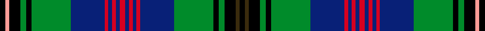
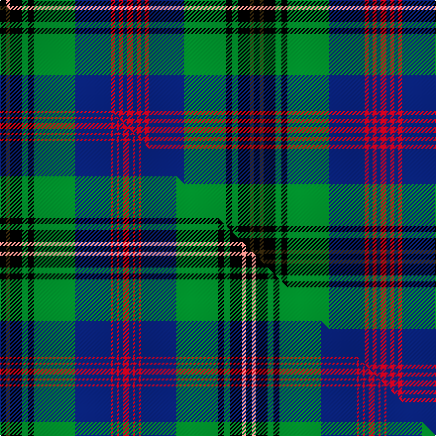

This is one **variant** — a specific cloth: this exact thread count and colourway, with its own
provenance below. It is one weaving of the [sett](/setts/k3dy2k6g3k3g21db18r2db2r2db2r3db2r2db2r2db18g21k3g3k6lr2k3/) (the scale-free proportion — the
same cloth at any scale or shade), whose colour order is pattern [KGKGKGBRBRBRBRBRBGKGKYK](/stripes/kgkgkgbrbrbrbrbrbgkgkyk/).

Part of the [Wood](/tartans/w/wo/wood/) tartan — the named design grouping this sett with its other cloths.

Sourced from house-of-tartan.  It is a [23 stripe tartan](/stripes/stripes23/).

Original link [http://www.house-of-tartan.scotland.net/house/TartanViewjs.asp?colr=Def&tnam=6630](http://www.house-of-tartan.scotland.net/house/TartanViewjs.asp?colr=Def&tnam=6630)

## Provenance

Earliest known date: March 2005 A tartan for all of the name. Initiated by Leslie N Wood of Dartmouth, Devon and designed by Keith Lumsden. Incorporates the colours of the Duke of Fife and Angus district tartans - areas with which the Woods are said to be historically connected. A Clan Wood Society is in the process of being formed (March 2005) and it is expected that they will adopt this tartan. Woven sample

Dataset <small>— provenance for this record, inherited from the source manifest</small>

<dl class="dataset-prov">
<dt>source</dt><dd><a href="/sources/house-of-tartan/">House of Tartan</a></dd>
<dt>data captured from</dt><dd><a href="https://github.com/thetartan/tartan-database/blob/master/data/house-of-tartan/data.csv">https://github.com/thetartan/tartan-database/blob/master/data/house-of-tartan/data.csv</a></dd>
<dt>data date</dt><dd>March 2005 <small>(this record)</small></dd>
<dt>licence</dt><dd><a href="https://creativecommons.org/licenses/by-nc-nd/4.0/">CC BY-NC-ND 4.0</a></dd>
</dl>

Capture chain <small>— the hands this data passed through, oldest first; each capture carries its own licence</small>

<ol class="capture-chain">
<li><a href="http://www.house-of-tartan.scotland.net/">House of Tartan</a> <small>the weaver/retailer's database — the site is now offline; the URL is kept as the ultimate source's identity</small></li>
<li><a href="https://github.com/thetartan/tartan-database">thetartan/tartan-database</a> <small>2016-2017</small> · <a href="https://creativecommons.org/licenses/by-nc-nd/4.0/">CC BY-NC-ND 4.0</a> <small>Levko Kravets's frozen compilation — the capture we vendored, and where its CC licence text came from</small></li>
<li>this dictionary <small>captured 2026-06-10 · commit 5bf86c7566</small> <small>each re-capture is a git commit to data/sources</small></li>
</ol>

## Thread count
K/6 LR4 K12 G6 K6 G42 DB36 R4 DB4 R4 DB4 R6 DB4 R4 DB4 R4 DB36 G42 K6 G6 K12 DY4 K/6

One full sett is **512 threads**.

## Palette
<table><thead><tr><th>Colour</th><th>Shade</th><th>OKLCh</th></tr></thead><tbody><tr><td>DB</td><td><code style="background-color:#082077;">#082077</code> <small style="color:#888">#082077</small></td><td><small style="color:#888">oklch(30.0% 0.149 265.1)</small></td></tr><tr><td>G</td><td><code style="background-color:#008B2A;">#008B2A</code> <small style="color:#888">#008B2A</small></td><td><small style="color:#888">oklch(55.4% 0.170 145.9)</small></td></tr><tr><td>K</td><td><code style="background-color:#000000;">#000000</code> <small style="color:#888">#000000</small></td><td><small style="color:#888">oklch(0.0% 0.000 0.0)</small></td></tr><tr><td>LR</td><td><code style="background-color:#FF9C97;">#FF9C97</code> <small style="color:#888">#FF9C97</small></td><td><small style="color:#888">oklch(79.3% 0.119 23.2)</small></td></tr><tr><td>R</td><td><code style="background-color:#D60020;">#D60020</code> <small style="color:#888">#D60020</small></td><td><small style="color:#888">oklch(55.2% 0.224 25.5)</small></td></tr><tr><td>DY</td><td><code style="background-color:#3A2B0D;">#3A2B0D</code> <small style="color:#888">#3A2B0D</small></td><td><small style="color:#888">oklch(30.0% 0.049 82.0)</small></td></tr></tbody></table>

# Sample pattern

## Compared to the master

This cloth is one sett of its design; the master sett (the exemplar the design is anchored on) is below for comparison.

Its **ΔTartan distance** from the master is **0.49** — the same measure the nearest-tartans table ranks by (0 is identical; a re-scale of the same cloth is near 0, a recolour or a different proportion further).

<figure class="master-compare" style="margin:0">

this sett
master sett ★

<figcaption style="color:#888;font-size:smaller">One weave of this sett against the <a href="/setts/k3dy2k6g3k3g21db18r1db2r1db2r3db2r1db2r1db18g21k3g3k6lr2k3/">master sett ★</a>, split on the diagonal: a shared proportion runs seamlessly across it with only the shades shifting; a different proportion breaks on it.</figcaption>
</figure>

## Nearest tartan variants

The nearest existing variants by ΔTartan distance, with this cloth at the top so the swatches line up against it.

ΔTartan

Threads

Variant

Sett

—

512

<a href="/variants/s23/k3dy2k6g3k3g21db18r2db2r2db2r3db2r2db2r2db18g21k3g3k6lr2k3~x2/">Wood Clan/Family Tartan</a>

<a href="/ttd/edit/#slug=k3dy2k6g3k3g21db18r1db2r1db2r3db2r1db2r1db18g21k3g3k6lr2k3~x2&amp;base=k3dy2k6g3k3g21db18r2db2r2db2r3db2r2db2r2db18g21k3g3k6lr2k3~x2" title="compare in the TTD">0.49</a>

496

<a href="/variants/s23/k3dy2k6g3k3g21db18r1db2r1db2r3db2r1db2r1db18g21k3g3k6lr2k3~x2/">Wood (Clan)</a>

<a href="/ttd/edit/#slug=db10k1g1k1g1k1db10r3k10r3g10k1y1k1w1k1g10&amp;base=k3dy2k6g3k3g21db18r2db2r2db2r3db2r2db2r2db18g21k3g3k6lr2k3~x2" title="compare in the TTD">1.72</a>

112

<a href="/variants/s17/db10k1g1k1g1k1db10r3k10r3g10k1y1k1w1k1g10/">MacNicol Hunting</a>

<a href="/ttd/edit/#slug=db10k1g1k1g1k1db10r3k10r3g10k1y1k1w1k1g10~x2&amp;base=k3dy2k6g3k3g21db18r2db2r2db2r3db2r2db2r2db18g21k3g3k6lr2k3~x2" title="compare in the TTD">1.72</a>

224

<a href="/variants/s17/db10k1g1k1g1k1db10r3k10r3g10k1y1k1w1k1g10~x2/">Cunningham, hunting</a>

<a href="/ttd/edit/#slug=dt50k10dt6k10dt6dg5lp5dg5o8dg23w5~x2~dt1204274-dg1405139&amp;base=k3dy2k6g3k3g21db18r2db2r2db2r3db2r2db2r2db18g21k3g3k6lr2k3~x2" title="compare in the TTD">2.21</a>

422

<a href="/variants/s11/db50k10db6k10db6dg5lp5dg5o8dg23w5~x2~db1204274-dg1405139/">Scottish Hockey Union</a>

<a href="/ttd/edit/#slug=db14k12db3dg26k6ly2k2db2k2dg8r4k2r4lb2r4k2r4dg8k2db2k2ly2k6dg26db3k12db14k4~x2~dg1405139&amp;base=k3dy2k6g3k3g21db18r2db2r2db2r3db2r2db2r2db18g21k3g3k6lr2k3~x2" title="compare in the TTD">2.26</a>

684

<a href="/variants/s28/db14k12db3dg26k6ly2k2db2k2dg8r4k2r4lb2r4k2r4dg8k2db2k2ly2k6dg26db3k12db14k4~x2~dg1405139/">Stewart</a>

<a href="/ttd/edit/#slug=db16k16g2k2g2k2g16k2g2k2g2k16y16k2db2r2k2y16k16db16k2w3k2~x2&amp;base=k3dy2k6g3k3g21db18r2db2r2db2r3db2r2db2r2db18g21k3g3k6lr2k3~x2" title="compare in the TTD">2.27</a>

600

<a href="/variants/s23/db16k16g2k2g2k2g16k2g2k2g2k16y16k2db2r2k2y16k16db16k2w3k2~x2/">Ferrazza in Guidonia, Rome (Personal)</a>

<a href="/ttd/edit/#slug=db38w2db2k10g2dy2g22k3r3k3r3~x2&amp;base=k3dy2k6g3k3g21db18r2db2r2db2r3db2r2db2r2db18g21k3g3k6lr2k3~x2" title="compare in the TTD">2.35</a>

278

<a href="/variants/s11/db38w2db2k10g2dy2g22k3r3k3r3~x2/">Hunnisett/Edinchip (Personal)</a>

<a href="/ttd/edit/#slug=g3dg2g2dg16g2dg2g2dg2g4n4k2n2k2n2k24r2k2w3~x2~g2203152-dg1806142&amp;base=k3dy2k6g3k3g21db18r2db2r2db2r3db2r2db2r2db18g21k3g3k6lr2k3~x2" title="compare in the TTD">2.39</a>

300

<a href="/variants/s18/g3dg2g2dg16g2dg2g2dg2g4n4k2n2k2n2k24r2k2w3~x2~g2203152-dg1806142/">Barkway (Name)</a>

<a href="/ttd/edit/#slug=db16k16g2k2g2k2g16k2g2k2g2k16ly16k2db2r2k2ly16k16db16k2w3k2~x2&amp;base=k3dy2k6g3k3g21db18r2db2r2db2r3db2r2db2r2db18g21k3g3k6lr2k3~x2" title="compare in the TTD">2.42</a>

600

<a href="/variants/s23/db16k16g2k2g2k2g16k2g2k2g2k16ly16k2db2r2k2ly16k16db16k2w3k2~x2/">Ferrazza (Personal)</a>

<a href="/ttd/edit/#slug=db15k1db1k1db1k12g9r1g9k1w1k1g9r1g9k12r1db9r2db1r1db6w1~x2&amp;base=k3dy2k6g3k3g21db18r2db2r2db2r3db2r2db2r2db18g21k3g3k6lr2k3~x2" title="compare in the TTD">2.42</a>

388

<a href="/variants/s23/db15k1db1k1db1k12g9r1g9k1w1k1g9r1g9k12r1db9r2db1r1db6w1~x2/">Rankine</a>

## Neighbour map

Every grey dot is one of 13621 variants placed by the first two principal components of the ΔTartan feature space (42% of its variance). Red is this tartan; blue dots are its nearest — click one to open its page.

<svg viewBox="0 0 640 380" role="img" style="max-width:100%;height:auto;border:1px solid #e0e0e0;border-radius:4px;display:block" xmlns="http://www.w3.org/2000/svg"><image href="/nn/cloud.v1.png" width="640" height="380"/><a href="/variants/s23/k3dy2k6g3k3g21db18r1db2r1db2r3db2r1db2r1db18g21k3g3k6lr2k3~x2/"><circle cx="140.0" cy="63.5" r="4" fill="#3465a4"><title>Wood (Clan)</title></circle></a><a href="/variants/s17/db10k1g1k1g1k1db10r3k10r3g10k1y1k1w1k1g10/"><circle cx="89.5" cy="112.7" r="4" fill="#3465a4"><title>MacNicol Hunting</title></circle></a><a href="/variants/s17/db10k1g1k1g1k1db10r3k10r3g10k1y1k1w1k1g10~x2/"><circle cx="89.5" cy="112.7" r="4" fill="#3465a4"><title>Cunningham, hunting</title></circle></a><a href="/variants/s11/db50k10db6k10db6dg5lp5dg5o8dg23w5~x2~db1204274-dg1405139/"><circle cx="113.7" cy="117.9" r="4" fill="#3465a4"><title>Scottish Hockey Union</title></circle></a><a href="/variants/s28/db14k12db3dg26k6ly2k2db2k2dg8r4k2r4lb2r4k2r4dg8k2db2k2ly2k6dg26db3k12db14k4~x2~dg1405139/"><circle cx="120.0" cy="86.9" r="4" fill="#3465a4"><title>Stewart</title></circle></a><a href="/variants/s23/db16k16g2k2g2k2g16k2g2k2g2k16y16k2db2r2k2y16k16db16k2w3k2~x2/"><circle cx="91.1" cy="110.3" r="4" fill="#3465a4"><title>Ferrazza in Guidonia, Rome (Personal)</title></circle></a><a href="/variants/s11/db38w2db2k10g2dy2g22k3r3k3r3~x2/"><circle cx="121.2" cy="63.2" r="4" fill="#3465a4"><title>Hunnisett/Edinchip (Personal)</title></circle></a><a href="/variants/s18/g3dg2g2dg16g2dg2g2dg2g4n4k2n2k2n2k24r2k2w3~x2~g2203152-dg1806142/"><circle cx="119.1" cy="83.8" r="4" fill="#3465a4"><title>Barkway (Name)</title></circle></a><a href="/variants/s23/db16k16g2k2g2k2g16k2g2k2g2k16ly16k2db2r2k2ly16k16db16k2w3k2~x2/"><circle cx="75.8" cy="106.2" r="4" fill="#3465a4"><title>Ferrazza (Personal)</title></circle></a><a href="/variants/s23/db15k1db1k1db1k12g9r1g9k1w1k1g9r1g9k12r1db9r2db1r1db6w1~x2/"><circle cx="119.4" cy="101.5" r="4" fill="#3465a4"><title>Rankine</title></circle></a><circle cx="107.5" cy="91.8" r="5" fill="#c00000"/><text x="320" y="376" text-anchor="middle" font-size="11" fill="#999">ground</text><text x="11" y="190" text-anchor="middle" font-size="11" fill="#999" transform="rotate(-90 11 190)">complexity</text></svg>

ID: /variants/s23/k3dy2k6g3k3g21db18r2db2r2db2r3db2r2db2r2db18g21k3g3k6lr2k3~x2/
