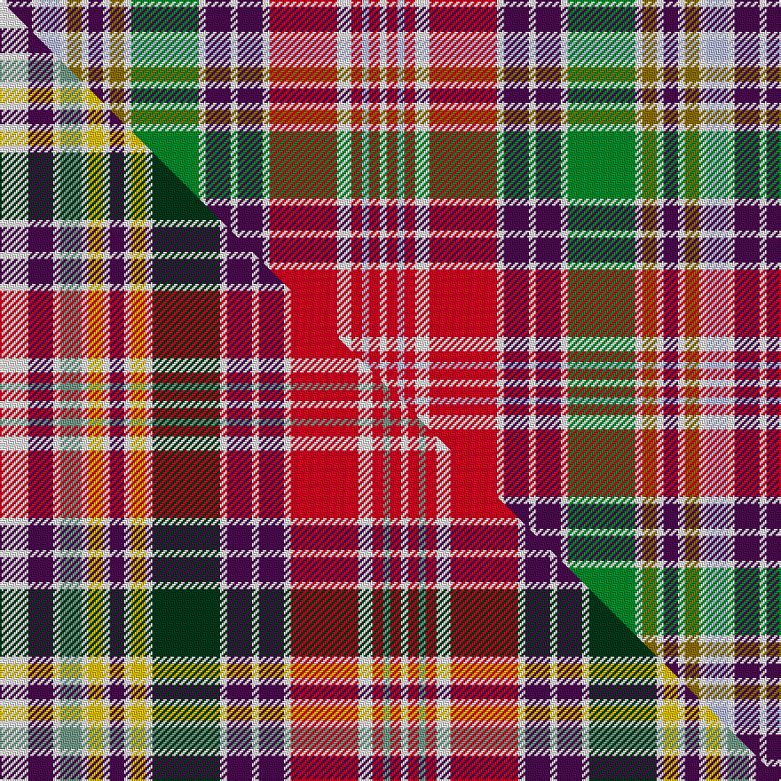

This page is one **sett** — a single exact thread-count. It belongs to the [tartan](/setts/w2dp7w2lb6w2y4w2dp4w2y4w2g19w2dp7w2dp7w2r19w4r3lb2r3w2/)
(the same proportion at any scale), whose colour order is pattern [WBWWWGWBWGWGWBWBWRWRWRW](/stripes/wbwwwgwbwgwgwbwbwrwrwrw/).

Part of the [Lasting](/tartans/lasting/) tartan — the named design grouping this sett with its other cloths.

Sourced from weddslist.  It is a [23 stripe tartan](/stripes/stripes23/).

Original link http://www.weddslist.com/cgi-bin/tartans/pg.pl?source=sts

## Provenance

Earliest known date: 1819 An early plaid sett from Wilson's of Bannockburn 1819 pattern book.

2 attestations — the source records this cloth was collapsed from (oldest owns this page)

<ul>
<li>undated — Lasting (weddslist, <a href="http://www.weddslist.com/cgi-bin/tartans/pg.pl?source=sts">record</a>) </li>
<li>undated — Lasting Family Tartan (house-of-tartan, <a href="http://www.house-of-tartan.scotland.net/house/TartanViewjs.asp?colr=Def&tnam=1789">record</a>) </li>
</ul>

Dataset <small>— provenance for this record, inherited from the source manifest</small>

<dl class="dataset-prov">
<dt>source</dt><dd><a href="/sources/weddslist/">Weddslist</a></dd>
<dt>data captured from</dt><dd><a href="https://github.com/thetartan/tartan-database/blob/master/data/weddslist/data.csv">https://github.com/thetartan/tartan-database/blob/master/data/weddslist/data.csv</a></dd>
<dt>data date</dt><dd>2016-11-17 <small>(dataset default)</small></dd>
<dt>licence</dt><dd><a href="https://creativecommons.org/licenses/by-nc-nd/4.0/">CC BY-NC-ND 4.0</a></dd>
</dl>

Capture chain <small>— the hands this data passed through, oldest first; each capture carries its own licence</small>

<ol class="capture-chain">
<li><a href="https://www.weddslist.com/tartans/">Weddslist</a> <small>the living privately compiled reference</small></li>
<li><a href="https://github.com/thetartan/tartan-database">thetartan/tartan-database</a> <small>2016-2017</small> · <a href="https://creativecommons.org/licenses/by-nc-nd/4.0/">CC BY-NC-ND 4.0</a> <small>Levko Kravets's frozen compilation — the capture we vendored, and where its CC licence text came from</small></li>
<li>this dictionary <small>captured 2026-06-10 · commit 5bf86c7566</small> <small>each re-capture is a git commit to data/sources</small></li>
</ol>

## Thread count
W/4 DP14 W4 LB12 W4 Y8 W4 DP8 W4 Y8 W4 G38 W4 DP14 W4 DP14 W4 R38 W8 R6 LB4 R6 W/4

One full sett is **428 threads**.

## Palette
<table><thead><tr><th>Colour</th><th>Shade</th><th>OKLCh</th></tr></thead><tbody><tr><td>LB</td><td><code style="background-color:#B5BBDE;">#B5BBDE</code> <small style="color:#888">#B5BBDE</small></td><td><small style="color:#888">oklch(79.9% 0.050 277.6)</small></td></tr><tr><td>G</td><td><code style="background-color:#008B2A;">#008B2A</code> <small style="color:#888">#008B2A</small></td><td><small style="color:#888">oklch(55.4% 0.170 145.9)</small></td></tr><tr><td>W</td><td><code style="background-color:#F7F7F7;">#F7F7F7</code> <small style="color:#888">#F7F7F7</small></td><td><small style="color:#888">oklch(97.6% 0.000 89.9)</small></td></tr><tr><td>DP</td><td><code style="background-color:#4B0B4F;">#4B0B4F</code> <small style="color:#888">#4B0B4F</small></td><td><small style="color:#888">oklch(30.1% 0.125 325.4)</small></td></tr><tr><td>R</td><td><code style="background-color:#D60020;">#D60020</code> <small style="color:#888">#D60020</small></td><td><small style="color:#888">oklch(55.2% 0.224 25.5)</small></td></tr><tr><td>Y</td><td><code style="background-color:#8B6E00;">#8B6E00</code> <small style="color:#888">#8B6E00</small></td><td><small style="color:#888">oklch(55.1% 0.113 90.4)</small></td></tr></tbody></table>

# Sample pattern

## Compared to the master

This cloth is one sett of its design; the master sett (the exemplar the design is anchored on) is below for comparison.

Its **ΔTartan distance** from the master is **0.78** — the same measure the nearest-tartans table ranks by (0 is identical; a re-scale of the same cloth is near 0, a recolour or a different proportion further).

<figure class="master-compare" style="margin:0">

this sett
master sett ★

<figcaption style="color:#888;font-size:smaller">One weave of this sett against the <a href="/setts/w8dp7w2y6w2ly4w2dp4w2ly4w2dg19w2dp7w2dp7w2r19w4r3y2r3w2/">master sett ★</a>, split on the diagonal: a shared proportion runs seamlessly across it with only the shades shifting; a different proportion breaks on it.</figcaption>
</figure>

## Nearest tartan variants

The nearest existing variants by ΔTartan distance, with this cloth at the top so the swatches line up against it.

ΔTartan

Threads

Variant

Sett

—

428

<a href="/variants/s23/w2dp7w2lb6w2y4w2dp4w2y4w2g19w2dp7w2dp7w2r19w4r3lb2r3w2~x2/">Lasting</a>

<a href="/ttd/edit/#slug=w8dp7w2ly6w2lyi4w2dp4w2lyi4w2dg19w2dp7w2dp7w2r19w4r3ly2r3w2~x2~ly2602166-lyi3307090&amp;base=w2dp7w2lb6w2y4w2dp4w2y4w2g19w2dp7w2dp7w2r19w4r3lb2r3w2~x2" title="compare in the TTD">0.78</a>

440

<a href="/variants/s23/w8dp7w2y6w2ly4w2dp4w2ly4w2dg19w2dp7w2dp7w2r19w4r3y2r3w2~x2~y2602166-ly3307090/">Lasting</a>

<a href="/ttd/edit/#slug=w7dp7w1g13w1dp2w1db14w1dp2w1r11w1dp2w1y7w1dp2w7~x2&amp;base=w2dp7w2lb6w2y4w2dp4w2y4w2g19w2dp7w2dp7w2r19w4r3lb2r3w2~x2" title="compare in the TTD">2.40</a>

300

<a href="/variants/s19/w7dp7w1g13w1dp2w1db14w1dp2w1r11w1dp2w1y7w1dp2w7~x2/">Four Quarters (Personal)</a>

<a href="/ttd/edit/#slug=w1r2db2w1g9w1db2r2w1r2db2w1lo9w1db2r2w1~x4&amp;base=w2dp7w2lb6w2y4w2dp4w2y4w2g19w2dp7w2dp7w2r19w4r3lb2r3w2~x2" title="compare in the TTD">2.62</a>

320

<a href="/variants/s17/w1r2db2w1g9w1db2r2w1r2db2w1lo9w1db2r2w1~x4/">Jacobite</a>

<a href="/ttd/edit/#slug=dg1r6g5r6dg1r1dg9dy3g3y3dg9r1dg1r6g5r6dg1r1w1r1w12g1w12r1w1r1~x4&amp;base=w2dp7w2lb6w2y4w2dp4w2y4w2g19w2dp7w2dp7w2r19w4r3lb2r3w2~x2" title="compare in the TTD">2.71</a>

776

<a href="/variants/s26/dg1r6g5r6dg1r1dg9dy3g3y3dg9r1dg1r6g5r6dg1r1w1r1w12g1w12r1w1r1~x4/">Maple Leaf Dress District Tartan</a>

<a href="/ttd/edit/#slug=r14lb4dt6y1dt2w2dt2lg12r6dt2r2w1~x4~lg3003114&amp;base=w2dp7w2lb6w2y4w2dp4w2y4w2g19w2dp7w2dp7w2r19w4r3lb2r3w2~x2" title="compare in the TTD">2.76</a>

372

<a href="/variants/s12/r14lb4dt6y1dt2w2dt2lg12r6dt2r2w1~x4~lg3003114/">Stuart/Stewart - Prince Charles Edward</a>

<a href="/ttd/edit/#slug=dg1r6g5r6dg1r1dg9o3dg3gi3dg9r1dg1r6g5r6dg1r1w1r1w12g1w12r1w1r1~x4~dg1104144-gi2104115&amp;base=w2dp7w2lb6w2y4w2dp4w2y4w2g19w2dp7w2dp7w2r19w4r3lb2r3w2~x2" title="compare in the TTD">2.86</a>

776

<a href="/variants/s26/dg1r6g5r6dg1r1dg9o3dg3gi3dg9r1dg1r6g5r6dg1r1w1r1w12g1w12r1w1r1~x4~dg1104144-gi2104115/">Maple Leaf, dress</a>

<a href="/ttd/edit/#slug=w1r2db2w1y8w1db2r2w1r2db2w1g8w1db2r2w1~x4&amp;base=w2dp7w2lb6w2y4w2dp4w2y4w2g19w2dp7w2dp7w2r19w4r3lb2r3w2~x2" title="compare in the TTD">2.96</a>

304

<a href="/variants/s17/w1r2db2w1y8w1db2r2w1r2db2w1g8w1db2r2w1~x4/">Jacobite (1712) (Universal)</a>

<a href="/ttd/edit/#slug=w5db2w1g8w1db2r2w1r2db2w1lo8w1db2w5~x4&amp;base=w2dp7w2lb6w2y4w2dp4w2y4w2g19w2dp7w2dp7w2r19w4r3lb2r3w2~x2" title="compare in the TTD">3.10</a>

304

<a href="/variants/s15/w5db2w1g8w1db2r2w1r2db2w1lo8w1db2w5~x4/">Wombles #4</a>

<a href="/ttd/edit/#slug=r26lb7dp8y3r3w3g20dp10w2~x2&amp;base=w2dp7w2lb6w2y4w2dp4w2y4w2g19w2dp7w2dp7w2r19w4r3lb2r3w2~x2" title="compare in the TTD">3.13</a>

272

<a href="/variants/s9/r26lb7dp8y3r3w3g20dp10w2~x2/">Wilson's No.227</a>

<a href="/ttd/edit/#slug=r2db2w1y8w1db2r2w1r2db2w1g8w1db2r2w1r2db2w1g8w1db2r2w1r2db2w1y8w1db2r2w1~x4~r2109032&amp;base=w2dp7w2lb6w2y4w2dp4w2y4w2g19w2dp7w2dp7w2r19w4r3lb2r3w2~x2" title="compare in the TTD">3.18</a>

596

<a href="/variants/s32/r2db2w1y8w1db2r2w1r2db2w1g8w1db2r2w1r2db2w1g8w1db2r2w1r2db2w1y8w1db2r2w1~x4~r2109032/">Jacobite (1712)</a>

## Neighbour map

Every grey dot is one of 13620 variants placed by the first two principal components of the ΔTartan feature space (42% of its variance). Red is this tartan; blue dots are its nearest — click one to open its page.

<svg viewBox="0 0 640 380" role="img" style="max-width:100%;height:auto;border:1px solid #e0e0e0;border-radius:4px;display:block" xmlns="http://www.w3.org/2000/svg"><image href="/nn/cloud.v1.png" width="640" height="380"/><a href="/variants/s23/w8dp7w2y6w2ly4w2dp4w2ly4w2dg19w2dp7w2dp7w2r19w4r3y2r3w2~x2~y2602166-ly3307090/"><circle cx="53.6" cy="118.6" r="4" fill="#3465a4"><title>Lasting</title></circle></a><a href="/variants/s19/w7dp7w1g13w1dp2w1db14w1dp2w1r11w1dp2w1y7w1dp2w7~x2/"><circle cx="79.3" cy="118.3" r="4" fill="#3465a4"><title>Four Quarters (Personal)</title></circle></a><a href="/variants/s17/w1r2db2w1g9w1db2r2w1r2db2w1lo9w1db2r2w1~x4/"><circle cx="79.9" cy="151.1" r="4" fill="#3465a4"><title>Jacobite</title></circle></a><a href="/variants/s26/dg1r6g5r6dg1r1dg9dy3g3y3dg9r1dg1r6g5r6dg1r1w1r1w12g1w12r1w1r1~x4/"><circle cx="84.6" cy="109.6" r="4" fill="#3465a4"><title>Maple Leaf Dress District Tartan</title></circle></a><a href="/variants/s12/r14lb4dt6y1dt2w2dt2lg12r6dt2r2w1~x4~lg3003114/"><circle cx="124.2" cy="119.9" r="4" fill="#3465a4"><title>Stuart/Stewart - Prince Charles Edward</title></circle></a><a href="/variants/s26/dg1r6g5r6dg1r1dg9o3dg3gi3dg9r1dg1r6g5r6dg1r1w1r1w12g1w12r1w1r1~x4~dg1104144-gi2104115/"><circle cx="84.2" cy="108.4" r="4" fill="#3465a4"><title>Maple Leaf, dress</title></circle></a><a href="/variants/s17/w1r2db2w1y8w1db2r2w1r2db2w1g8w1db2r2w1~x4/"><circle cx="71.3" cy="164.9" r="4" fill="#3465a4"><title>Jacobite (1712) (Universal)</title></circle></a><a href="/variants/s15/w5db2w1g8w1db2r2w1r2db2w1lo8w1db2w5~x4/"><circle cx="65.7" cy="146.2" r="4" fill="#3465a4"><title>Wombles #4</title></circle></a><a href="/variants/s9/r26lb7dp8y3r3w3g20dp10w2~x2/"><circle cx="107.9" cy="139.3" r="4" fill="#3465a4"><title>Wilson's No.227</title></circle></a><a href="/variants/s32/r2db2w1y8w1db2r2w1r2db2w1g8w1db2r2w1r2db2w1g8w1db2r2w1r2db2w1y8w1db2r2w1~x4~r2109032/"><circle cx="60.6" cy="142.7" r="4" fill="#3465a4"><title>Jacobite (1712)</title></circle></a><circle cx="64.1" cy="125.9" r="5" fill="#c00000"/><text x="320" y="376" text-anchor="middle" font-size="11" fill="#999">ground</text><text x="11" y="190" text-anchor="middle" font-size="11" fill="#999" transform="rotate(-90 11 190)">complexity</text></svg>

ID: /variants/s23/w2dp7w2lb6w2y4w2dp4w2y4w2g19w2dp7w2dp7w2r19w4r3lb2r3w2~x2/
