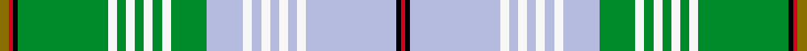

This is one **variant** — a specific cloth: this exact thread count and colourway, with its own
provenance below. It is one weaving of the [sett](/setts/y2r1k1g20w2g2w2g2w2g2w2g8lb8w2lb2w2lb2w2lb2w2lb20k1r1/) (the scale-free proportion — the
same cloth at any scale or shade), whose colour order is pattern [GRKGWGWGWGWGWWWWWWWWWKR](/stripes/grkgwgwgwgwgwwwwwwwwwkr/).

Part of the [Lachine](/tartans/l/la/lachine-2/) tartan — the named design grouping this sett with its other cloths.

Sourced from register-of-tartans.  It is a [23 stripe tartan](/stripes/stripes23/).

Original link [https://www.tartanregister.gov.uk/tartanDetails.aspx?ref=2019](https://www.tartanregister.gov.uk/tartanDetails.aspx?ref=2019)

2 attestations — the source records this cloth was collapsed from (oldest owns this page)

<ul>
<li>01/08/2000 — Lachine (register-of-tartans, <a href="https://www.tartanregister.gov.uk/tartanDetails.aspx?ref=2019">record</a>)  <em>Produced by the Guilde des Tisserandes de Lachine this complicated asymmetric sett is typical of Quebec weaving tradition. Lachine is close to Montreal on Lake Saint-Louis and historically occupied a strategic position on the fur route as a departure and arrival point for trading expeditions. The colours used here are from the city's coat of arms.</em></li>
<li>pre 2004 — Lachine (District) (tartans-authority, <a href="https://www.tartanregister.gov.uk/tartanDetails.aspx?ref=6202">record</a>)  <em>Produced by the Guilde des Tisserandes de Lachine this complicated asymmetric sett is typical of Quebec weaving tradition. Lachine is close to Montreal on Lake Saint-Louis and historically occupied a strategic position on the fur route as a departure and arrival point for trading expeditions. The colours used here are from the city's coat of arms. Colours of this 'emblamatic' tartan are were inspired by the crest and loogo used by the city between 1979 and 2001.</em></li>
</ul>

Dataset <small>— provenance for this record, inherited from the source manifest</small>

<dl class="dataset-prov">
<dt>source</dt><dd><a href="/sources/register-of-tartans/">Scottish Register of Tartans</a></dd>
<dt>data captured from</dt><dd><a href="https://github.com/thetartan/tartan-database/blob/master/data/register-of-tartans/data.csv">https://github.com/thetartan/tartan-database/blob/master/data/register-of-tartans/data.csv</a></dd>
<dt>data date</dt><dd>01/08/2000 <small>(this record)</small></dd>
<dt>licence</dt><dd><a href="https://www.tartanregister.gov.uk/copyright">Crown copyright</a></dd>
</dl>

Capture chain <small>— the hands this data passed through, oldest first; each capture carries its own licence</small>

<ol class="capture-chain">
<li><a href="https://www.tartanregister.gov.uk/">Scottish Register of Tartans</a> · <a href="https://www.tartanregister.gov.uk/copyright">Crown copyright</a> <small>the living register — still published by National Records of Scotland</small></li>
<li><a href="https://github.com/thetartan/tartan-database">thetartan/tartan-database</a> <small>2016-2017</small> · <a href="https://creativecommons.org/licenses/by-nc-nd/4.0/">CC BY-NC-ND 4.0</a> <small>Levko Kravets's frozen compilation — the capture we vendored, and where its CC licence text came from</small></li>
<li>this dictionary <small>captured 2026-06-10 · commit 5bf86c7566</small> <small>each re-capture is a git commit to data/sources</small></li>
</ol>

## Register references

External register numbers recorded for this tartan.

- Scottish Register of Tartans: [2019](https://www.tartanregister.gov.uk/tartanDetails.aspx?ref=2019)
- Scottish Tartans Authority (ITI): 6202
- Scottish Tartans World Register: 2910

## Thread count
Y/4 R2 K2 G40 W4 G4 W4 G4 W4 G4 W4 G16 LB16 W4 LB4 W4 LB4 W4 LB4 W4 LB40 K2 R/2

One full sett is **354 threads**.

## Palette
<table><thead><tr><th>Colour</th><th>Shade</th><th>OKLCh</th></tr></thead><tbody><tr><td>LB</td><td><code style="background-color:#B5BBDE;">#B5BBDE</code> <small style="color:#888">#B5BBDE</small></td><td><small style="color:#888">oklch(79.9% 0.050 277.6)</small></td></tr><tr><td>G</td><td><code style="background-color:#008B2A;">#008B2A</code> <small style="color:#888">#008B2A</small></td><td><small style="color:#888">oklch(55.4% 0.170 145.9)</small></td></tr><tr><td>K</td><td><code style="background-color:#000000;">#000000</code> <small style="color:#888">#000000</small></td><td><small style="color:#888">oklch(0.0% 0.000 0.0)</small></td></tr><tr><td>R</td><td><code style="background-color:#D60020;">#D60020</code> <small style="color:#888">#D60020</small></td><td><small style="color:#888">oklch(55.2% 0.224 25.5)</small></td></tr><tr><td>W</td><td><code style="background-color:#F7F7F7;">#F7F7F7</code> <small style="color:#888">#F7F7F7</small></td><td><small style="color:#888">oklch(97.6% 0.000 89.9)</small></td></tr><tr><td>Y</td><td><code style="background-color:#8B6E00;">#8B6E00</code> <small style="color:#888">#8B6E00</small></td><td><small style="color:#888">oklch(55.1% 0.113 90.4)</small></td></tr></tbody></table>

# Sample pattern

## Nearest tartan variants

The nearest existing variants by ΔTartan distance, with this cloth at the top so the swatches line up against it.

ΔTartan

Threads

Variant

Sett

—

354

<a href="/variants/s23/y2r1k1g20w2g2w2g2w2g2w2g8lb8w2lb2w2lb2w2lb2w2lb20k1r1~x2/">Lachine</a>

<a href="/ttd/edit/#slug=g22r3w1g2r3lb16k3dy2~x4&amp;base=y2r1k1g20w2g2w2g2w2g2w2g8lb8w2lb2w2lb2w2lb2w2lb20k1r1~x2" title="compare in the TTD">3.51</a>

320

<a href="/variants/s8/g22r3w1g2r3lb16k3dy2~x4/">Stirling University #2</a>

<a href="/ttd/edit/#slug=lb7k1do1n2g18lb2k1lo2k1lb6k1do1lb1~x4&amp;base=y2r1k1g20w2g2w2g2w2g2w2g8lb8w2lb2w2lb2w2lb2w2lb20k1r1~x2" title="compare in the TTD">3.54</a>

320

<a href="/variants/s13/lb7k1do1n2g18lb2k1lo2k1lb6k1do1lb1~x4/">Wcwm 972-1</a>

<a href="/ttd/edit/#slug=lb18y2lb2y1r3g3r2g2r1k2lb3w7lb2w2lb1w4~x4&amp;base=y2r1k1g20w2g2w2g2w2g2w2g8lb8w2lb2w2lb2w2lb2w2lb20k1r1~x2" title="compare in the TTD">3.69</a>

352

<a href="/variants/s16/lb18y2lb2y1r3g3r2g2r1k2lb3w7lb2w2lb1w4~x4/">Inverness County (Canada) (District)</a>

<a href="/ttd/edit/#slug=lb18y2lb2y1r3g3r2g2r1k2lb3w7lb2w2lb1w4~x4~w3600000&amp;base=y2r1k1g20w2g2w2g2w2g2w2g8lb8w2lb2w2lb2w2lb2w2lb20k1r1~x2" title="compare in the TTD">3.71</a>

352

<a href="/variants/s16/lb18y2lb2y1r3g3r2g2r1k2lb3w7lb2w2lb1w4~x4~w3600000/">Inverness County (Canada)</a>

<a href="/ttd/edit/#slug=k1lb2k2ly2lb12w13dr1w1dr2w1dr1w13lb12ly2k2lb2k1y1~x4&amp;base=y2r1k1g20w2g2w2g2w2g2w2g8lb8w2lb2w2lb2w2lb2w2lb20k1r1~x2" title="compare in the TTD">3.88</a>

560

<a href="/variants/s18/k1lb2k2ly2lb12w13dr1w1dr2w1dr1w13lb12ly2k2lb2k1y1~x4/">Jong Nederland Born Union, Dress</a>

<a href="/ttd/edit/#slug=k2db2w2db3w38g2b12g3db4g30db2g6w2~x2&amp;base=y2r1k1g20w2g2w2g2w2g2w2g8lb8w2lb2w2lb2w2lb2w2lb20k1r1~x2" title="compare in the TTD">3.91</a>

424

<a href="/variants/s13/k2db2w2db3w38g2b12g3db4g30db2g6w2~x2/">Crieff Turquoise (Dance)</a>

<a href="/ttd/edit/#slug=r3k2lb2r2g20r3g2r2db7r2g2w23k2lb2w2g2~x2&amp;base=y2r1k1g20w2g2w2g2w2g2w2g8lb8w2lb2w2lb2w2lb2w2lb20k1r1~x2" title="compare in the TTD">3.96</a>

302

<a href="/variants/s16/r3k2lb2r2g20r3g2r2db7r2g2w23k2lb2w2g2~x2/">Stuart/Stewart of Appin (Dress Hunting Stewart)</a>

<a href="/ttd/edit/#slug=o2w3k1t9k1lr6g1lr3g1lr19k2w7o1~x2~t2503227-lr2800000&amp;base=y2r1k1g20w2g2w2g2w2g2w2g8lb8w2lb2w2lb2w2lb2w2lb20k1r1~x2" title="compare in the TTD">4.00</a>

218

<a href="/variants/s13/o2w3k1t9k1lr6g1lr3g1lr19k2w7o1~x2~t2503227-lr2800000/">Cahaba Memorial (Commemorative)</a>

## Neighbour map

Every grey dot is one of 13621 variants placed by the first two principal components of the ΔTartan feature space (42% of its variance). Red is this tartan; blue dots are its nearest — click one to open its page. The map is a flat projection of a many-dimensional space — [how to read it](/posts/neighbourhood-maps/).

<svg viewBox="0 0 640 380" role="img" style="max-width:100%;height:auto;border:1px solid #e0e0e0;border-radius:4px;display:block" xmlns="http://www.w3.org/2000/svg"><image href="/nn/cloud.v1.png" width="640" height="380"/><a href="/variants/s8/g22r3w1g2r3lb16k3dy2~x4/"><circle cx="163.1" cy="86.3" r="4" fill="#3465a4"><title>Stirling University #2</title></circle></a><a href="/variants/s13/lb7k1do1n2g18lb2k1lo2k1lb6k1do1lb1~x4/"><circle cx="181.4" cy="91.1" r="4" fill="#3465a4"><title>Wcwm 972-1</title></circle></a><a href="/variants/s16/lb18y2lb2y1r3g3r2g2r1k2lb3w7lb2w2lb1w4~x4/"><circle cx="194.9" cy="89.0" r="4" fill="#3465a4"><title>Inverness County (Canada) (District)</title></circle></a><a href="/variants/s16/lb18y2lb2y1r3g3r2g2r1k2lb3w7lb2w2lb1w4~x4~w3600000/"><circle cx="207.8" cy="93.6" r="4" fill="#3465a4"><title>Inverness County (Canada)</title></circle></a><a href="/variants/s18/k1lb2k2ly2lb12w13dr1w1dr2w1dr1w13lb12ly2k2lb2k1y1~x4/"><circle cx="144.2" cy="93.2" r="4" fill="#3465a4"><title>Jong Nederland Born Union, Dress</title></circle></a><a href="/variants/s13/k2db2w2db3w38g2b12g3db4g30db2g6w2~x2/"><circle cx="184.3" cy="101.6" r="4" fill="#3465a4"><title>Crieff Turquoise (Dance)</title></circle></a><a href="/variants/s16/r3k2lb2r2g20r3g2r2db7r2g2w23k2lb2w2g2~x2/"><circle cx="94.8" cy="91.1" r="4" fill="#3465a4"><title>Stuart/Stewart of Appin (Dress Hunting Stewart)</title></circle></a><a href="/variants/s13/o2w3k1t9k1lr6g1lr3g1lr19k2w7o1~x2~t2503227-lr2800000/"><circle cx="220.6" cy="102.4" r="4" fill="#3465a4"><title>Cahaba Memorial (Commemorative)</title></circle></a><circle cx="175.3" cy="69.7" r="5" fill="#c00000"/><text x="320" y="376" text-anchor="middle" font-size="11" fill="#999">ground</text><text x="11" y="190" text-anchor="middle" font-size="11" fill="#999" transform="rotate(-90 11 190)">complexity</text></svg>

ID: /variants/s23/y2r1k1g20w2g2w2g2w2g2w2g8lb8w2lb2w2lb2w2lb2w2lb20k1r1~x2/
