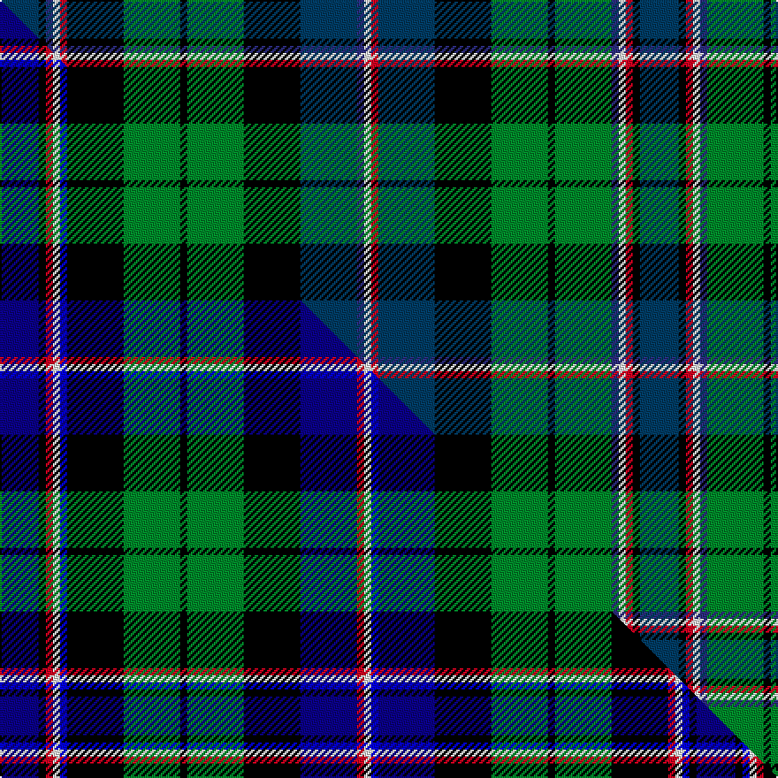

This is one **variant** — a specific cloth: this exact thread count and colourway, with its own
provenance below. It is one weaving of the [sett](/tartans/s/sc/scottish-american-military/) (the scale-free proportion — the
same cloth at any scale or shade), whose colour order is pattern [BKBWRKGKGKBBWRBKGKGBWRKB](/stripes/bkbwrkgkgkbbwrbkgkgbwrkb/).

Part of the [Scottish American Military](/tartans/s/sc/scottish-american-military/) tartan — the named design grouping this sett with its other cloths.

Sourced from tartans-authority.  It is a [24 stripe tartan](/stripes/stripes24/).

Original link <code>http://www.tartansauthority.com/tartan-ferret/display/10084/</code> — retired · [Internet Archive copy](https://web.archive.org/web/*/http://www.tartansauthority.com/tartan-ferret/display/10084/*)

Dataset <small>— provenance for this record, inherited from the source manifest</small>

<dl class="dataset-prov">
<dt>source</dt><dd><a href="/sources/tartans-authority/">Scottish Tartans Authority</a></dd>
<dt>data captured from</dt><dd><a href="https://github.com/thetartan/tartan-database/blob/master/data/tartans-authority/data.csv">https://github.com/thetartan/tartan-database/blob/master/data/tartans-authority/data.csv</a></dd>
<dt>data date</dt><dd>5th October 2009 <small>(this record)</small></dd>
<dt>licence</dt><dd><a href="https://creativecommons.org/licenses/by-nc-nd/4.0/">CC BY-NC-ND 4.0</a></dd>
</dl>

Capture chain <small>— the hands this data passed through, oldest first; each capture carries its own licence</small>

<ol class="capture-chain">
<li><a href="https://www.tartansauthority.com/">Scottish Tartans Authority</a> <small>the heritage body’s archive — its tartan-ferret record browser is retired; dead record links are shown unlinked, with an Internet Archive copy (ITI numbers are not SRT references)</small></li>
<li><a href="https://github.com/thetartan/tartan-database">thetartan/tartan-database</a> <small>2016-2017</small> · <a href="https://creativecommons.org/licenses/by-nc-nd/4.0/">CC BY-NC-ND 4.0</a> <small>Levko Kravets's frozen compilation — the capture we vendored, and where its CC licence text came from</small></li>
<li>this dictionary <small>captured 2026-06-10 · commit 5bf86c7566</small> <small>each re-capture is a git commit to data/sources</small></li>
</ol>

## Register references

External register numbers recorded for this tartan.

- Scottish Register of Tartans: [10084](https://www.tartanregister.gov.uk/tartanDetails?ref=10084)
- Scottish Tartans Authority (ITI): 10084

## Thread count
DB/22 K4 DBi4 W4 R4 K32 G32 K4 G32 K32 DB32 DBi4 W4 R4 DB32 K32 G32 K4 G32 DBi4 W4 R4 K4 DB/22

One full sett is **724 threads**.

## Palette
<table><thead><tr><th>Colour</th><th>Shade</th><th>OKLCh</th></tr></thead><tbody><tr><td>DB</td><td><code style="background-color:#2C2C80;">#2C2C80</code> <small style="color:#888">#2C2C80</small></td><td><small style="color:#888">oklch(35.0% 0.138 276.6)</small></td></tr><tr><td>DB</td><td><code style="background-color:#003C64;">#003C64</code> <small style="color:#888">#003C64</small></td><td><small style="color:#888">oklch(34.5% 0.089 246.0)</small></td></tr><tr><td>G</td><td><code style="background-color:#008B2A;">#008B2A</code> <small style="color:#888">#008B2A</small></td><td><small style="color:#888">oklch(55.4% 0.170 145.9)</small></td></tr><tr><td>K</td><td><code style="background-color:#000000;">#000000</code> <small style="color:#888">#000000</small></td><td><small style="color:#888">oklch(0.0% 0.000 0.0)</small></td></tr><tr><td>W</td><td><code style="background-color:#F7F7F7;">#F7F7F7</code> <small style="color:#888">#F7F7F7</small></td><td><small style="color:#888">oklch(97.6% 0.000 89.9)</small></td></tr><tr><td>R</td><td><code style="background-color:#D60020;">#D60020</code> <small style="color:#888">#D60020</small></td><td><small style="color:#888">oklch(55.2% 0.224 25.5)</small></td></tr></tbody></table>

# Sample pattern

## Compared to the master

This cloth is one sett of its design; the master sett (the exemplar the design is anchored on) is below for comparison.

Its **ΔTartan distance** from the master is **1.13** — the same measure the nearest-tartans table ranks by (0 is identical; a re-scale of the same cloth is near 0, a recolour or a different proportion further).

<figure class="master-compare" style="margin:0">

this sett
master sett ★

<figcaption style="color:#888;font-size:smaller">One weave of this sett against the <a href="/setts/db11k2r2w2b2k16g16k2g16k16db16r2w2b2db16k16g16k2g16k16r2w2b2k2db11/">master sett ★</a>, split on the diagonal: a shared proportion runs seamlessly across it with only the shades shifting; a different proportion breaks on it.</figcaption>
</figure>

## Nearest tartan variants

The nearest existing variants by ΔTartan distance, with this cloth at the top so the swatches line up against it.

ΔTartan

Threads

Variant

Sett

—

724

<a href="/variants/s24/db11k2dbi2w2r2k16g16k2g16k16db16dbi2w2r2db16k16g16k2g16dbi2w2r2k2db11~x2~db1404245-dbi1406275/">Scottish American Military (Fashion)</a>

<a href="/ttd/edit/#slug=db11k2r2w2b2k16g16k2g16k16db16r2w2b2db16k16g16k2g16k16r2w2b2k2db11~x2~db1108266-b1813263&amp;base=db11k2dbi2w2r2k16g16k2g16k16db16dbi2w2r2db16k16g16k2g16dbi2w2r2k2db11~x2~db1404245-dbi1406275" title="compare in the TTD">1.13</a>

788

<a href="/variants/s25/db11k2r2w2b2k16g16k2g16k16db16r2w2b2db16k16g16k2g16k16r2w2b2k2db11~x2~db1108266-b1813263/">Scottish American Military</a>

<a href="/ttd/edit/#slug=t8k1t1k1t1k5g6k1g6k5db3t1dr1t1~x4~t2405244&amp;base=db11k2dbi2w2r2k16g16k2g16k16db16dbi2w2r2db16k16g16k2g16dbi2w2r2k2db11~x2~db1404245-dbi1406275" title="compare in the TTD">1.97</a>

292

<a href="/variants/s14/t8k1t1k1t1k5g6k1g6k5db3t1dr1t1~x4~t2405244/">Gemmell Clan/Family Tartan</a>

<a href="/ttd/edit/#slug=db12k2g2k2g2k2db13dr6k10dr6g13k2lo2k2lb2k2g12~x2&amp;base=db11k2dbi2w2r2k16g16k2g16k16db16dbi2w2r2db16k16g16k2g16dbi2w2r2k2db11~x2~db1404245-dbi1406275" title="compare in the TTD">1.98</a>

320

<a href="/variants/s17/db12k2g2k2g2k2db13dr6k10dr6g13k2lo2k2lb2k2g12~x2/">Cunningham Hunting</a>

<a href="/ttd/edit/#slug=y5g2y2g15k9db2k2db2k2db9g5db9k2db2k2db2k9g15k2w4~x2&amp;base=db11k2dbi2w2r2k16g16k2g16k16db16dbi2w2r2db16k16g16k2g16dbi2w2r2k2db11~x2~db1404245-dbi1406275" title="compare in the TTD">2.07</a>

390

<a href="/variants/s20/y5g2y2g15k9db2k2db2k2db9g5db9k2db2k2db2k9g15k2w4~x2/">Fyvie</a>

<a href="/ttd/edit/#slug=dp47k6r6k6dp6k19g19k6g19y6g19k6g19k19dp6k6w6k6~x2&amp;base=db11k2dbi2w2r2k16g16k2g16k16db16dbi2w2r2db16k16g16k2g16dbi2w2r2k2db11~x2~db1404245-dbi1406275" title="compare in the TTD">2.12</a>

802

<a href="/variants/s18/dp47k6r6k6dp6k19g19k6g19y6g19k6g19k19dp6k6w6k6~x2/">Unidentified fragment</a>

<a href="/ttd/edit/#slug=db16k16g2k2g2k2g16k2g2k2g2k16y16k2db2r2k2y16k16db16k2w3k2~x2&amp;base=db11k2dbi2w2r2k16g16k2g16k16db16dbi2w2r2db16k16g16k2g16dbi2w2r2k2db11~x2~db1404245-dbi1406275" title="compare in the TTD">2.13</a>

600

<a href="/variants/s23/db16k16g2k2g2k2g16k2g2k2g2k16y16k2db2r2k2y16k16db16k2w3k2~x2/">Ferrazza in Guidonia, Rome (Personal)</a>

<a href="/ttd/edit/#slug=db16k16g2k2g2k2g16k2g2k2g2k16ly16k2db2r2k2ly16k16db16k2w3k2~x2&amp;base=db11k2dbi2w2r2k16g16k2g16k16db16dbi2w2r2db16k16g16k2g16dbi2w2r2k2db11~x2~db1404245-dbi1406275" title="compare in the TTD">2.18</a>

600

<a href="/variants/s23/db16k16g2k2g2k2g16k2g2k2g2k16ly16k2db2r2k2ly16k16db16k2w3k2~x2/">Ferrazza (Personal)</a>

<a href="/ttd/edit/#slug=db12k2db3k2db3k16g8dr2g8k2w2g8dr2g8k16dr2db8dr3db2dr2db3w2~x2&amp;base=db11k2dbi2w2r2k16g16k2g16k16db16dbi2w2r2db16k16g16k2g16dbi2w2r2k2db11~x2~db1404245-dbi1406275" title="compare in the TTD">2.25</a>

436

<a href="/variants/s22/db12k2db3k2db3k16g8dr2g8k2w2g8dr2g8k16dr2db8dr3db2dr2db3w2~x2/">Rankin (Dalgleish) #2</a>

<a href="/ttd/edit/#slug=k1t8k8g8w2g8k8t1k1t1k1t8k1t1k1t1k8g8y2g8k8t8k1t1~x2~w4000000&amp;base=db11k2dbi2w2r2k16g16k2g16k16db16dbi2w2r2db16k16g16k2g16dbi2w2r2k2db11~x2~db1404245-dbi1406275" title="compare in the TTD">2.27</a>

408

<a href="/variants/s24/k1t8k8g8w2g8k8t1k1t1k1t8k1t1k1t1k8g8y2g8k8t8k1t1~x2~w4000000/">Campbell of Argyll (no guards)</a>

<a href="/ttd/edit/#slug=db10k1g1k1g1k1db10r3k10r3g10k1y1k1w1k1g10&amp;base=db11k2dbi2w2r2k16g16k2g16k16db16dbi2w2r2db16k16g16k2g16dbi2w2r2k2db11~x2~db1404245-dbi1406275" title="compare in the TTD">2.31</a>

112

<a href="/variants/s17/db10k1g1k1g1k1db10r3k10r3g10k1y1k1w1k1g10/">MacNicol Hunting</a>

## Neighbour map

Every grey dot is one of 13656 variants placed by the first two principal components of the ΔTartan feature space (42% of its variance). Red is this tartan; blue dots are its nearest — click one to open its page. The map is a flat projection of a many-dimensional space — [how to read it](/posts/neighbourhood-maps/).

<svg viewBox="0 0 640 380" role="img" style="max-width:100%;height:auto;border:1px solid #e0e0e0;border-radius:4px;display:block" xmlns="http://www.w3.org/2000/svg"><image href="/nn/cloud.v1.png" width="640" height="380"/><a href="/variants/s25/db11k2r2w2b2k16g16k2g16k16db16r2w2b2db16k16g16k2g16k16r2w2b2k2db11~x2~db1108266-b1813263/"><circle cx="62.1" cy="123.1" r="4" fill="#3465a4"><title>Scottish American Military</title></circle></a><a href="/variants/s14/t8k1t1k1t1k5g6k1g6k5db3t1dr1t1~x4~t2405244/"><circle cx="83.0" cy="136.6" r="4" fill="#3465a4"><title>Gemmell Clan/Family Tartan</title></circle></a><a href="/variants/s17/db12k2g2k2g2k2db13dr6k10dr6g13k2lo2k2lb2k2g12~x2/"><circle cx="59.0" cy="148.5" r="4" fill="#3465a4"><title>Cunningham Hunting</title></circle></a><a href="/variants/s20/y5g2y2g15k9db2k2db2k2db9g5db9k2db2k2db2k9g15k2w4~x2/"><circle cx="89.0" cy="147.0" r="4" fill="#3465a4"><title>Fyvie</title></circle></a><a href="/variants/s18/dp47k6r6k6dp6k19g19k6g19y6g19k6g19k19dp6k6w6k6~x2/"><circle cx="70.7" cy="132.2" r="4" fill="#3465a4"><title>Unidentified fragment</title></circle></a><a href="/variants/s23/db16k16g2k2g2k2g16k2g2k2g2k16y16k2db2r2k2y16k16db16k2w3k2~x2/"><circle cx="91.0" cy="110.2" r="4" fill="#3465a4"><title>Ferrazza in Guidonia, Rome (Personal)</title></circle></a><a href="/variants/s23/db16k16g2k2g2k2g16k2g2k2g2k16ly16k2db2r2k2ly16k16db16k2w3k2~x2/"><circle cx="75.7" cy="106.0" r="4" fill="#3465a4"><title>Ferrazza (Personal)</title></circle></a><a href="/variants/s22/db12k2db3k2db3k16g8dr2g8k2w2g8dr2g8k16dr2db8dr3db2dr2db3w2~x2/"><circle cx="81.6" cy="140.6" r="4" fill="#3465a4"><title>Rankin (Dalgleish) #2</title></circle></a><a href="/variants/s24/k1t8k8g8w2g8k8t1k1t1k1t8k1t1k1t1k8g8y2g8k8t8k1t1~x2~w4000000/"><circle cx="94.4" cy="141.8" r="4" fill="#3465a4"><title>Campbell of Argyll (no guards)</title></circle></a><a href="/variants/s17/db10k1g1k1g1k1db10r3k10r3g10k1y1k1w1k1g10/"><circle cx="89.3" cy="112.6" r="4" fill="#3465a4"><title>MacNicol Hunting</title></circle></a><circle cx="65.8" cy="126.1" r="5" fill="#c00000"/><text x="320" y="376" text-anchor="middle" font-size="11" fill="#999">ground</text><text x="11" y="190" text-anchor="middle" font-size="11" fill="#999" transform="rotate(-90 11 190)">complexity</text></svg>

ID: /variants/s24/db11k2dbi2w2r2k16g16k2g16k16db16dbi2w2r2db16k16g16k2g16dbi2w2r2k2db11~x2~db1404245-dbi1406275/
