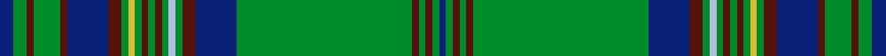

This page is one **sett** — a single exact thread-count. It belongs to the [tartan](/setts/db2g2dr1g4dr1db6dr2g1ly1g1dr1g1dr1g1lb1g1dr2db6g26dr1g1dr1g1db1/)
(the same proportion at any scale), whose colour order is pattern [BGBGBBBGYGBGBGWGBBGBGBGB](/stripes/bgbgbbbgygbgbgwgbbgbgbgb/).

Sourced from register-of-tartans.  It is a [24 stripe tartan](/stripes/stripes24/).

Original link https://www.tartanregister.gov.uk/tartanDetails.aspx?ref=1137

2 attestations — the source records this cloth was collapsed from (oldest owns this page)

<ul>
<li>01/01/1995 — Ettrick Forest (register-of-tartans, <a href="https://www.tartanregister.gov.uk/tartanDetails.aspx?ref=1137">record</a>)  <em>Designed by Alistair Buchan of Lochcarron of Scotland. The colours depict those found in and around the Ettrick Valley and River Ettrick in the Scottish Borders. Sample in Scottish Tartans Authority's Johnston Collection.</em></li>
<li>1995 — Ettrick Forest (District) (tartans-authority, <a href="http://www.tartansauthority.com/tartan-ferret/display/4829/">record</a>)  <em>Designed by Alistair Buchan of Lochcarron of Scotland. The colours depict those found in and around the Ettrick Valley and River Ettrick in the Scottish Borders. Sample in STA's Johnston Collection.</em></li>
</ul>

## Register references

External register numbers recorded for this tartan.

- Scottish Register of Tartans: [1137](https://www.tartanregister.gov.uk/tartanDetails.aspx?ref=1137)
- Scottish Tartans Authority (ITI): 4829

## Thread count
DB/4 G4 DR2 G8 DR2 DB12 DR4 G2 LY2 G2 DR2 G2 DR2 G2 LB2 G2 DR4 DB12 G52 DR2 G2 DR2 G2 DB/2

One full sett is **258 threads**.

## Palette
<table><thead><tr><th>Colour</th><th>Shade</th><th>OKLCh</th></tr></thead><tbody><tr><td>LB</td><td><code style="background-color:#B5BBDE;">#B5BBDE</code> <small style="color:#888">#B5BBDE</small></td><td><small style="color:#888">oklch(79.9% 0.050 277.6)</small></td></tr><tr><td>DB</td><td><code style="background-color:#082077;">#082077</code> <small style="color:#888">#082077</small></td><td><small style="color:#888">oklch(30.0% 0.149 265.1)</small></td></tr><tr><td>DR</td><td><code style="background-color:#55120C;">#55120C</code> <small style="color:#888">#55120C</small></td><td><small style="color:#888">oklch(30.0% 0.099 29.3)</small></td></tr><tr><td>G</td><td><code style="background-color:#008B2A;">#008B2A</code> <small style="color:#888">#008B2A</small></td><td><small style="color:#888">oklch(55.4% 0.170 145.9)</small></td></tr><tr><td>LY</td><td><code style="background-color:#DCBC32;">#DCBC32</code> <small style="color:#888">#DCBC32</small></td><td><small style="color:#888">oklch(80.0% 0.150 95.2)</small></td></tr></tbody></table>

# Sample pattern

## Nearest tartan variants

The nearest existing variants by ΔTartan distance, with this cloth at the top so the swatches line up against it.

ΔTartan

Threads

Variant

Sett

—

258

<a href="/variants/s24/db2g2dr1g4dr1db6dr2g1ly1g1dr1g1dr1g1lb1g1dr2db6g26dr1g1dr1g1db1~x2/">Ettrick Forest</a>

<a href="/ttd/edit/#slug=db2dg2r1dg5r1db6r2dg1y1dg1r1dg1r1dg1lb1dg1r2db6dg20r1dg1r1dg1db2~x2&amp;base=db2g2dr1g4dr1db6dr2g1ly1g1dr1g1dr1g1lb1g1dr2db6g26dr1g1dr1g1db1~x2" title="compare in the TTD">0.26</a>

240

<a href="/variants/s24/db2dg2r1dg5r1db6r2dg1y1dg1r1dg1r1dg1lb1dg1r2db6dg20r1dg1r1dg1db2~x2/">Ettrick (Green) District Tartan</a>

## Neighbour map

Every grey dot is one of 13620 variants placed by the first two principal components of the ΔTartan feature space (42% of its variance). Red is this tartan; blue dots are its nearest — click one to open its page.

<svg viewBox="0 0 640 380" role="img" style="max-width:100%;height:auto;border:1px solid #e0e0e0;border-radius:4px;display:block" xmlns="http://www.w3.org/2000/svg"><image href="/nn/cloud.v1.png" width="640" height="380"/><a href="/variants/s24/db2dg2r1dg5r1db6r2dg1y1dg1r1dg1r1dg1lb1dg1r2db6dg20r1dg1r1dg1db2~x2/"><circle cx="340.1" cy="89.9" r="4" fill="#3465a4"><title>Ettrick (Green) District Tartan</title></circle></a><circle cx="376.4" cy="81.1" r="5" fill="#c00000"/><text x="320" y="376" text-anchor="middle" font-size="11" fill="#999">ground</text><text x="11" y="190" text-anchor="middle" font-size="11" fill="#999" transform="rotate(-90 11 190)">complexity</text></svg>

ID: /variants/s24/db2g2dr1g4dr1db6dr2g1ly1g1dr1g1dr1g1lb1g1dr2db6g26dr1g1dr1g1db1~x2/
