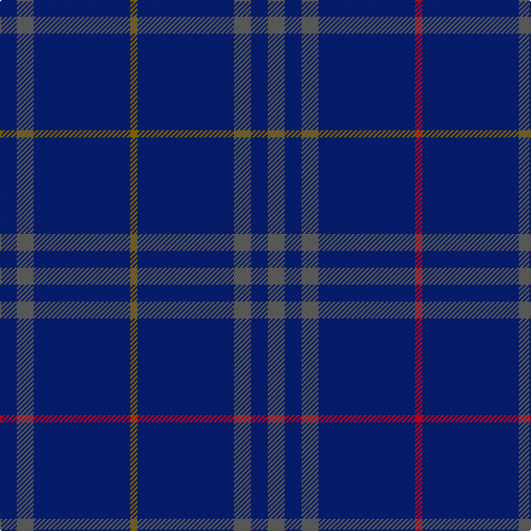

This page is one **sett** — a single exact thread-count. It belongs to the [tartan](/setts/db7n7db40y3db40n7db7n7db7n7db40r3db40n7db7n7db7n7db40t3db40n7db7n7/)
(the same proportion at any scale), whose colour order is pattern [BBBBBBBBBBBBRBBBBBBBGBBB](/stripes/bbbbbbbbbbbbrbbbbbbbgbbb/).

Part of the [Colliers International](/tartans/colliers-international/) tartan — the named design grouping this sett with its other cloths.

Sourced from house-of-tartan.  It is a [24 stripe tartan](/stripes/stripes24/).

Original link http://www.house-of-tartan.scotland.net/house/TartanViewjs.asp?colr=Def&tnam=7524

## Provenance

Earliest known date: 2008 Colliers International are a long established (1985) international property company. This asymmetric tartan appears to have been designed for them by Janet Helm Presents Tartan - a design company from Vancouver. Count estimated from online photograph.

## Thread count
DB/14 N14 DB80 Y6 DB80 N14 DB14 N14 DB14 N14 DB80 R6 DB80 N14 DB14 N14 DB14 N14 DB80 T6 DB80 N14 DB14 N/14

One full sett is **1388 threads**.

## Palette
<table><thead><tr><th>Colour</th><th>Shade</th><th>OKLCh</th></tr></thead><tbody><tr><td>T</td><td><code style="background-color:#2888C4;">#2888C4</code> <small style="color:#888">#2888C4</small></td><td><small style="color:#888">oklch(60.1% 0.125 241.5)</small></td></tr><tr><td>DB</td><td><code style="background-color:#082077;">#082077</code> <small style="color:#888">#082077</small></td><td><small style="color:#888">oklch(30.0% 0.149 265.1)</small></td></tr><tr><td>LR</td><td><code style="background-color:#A0A0A0;">#A0A0A0</code> <small style="color:#888">#A0A0A0</small></td><td><small style="color:#888">oklch(70.6% 0.000 89.9)</small></td></tr><tr><td>N</td><td><code style="background-color:#636363;">#636363</code> <small style="color:#888">#636363</small></td><td><small style="color:#888">oklch(50.0% 0.000 89.9)</small></td></tr><tr><td>R</td><td><code style="background-color:#D60020;">#D60020</code> <small style="color:#888">#D60020</small></td><td><small style="color:#888">oklch(55.2% 0.224 25.5)</small></td></tr><tr><td>Y</td><td><code style="background-color:#8B6E00;">#8B6E00</code> <small style="color:#888">#8B6E00</small></td><td><small style="color:#888">oklch(55.1% 0.113 90.4)</small></td></tr></tbody></table>

# Sample pattern

## Compared to the master

This cloth is one sett of its design; the master sett (the exemplar the design is anchored on) is below for comparison.

Its **ΔTartan distance** from the master is **0.31** — the same measure the nearest-tartans table ranks by (0 is identical; a re-scale of the same cloth is near 0, a recolour or a different proportion further).

<figure class="master-compare" style="margin:0">

this sett
master sett ★

<figcaption style="color:#888;font-size:smaller">One weave of this sett against the <a href="/setts/db7n7db40y3db40n7db7n7db7n7db40r3db40n7db7n7db7n7db40lb3db40n7db7n7/">master sett ★</a>, split on the diagonal: a shared proportion runs seamlessly across it with only the shades shifting; a different proportion breaks on it.</figcaption>
</figure>

## Nearest variants

The nearest existing variants by ΔTartan distance, with this cloth at the top so the swatches line up against it.

ΔTartan

Threads

Variant

Sett

—

1388

<a href="/variants/s24/db7n7db40y3db40n7db7n7db7n7db40r3db40n7db7n7db7n7db40t3db40n7db7n7~x2~t2405244/">Colliers International Canadian Corporate Tartan</a>

<a href="/ttd/edit/#slug=db7n7db40y3db40n7db7n7db7n7db40r3db40n7db7n7db7n7db40lb3db40n7db7n7~x2&amp;base=db7n7db40y3db40n7db7n7db7n7db40r3db40n7db7n7db7n7db40t3db40n7db7n7~x2~t2405244" title="compare in the TTD">0.00</a>

1388

<a href="/variants/s24/db7n7db40y3db40n7db7n7db7n7db40r3db40n7db7n7db7n7db40lb3db40n7db7n7~x2/">Colliers International (Corporate)</a>

## Neighbour map

Every grey dot is one of 13620 variants placed by the first two principal components of the ΔTartan feature space (42% of its variance). Red is this tartan; blue dots are its nearest — click one to open its page.

<svg viewBox="0 0 640 380" role="img" style="max-width:100%;height:auto;border:1px solid #e0e0e0;border-radius:4px;display:block" xmlns="http://www.w3.org/2000/svg"><image href="/nn/cloud.v1.png" width="640" height="380"/><a href="/variants/s24/db7n7db40y3db40n7db7n7db7n7db40r3db40n7db7n7db7n7db40lb3db40n7db7n7~x2/"><circle cx="544.4" cy="154.6" r="4" fill="#3465a4"><title>Colliers International (Corporate)</title></circle></a><circle cx="555.2" cy="158.2" r="5" fill="#c00000"/><text x="320" y="376" text-anchor="middle" font-size="11" fill="#999">ground</text><text x="11" y="190" text-anchor="middle" font-size="11" fill="#999" transform="rotate(-90 11 190)">complexity</text></svg>

ID: /variants/s24/db7n7db40y3db40n7db7n7db7n7db40r3db40n7db7n7db7n7db40t3db40n7db7n7~x2~t2405244/
