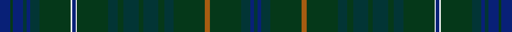

This page is one **sett** — a single exact thread-count. It belongs to the [tartan](/setts/db9dg2db9dt3db3dt8dg27w1db3w1dg27dt8dg5dt13dg4dt13dg5dt8dg27o4dg27dt8db3dt3/)
(the same proportion at any scale), whose colour order is pattern [BBBGRGBGBGBGBGWBWGBBBBGB](/stripes/bbbgrgbgbgbgbgwbwgbbbbgb/).

Sourced from tartans-authority.  It is a [24 stripe tartan](/stripes/stripes24/).

Original link http://www.tartansauthority.com/tartan-ferret/display/8410/

## Register references

External register numbers recorded for this tartan.

- Scottish Register of Tartans: [8410](https://www.tartanregister.gov.uk/tartanDetails?ref=8410)
- Scottish Tartans Authority (ITI): 8410

## Thread count
DB/18 DG4 DB18 DT6 DB6 DT16 DG54 W2 DB6 W2 DG54 DT16 DG10 DT26 DG8 DT26 DG10 DT16 DG54 O8 DG54 DT16 DB6 DT/6

One full sett is **860 threads**.

## Palette
<table><thead><tr><th>Colour</th><th>Shade</th><th>OKLCh</th></tr></thead><tbody><tr><td>DB</td><td><code style="background-color:#082077;">#082077</code> <small style="color:#888">#082077</small></td><td><small style="color:#888">oklch(30.0% 0.149 265.1)</small></td></tr><tr><td>DG</td><td><code style="background-color:#053819;">#053819</code> <small style="color:#888">#053819</small></td><td><small style="color:#888">oklch(30.0% 0.075 151.3)</small></td></tr><tr><td>K</td><td><code style="background-color:#023535;">#023535</code> <small style="color:#888">#023535</small></td><td><small style="color:#888">oklch(29.8% 0.050 194.8)</small></td></tr><tr><td>LP</td><td><code style="background-color:#A65C11;">#A65C11</code> <small style="color:#888">#A65C11</small></td><td><small style="color:#888">oklch(55.0% 0.125 58.3)</small></td></tr><tr><td>W</td><td><code style="background-color:#F7F7F7;">#F7F7F7</code> <small style="color:#888">#F7F7F7</small></td><td><small style="color:#888">oklch(97.6% 0.000 89.9)</small></td></tr></tbody></table>

# Sample pattern

ID: /variants/s24/db9dg2db9dt3db3dt8dg27w1db3w1dg27dt8dg5dt13dg4dt13dg5dt8dg27o4dg27dt8db3dt3~x2/
