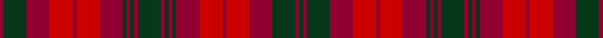

This is one **variant** — a specific cloth: this exact thread count and colourway, with its own
provenance below. It is one weaving of the [sett](/setts/dg1r1dg6r6ri6r1ri6r6dg1r1dg1r1dg6r1dg1r1dg1r6ri6r1ri6r6dg6r1/) (the scale-free proportion — the
same cloth at any scale or shade), whose colour order is pattern [GRGRRRRRGRGRGRGRGRRRRRGR](/stripes/grgrrrrrgrgrgrgrgrrrrrgr/).

Part of the [MacNab of Arthurston](/tartans/m/ma/macnab-of-arthurston/) tartan — the named design grouping this sett with its other cloths.

Sourced from peter-1856.  It is a [24 stripe tartan](/stripes/stripes24/).

Original link [/posts/baronage-angus-mearns/](/posts/baronage-angus-mearns/)

## Provenance

<figure class="logan-scan">

<figcaption>Peter, The Baronage of Angus and Mearns (1856), p. 227–228 — page-scan crop (97,1285)–(852,1407), (113,163)–(874,265)</figcaption>
</figure>

David MacGregor Peter recorded the tartan of **MacNab of Arthurston** in 1856, on page 227 of *The Baronage of Angus and Mearns* — a genealogy of the families of Angus and the Mearns whose entries carry their tartans in Logan's method: stripe depths in eighths of an inch, measured across the cloth and reflected about each end (a half-sett):

> 1 green · 1 crimson · 6 green · 6 crimson · 6 red · 1 crimson · 6 red · 6 crimson · 1 green · 1 crimson · 1 green · 1 crimson · 6 green · 1 crimson · 1 green · 1 crimson · 1 green · 6 crimson · 6 red · 1 crimson · 6 red · 6 crimson · 6 green · 1 crimson

Rendered at 8 threads to the eighth-inch that is `G/8 C8 G48 C48 R48 C8 R48 C48 G8 C8 G8 C8 G48 C8 G8 C8 G8 C48 R48 C8 R48 C48 G48 C/8` — the eighths are the captured data, and the threadcount is derived from them at that stated factor (the same display calibration as Logan 1831, whose method the book borrows). Peter named his colours rather than dyeing to a standard, so the palette here is the Dictionary's modern reading of his names.

The entry as printed: [page 227 of the first edition, on the Internet Archive](https://archive.org/details/baronageofangusm00peteuoft/page/n242/mode/1up).

See [The Baronage of Angus and Mearns](/posts/baronage-angus-mearns/) for the book, its method and every entry.

Dataset <small>— provenance for this record, inherited from the source manifest</small>

<dl class="dataset-prov">
<dt>source</dt><dd><a href="/sources/peter-1856/">Peter, The Baronage of Angus and Mearns (1856)</a></dd>
<dt>data captured from</dt><dd><a href="https://archive.org/details/baronageofangusm00peteuoft">https://archive.org/details/baronageofangusm00peteuoft</a></dd>
<dt>data date</dt><dd>1856 <small>(this record)</small></dd>
<dt>licence</dt><dd>Public domain</dd>
</dl>

Capture chain <small>— the hands this data passed through, oldest first; each capture carries its own licence</small>

<ol class="capture-chain">
<li>David MacGregor Peter, The Baronage of Angus and Mearns (first edition) <small>1856</small> · Public domain <small>38 TARTAN entries among the genealogies of 360 Angus and Mearns families, in Logan's eighths-of-an-inch method</small></li>
<li><a href="https://archive.org/details/baronageofangusm00peteuoft">Internet Archive scans</a> <small>three digitised copies: University of Toronto (500 ppi, the transcription's primary), Allen County Public Library, and Google/Oxford — each OCR layer garbles the fraction glyphs differently, so all three were kept as a per-glyph vote, the 500 ppi page image ruling</small></li>
<li><a href="/posts/baronage-angus-mearns/">Tartan Dictionary transcription — The Baronage of Angus and Mearns</a> <small>2026-07</small> · <a href="https://creativecommons.org/licenses/by-sa/4.0/">CC BY-SA 4.0</a> <small>by-eye transcription of the 38 entries from 200-400 dpi page renders of the 500 ppi scan — depths in eighths of an inch, rendered at 8 threads per eighth (the Logan display calibration); method and entry table in the linked post</small></li>
<li>this dictionary <small>each re-capture is a git commit to data/sources</small></li>
</ol>

## Thread count
R/8 DG48 R48 Ri48 R8 Ri48 R48 DG8 R8 DG8 R8 DG48 R8 DG8 R8 DG8 R48 Ri48 R8 Ri48 R48 DG48 R8 DG/8

One full sett is **1248 threads**.

## Palette
<table><thead><tr><th>Colour</th><th>Shade</th><th>OKLCh</th></tr></thead><tbody><tr><td>R</td><td><code style="background-color:#900030;">#900030</code> <small style="color:#888">#900030</small></td><td><small style="color:#888">oklch(41.6% 0.166 13.6)</small></td></tr><tr><td>DG</td><td><code style="background-color:#053819;">#053819</code> <small style="color:#888">#053819</small></td><td><small style="color:#888">oklch(30.0% 0.075 151.3)</small></td></tr><tr><td>R</td><td><code style="background-color:#C80000;">#C80000</code> <small style="color:#888">#C80000</small></td><td><small style="color:#888">oklch(52.3% 0.215 29.2)</small></td></tr></tbody></table>

# Sample pattern

## Nearest tartan variants

The nearest existing variants by ΔTartan distance, with this cloth at the top so the swatches line up against it.

ΔTartan

Threads

Variant

Sett

—

1248

<a href="/variants/s24/dg1r1dg6r6ri6r1ri6r6dg1r1dg1r1dg6r1dg1r1dg1r6ri6r1ri6r6dg6r1~x8~r1707016-ri2109032/">MacNab of Arthurston</a>

<a href="/ttd/edit/#slug=r1g6r6ri6r1ri6r6g1r1g1r1g1r1g6r1g1r1g1r6ri6r1ri6r6g6r1g1~x8~r1707016-ri2109032&amp;base=dg1r1dg6r6ri6r1ri6r6dg1r1dg1r1dg6r1dg1r1dg1r6ri6r1ri6r6dg6r1~x8~r1707016-ri2109032" title="compare in the TTD">2.12</a>

1280

<a href="/variants/s26/r1g6r6ri6r1ri6r6g1r1g1r1g1r1g6r1g1r1g1r6ri6r1ri6r6g6r1g1~x8~r1707016-ri2109032/">MacNab</a>

## Neighbour map

Every grey dot is one of 13656 variants placed by the first two principal components of the ΔTartan feature space (42% of its variance). Red is this tartan; blue dots are its nearest — click one to open its page. The map is a flat projection of a many-dimensional space — [how to read it](/posts/neighbourhood-maps/).

<svg viewBox="0 0 640 380" role="img" style="max-width:100%;height:auto;border:1px solid #e0e0e0;border-radius:4px;display:block" xmlns="http://www.w3.org/2000/svg"><image href="/nn/cloud.v1.png" width="640" height="380"/><a href="/variants/s26/r1g6r6ri6r1ri6r6g1r1g1r1g1r1g6r1g1r1g1r6ri6r1ri6r6g6r1g1~x8~r1707016-ri2109032/"><circle cx="263.0" cy="206.5" r="4" fill="#3465a4"><title>MacNab</title></circle></a><circle cx="290.6" cy="219.9" r="5" fill="#c00000"/><text x="320" y="376" text-anchor="middle" font-size="11" fill="#999">ground</text><text x="11" y="190" text-anchor="middle" font-size="11" fill="#999" transform="rotate(-90 11 190)">complexity</text></svg>

ID: /variants/s24/dg1r1dg6r6ri6r1ri6r6dg1r1dg1r1dg6r1dg1r1dg1r6ri6r1ri6r6dg6r1~x8~r1707016-ri2109032/
