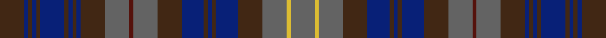
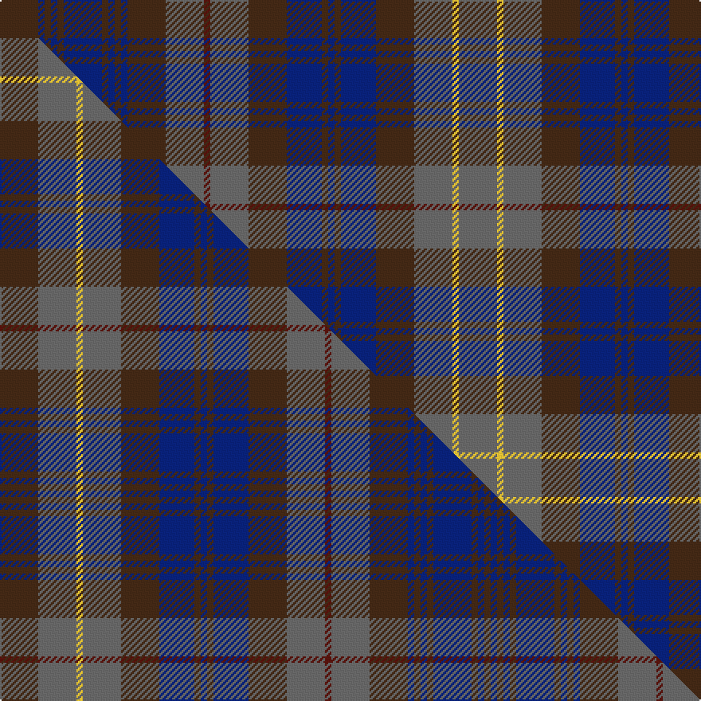

This is one **variant** — a specific cloth: this exact thread count and colourway, with its own
provenance below. It is one weaving of the [sett](/setts/do12db2do2db2do2db12do2db2do2db2do12n12dr2n12do12db11do2db2do2db11do12n12ly2n12/) (the scale-free proportion — the
same cloth at any scale or shade), whose colour order is pattern [BBBBBBBBBBBBBBBBBBBBBBYB](/stripes/bbbbbbbbbbbbbbbbbbbbbbyb/).

Part of the [Bartlam](/tartans/b/ba/bartlam/) tartan — the named design grouping this sett with its other cloths.

Sourced from tartans-authority.  It is a [24 stripe tartan](/stripes/stripes24/).

Original link [https://www.tartanregister.gov.uk/tartanDetails.aspx?ref=3122](https://www.tartanregister.gov.uk/tartanDetails.aspx?ref=3122)

Dataset <small>— provenance for this record, inherited from the source manifest</small>

<dl class="dataset-prov">
<dt>source</dt><dd><a href="/sources/tartans-authority/">Scottish Tartans Authority</a></dd>
<dt>data captured from</dt><dd><a href="https://github.com/thetartan/tartan-database/blob/master/data/tartans-authority/data.csv">https://github.com/thetartan/tartan-database/blob/master/data/tartans-authority/data.csv</a></dd>
<dt>data date</dt><dd>2002 <small>(this record)</small></dd>
<dt>licence</dt><dd><a href="https://creativecommons.org/licenses/by-nc-nd/4.0/">CC BY-NC-ND 4.0</a></dd>
</dl>

Capture chain <small>— the hands this data passed through, oldest first; each capture carries its own licence</small>

<ol class="capture-chain">
<li><a href="https://www.tartansauthority.com/">Scottish Tartans Authority</a> <small>the heritage body's archive — its tartan-ferret record browser is retired (links repaired to the SRT, above)</small></li>
<li><a href="https://github.com/thetartan/tartan-database">thetartan/tartan-database</a> <small>2016-2017</small> · <a href="https://creativecommons.org/licenses/by-nc-nd/4.0/">CC BY-NC-ND 4.0</a> <small>Levko Kravets's frozen compilation — the capture we vendored, and where its CC licence text came from</small></li>
<li>this dictionary <small>captured 2026-06-10 · commit 5bf86c7566</small> <small>each re-capture is a git commit to data/sources</small></li>
</ol>

## Register references

External register numbers recorded for this tartan.

- Scottish Tartans Authority (ITI): 3122

## Thread count
DO/24 DB4 DO4 DB4 DO4 DB24 DO4 DB4 DO4 DB4 DO24 N24 DR4 N24 DO24 DB22 DO4 DB4 DO4 DB22 DO24 N24 LY4 N/24

One full sett is **576 threads**.

## Palette
<table><thead><tr><th>Colour</th><th>Shade</th><th>OKLCh</th></tr></thead><tbody><tr><td>DB</td><td><code style="background-color:#082077;">#082077</code> <small style="color:#888">#082077</small></td><td><small style="color:#888">oklch(30.0% 0.149 265.1)</small></td></tr><tr><td>DO</td><td><code style="background-color:#412714;">#412714</code> <small style="color:#888">#412714</small></td><td><small style="color:#888">oklch(30.1% 0.050 55.7)</small></td></tr><tr><td>DR</td><td><code style="background-color:#55120C;">#55120C</code> <small style="color:#888">#55120C</small></td><td><small style="color:#888">oklch(30.0% 0.099 29.3)</small></td></tr><tr><td>LY</td><td><code style="background-color:#DCBC32;">#DCBC32</code> <small style="color:#888">#DCBC32</small></td><td><small style="color:#888">oklch(80.0% 0.150 95.2)</small></td></tr><tr><td>N</td><td><code style="background-color:#636363;">#636363</code> <small style="color:#888">#636363</small></td><td><small style="color:#888">oklch(50.0% 0.000 89.9)</small></td></tr></tbody></table>

# Sample pattern

## Compared to the master

This cloth is one sett of its design; the master sett (the exemplar the design is anchored on) is below for comparison.

Its **ΔTartan distance** from the master is **0.00** — the same measure the nearest-tartans table ranks by (0 is identical; a re-scale of the same cloth is near 0, a recolour or a different proportion further).

<figure class="master-compare" style="margin:0">

this sett
master sett ★

<figcaption style="color:#888;font-size:smaller">One weave of this sett against the <a href="/setts/do12n12ly2n12do12db11do2db2do2db11do12n12dr2n12do12db2do2db2do2db12do2db2do2db2/">master sett ★</a>, split on the diagonal: a shared proportion runs seamlessly across it with only the shades shifting; a different proportion breaks on it.</figcaption>
</figure>

## Nearest tartan variants

The nearest existing variants by ΔTartan distance, with this cloth at the top so the swatches line up against it.

ΔTartan

Threads

Variant

Sett

—

576

<a href="/variants/s24/do12db2do2db2do2db12do2db2do2db2do12n12dr2n12do12db11do2db2do2db11do12n12ly2n12~x2/">Bartlam (Personal)</a>

<a href="/ttd/edit/#slug=do12n12ly2n12do12db11do2db2do2db11do12n12dr2n12do12db2do2db2do2db12do2db2do2db2~x2&amp;base=do12db2do2db2do2db12do2db2do2db2do12n12dr2n12do12db11do2db2do2db11do12n12ly2n12~x2" title="compare in the TTD">0.00</a>

596

<a href="/variants/s24/do12n12ly2n12do12db11do2db2do2db11do12n12dr2n12do12db2do2db2do2db12do2db2do2db2~x2/">Bartlam (Personal)</a>

## Neighbour map

Every grey dot is one of 13621 variants placed by the first two principal components of the ΔTartan feature space (42% of its variance). Red is this tartan; blue dots are its nearest — click one to open its page. The map is a flat projection of a many-dimensional space — [how to read it](/posts/neighbourhood-maps/).

<svg viewBox="0 0 640 380" role="img" style="max-width:100%;height:auto;border:1px solid #e0e0e0;border-radius:4px;display:block" xmlns="http://www.w3.org/2000/svg"><image href="/nn/cloud.v1.png" width="640" height="380"/><a href="/variants/s24/do12n12ly2n12do12db11do2db2do2db11do12n12dr2n12do12db2do2db2do2db12do2db2do2db2~x2/"><circle cx="300.1" cy="240.1" r="4" fill="#3465a4"><title>Bartlam (Personal)</title></circle></a><circle cx="300.1" cy="240.1" r="5" fill="#c00000"/><text x="320" y="376" text-anchor="middle" font-size="11" fill="#999">ground</text><text x="11" y="190" text-anchor="middle" font-size="11" fill="#999" transform="rotate(-90 11 190)">complexity</text></svg>

ID: /variants/s24/do12db2do2db2do2db12do2db2do2db2do12n12dr2n12do12db11do2db2do2db11do12n12ly2n12~x2/
