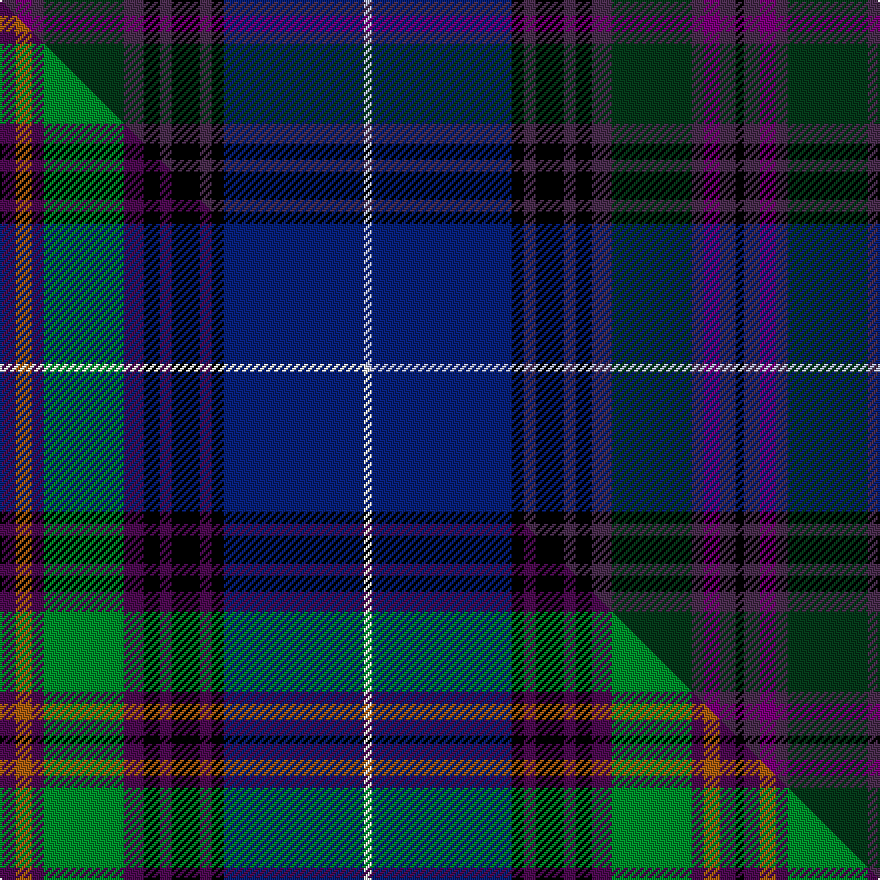

This page is one **sett** — a single exact thread-count. It belongs to the [tartan](/setts/dp4dpi4dp3dg20dp5k4dp3k7dp3k3db35lb2db35k3dp3k7dp3k4dp5dg20dp3dpi4dp4k2/)
(the same proportion at any scale), whose colour order is pattern [BBBGBKBKBKBWBKBKBKBGBBBK](/stripes/bbbgbkbkbkbwbkbkbkbgbbbk/).

Part of the [Spirit of Bannockburn](/tartans/spirit-of-bannockburn/) tartan — the named design grouping this sett with its other cloths.

Sourced from house-of-tartan.  It is a [24 stripe tartan](/stripes/stripes24/).

Original link http://www.house-of-tartan.scotland.net/house/TartanViewjs.asp?colr=Def&tnam=3445

## Provenance

Earliest known date: 2000 Designed by Lochcarron of Scotland for ACS Clothing of Glasgow (0141 766 2600). Original name was 'Scotland the Brave' but changed to Spirit of Bannockburn by Lochcarron.

Dataset <small>— provenance for this record, inherited from the source manifest</small>

<dl class="dataset-prov">
<dt>source</dt><dd><a href="/sources/house-of-tartan/">House of Tartan</a></dd>
<dt>data captured from</dt><dd><a href="https://github.com/thetartan/tartan-database/blob/master/data/house-of-tartan/data.csv">https://github.com/thetartan/tartan-database/blob/master/data/house-of-tartan/data.csv</a></dd>
<dt>data date</dt><dd>2017-01-10 <small>(dataset default)</small></dd>
<dt>licence</dt><dd><a href="https://creativecommons.org/licenses/by-nc-nd/4.0/">CC BY-NC-ND 4.0</a></dd>
</dl>

Capture chain <small>— the hands this data passed through, oldest first; each capture carries its own licence</small>

<ol class="capture-chain">
<li><a href="http://www.house-of-tartan.scotland.net/">House of Tartan</a> <small>the weaver/retailer's database — the site is now offline; the URL is kept as the ultimate source's identity</small></li>
<li><a href="https://github.com/thetartan/tartan-database">thetartan/tartan-database</a> <small>2016-2017</small> · <a href="https://creativecommons.org/licenses/by-nc-nd/4.0/">CC BY-NC-ND 4.0</a> <small>Levko Kravets's frozen compilation — the capture we vendored, and where its CC licence text came from</small></li>
<li>this dictionary <small>captured 2026-06-10 · commit 5bf86c7566</small> <small>each re-capture is a git commit to data/sources</small></li>
</ol>

## Thread count
DP/8 DPi8 DP6 DG40 DP10 K8 DP6 K14 DP6 K6 DB70 LB4 DB70 K6 DP6 K14 DP6 K8 DP10 DG40 DP6 DPi8 DP8 K/4

One full sett is **732 threads**.

## Palette
<table><thead><tr><th>Colour</th><th>Shade</th><th>OKLCh</th></tr></thead><tbody><tr><td>DB</td><td><code style="background-color:#082077;">#082077</code> <small style="color:#888">#082077</small></td><td><small style="color:#888">oklch(30.0% 0.149 265.1)</small></td></tr><tr><td>DR</td><td><code style="background-color:#55120C;">#55120C</code> <small style="color:#888">#55120C</small></td><td><small style="color:#888">oklch(30.0% 0.099 29.3)</small></td></tr><tr><td>DG</td><td><code style="background-color:#053819;">#053819</code> <small style="color:#888">#053819</small></td><td><small style="color:#888">oklch(30.0% 0.075 151.3)</small></td></tr><tr><td>K</td><td><code style="background-color:#000000;">#000000</code> <small style="color:#888">#000000</small></td><td><small style="color:#888">oklch(0.0% 0.000 0.0)</small></td></tr><tr><td>DP</td><td><code style="background-color:#482C4C;">#482C4C</code> <small style="color:#888">#482C4C</small></td><td><small style="color:#888">oklch(34.1% 0.065 322.4)</small></td></tr><tr><td>LB</td><td><code style="background-color:#B5BBDE;">#B5BBDE</code> <small style="color:#888">#B5BBDE</small></td><td><small style="color:#888">oklch(79.9% 0.050 277.6)</small></td></tr><tr><td>DP</td><td><code style="background-color:#780078;">#780078</code> <small style="color:#888">#780078</small></td><td><small style="color:#888">oklch(40.2% 0.185 328.4)</small></td></tr></tbody></table>

# Sample pattern

## Compared to the master

This cloth is one sett of its design; the master sett (the exemplar the design is anchored on) is below for comparison.

Its **ΔTartan distance** from the master is **0.91** — the same measure the nearest-tartans table ranks by (0 is identical; a re-scale of the same cloth is near 0, a recolour or a different proportion further).

<figure class="master-compare" style="margin:0">

this sett
master sett ★

<figcaption style="color:#888;font-size:smaller">One weave of this sett against the <a href="/setts/dp4o4dp3g20dp5k4dp3k7dp3k3db35w2db35k3dp3k7dp3k4dp5g20dp3o4dp4k2/">master sett ★</a>, split on the diagonal: a shared proportion runs seamlessly across it with only the shades shifting; a different proportion breaks on it.</figcaption>
</figure>

## Nearest tartan variants

The nearest existing variants by ΔTartan distance, with this cloth at the top so the swatches line up against it.

ΔTartan

Threads

Variant

Sett

—

732

<a href="/variants/s24/dp4dpi4dp3dg20dp5k4dp3k7dp3k3db35lb2db35k3dp3k7dp3k4dp5dg20dp3dpi4dp4k2~x2~dp1403322-dpi1607327/">Spirit of Bannockburn Fashion Tartan</a>

<a href="/ttd/edit/#slug=dp4o4dp3g20dp5k4dp3k7dp3k3db35w2db35k3dp3k7dp3k4dp5g20dp3o4dp4k2~x2&amp;base=dp4dpi4dp3dg20dp5k4dp3k7dp3k3db35lb2db35k3dp3k7dp3k4dp5dg20dp3dpi4dp4k2~x2~dp1403322-dpi1607327" title="compare in the TTD">0.91</a>

732

<a href="/variants/s24/dp4o4dp3g20dp5k4dp3k7dp3k3db35w2db35k3dp3k7dp3k4dp5g20dp3o4dp4k2~x2/">Spirit of Bannockburn</a>

<a href="/ttd/edit/#slug=k3db30k2db4k2db30k3dg30k3dt30k2lb2k2dt30k3dg30k3db30k2db4k2db30k3g3~db1106275-dg1806142-dt1204274-g2203152&amp;base=dp4dpi4dp3dg20dp5k4dp3k7dp3k3db35lb2db35k3dp3k7dp3k4dp5dg20dp3dpi4dp4k2~x2~dp1403322-dpi1607327" title="compare in the TTD">2.43</a>

560

<a href="/variants/s24/k3db30k2db4k2db30k3dg30k3dbi30k2lb2k2dbi30k3dg30k3db30k2db4k2db30k3g3~db1106275-dg1806142-dbi1204274-g2203152/">Davies of Wales</a>

<a href="/ttd/edit/#slug=r2dp4db2dg25db4dg2db4k11dp4w2dp4dg11db2k2db24dp4db2r2~x2&amp;base=dp4dpi4dp3dg20dp5k4dp3k7dp3k3db35lb2db35k3dp3k7dp3k4dp5dg20dp3dpi4dp4k2~x2~dp1403322-dpi1607327" title="compare in the TTD">2.62</a>

436

<a href="/variants/s18/r2dp4db2dg25db4dg2db4k11dp4w2dp4dg11db2k2db24dp4db2r2~x2/">Empire Golf Check (Fashion)</a>

<a href="/ttd/edit/#slug=dy2db4dbi2dg25dbi4dg2dbi4k10db4dg2db4dg11dbi2k2dbi24db4dbi2dy2~x2~db1106275-dbi1406275&amp;base=dp4dpi4dp3dg20dp5k4dp3k7dp3k3db35lb2db35k3dp3k7dp3k4dp5dg20dp3dpi4dp4k2~x2~dp1403322-dpi1607327" title="compare in the TTD">3.15</a>

432

<a href="/variants/s18/dy2db4dbi2dg25dbi4dg2dbi4k10db4dg2db4dg11dbi2k2dbi24db4dbi2dy2~x2~db1106275-dbi1406275/">LS Curling</a>

<a href="/ttd/edit/#slug=k16lb6dbi12db4dp4db4dbi35db40dbi4db4dbi4db6dp4o6~dbi1406275-db1404245&amp;base=dp4dpi4dp3dg20dp5k4dp3k7dp3k3db35lb2db35k3dp3k7dp3k4dp5dg20dp3dpi4dp4k2~x2~dp1403322-dpi1607327" title="compare in the TTD">3.62</a>

276

<a href="/variants/s14/k16lb6dbi12db4dp4db4dbi35db40dbi4db4dbi4db6dp4o6~dbi1406275-db1404245/">Benedictus Blue (Personal)</a>

<a href="/ttd/edit/#slug=db9dg2dpi2dp2dg18dpi2k2dg1k19db33w2~x2~dpi1607327-dp1105325&amp;base=dp4dpi4dp3dg20dp5k4dp3k7dp3k3db35lb2db35k3dp3k7dp3k4dp5dg20dp3dpi4dp4k2~x2~dp1403322-dpi1607327" title="compare in the TTD">3.63</a>

346

<a href="/variants/s11/db9dg2dpi2dp2dg18dpi2k2dg1k19db33w2~x2~dpi1607327-dp1105325/">Highland Pride of Scotland</a>

<a href="/ttd/edit/#slug=g2k3db30k2db4k2db30k3dg30k3dt30k2lb2~g2203152-db1106275-dg1806142-dt1204274&amp;base=dp4dpi4dp3dg20dp5k4dp3k7dp3k3db35lb2db35k3dp3k7dp3k4dp5dg20dp3dpi4dp4k2~x2~dp1403322-dpi1607327" title="compare in the TTD">3.64</a>

282

<a href="/variants/s13/g2k3db30k2db4k2db30k3dg30k3dbi30k2lb2~g2203152-db1106275-dg1806142-dbi1204274/">Davies (Welsh Name)</a>

<a href="/ttd/edit/#slug=db29dy3k3dy3k3dy3dg28k3dy2k3dr3ly3~x2&amp;base=dp4dpi4dp3dg20dp5k4dp3k7dp3k3db35lb2db35k3dp3k7dp3k4dp5dg20dp3dpi4dp4k2~x2~dp1403322-dpi1607327" title="compare in the TTD">3.83</a>

280

<a href="/variants/s12/db29dy3k3dy3k3dy3dg28k3dy2k3dr3ly3~x2/">Bro-Vigouden (Corporate)</a>

<a href="/ttd/edit/#slug=db30k4g3dp2dr2dp2dr10k2dr2k4dr2g3dr2k4dr2k2dr10dp2dr2dp2g3k4db30lb3~x2~dp1607327-dr1406341&amp;base=dp4dpi4dp3dg20dp5k4dp3k7dp3k3db35lb2db35k3dp3k7dp3k4dp5dg20dp3dpi4dp4k2~x2~dp1403322-dpi1607327" title="compare in the TTD">3.88</a>

462

<a href="/variants/s24/db30k4g3dpi2dp2dpi2dp10k2dp2k4dp2g3dp2k4dp2k2dp10dpi2dp2dpi2g3k4db30lb3~x2~dpi1607327-dp1406341/">Scotland 1782</a>

<a href="/ttd/edit/#slug=db6k2dp9lb1dp9k2dt4k6dt24w1db6~x2&amp;base=dp4dpi4dp3dg20dp5k4dp3k7dp3k3db35lb2db35k3dp3k7dp3k4dp5dg20dp3dpi4dp4k2~x2~dp1403322-dpi1607327" title="compare in the TTD">3.91</a>

256

<a href="/variants/s11/db6k2dp9lb1dp9k2dt4k6dt24w1db6~x2/">Newlands, Charlie (Personal)</a>

## Neighbour map

Every grey dot is one of 13620 variants placed by the first two principal components of the ΔTartan feature space (42% of its variance). Red is this tartan; blue dots are its nearest — click one to open its page.

<svg viewBox="0 0 640 380" role="img" style="max-width:100%;height:auto;border:1px solid #e0e0e0;border-radius:4px;display:block" xmlns="http://www.w3.org/2000/svg"><image href="/nn/cloud.v1.png" width="640" height="380"/><a href="/variants/s24/dp4o4dp3g20dp5k4dp3k7dp3k3db35w2db35k3dp3k7dp3k4dp5g20dp3o4dp4k2~x2/"><circle cx="147.8" cy="76.5" r="4" fill="#3465a4"><title>Spirit of Bannockburn</title></circle></a><a href="/variants/s24/k3db30k2db4k2db30k3dg30k3dbi30k2lb2k2dbi30k3dg30k3db30k2db4k2db30k3g3~db1106275-dg1806142-dbi1204274-g2203152/"><circle cx="227.9" cy="104.9" r="4" fill="#3465a4"><title>Davies of Wales</title></circle></a><a href="/variants/s18/r2dp4db2dg25db4dg2db4k11dp4w2dp4dg11db2k2db24dp4db2r2~x2/"><circle cx="183.1" cy="121.4" r="4" fill="#3465a4"><title>Empire Golf Check (Fashion)</title></circle></a><a href="/variants/s18/dy2db4dbi2dg25dbi4dg2dbi4k10db4dg2db4dg11dbi2k2dbi24db4dbi2dy2~x2~db1106275-dbi1406275/"><circle cx="265.3" cy="154.2" r="4" fill="#3465a4"><title>LS Curling</title></circle></a><a href="/variants/s14/k16lb6dbi12db4dp4db4dbi35db40dbi4db4dbi4db6dp4o6~dbi1406275-db1404245/"><circle cx="226.6" cy="148.4" r="4" fill="#3465a4"><title>Benedictus Blue (Personal)</title></circle></a><a href="/variants/s11/db9dg2dpi2dp2dg18dpi2k2dg1k19db33w2~x2~dpi1607327-dp1105325/"><circle cx="241.6" cy="69.5" r="4" fill="#3465a4"><title>Highland Pride of Scotland</title></circle></a><a href="/variants/s13/g2k3db30k2db4k2db30k3dg30k3dbi30k2lb2~g2203152-db1106275-dg1806142-dbi1204274/"><circle cx="236.0" cy="122.8" r="4" fill="#3465a4"><title>Davies (Welsh Name)</title></circle></a><a href="/variants/s12/db29dy3k3dy3k3dy3dg28k3dy2k3dr3ly3~x2/"><circle cx="203.0" cy="122.1" r="4" fill="#3465a4"><title>Bro-Vigouden (Corporate)</title></circle></a><a href="/variants/s24/db30k4g3dpi2dp2dpi2dp10k2dp2k4dp2g3dp2k4dp2k2dp10dpi2dp2dpi2g3k4db30lb3~x2~dpi1607327-dp1406341/"><circle cx="219.0" cy="75.0" r="4" fill="#3465a4"><title>Scotland 1782</title></circle></a><a href="/variants/s11/db6k2dp9lb1dp9k2dt4k6dt24w1db6~x2/"><circle cx="242.4" cy="130.9" r="4" fill="#3465a4"><title>Newlands, Charlie (Personal)</title></circle></a><circle cx="220.6" cy="100.7" r="5" fill="#c00000"/><text x="320" y="376" text-anchor="middle" font-size="11" fill="#999">ground</text><text x="11" y="190" text-anchor="middle" font-size="11" fill="#999" transform="rotate(-90 11 190)">complexity</text></svg>

ID: /variants/s24/dp4dpi4dp3dg20dp5k4dp3k7dp3k3db35lb2db35k3dp3k7dp3k4dp5dg20dp3dpi4dp4k2~x2~dp1403322-dpi1607327/
