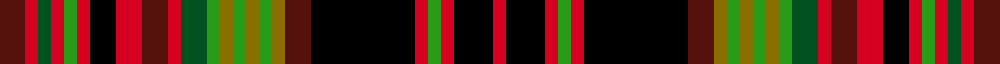

This page is one **sett** — a single exact thread-count. It belongs to the [tartan](/setts/dr2r1dg1r1g1r1k2r2dr2r1dg2g1y1g1y1g1y1dr2k8r1g1r1k3r1/)
(the same proportion at any scale), whose colour order is pattern [BRGRGRKRBRGGGGGGGBKRGRKR](/stripes/brgrgrkrbrgggggggbkrgrkr/).

Sourced from register-of-tartans.  It is a [24 stripe tartan](/stripes/stripes24/).

Original link https://www.tartanregister.gov.uk/tartanDetails.aspx?ref=11575

## Register references

External register numbers recorded for this tartan.

- Scottish Register of Tartans: [11575](https://www.tartanregister.gov.uk/tartanDetails.aspx?ref=11575)

## Thread count
DR/20 R10 DG10 R10 G10 R10 K20 R20 DR20 R10 DG20 G10 Y10 G10 Y10 G10 Y10 DR20 K80 R10 G10 R10 K30 R/10

One full sett is **750 threads**.

## Palette
<table><thead><tr><th>Colour</th><th>Shade</th><th>OKLCh</th></tr></thead><tbody><tr><td>DR</td><td><code style="background-color:#55120C;">#55120C</code> <small style="color:#888">#55120C</small></td><td><small style="color:#888">oklch(30.0% 0.099 29.3)</small></td></tr><tr><td>DG</td><td><code style="background-color:#005020;">#005020</code> <small style="color:#888">#005020</small></td><td><small style="color:#888">oklch(37.7% 0.105 149.6)</small></td></tr><tr><td>G</td><td><code style="background-color:#289C18;">#289C18</code> <small style="color:#888">#289C18</small></td><td><small style="color:#888">oklch(60.6% 0.191 141.6)</small></td></tr><tr><td>K</td><td><code style="background-color:#000000;">#000000</code> <small style="color:#888">#000000</small></td><td><small style="color:#888">oklch(0.0% 0.000 0.0)</small></td></tr><tr><td>R</td><td><code style="background-color:#D60020;">#D60020</code> <small style="color:#888">#D60020</small></td><td><small style="color:#888">oklch(55.2% 0.224 25.5)</small></td></tr><tr><td>Y</td><td><code style="background-color:#8B6E00;">#8B6E00</code> <small style="color:#888">#8B6E00</small></td><td><small style="color:#888">oklch(55.1% 0.113 90.4)</small></td></tr></tbody></table>

# Sample pattern

ID: /variants/s24/dr2r1dg1r1g1r1k2r2dr2r1dg2g1y1g1y1g1y1dr2k8r1g1r1k3r1~x10~dg1504144-g2408144/
