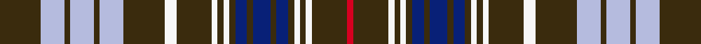
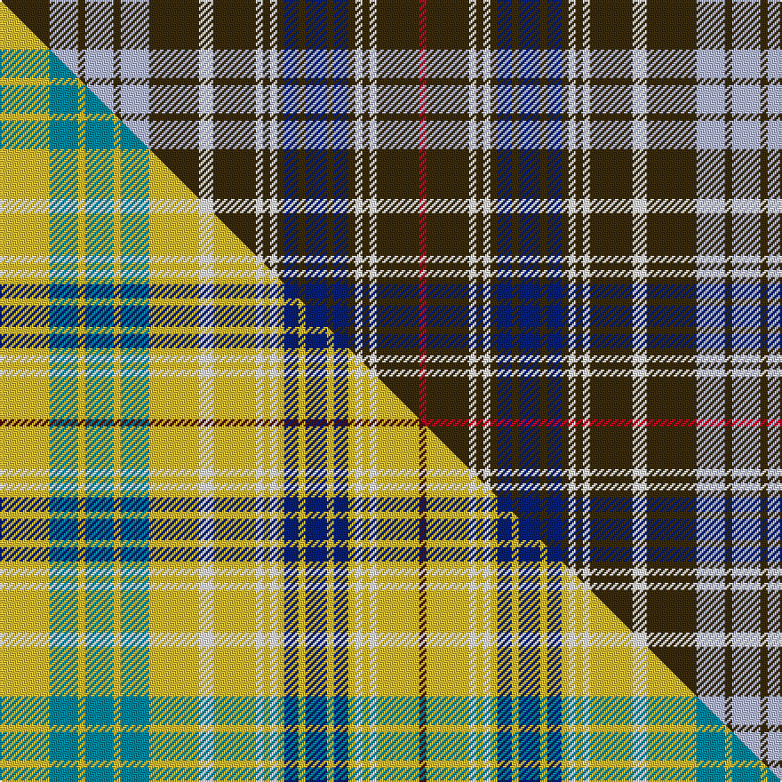

This page is one **sett** — a single exact thread-count. It belongs to the [tartan](/setts/dy7lb4dy1lb4dy1lb4dy7w2dy6w1dy1w1dy1db2dy1db3dy1db2dy1w1dy1w1dy6r1/)
(the same proportion at any scale), whose colour order is pattern [GWGWGWGWGWGWGBGBGBGWGWGR](/stripes/gwgwgwgwgwgwgbgbgbgwgwgr/).

Part of the [Ottawa](/tartans/ottawa/) tartan — the named design grouping this sett with its other cloths.

Sourced from house-of-tartan.  It is a [24 stripe tartan](/stripes/stripes24/).

Original link http://www.house-of-tartan.scotland.net/house/TartanViewjs.asp?colr=Def&tnam=2021

## Provenance

Earliest known date: 1966 In two blocks - Navy Block ends on 14th colour change Gold 24. Azure Block starts on the following White 8. The design was accepted as the Official Tartan of Ottawa by order of the Council on November 21st 1966. In 1985 it was no longer in commercial production.

## Thread count
DY/28 LB16 DY4 LB16 DY4 LB16 DY28 W8 DY24 W4 DY4 W4 DY4 DB8 DY4 DB12 DY4 DB8 DY4 W4 DY4 W4 DY24 R/4

One full sett is **448 threads**.

## Palette
<table><thead><tr><th>Colour</th><th>Shade</th><th>OKLCh</th></tr></thead><tbody><tr><td>LB</td><td><code style="background-color:#B5BBDE;">#B5BBDE</code> <small style="color:#888">#B5BBDE</small></td><td><small style="color:#888">oklch(79.9% 0.050 277.6)</small></td></tr><tr><td>DB</td><td><code style="background-color:#082077;">#082077</code> <small style="color:#888">#082077</small></td><td><small style="color:#888">oklch(30.0% 0.149 265.1)</small></td></tr><tr><td>W</td><td><code style="background-color:#F7F7F7;">#F7F7F7</code> <small style="color:#888">#F7F7F7</small></td><td><small style="color:#888">oklch(97.6% 0.000 89.9)</small></td></tr><tr><td>R</td><td><code style="background-color:#D60020;">#D60020</code> <small style="color:#888">#D60020</small></td><td><small style="color:#888">oklch(55.2% 0.224 25.5)</small></td></tr><tr><td>DY</td><td><code style="background-color:#3A2B0D;">#3A2B0D</code> <small style="color:#888">#3A2B0D</small></td><td><small style="color:#888">oklch(30.0% 0.049 82.0)</small></td></tr></tbody></table>

# Sample pattern

## Compared to the master

This cloth is one sett of its design; the master sett (the exemplar the design is anchored on) is below for comparison.

Its **ΔTartan distance** from the master is **3.47** — the same measure the nearest-tartans table ranks by (0 is identical; a re-scale of the same cloth is near 0, a recolour or a different proportion further).

<figure class="master-compare" style="margin:0">

this sett
master sett ★

<figcaption style="color:#888;font-size:smaller">One weave of this sett against the <a href="/setts/ly7t4ly1t4ly1t4ly7w2ly6w1ly1w1ly1db2ly1db3ly1db2ly1w1ly1w1ly6dr1/">master sett ★</a>, split on the diagonal: a shared proportion runs seamlessly across it with only the shades shifting; a different proportion breaks on it.</figcaption>
</figure>

## Nearest variants

The nearest existing variants by ΔTartan distance, with this cloth at the top so the swatches line up against it.

ΔTartan

Threads

Variant

Sett

—

448

<a href="/variants/s24/dy7lb4dy1lb4dy1lb4dy7w2dy6w1dy1w1dy1db2dy1db3dy1db2dy1w1dy1w1dy6r1~x4/">Ottawa District Tartan</a>

<a href="/ttd/edit/#slug=y7lb4y1lb4y1lb4y7w2y6w1y1w1y1db2y1db3y1db2y1w1y1w1y6r1~x4&amp;base=dy7lb4dy1lb4dy1lb4dy7w2dy6w1dy1w1dy1db2dy1db3dy1db2dy1w1dy1w1dy6r1~x4" title="compare in the TTD">0.00</a>

448

<a href="/variants/s24/y7lb4y1lb4y1lb4y7w2y6w1y1w1y1db2y1db3y1db2y1w1y1w1y6r1~x4/">Ottawa</a>

## Neighbour map

Every grey dot is one of 13620 variants placed by the first two principal components of the ΔTartan feature space (42% of its variance). Red is this tartan; blue dots are its nearest — click one to open its page.

<svg viewBox="0 0 640 380" role="img" style="max-width:100%;height:auto;border:1px solid #e0e0e0;border-radius:4px;display:block" xmlns="http://www.w3.org/2000/svg"><image href="/nn/cloud.v1.png" width="640" height="380"/><a href="/variants/s24/y7lb4y1lb4y1lb4y7w2y6w1y1w1y1db2y1db3y1db2y1w1y1w1y6r1~x4/"><circle cx="242.3" cy="162.6" r="4" fill="#3465a4"><title>Ottawa</title></circle></a><circle cx="212.1" cy="150.9" r="5" fill="#c00000"/><text x="320" y="376" text-anchor="middle" font-size="11" fill="#999">ground</text><text x="11" y="190" text-anchor="middle" font-size="11" fill="#999" transform="rotate(-90 11 190)">complexity</text></svg>

ID: /variants/s24/dy7lb4dy1lb4dy1lb4dy7w2dy6w1dy1w1dy1db2dy1db3dy1db2dy1w1dy1w1dy6r1~x4/
