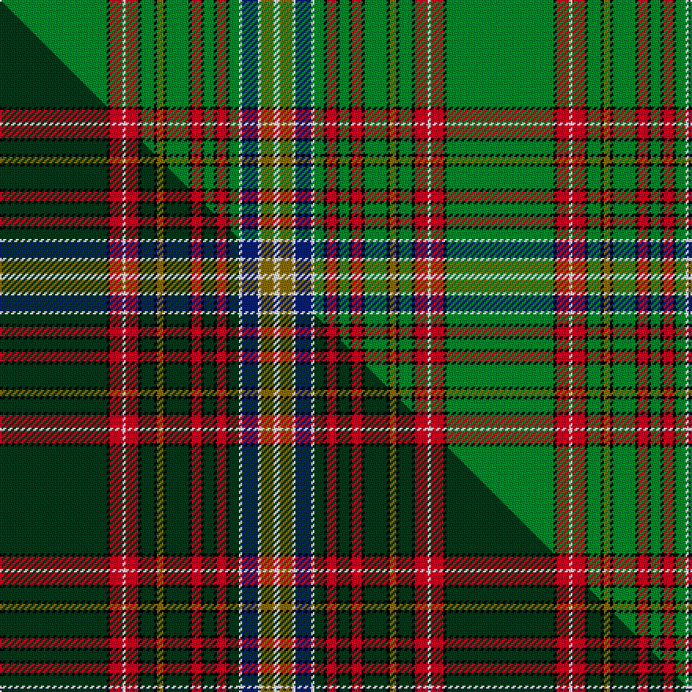

This is one **variant** — a specific cloth: this exact thread count and colourway, with its own
provenance below. It is one weaving of the [sett](/tartans/m/ma/macmaster-2/) (the scale-free proportion — the
same cloth at any scale or shade), whose colour order is pattern [GKRWRKGKGKGKRKGKRKGWBWGW](/stripes/gkrwrkgkgkgkrkgkrkgwbwgw/).

Part of the [MacMaster](/tartans/m/ma/macmaster-2/) tartan — the named design grouping this sett with its other cloths.

Sourced from house-of-tartan.  It is a [24 stripe tartan](/stripes/stripes24/).

Original link [http://www.house-of-tartan.scotland.net/house/TartanViewjs.asp?colr=Def&tnam=822](http://www.house-of-tartan.scotland.net/house/TartanViewjs.asp?colr=Def&tnam=822)

## Provenance

Earliest known date: 1987 Research report available.

2 attestations — the source records this cloth was collapsed from (oldest owns this page)

<ul>
<li>1987 — MacMaster Corporate Tartan (house-of-tartan, <a href="http://www.house-of-tartan.scotland.net/house/TartanViewjs.asp?colr=Def&tnam=822">record</a>) </li>
<li>undated — MacMaster (weddslist, <a href="http://www.weddslist.com/cgi-bin/tartans/pg.pl?source=sts">record</a>) </li>
</ul>

Dataset <small>— provenance for this record, inherited from the source manifest</small>

<dl class="dataset-prov">
<dt>source</dt><dd><a href="/sources/house-of-tartan/">House of Tartan</a></dd>
<dt>data captured from</dt><dd><a href="https://github.com/thetartan/tartan-database/blob/master/data/house-of-tartan/data.csv">https://github.com/thetartan/tartan-database/blob/master/data/house-of-tartan/data.csv</a></dd>
<dt>data date</dt><dd>1987 <small>(this record)</small></dd>
<dt>licence</dt><dd><a href="https://creativecommons.org/licenses/by-nc-nd/4.0/">CC BY-NC-ND 4.0</a></dd>
</dl>

Capture chain <small>— the hands this data passed through, oldest first; each capture carries its own licence</small>

<ol class="capture-chain">
<li><a href="http://www.house-of-tartan.scotland.net/">House of Tartan</a> <small>the weaver/retailer's database — the site is now offline; the URL is kept as the ultimate source's identity</small></li>
<li><a href="https://github.com/thetartan/tartan-database">thetartan/tartan-database</a> <small>2016-2017</small> · <a href="https://creativecommons.org/licenses/by-nc-nd/4.0/">CC BY-NC-ND 4.0</a> <small>Levko Kravets's frozen compilation — the capture we vendored, and where its CC licence text came from</small></li>
<li>this dictionary <small>captured 2026-06-10 · commit 5bf86c7566</small> <small>each re-capture is a git commit to data/sources</small></li>
</ol>

## Thread count
G/68 K2 R8 W2 R8 K2 G8 K2 Y4 K2 G14 K2 R6 K2 G6 K2 R6 K2 G6 W2 DB10 W2 Y8 W/4

One full sett is **284 threads**.

## Palette
<table><thead><tr><th>Colour</th><th>Shade</th><th>OKLCh</th></tr></thead><tbody><tr><td>DB</td><td><code style="background-color:#082077;">#082077</code> <small style="color:#888">#082077</small></td><td><small style="color:#888">oklch(30.0% 0.149 265.1)</small></td></tr><tr><td>G</td><td><code style="background-color:#008B2A;">#008B2A</code> <small style="color:#888">#008B2A</small></td><td><small style="color:#888">oklch(55.4% 0.170 145.9)</small></td></tr><tr><td>K</td><td><code style="background-color:#000000;">#000000</code> <small style="color:#888">#000000</small></td><td><small style="color:#888">oklch(0.0% 0.000 0.0)</small></td></tr><tr><td>W</td><td><code style="background-color:#F7F7F7;">#F7F7F7</code> <small style="color:#888">#F7F7F7</small></td><td><small style="color:#888">oklch(97.6% 0.000 89.9)</small></td></tr><tr><td>R</td><td><code style="background-color:#D60020;">#D60020</code> <small style="color:#888">#D60020</small></td><td><small style="color:#888">oklch(55.2% 0.224 25.5)</small></td></tr><tr><td>Y</td><td><code style="background-color:#8B6E00;">#8B6E00</code> <small style="color:#888">#8B6E00</small></td><td><small style="color:#888">oklch(55.1% 0.113 90.4)</small></td></tr></tbody></table>

# Sample pattern

## Compared to the master

This cloth is one sett of its design; the master sett (the exemplar the design is anchored on) is below for comparison.

Its **ΔTartan distance** from the master is **0.20** — the same measure the nearest-tartans table ranks by (0 is identical; a re-scale of the same cloth is near 0, a recolour or a different proportion further).

<figure class="master-compare" style="margin:0">

this sett
master sett ★

<figcaption style="color:#888;font-size:smaller">One weave of this sett against the <a href="/setts/dg34k1r4w1r4k1dg4k1y2k1dg7k1r3k1dg3k1r3k1dg3w1db5w1y4w2/">master sett ★</a>, split on the diagonal: a shared proportion runs seamlessly across it with only the shades shifting; a different proportion breaks on it.</figcaption>
</figure>

## Nearest tartan variants

The nearest existing variants by ΔTartan distance, with this cloth at the top so the swatches line up against it.

ΔTartan

Threads

Variant

Sett

—

284

<a href="/variants/s24/g34k1r4w1r4k1g4k1y2k1g7k1r3k1g3k1r3k1g3w1db5w1y4w2~x2/">MacMaster Corporate Tartan</a>

<a href="/ttd/edit/#slug=dg34k1r4w1r4k1dg4k1y2k1dg7k1r3k1dg3k1r3k1dg3w1db5w1y4w2~x2&amp;base=g34k1r4w1r4k1g4k1y2k1g7k1r3k1g3k1r3k1g3w1db5w1y4w2~x2" title="compare in the TTD">0.20</a>

284

<a href="/variants/s24/dg34k1r4w1r4k1dg4k1y2k1dg7k1r3k1dg3k1r3k1dg3w1db5w1y4w2~x2/">MacMaster (USA) #2</a>

<a href="/ttd/edit/#slug=g64k4db9dy2db4dy2db4g11r8db2r4w3~x2~w4000000&amp;base=g34k1r4w1r4k1g4k1y2k1g7k1r3k1g3k1r3k1g3w1db5w1y4w2~x2" title="compare in the TTD">2.27</a>

334

<a href="/variants/s12/g64k4db9dy2db4dy2db4g11r8db2r4w3~x2~w4000000/">Sillars</a>

<a href="/ttd/edit/#slug=g105db9k16y6k8w3k8g16r24k1r4k2r3k3r2k4r1k9g1k4g2k3g3k2g4k1g40r9g10k3w5~x2&amp;base=g34k1r4w1r4k1g4k1y2k1g7k1r3k1g3k1r3k1g3w1db5w1y4w2~x2" title="compare in the TTD">2.31</a>

1024

<a href="/variants/s31/g105db9k16y6k8w3k8g16r24k1r4k2r3k3r2k4r1k9g1k4g2k3g3k2g4k1g40r9g10k3w5~x2/">Un-named C19th Plaid</a>

<a href="/ttd/edit/#slug=g42t3k8y2k2w3k2g12r5k2r2w2~x2&amp;base=g34k1r4w1r4k1g4k1y2k1g7k1r3k1g3k1r3k1g3w1db5w1y4w2~x2" title="compare in the TTD">2.58</a>

252

<a href="/variants/s12/g42t3k8y2k2w3k2g12r5k2r2w2~x2/">King George VI (Green Stewart)</a>

<a href="/ttd/edit/#slug=g40n1dp4n1dp4k4r1k1r1k1r1k1r2w4~x2&amp;base=g34k1r4w1r4k1g4k1y2k1g7k1r3k1g3k1r3k1g3w1db5w1y4w2~x2" title="compare in the TTD">2.84</a>

176

<a href="/variants/s14/g40n1dp4n1dp4k4r1k1r1k1r1k1r2w4~x2/">Mighty Men</a>

<a href="/ttd/edit/#slug=g46k3db6y2db3y2db3g7r6db2r3w4~x2&amp;base=g34k1r4w1r4k1g4k1y2k1g7k1r3k1g3k1r3k1g3w1db5w1y4w2~x2" title="compare in the TTD">2.92</a>

248

<a href="/variants/s12/g46k3db6y2db3y2db3g7r6db2r3w4~x2/">Seller (Personal)</a>

<a href="/ttd/edit/#slug=g82k2g2k2g2k8db28k1w6k1db28k1y6k1g32k2r5k2g15w6~x2&amp;base=g34k1r4w1r4k1g4k1y2k1g7k1r3k1g3k1r3k1g3w1db5w1y4w2~x2" title="compare in the TTD">2.95</a>

752

<a href="/variants/s20/g82k2g2k2g2k8db28k1w6k1db28k1y6k1g32k2r5k2g15w6~x2/">Unidentified #30</a>

<a href="/ttd/edit/#slug=g82k2g2k2g2k8db28k1w6k1db28k1dy6k1g32k2r5k2g15w6~x2&amp;base=g34k1r4w1r4k1g4k1y2k1g7k1r3k1g3k1r3k1g3w1db5w1y4w2~x2" title="compare in the TTD">3.03</a>

752

<a href="/variants/s20/g82k2g2k2g2k8db28k1w6k1db28k1dy6k1g32k2r5k2g15w6~x2/">Unnamed No 38 Artifact Tartan</a>

<a href="/ttd/edit/#slug=g36k1g1k1g1k1db12k1w1k1db12k1y1k1g12k2r2&amp;base=g34k1r4w1r4k1g4k1y2k1g7k1r3k1g3k1r3k1g3w1db5w1y4w2~x2" title="compare in the TTD">3.40</a>

136

<a href="/variants/s17/g36k1g1k1g1k1db12k1w1k1db12k1y1k1g12k2r2/">Cockburn</a>

<a href="/ttd/edit/#slug=g36k1g1k1g1k1db12k1w1k1db12k1y1k1g12k2r2~x2&amp;base=g34k1r4w1r4k1g4k1y2k1g7k1r3k1g3k1r3k1g3w1db5w1y4w2~x2" title="compare in the TTD">3.40</a>

272

<a href="/variants/s17/g36k1g1k1g1k1db12k1w1k1db12k1y1k1g12k2r2~x2/">Cockburn Clan Tartan</a>

## Neighbour map

Every grey dot is one of 13656 variants placed by the first two principal components of the ΔTartan feature space (42% of its variance). Red is this tartan; blue dots are its nearest — click one to open its page. The map is a flat projection of a many-dimensional space — [how to read it](/posts/neighbourhood-maps/).

<svg viewBox="0 0 640 380" role="img" style="max-width:100%;height:auto;border:1px solid #e0e0e0;border-radius:4px;display:block" xmlns="http://www.w3.org/2000/svg"><image href="/nn/cloud.v1.png" width="640" height="380"/><a href="/variants/s24/dg34k1r4w1r4k1dg4k1y2k1dg7k1r3k1dg3k1r3k1dg3w1db5w1y4w2~x2/"><circle cx="272.2" cy="14.0" r="4" fill="#3465a4"><title>MacMaster (USA) #2</title></circle></a><a href="/variants/s12/g64k4db9dy2db4dy2db4g11r8db2r4w3~x2~w4000000/"><circle cx="244.7" cy="31.6" r="4" fill="#3465a4"><title>Sillars</title></circle></a><a href="/variants/s31/g105db9k16y6k8w3k8g16r24k1r4k2r3k3r2k4r1k9g1k4g2k3g3k2g4k1g40r9g10k3w5~x2/"><circle cx="272.2" cy="14.0" r="4" fill="#3465a4"><title>Un-named C19th Plaid</title></circle></a><a href="/variants/s12/g42t3k8y2k2w3k2g12r5k2r2w2~x2/"><circle cx="199.1" cy="45.3" r="4" fill="#3465a4"><title>King George VI (Green Stewart)</title></circle></a><a href="/variants/s14/g40n1dp4n1dp4k4r1k1r1k1r1k1r2w4~x2/"><circle cx="304.6" cy="18.0" r="4" fill="#3465a4"><title>Mighty Men</title></circle></a><a href="/variants/s12/g46k3db6y2db3y2db3g7r6db2r3w4~x2/"><circle cx="212.0" cy="47.1" r="4" fill="#3465a4"><title>Seller (Personal)</title></circle></a><a href="/variants/s20/g82k2g2k2g2k8db28k1w6k1db28k1y6k1g32k2r5k2g15w6~x2/"><circle cx="279.6" cy="17.2" r="4" fill="#3465a4"><title>Unidentified #30</title></circle></a><a href="/variants/s20/g82k2g2k2g2k8db28k1w6k1db28k1dy6k1g32k2r5k2g15w6~x2/"><circle cx="279.1" cy="16.9" r="4" fill="#3465a4"><title>Unnamed No 38 Artifact Tartan</title></circle></a><a href="/variants/s17/g36k1g1k1g1k1db12k1w1k1db12k1y1k1g12k2r2/"><circle cx="290.3" cy="34.0" r="4" fill="#3465a4"><title>Cockburn</title></circle></a><a href="/variants/s17/g36k1g1k1g1k1db12k1w1k1db12k1y1k1g12k2r2~x2/"><circle cx="290.3" cy="34.0" r="4" fill="#3465a4"><title>Cockburn Clan Tartan</title></circle></a><circle cx="263.5" cy="17.0" r="5" fill="#c00000"/><text x="320" y="376" text-anchor="middle" font-size="11" fill="#999">ground</text><text x="11" y="190" text-anchor="middle" font-size="11" fill="#999" transform="rotate(-90 11 190)">complexity</text></svg>

ID: /variants/s24/g34k1r4w1r4k1g4k1y2k1g7k1r3k1g3k1r3k1g3w1db5w1y4w2~x2/
