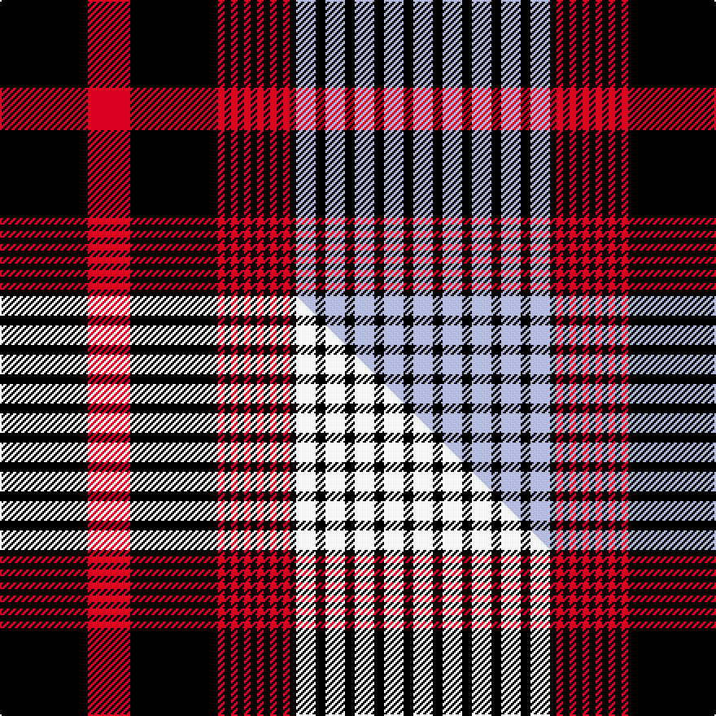

This is one **variant** — a specific cloth: this exact thread count and colourway, with its own
provenance below. It is one weaving of the [sett](/setts/k27r13k27r2k2r2k2r2k2r2k2r2k2r2k2lb6k3lb6k3lb6k3lb6k3lb6/) (the scale-free proportion — the
same cloth at any scale or shade), whose colour order is pattern [KRKRKRKRKRKRKRKWKWKWKWKW](/stripes/krkrkrkrkrkrkrkwkwkwkwkw/).

Part of the [Angus](/tartans/a/an/angus/) tartan — the named design grouping this sett with its other cloths.

Sourced from tartans-authority.  It is a [24 stripe tartan](/stripes/stripes24/).

Original link [https://www.tartanregister.gov.uk/tartanDetails.aspx?ref=1199](https://www.tartanregister.gov.uk/tartanDetails.aspx?ref=1199)

Dataset <small>— provenance for this record, inherited from the source manifest</small>

<dl class="dataset-prov">
<dt>source</dt><dd><a href="/sources/tartans-authority/">Scottish Tartans Authority</a></dd>
<dt>data captured from</dt><dd><a href="https://github.com/thetartan/tartan-database/blob/master/data/tartans-authority/data.csv">https://github.com/thetartan/tartan-database/blob/master/data/tartans-authority/data.csv</a></dd>
<dt>data date</dt><dd>1830 <small>(this record)</small></dd>
<dt>licence</dt><dd><a href="https://creativecommons.org/licenses/by-nc-nd/4.0/">CC BY-NC-ND 4.0</a></dd>
</dl>

Capture chain <small>— the hands this data passed through, oldest first; each capture carries its own licence</small>

<ol class="capture-chain">
<li><a href="https://www.tartansauthority.com/">Scottish Tartans Authority</a> <small>the heritage body's archive — its tartan-ferret record browser is retired (links repaired to the SRT, above)</small></li>
<li><a href="https://github.com/thetartan/tartan-database">thetartan/tartan-database</a> <small>2016-2017</small> · <a href="https://creativecommons.org/licenses/by-nc-nd/4.0/">CC BY-NC-ND 4.0</a> <small>Levko Kravets's frozen compilation — the capture we vendored, and where its CC licence text came from</small></li>
<li>this dictionary <small>captured 2026-06-10 · commit 5bf86c7566</small> <small>each re-capture is a git commit to data/sources</small></li>
</ol>

## Register references

External register numbers recorded for this tartan.

- Scottish Tartans Authority (ITI): 1199

## Thread count
K/54 R26 K54 R4 K4 R4 K4 R4 K4 R4 K4 R4 K4 R4 K4 LB12 K6 LB12 K6 LB12 K6 LB12 K6 LB/12

One full sett is **466 threads**.

## Palette
<table><thead><tr><th>Colour</th><th>Shade</th><th>OKLCh</th></tr></thead><tbody><tr><td>K</td><td><code style="background-color:#000000;">#000000</code> <small style="color:#888">#000000</small></td><td><small style="color:#888">oklch(0.0% 0.000 0.0)</small></td></tr><tr><td>LB</td><td><code style="background-color:#B5BBDE;">#B5BBDE</code> <small style="color:#888">#B5BBDE</small></td><td><small style="color:#888">oklch(79.9% 0.050 277.6)</small></td></tr><tr><td>R</td><td><code style="background-color:#D60020;">#D60020</code> <small style="color:#888">#D60020</small></td><td><small style="color:#888">oklch(55.2% 0.224 25.5)</small></td></tr></tbody></table>

# Sample pattern

## Compared to the master

This cloth is one sett of its design; the master sett (the exemplar the design is anchored on) is below for comparison.

Its **ΔTartan distance** from the master is **1.00** — the same measure the nearest-tartans table ranks by (0 is identical; a re-scale of the same cloth is near 0, a recolour or a different proportion further).

<figure class="master-compare" style="margin:0">

this sett
master sett ★

<figcaption style="color:#888;font-size:smaller">One weave of this sett against the <a href="/setts/k27r13k27r2k2r2k2r2k2r2k2r2k2r2k2w6k3w6k3w6k3w6k3w6/">master sett ★</a>, split on the diagonal: a shared proportion runs seamlessly across it with only the shades shifting; a different proportion breaks on it.</figcaption>
</figure>

## Nearest tartan variants

The nearest existing variants by ΔTartan distance, with this cloth at the top so the swatches line up against it.

ΔTartan

Threads

Variant

Sett

—

466

<a href="/variants/s24/k27r13k27r2k2r2k2r2k2r2k2r2k2r2k2lb6k3lb6k3lb6k3lb6k3lb6~x2/">Angus, Red (Fashion)</a>

<a href="/ttd/edit/#slug=k27r13k27r2k2r2k2r2k2r2k2r2k2r2k2w6k3w6k3w6k3w6k3w6~x2&amp;base=k27r13k27r2k2r2k2r2k2r2k2r2k2r2k2lb6k3lb6k3lb6k3lb6k3lb6~x2" title="compare in the TTD">1.00</a>

466

<a href="/variants/s24/k27r13k27r2k2r2k2r2k2r2k2r2k2r2k2w6k3w6k3w6k3w6k3w6~x2/">Angus (Paton)</a>

<a href="/ttd/edit/#slug=o6g5o6k34w3k3w3k3o6k3w3k3w3k34o6g5o6k5~x2&amp;base=k27r13k27r2k2r2k2r2k2r2k2r2k2r2k2lb6k3lb6k3lb6k3lb6k3lb6~x2" title="compare in the TTD">3.04</a>

526

<a href="/variants/s18/o6g5o6k34w3k3w3k3o6k3w3k3w3k34o6g5o6k5~x2/">Woodberry Forest School</a>

<a href="/ttd/edit/#slug=k6dr5k5dr5k5dr5k12w2k2w2k12dr5k38dr21k6dr21w2k12w2k12dr3w2dr3w2k6&amp;base=k27r13k27r2k2r2k2r2k2r2k2r2k2r2k2lb6k3lb6k3lb6k3lb6k3lb6~x2" title="compare in the TTD">3.12</a>

380

<a href="/variants/s25/k6dr5k5dr5k5dr5k12w2k2w2k12dr5k38dr21k6dr21w2k12w2k12dr3w2dr3w2k6/">Amstartan</a>

<a href="/ttd/edit/#slug=k4lb2k2n14lb2k2lb2k4n2k16lb2k2lb1k4~x2&amp;base=k27r13k27r2k2r2k2r2k2r2k2r2k2r2k2lb6k3lb6k3lb6k3lb6k3lb6~x2" title="compare in the TTD">3.20</a>

220

<a href="/variants/s14/k4lb2k2n14lb2k2lb2k4n2k16lb2k2lb1k4~x2/">Drummond (Grey) Clan Tartan</a>

<a href="/ttd/edit/#slug=r4k2r11k14r2w2k2r2k10w4k50w4k10r2k2w2r2k14r11k2r4w2~x2&amp;base=k27r13k27r2k2r2k2r2k2r2k2r2k2r2k2lb6k3lb6k3lb6k3lb6k3lb6~x2" title="compare in the TTD">3.34</a>

620

<a href="/variants/s22/r4k2r11k14r2w2k2r2k10w4k50w4k10r2k2w2r2k14r11k2r4w2~x2/">Knights Templar Dress</a>

<a href="/ttd/edit/#slug=y2w15dp10k23y2k23dp10k15y2w2y2k15dp10k23y2k2w2k23dp10w15y2w2~x2&amp;base=k27r13k27r2k2r2k2r2k2r2k2r2k2r2k2lb6k3lb6k3lb6k3lb6k3lb6~x2" title="compare in the TTD">3.38</a>

840

<a href="/variants/s22/y2w15dp10k23y2k23dp10k15y2w2y2k15dp10k23y2k2w2k23dp10w15y2w2~x2/">Freger (Corporate)</a>

<a href="/ttd/edit/#slug=dy21k2w2dy2k2dy2w2k2dy2k2dy2w6dy2k2dy3k20~x2&amp;base=k27r13k27r2k2r2k2r2k2r2k2r2k2r2k2lb6k3lb6k3lb6k3lb6k3lb6~x2" title="compare in the TTD">3.53</a>

214

<a href="/variants/s16/dy21k2w2dy2k2dy2w2k2dy2k2dy2w6dy2k2dy3k20~x2/">Corps Suevia Heidelburg</a>

<a href="/ttd/edit/#slug=w1y2k8dp6k15y1k1w1k15dp5w8y1w1~x2&amp;base=k27r13k27r2k2r2k2r2k2r2k2r2k2r2k2lb6k3lb6k3lb6k3lb6k3lb6~x2" title="compare in the TTD">3.74</a>

256

<a href="/variants/s13/w1y2k8dp6k15y1k1w1k15dp5w8y1w1~x2/">Freger</a>

<a href="/ttd/edit/#slug=k2r2k12r2k2r18k2r2k12r2w1~x2&amp;base=k27r13k27r2k2r2k2r2k2r2k2r2k2r2k2lb6k3lb6k3lb6k3lb6k3lb6~x2" title="compare in the TTD">3.79</a>

222

<a href="/variants/s11/k2r2k12r2k2r18k2r2k12r2w1~x2/">Hebrides #12</a>

<a href="/ttd/edit/#slug=dy2w2r13k17r2k17w2dy4w2k17r2k17w2r13w2k17r2k17r13w2~x2&amp;base=k27r13k27r2k2r2k2r2k2r2k2r2k2r2k2lb6k3lb6k3lb6k3lb6k3lb6~x2" title="compare in the TTD">3.86</a>

652

<a href="/variants/s20/dy2w2r13k17r2k17w2dy4w2k17r2k17w2r13w2k17r2k17r13w2~x2/">Holy Sepulchre Corporate Tartan</a>

## Neighbour map

Every grey dot is one of 13656 variants placed by the first two principal components of the ΔTartan feature space (42% of its variance). Red is this tartan; blue dots are its nearest — click one to open its page. The map is a flat projection of a many-dimensional space — [how to read it](/posts/neighbourhood-maps/).

<svg viewBox="0 0 640 380" role="img" style="max-width:100%;height:auto;border:1px solid #e0e0e0;border-radius:4px;display:block" xmlns="http://www.w3.org/2000/svg"><image href="/nn/cloud.v1.png" width="640" height="380"/><a href="/variants/s24/k27r13k27r2k2r2k2r2k2r2k2r2k2r2k2w6k3w6k3w6k3w6k3w6~x2/"><circle cx="260.6" cy="92.4" r="4" fill="#3465a4"><title>Angus (Paton)</title></circle></a><a href="/variants/s18/o6g5o6k34w3k3w3k3o6k3w3k3w3k34o6g5o6k5~x2/"><circle cx="266.0" cy="101.5" r="4" fill="#3465a4"><title>Woodberry Forest School</title></circle></a><a href="/variants/s25/k6dr5k5dr5k5dr5k12w2k2w2k12dr5k38dr21k6dr21w2k12w2k12dr3w2dr3w2k6/"><circle cx="306.7" cy="99.8" r="4" fill="#3465a4"><title>Amstartan</title></circle></a><a href="/variants/s14/k4lb2k2n14lb2k2lb2k4n2k16lb2k2lb1k4~x2/"><circle cx="275.2" cy="125.0" r="4" fill="#3465a4"><title>Drummond (Grey) Clan Tartan</title></circle></a><a href="/variants/s22/r4k2r11k14r2w2k2r2k10w4k50w4k10r2k2w2r2k14r11k2r4w2~x2/"><circle cx="352.5" cy="62.3" r="4" fill="#3465a4"><title>Knights Templar Dress</title></circle></a><a href="/variants/s22/y2w15dp10k23y2k23dp10k15y2w2y2k15dp10k23y2k2w2k23dp10w15y2w2~x2/"><circle cx="217.3" cy="122.9" r="4" fill="#3465a4"><title>Freger (Corporate)</title></circle></a><a href="/variants/s16/dy21k2w2dy2k2dy2w2k2dy2k2dy2w6dy2k2dy3k20~x2/"><circle cx="193.1" cy="101.9" r="4" fill="#3465a4"><title>Corps Suevia Heidelburg</title></circle></a><a href="/variants/s13/w1y2k8dp6k15y1k1w1k15dp5w8y1w1~x2/"><circle cx="256.4" cy="119.9" r="4" fill="#3465a4"><title>Freger</title></circle></a><a href="/variants/s11/k2r2k12r2k2r18k2r2k12r2w1~x2/"><circle cx="286.1" cy="102.8" r="4" fill="#3465a4"><title>Hebrides #12</title></circle></a><a href="/variants/s20/dy2w2r13k17r2k17w2dy4w2k17r2k17w2r13w2k17r2k17r13w2~x2/"><circle cx="242.7" cy="132.2" r="4" fill="#3465a4"><title>Holy Sepulchre Corporate Tartan</title></circle></a><circle cx="266.3" cy="93.6" r="5" fill="#c00000"/><text x="320" y="376" text-anchor="middle" font-size="11" fill="#999">ground</text><text x="11" y="190" text-anchor="middle" font-size="11" fill="#999" transform="rotate(-90 11 190)">complexity</text></svg>

ID: /variants/s24/k27r13k27r2k2r2k2r2k2r2k2r2k2r2k2lb6k3lb6k3lb6k3lb6k3lb6~x2/
