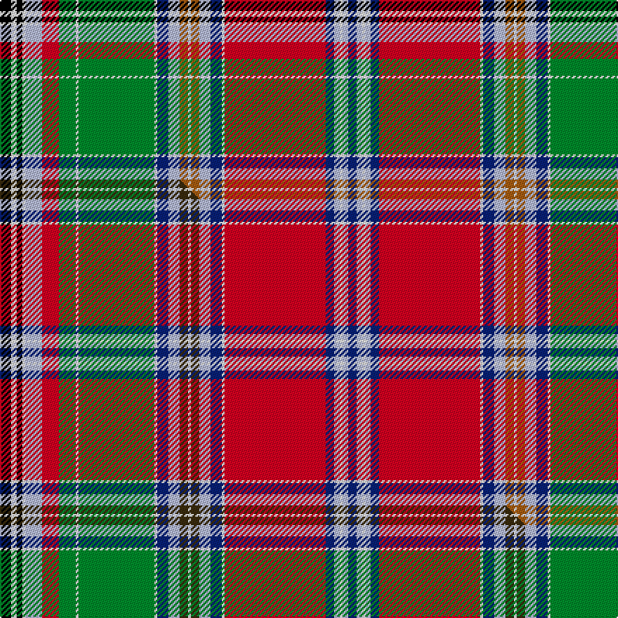

This is one **variant** — a specific cloth: this exact thread count and colourway, with its own
provenance below. It is one weaving of the [sett](/tartans/r/ro/ross-wedding-dress/) (the scale-free proportion — the
same cloth at any scale or shade), whose colour order is pattern [BWWWBRWBWRWRWBWGWGRWWKWK](/stripes/bwwwbrwbwrwrwbwgwgrwwkwk/).

Part of the [Ross Wedding Dress](/tartans/r/ro/ross-wedding-dress/) tartan — the named design grouping this sett with its other cloths.

Sourced from weddslist.  It is a [24 stripe tartan](/stripes/stripes24/).

Original link [http://www.weddslist.com/cgi-bin/tartans/pg.pl?source=sts](http://www.weddslist.com/cgi-bin/tartans/pg.pl?source=sts)

Dataset <small>— provenance for this record, inherited from the source manifest</small>

<dl class="dataset-prov">
<dt>source</dt><dd><a href="/sources/weddslist/">Weddslist</a></dd>
<dt>data captured from</dt><dd><a href="https://github.com/thetartan/tartan-database/blob/master/data/weddslist/data.csv">https://github.com/thetartan/tartan-database/blob/master/data/weddslist/data.csv</a></dd>
<dt>data date</dt><dd>2016-11-17 <small>(dataset default)</small></dd>
<dt>licence</dt><dd><a href="https://creativecommons.org/licenses/by-nc-nd/4.0/">CC BY-NC-ND 4.0</a></dd>
</dl>

Capture chain <small>— the hands this data passed through, oldest first; each capture carries its own licence</small>

<ol class="capture-chain">
<li><a href="https://www.weddslist.com/tartans/">Weddslist</a> <small>the living privately compiled reference</small></li>
<li><a href="https://github.com/thetartan/tartan-database">thetartan/tartan-database</a> <small>2016-2017</small> · <a href="https://creativecommons.org/licenses/by-nc-nd/4.0/">CC BY-NC-ND 4.0</a> <small>Levko Kravets's frozen compilation — the capture we vendored, and where its CC licence text came from</small></li>
<li>this dictionary <small>captured 2026-06-10 · commit 5bf86c7566</small> <small>each re-capture is a git commit to data/sources</small></li>
</ol>

## Thread count
K/8 W4 K4 W2 LB12 R12 G12 W2 G54 W2 DB8 LB8 O6 W2 O6 LB8 DB8 W2 R72 DB6 LB4 W2 LB4 DB/6

One full sett is **494 threads**.

## Palette
<table><thead><tr><th>Colour</th><th>Shade</th><th>OKLCh</th></tr></thead><tbody><tr><td>DB</td><td><code style="background-color:#082077;">#082077</code> <small style="color:#888">#082077</small></td><td><small style="color:#888">oklch(30.0% 0.149 265.1)</small></td></tr><tr><td>LB</td><td><code style="background-color:#B5BBDE;">#B5BBDE</code> <small style="color:#888">#B5BBDE</small></td><td><small style="color:#888">oklch(79.9% 0.050 277.6)</small></td></tr><tr><td>G</td><td><code style="background-color:#008B2A;">#008B2A</code> <small style="color:#888">#008B2A</small></td><td><small style="color:#888">oklch(55.4% 0.170 145.9)</small></td></tr><tr><td>K</td><td><code style="background-color:#000000;">#000000</code> <small style="color:#888">#000000</small></td><td><small style="color:#888">oklch(0.0% 0.000 0.0)</small></td></tr><tr><td>W</td><td><code style="background-color:#F7F7F7;">#F7F7F7</code> <small style="color:#888">#F7F7F7</small></td><td><small style="color:#888">oklch(97.6% 0.000 89.9)</small></td></tr><tr><td>O</td><td><code style="background-color:#A65C11;">#A65C11</code> <small style="color:#888">#A65C11</small></td><td><small style="color:#888">oklch(55.0% 0.125 58.3)</small></td></tr><tr><td>R</td><td><code style="background-color:#D60020;">#D60020</code> <small style="color:#888">#D60020</small></td><td><small style="color:#888">oklch(55.2% 0.224 25.5)</small></td></tr></tbody></table>

# Sample pattern

[Sample sheet (PDF)](swatch.pdf) — the woven sample, thread count and palette on one printable A4, rendered on demand (the same sheet the TTD print page downloads).

## Compared to the master

This cloth is one sett of its design; the master sett (the exemplar the design is anchored on) is below for comparison.

Its **ΔTartan distance** from the master is **0.60** — the same measure the nearest-tartans table ranks by (0 is identical; a re-scale of the same cloth is near 0, a recolour or a different proportion further).

<figure class="master-compare" style="margin:0">

this sett
master sett ★

<figcaption style="color:#888;font-size:smaller">One weave of this sett against the <a href="/setts/k4w2k2w1lb6r6g6w1g27w1db4lb4dy3w1dy3lb4db4w1r36db3lb2w1lb2db3/">master sett ★</a>, split on the diagonal: a shared proportion runs seamlessly across it with only the shades shifting; a different proportion breaks on it.</figcaption>
</figure>

## Nearest tartan variants

The nearest existing variants by ΔTartan distance, with this cloth at the top so the swatches line up against it.

ΔTartan

Threads

Variant

Sett

—

494

<a href="/variants/s24/k4w2k2w1lb6r6g6w1g27w1db4lb4o3w1o3lb4db4w1r36db3lb2w1lb2db3~x2/">Ross, Wedding dress</a>

<a href="/ttd/edit/#slug=k4w2k2w1lb6r6g6w1g27w1db4lb4dy3w1dy3lb4db4w1r36db3lb2w1lb2db3~x2&amp;base=k4w2k2w1lb6r6g6w1g27w1db4lb4o3w1o3lb4db4w1r36db3lb2w1lb2db3~x2" title="compare in the TTD">0.60</a>

494

<a href="/variants/s24/k4w2k2w1lb6r6g6w1g27w1db4lb4dy3w1dy3lb4db4w1r36db3lb2w1lb2db3~x2/">Ross Wedding Dress</a>

<a href="/ttd/edit/#slug=k4lb2k2lb1lg6o6dg6lb1dg27lb1db4lg4do3lb1do3lg4db4lb1o36db3lg2lb1lg2db3~x4&amp;base=k4w2k2w1lb6r6g6w1g27w1db4lb4o3w1o3lb4db4w1r36db3lb2w1lb2db3~x2" title="compare in the TTD">2.48</a>

988

<a href="/variants/s24/k4lb2k2lb1lg6o6dg6lb1dg27lb1db4lg4do3lb1do3lg4db4lb1o36db3lg2lb1lg2db3~x4/">Wedding Dress:1766</a>

<a href="/ttd/edit/#slug=r36k2w1g18w1dy2y2r3k1r3y2dy2w1lb18k5r4y5dy2w2~x2&amp;base=k4w2k2w1lb6r6g6w1g27w1db4lb4o3w1o3lb4db4w1r36db3lb2w1lb2db3~x2" title="compare in the TTD">2.68</a>

364

<a href="/variants/s19/r36k2w1g18w1dy2y2r3k1r3y2dy2w1lb18k5r4y5dy2w2~x2/">Chattan Clan Tartan</a>

<a href="/ttd/edit/#slug=r36k2w1g18w1ly2y2r3k1r3y2ly2w1lb18k5r4y5ly2w2~x2&amp;base=k4w2k2w1lb6r6g6w1g27w1db4lb4o3w1o3lb4db4w1r36db3lb2w1lb2db3~x2" title="compare in the TTD">2.78</a>

364

<a href="/variants/s19/r36k2w1g18w1ly2y2r3k1r3y2ly2w1lb18k5r4y5ly2w2~x2/">Chattan (brown stripe variation)</a>

<a href="/ttd/edit/#slug=r36k2w1g18w1o2y2r3k1r3y2o2w1lb18k5r4y5o2w2~x2&amp;base=k4w2k2w1lb6r6g6w1g27w1db4lb4o3w1o3lb4db4w1r36db3lb2w1lb2db3~x2" title="compare in the TTD">2.85</a>

364

<a href="/variants/s19/r36k2w1g18w1o2y2r3k1r3y2o2w1lb18k5r4y5o2w2~x2/">Chattan</a>

<a href="/ttd/edit/#slug=r4g6r1g2r3g2r1g6r3db2r1k2y1k1y1k2w2k2lb18r1k1r1lb3r2~x2&amp;base=k4w2k2w1lb6r6g6w1g27w1db4lb4o3w1o3lb4db4w1r36db3lb2w1lb2db3~x2" title="compare in the TTD">2.99</a>

260

<a href="/variants/s24/r4g6r1g2r3g2r1g6r3db2r1k2y1k1y1k2w2k2lb18r1k1r1lb3r2~x2/">Anderson (MacGregor-Hastie #4)</a>

<a href="/ttd/edit/#slug=w2k1ri3db3ri3r3ri19r3ri3db3ri3db29ly3g29ri3db3ri3r3ri19r3ri3db3ri3k1w2~x4~ri5121030-r4417015&amp;base=k4w2k2w1lb6r6g6w1g27w1db4lb4o3w1o3lb4db4w1r36db3lb2w1lb2db3~x2" title="compare in the TTD">3.14</a>

1208

<a href="/variants/s25/w2k1ri3db3ri3r3ri19r3ri3db3ri3db29ly3g29ri3db3ri3r3ri19r3ri3db3ri3k1w2~x4~ri5121030-r4417015/">Fitzgerald Dress</a>

<a href="/ttd/edit/#slug=r4lb10k1r2k1lb32db4w5k4y2k2y2k8r2db8g9k1r2k1g8r4~x2&amp;base=k4w2k2w1lb6r6g6w1g27w1db4lb4o3w1o3lb4db4w1r36db3lb2w1lb2db3~x2" title="compare in the TTD">3.24</a>

432

<a href="/variants/s21/r4lb10k1r2k1lb32db4w5k4y2k2y2k8r2db8g9k1r2k1g8r4~x2/">Anderson (MacGregor-Hastie #2)</a>

<a href="/ttd/edit/#slug=lb8lo8r6k6b28lo12r6k2r6lo12g28lb2k4r54dr1lb2~x2~lb82-r4016030-b6306264-dr2909024&amp;base=k4w2k2w1lb6r6g6w1g27w1db4lb4o3w1o3lb4db4w1r36db3lb2w1lb2db3~x2" title="compare in the TTD">3.28</a>

720

<a href="/variants/s16/lb8lo8r6k6b28lo12r6k2r6lo12g28lb2k4r54dr1lb2~x2~lb82-r4016030-b6306264-dr2909024/">Finzean's Fancy</a>

<a href="/ttd/edit/#slug=db10r10k36o1w1o1w1o1w1o1w1o1w1o1k1o1k1o1k1o1k1o1k1w1o1w1o1w1o1w1o1w1o27w26lg10ly10~o6312063-ly8818099&amp;base=k4w2k2w1lb6r6g6w1g27w1db4lb4o3w1o3lb4db4w1r36db3lb2w1lb2db3~x2" title="compare in the TTD">3.35</a>

296

<a href="/variants/s36/db10r10k36o1w1o1w1o1w1o1w1o1w1o1k1o1k1o1k1o1k1o1k1w1o1w1o1w1o1w1o1w1o27w26lg10ly10~o6312063-ly8818099/">All Breeds Dairy Goats</a>

## Neighbour map

Every grey dot is one of 13662 variants placed by the first two principal components of the ΔTartan feature space (42% of its variance). Red is this tartan; blue dots are its nearest — click one to open its page. The map is a flat projection of a many-dimensional space — [how to read it](/posts/neighbourhood-maps/).

<svg viewBox="0 0 640 380" role="img" style="max-width:100%;height:auto;border:1px solid #e0e0e0;border-radius:4px;display:block" xmlns="http://www.w3.org/2000/svg"><image href="/nn/cloud.v1.png" width="640" height="380"/><a href="/variants/s24/k4w2k2w1lb6r6g6w1g27w1db4lb4dy3w1dy3lb4db4w1r36db3lb2w1lb2db3~x2/"><circle cx="126.7" cy="14.0" r="4" fill="#3465a4"><title>Ross Wedding Dress</title></circle></a><a href="/variants/s24/k4lb2k2lb1lg6o6dg6lb1dg27lb1db4lg4do3lb1do3lg4db4lb1o36db3lg2lb1lg2db3~x4/"><circle cx="135.1" cy="21.1" r="4" fill="#3465a4"><title>Wedding Dress:1766</title></circle></a><a href="/variants/s19/r36k2w1g18w1dy2y2r3k1r3y2dy2w1lb18k5r4y5dy2w2~x2/"><circle cx="165.8" cy="15.8" r="4" fill="#3465a4"><title>Chattan Clan Tartan</title></circle></a><a href="/variants/s19/r36k2w1g18w1ly2y2r3k1r3y2ly2w1lb18k5r4y5ly2w2~x2/"><circle cx="166.7" cy="16.6" r="4" fill="#3465a4"><title>Chattan (brown stripe variation)</title></circle></a><a href="/variants/s19/r36k2w1g18w1o2y2r3k1r3y2o2w1lb18k5r4y5o2w2~x2/"><circle cx="171.0" cy="17.4" r="4" fill="#3465a4"><title>Chattan</title></circle></a><a href="/variants/s24/r4g6r1g2r3g2r1g6r3db2r1k2y1k1y1k2w2k2lb18r1k1r1lb3r2~x2/"><circle cx="73.1" cy="49.5" r="4" fill="#3465a4"><title>Anderson (MacGregor-Hastie #4)</title></circle></a><a href="/variants/s25/w2k1ri3db3ri3r3ri19r3ri3db3ri3db29ly3g29ri3db3ri3r3ri19r3ri3db3ri3k1w2~x4~ri5121030-r4417015/"><circle cx="168.3" cy="27.3" r="4" fill="#3465a4"><title>Fitzgerald Dress</title></circle></a><a href="/variants/s21/r4lb10k1r2k1lb32db4w5k4y2k2y2k8r2db8g9k1r2k1g8r4~x2/"><circle cx="98.9" cy="28.2" r="4" fill="#3465a4"><title>Anderson (MacGregor-Hastie #2)</title></circle></a><a href="/variants/s16/lb8lo8r6k6b28lo12r6k2r6lo12g28lb2k4r54dr1lb2~x2~lb82-r4016030-b6306264-dr2909024/"><circle cx="159.7" cy="32.2" r="4" fill="#3465a4"><title>Finzean's Fancy</title></circle></a><a href="/variants/s36/db10r10k36o1w1o1w1o1w1o1w1o1w1o1k1o1k1o1k1o1k1o1k1w1o1w1o1w1o1w1o1w1o27w26lg10ly10~o6312063-ly8818099/"><circle cx="62.7" cy="14.0" r="4" fill="#3465a4"><title>All Breeds Dairy Goats</title></circle></a><circle cx="129.8" cy="14.7" r="5" fill="#c00000"/><text x="320" y="376" text-anchor="middle" font-size="11" fill="#999">ground</text><text x="11" y="190" text-anchor="middle" font-size="11" fill="#999" transform="rotate(-90 11 190)">complexity</text></svg>

ID: /variants/s24/k4w2k2w1lb6r6g6w1g27w1db4lb4o3w1o3lb4db4w1r36db3lb2w1lb2db3~x2/
