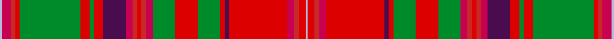

This page is one **sett** — a single exact thread-count. It belongs to the [tartan](/setts/lb1r4ri2rii2g27rii4g2rii4dp10r3ri2rii2ri2r3g10rii10g10rii2dp2rii26r3ri2rii3lb1/)
(the same proportion at any scale), whose colour order is pattern [WRRRGRGRBRRRRRGRGRBRRRRW](/stripes/wrrrgrgrbrrrrrgrgrbrrrrw/).

Part of the [MacDougall](/tartans/macdougall/) tartan — the named design grouping this sett with its other cloths.

Sourced from register-of-tartans.  It is a [24 stripe tartan](/stripes/stripes24/).

Original link https://www.tartanregister.gov.uk/tartanDetails.aspx?ref=2407

## Register references

External register numbers recorded for this tartan.

- Scottish Register of Tartans: [2407](https://www.tartanregister.gov.uk/tartanDetails.aspx?ref=2407)
- Scottish Tartans World Register: 567

## Thread count
LB/2 R8 Ri4 Rii4 G54 Rii8 G4 Rii8 DP20 R6 Ri4 Rii4 Ri4 R6 G20 Rii20 G20 Rii4 DP4 Rii52 R6 Ri4 Rii6 LB/2

One full sett is **544 threads**.

## Palette
<table><thead><tr><th>Colour</th><th>Shade</th><th>OKLCh</th></tr></thead><tbody><tr><td>B</td><td><code style="background-color:#B5BBDE;">#B5BBDE</code> <small style="color:#888">#B5BBDE</small></td><td><small style="color:#888">oklch(79.9% 0.050 277.6)</small></td></tr><tr><td>G</td><td><code style="background-color:#008B2A;">#008B2A</code> <small style="color:#888">#008B2A</small></td><td><small style="color:#888">oklch(55.4% 0.170 145.9)</small></td></tr><tr><td>P</td><td><code style="background-color:#4B0B4F;">#4B0B4F</code> <small style="color:#888">#4B0B4F</small></td><td><small style="color:#888">oklch(30.1% 0.125 325.4)</small></td></tr><tr><td>R</td><td><code style="background-color:#C80050;">#C80050</code> <small style="color:#888">#C80050</small></td><td><small style="color:#888">oklch(53.2% 0.213 9.9)</small></td></tr><tr><td>Ra</td><td><code style="background-color:#C82828;">#C82828</code> <small style="color:#888">#C82828</small></td><td><small style="color:#888">oklch(54.2% 0.196 26.8)</small></td></tr><tr><td>Rb</td><td><code style="background-color:#DC0000;">#DC0000</code> <small style="color:#888">#DC0000</small></td><td><small style="color:#888">oklch(56.2% 0.230 29.2)</small></td></tr></tbody></table>

# Sample pattern

## Nearest variants

The nearest existing variants by ΔTartan distance, with this cloth at the top so the swatches line up against it.

ΔTartan

Threads

Variant

Sett

—

544

<a href="/variants/s24/lb1r4ri2rii2g27rii4g2rii4dp10r3ri2rii2ri2r3g10rii10g10rii2dp2rii26r3ri2rii3lb1~x2~r2109013-ri2208029-rii2209032/">MacDougall (Wilson)</a>

<a href="/ttd/edit/#slug=lb1r5ri2rii3g24rii5g2rii5db11r3ri2rii2ri2r3g11rii11g11rii2db2rii25r3ri2rii5lb1~x2~r1707016-ri2208029-rii2209032&amp;base=lb1r4ri2rii2g27rii4g2rii4dp10r3ri2rii2ri2r3g10rii10g10rii2dp2rii26r3ri2rii3lb1~x2~r2109013-ri2208029-rii2209032" title="compare in the TTD">1.39</a>

568

<a href="/variants/s24/lb1r5ri2rii3g24rii5g2rii5db11r3ri2rii2ri2r3g11rii11g11rii2db2rii25r3ri2rii5lb1~x2~r1707016-ri2208029-rii2209032/">MacDougall #2</a>

## Neighbour map

Every grey dot is one of 13620 variants placed by the first two principal components of the ΔTartan feature space (42% of its variance). Red is this tartan; blue dots are its nearest — click one to open its page.

<svg viewBox="0 0 640 380" role="img" style="max-width:100%;height:auto;border:1px solid #e0e0e0;border-radius:4px;display:block" xmlns="http://www.w3.org/2000/svg"><image href="/nn/cloud.v1.png" width="640" height="380"/><a href="/variants/s24/lb1r5ri2rii3g24rii5g2rii5db11r3ri2rii2ri2r3g11rii11g11rii2db2rii25r3ri2rii5lb1~x2~r1707016-ri2208029-rii2209032/"><circle cx="220.9" cy="83.4" r="4" fill="#3465a4"><title>MacDougall #2</title></circle></a><circle cx="232.5" cy="75.4" r="5" fill="#c00000"/><text x="320" y="376" text-anchor="middle" font-size="11" fill="#999">ground</text><text x="11" y="190" text-anchor="middle" font-size="11" fill="#999" transform="rotate(-90 11 190)">complexity</text></svg>

ID: /variants/s24/lb1r4ri2rii2g27rii4g2rii4dp10r3ri2rii2ri2r3g10rii10g10rii2dp2rii26r3ri2rii3lb1~x2~r2109013-ri2208029-rii2209032/
