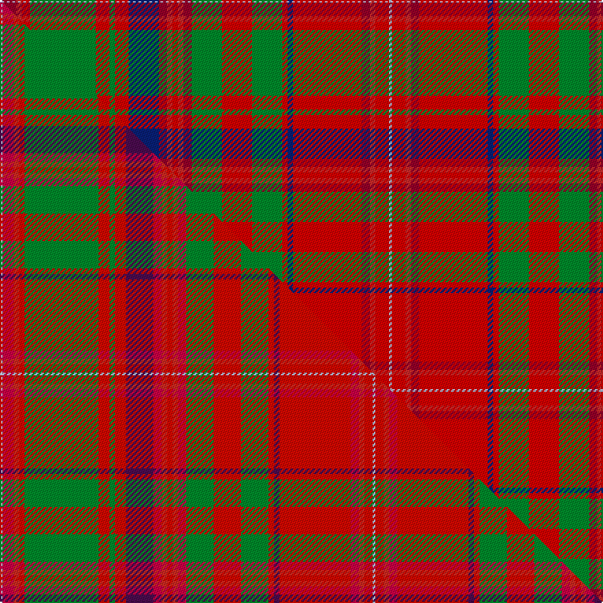

This is one **variant** — a specific cloth: this exact thread count and colourway, with its own
provenance below. It is one weaving of the [sett](/tartans/m/ma/macdougall-5/) (the scale-free proportion — the
same cloth at any scale or shade), whose colour order is pattern [WRRRGRGRBRRRRRGRGRBRRRRW](/stripes/wrrrgrgrbrrrrrgrgrbrrrrw/).

Part of the [MacDougall](/tartans/m/ma/macdougall-5/) tartan — the named design grouping this sett with its other cloths.

Sourced from register-of-tartans.  It is a [24 stripe tartan](/stripes/stripes24/).

Original link [https://www.tartanregister.gov.uk/tartanDetails.aspx?ref=2395](https://www.tartanregister.gov.uk/tartanDetails.aspx?ref=2395)

Dataset <small>— provenance for this record, inherited from the source manifest</small>

<dl class="dataset-prov">
<dt>source</dt><dd><a href="/sources/register-of-tartans/">Scottish Register of Tartans</a></dd>
<dt>data captured from</dt><dd><a href="https://github.com/thetartan/tartan-database/blob/master/data/register-of-tartans/data.csv">https://github.com/thetartan/tartan-database/blob/master/data/register-of-tartans/data.csv</a></dd>
<dt>data date</dt><dd>2017-01-06 <small>(dataset default)</small></dd>
<dt>licence</dt><dd><a href="https://www.tartanregister.gov.uk/copyright">Crown copyright</a></dd>
</dl>

Capture chain <small>— the hands this data passed through, oldest first; each capture carries its own licence</small>

<ol class="capture-chain">
<li><a href="https://www.tartanregister.gov.uk/">Scottish Register of Tartans</a> · <a href="https://www.tartanregister.gov.uk/copyright">Crown copyright</a> <small>the living register — still published by National Records of Scotland</small></li>
<li><a href="https://github.com/thetartan/tartan-database">thetartan/tartan-database</a> <small>2016-2017</small> · <a href="https://creativecommons.org/licenses/by-nc-nd/4.0/">CC BY-NC-ND 4.0</a> <small>Levko Kravets's frozen compilation — the capture we vendored, and where its CC licence text came from</small></li>
<li>this dictionary <small>captured 2026-06-10 · commit 5bf86c7566</small> <small>each re-capture is a git commit to data/sources</small></li>
</ol>

## Register references

External register numbers recorded for this tartan.

- Scottish Register of Tartans: [2395](https://www.tartanregister.gov.uk/tartanDetails.aspx?ref=2395)
- Scottish Tartans World Register: 569

## Thread count
LB/2 R10 Ri4 Rii6 G48 Rii10 G4 Rii10 DB22 R6 Ri4 Rii4 Ri4 R6 G22 Rii22 G22 Rii4 DB4 Rii50 R6 Ri4 Rii10 LB/2

One full sett is **568 threads**.

## Palette
<table><thead><tr><th>Colour</th><th>Shade</th><th>OKLCh</th></tr></thead><tbody><tr><td>LB</td><td><code style="background-color:#B5BBDE;">#B5BBDE</code> <small style="color:#888">#B5BBDE</small></td><td><small style="color:#888">oklch(79.9% 0.050 277.6)</small></td></tr><tr><td>DB</td><td><code style="background-color:#082077;">#082077</code> <small style="color:#888">#082077</small></td><td><small style="color:#888">oklch(30.0% 0.149 265.1)</small></td></tr><tr><td>R</td><td><code style="background-color:#960028;">#960028</code> <small style="color:#888">#960028</small></td><td><small style="color:#888">oklch(42.7% 0.171 18.3)</small></td></tr><tr><td>G</td><td><code style="background-color:#008B2A;">#008B2A</code> <small style="color:#888">#008B2A</small></td><td><small style="color:#888">oklch(55.4% 0.170 145.9)</small></td></tr><tr><td>R</td><td><code style="background-color:#DC0000;">#DC0000</code> <small style="color:#888">#DC0000</small></td><td><small style="color:#888">oklch(56.2% 0.230 29.2)</small></td></tr><tr><td>R</td><td><code style="background-color:#C82828;">#C82828</code> <small style="color:#888">#C82828</small></td><td><small style="color:#888">oklch(54.2% 0.196 26.8)</small></td></tr></tbody></table>

# Sample pattern

## Compared to the master

This cloth is one sett of its design; the master sett (the exemplar the design is anchored on) is below for comparison.

Its **ΔTartan distance** from the master is **1.39** — the same measure the nearest-tartans table ranks by (0 is identical; a re-scale of the same cloth is near 0, a recolour or a different proportion further).

<figure class="master-compare" style="margin:0">

this sett
master sett ★

<figcaption style="color:#888;font-size:smaller">One weave of this sett against the <a href="/setts/lb1r4ri2rii2g27rii4g2rii4dp10r3ri2rii2ri2r3g10rii10g10rii2dp2rii26r3ri2rii3lb1/">master sett ★</a>, split on the diagonal: a shared proportion runs seamlessly across it with only the shades shifting; a different proportion breaks on it.</figcaption>
</figure>

## Nearest tartan variants

The nearest existing variants by ΔTartan distance, with this cloth at the top so the swatches line up against it.

ΔTartan

Threads

Variant

Sett

—

568

<a href="/variants/s24/lb1r5ri2rii3g24rii5g2rii5db11r3ri2rii2ri2r3g11rii11g11rii2db2rii25r3ri2rii5lb1~x2~r1707016-ri2208029-rii2209032/">MacDougall #2</a>

<a href="/ttd/edit/#slug=lb1r5b2ri3g24ri5g2ri5db11r3b2ri2b2r3g11ri11g11ri2db2ri25r3b2ri5lb1~x2~r1707016-ri2008029&amp;base=lb1r5ri2rii3g24rii5g2rii5db11r3ri2rii2ri2r3g11rii11g11rii2db2rii25r3ri2rii5lb1~x2~r1707016-ri2208029-rii2209032" title="compare in the TTD">1.23</a>

568

<a href="/variants/s24/lb1r5b2ri3g24ri5g2ri5db11r3b2ri2b2r3g11ri11g11ri2db2ri25r3b2ri5lb1~x2~r1707016-ri2008029/">MacDougall 5</a>

<a href="/ttd/edit/#slug=y1o4ri2r2g27r4g2r4dp10o3ri2r2ri2o3g10r10g10r2dp2r26o3ri2r3y1~x2~o2307033-ri2806019-r2109032&amp;base=lb1r5ri2rii3g24rii5g2rii5db11r3ri2rii2ri2r3g11rii11g11rii2db2rii25r3ri2rii5lb1~x2~r1707016-ri2208029-rii2209032" title="compare in the TTD">1.37</a>

544

<a href="/variants/s24/y1ri4rii2r2g27r4g2r4dp10ri3rii2r2rii2ri3g10r10g10r2dp2r26ri3rii2r3y1~x2~ri2307033-rii2806019-r2109032/">MacDougall - 1819 (Clan)</a>

<a href="/ttd/edit/#slug=lb1r4ri2rii2g27rii4g2rii4dp10r3ri2rii2ri2r3g10rii10g10rii2dp2rii26r3ri2rii3lb1~x2~r2109013-ri2208029-rii2209032&amp;base=lb1r5ri2rii3g24rii5g2rii5db11r3ri2rii2ri2r3g11rii11g11rii2db2rii25r3ri2rii5lb1~x2~r1707016-ri2208029-rii2209032" title="compare in the TTD">1.39</a>

544

<a href="/variants/s24/lb1r4ri2rii2g27rii4g2rii4dp10r3ri2rii2ri2r3g10rii10g10rii2dp2rii26r3ri2rii3lb1~x2~r2109013-ri2208029-rii2209032/">MacDougall (Wilson)</a>

<a href="/ttd/edit/#slug=lb1b4dg2r2g27r4g2r4dp10b3dg2r2dg2b3g10r10g10r2dp2r26b3dg2r3lb1~x2&amp;base=lb1r5ri2rii3g24rii5g2rii5db11r3ri2rii2ri2r3g11rii11g11rii2db2rii25r3ri2rii5lb1~x2~r1707016-ri2208029-rii2209032" title="compare in the TTD">1.84</a>

544

<a href="/variants/s24/lb1b4dg2r2g27r4g2r4dp10b3dg2r2dg2b3g10r10g10r2dp2r26b3dg2r3lb1~x2/">MacDougal 1</a>

<a href="/ttd/edit/#slug=lb2dp10r3ri4g72ri7g4ri10db24dp6r5ri4r5dp7g24ri24g24ri3db3ri74dp7r5ri6lb2~x2~r2208029-ri2209032&amp;base=lb1r5ri2rii3g24rii5g2rii5db11r3ri2rii2ri2r3g11rii11g11rii2db2rii25r3ri2rii5lb1~x2~r1707016-ri2208029-rii2209032" title="compare in the TTD">2.19</a>

1332

<a href="/variants/s24/lb2dp10r3ri4g72ri7g4ri10db24dp6r5ri4r5dp7g24ri24g24ri3db3ri74dp7r5ri6lb2~x2~r2208029-ri2209032/">MacDougall of MacDougall</a>

<a href="/ttd/edit/#slug=y2ri5r3g54r5g3r5db20ri5r3ri5g16r2db4r48ri6r3w2~x2~ri2806019-r2109032-db1406275&amp;base=lb1r5ri2rii3g24rii5g2rii5db11r3ri2rii2ri2r3g11rii11g11rii2db2rii25r3ri2rii5lb1~x2~r1707016-ri2208029-rii2209032" title="compare in the TTD">2.50</a>

756

<a href="/variants/s18/y2ri5r3g54r5g3r5db20ri5r3ri5g16r2db4r48ri6r3w2~x2~ri2806019-r2109032-db1406275/">Sommerville</a>

<a href="/ttd/edit/#slug=y2ri5r3g54r5g3r5db21ri5r3ri5g17r2db4r48ri5r3w2~ri2406019-r2109032&amp;base=lb1r5ri2rii3g24rii5g2rii5db11r3ri2rii2ri2r3g11rii11g11rii2db2rii25r3ri2rii5lb1~x2~r1707016-ri2208029-rii2209032" title="compare in the TTD">2.57</a>

380

<a href="/variants/s18/y2ri5r3g54r5g3r5db21ri5r3ri5g17r2db4r48ri5r3w2~ri2406019-r2109032/">Sommerville Family Tartan</a>

<a href="/ttd/edit/#slug=y2ri5r3g54r5g3r5db20ri5r3ri5g16r2db4r48ri6r3w2~x2~ri2806019-r2109032&amp;base=lb1r5ri2rii3g24rii5g2rii5db11r3ri2rii2ri2r3g11rii11g11rii2db2rii25r3ri2rii5lb1~x2~r1707016-ri2208029-rii2209032" title="compare in the TTD">2.66</a>

756

<a href="/variants/s18/y2ri5r3g54r5g3r5db20ri5r3ri5g16r2db4r48ri6r3w2~x2~ri2806019-r2109032/">Somerville (Name)</a>

<a href="/ttd/edit/#slug=lb2dp10b3r4g72r7g4r10db24dp6b5r4b5dp7g24r24g24r3db3r74dp7b5r6lb2~x2&amp;base=lb1r5ri2rii3g24rii5g2rii5db11r3ri2rii2ri2r3g11rii11g11rii2db2rii25r3ri2rii5lb1~x2~r1707016-ri2208029-rii2209032" title="compare in the TTD">2.70</a>

1332

<a href="/variants/s24/lb2dp10b3r4g72r7g4r10db24dp6b5r4b5dp7g24r24g24r3db3r74dp7b5r6lb2~x2/">MacDougall, of MacDougall</a>

<a href="/ttd/edit/#slug=ri39r3w2g14w2y4ri4r2ri4y4w2lb12r6ri6y7w2~x2~ri2008029-r1506028&amp;base=lb1r5ri2rii3g24rii5g2rii5db11r3ri2rii2ri2r3g11rii11g11rii2db2rii25r3ri2rii5lb1~x2~r1707016-ri2208029-rii2209032" title="compare in the TTD">2.71</a>

370

<a href="/variants/s16/ri39r3w2g14w2y4ri4r2ri4y4w2lb12r6ri6y7w2~x2~ri2008029-r1506028/">North West, Mounted Police</a>

## Neighbour map

Every grey dot is one of 13657 variants placed by the first two principal components of the ΔTartan feature space (42% of its variance). Red is this tartan; blue dots are its nearest — click one to open its page. The map is a flat projection of a many-dimensional space — [how to read it](/posts/neighbourhood-maps/).

<svg viewBox="0 0 640 380" role="img" style="max-width:100%;height:auto;border:1px solid #e0e0e0;border-radius:4px;display:block" xmlns="http://www.w3.org/2000/svg"><image href="/nn/cloud.v1.png" width="640" height="380"/><a href="/variants/s24/lb1r5b2ri3g24ri5g2ri5db11r3b2ri2b2r3g11ri11g11ri2db2ri25r3b2ri5lb1~x2~r1707016-ri2008029/"><circle cx="222.9" cy="86.3" r="4" fill="#3465a4"><title>MacDougall 5</title></circle></a><a href="/variants/s24/y1ri4rii2r2g27r4g2r4dp10ri3rii2r2rii2ri3g10r10g10r2dp2r26ri3rii2r3y1~x2~ri2307033-rii2806019-r2109032/"><circle cx="240.3" cy="79.5" r="4" fill="#3465a4"><title>MacDougall - 1819 (Clan)</title></circle></a><a href="/variants/s24/lb1r4ri2rii2g27rii4g2rii4dp10r3ri2rii2ri2r3g10rii10g10rii2dp2rii26r3ri2rii3lb1~x2~r2109013-ri2208029-rii2209032/"><circle cx="232.7" cy="75.4" r="4" fill="#3465a4"><title>MacDougall (Wilson)</title></circle></a><a href="/variants/s24/lb1b4dg2r2g27r4g2r4dp10b3dg2r2dg2b3g10r10g10r2dp2r26b3dg2r3lb1~x2/"><circle cx="217.3" cy="75.0" r="4" fill="#3465a4"><title>MacDougal 1</title></circle></a><a href="/variants/s24/lb2dp10r3ri4g72ri7g4ri10db24dp6r5ri4r5dp7g24ri24g24ri3db3ri74dp7r5ri6lb2~x2~r2208029-ri2209032/"><circle cx="235.3" cy="49.6" r="4" fill="#3465a4"><title>MacDougall of MacDougall</title></circle></a><a href="/variants/s18/y2ri5r3g54r5g3r5db20ri5r3ri5g16r2db4r48ri6r3w2~x2~ri2806019-r2109032-db1406275/"><circle cx="235.7" cy="74.8" r="4" fill="#3465a4"><title>Sommerville</title></circle></a><a href="/variants/s18/y2ri5r3g54r5g3r5db21ri5r3ri5g17r2db4r48ri5r3w2~ri2406019-r2109032/"><circle cx="234.3" cy="74.1" r="4" fill="#3465a4"><title>Sommerville Family Tartan</title></circle></a><a href="/variants/s18/y2ri5r3g54r5g3r5db20ri5r3ri5g16r2db4r48ri6r3w2~x2~ri2806019-r2109032/"><circle cx="227.8" cy="72.5" r="4" fill="#3465a4"><title>Somerville (Name)</title></circle></a><a href="/variants/s24/lb2dp10b3r4g72r7g4r10db24dp6b5r4b5dp7g24r24g24r3db3r74dp7b5r6lb2~x2/"><circle cx="235.2" cy="51.8" r="4" fill="#3465a4"><title>MacDougall, of MacDougall</title></circle></a><a href="/variants/s16/ri39r3w2g14w2y4ri4r2ri4y4w2lb12r6ri6y7w2~x2~ri2008029-r1506028/"><circle cx="244.5" cy="93.4" r="4" fill="#3465a4"><title>North West, Mounted Police</title></circle></a><circle cx="221.2" cy="83.3" r="5" fill="#c00000"/><text x="320" y="376" text-anchor="middle" font-size="11" fill="#999">ground</text><text x="11" y="190" text-anchor="middle" font-size="11" fill="#999" transform="rotate(-90 11 190)">complexity</text></svg>

ID: /variants/s24/lb1r5ri2rii3g24rii5g2rii5db11r3ri2rii2ri2r3g11rii11g11rii2db2rii25r3ri2rii5lb1~x2~r1707016-ri2208029-rii2209032/
