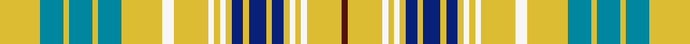

This is one **variant** — a specific cloth: this exact thread count and colourway, with its own
provenance below. It is one weaving of the [sett](/setts/ly7t4ly1t4ly1t4ly7w2ly6w1ly1w1ly1db2ly1db3ly1db2ly1w1ly1w1ly6dr1/) (the scale-free proportion — the
same cloth at any scale or shade), whose colour order is pattern [BYWYWYBYBYBYWYWYWYBYBYBY](/stripes/bywywybybybywywywybybyby/).

Part of the [Ottawa](/tartans/o/ot/ottawa/) tartan — the named design grouping this sett with its other cloths.

Sourced from tartans-authority.  It is a [24 stripe tartan](/stripes/stripes24/).

Original link [https://www.tartanregister.gov.uk/tartanDetails.aspx?ref=2021](https://www.tartanregister.gov.uk/tartanDetails.aspx?ref=2021)

2 attestations — the source records this cloth was collapsed from (oldest owns this page)

<ul>
<li>1966 — Ottawa (District) (tartans-authority, <a href="https://www.tartanregister.gov.uk/tartanDetails.aspx?ref=2021">record</a>)  <em>Asymmetric. An unusual assymetric sett commissioned by the Centennial Committee of the City of Ottawa in 1966. Jean Docton was an award-winning textile designer and weaver. STS has this as a symetrical tartan and its notes say: In two blocks - Navy Block ends on 14th colour change Gold 24. Azure Block starts on the following White 8. The design was accepted as the Official Tartan of Ottawa by order of the Council on November 21st 1966. In 1985 it was no longer in commercial production. D C Stewart's NOMINDEX says designer's name was Doctor rather than Docton. Colour explanation from John Forsyth of Vancouver island (July 2008). Azure/sky blue for the three rivers of the area, the Ottawa, Gatuneau and Rideau. Navy blue for the Outaouais First Nation from which Ottawa takes its name, white for the white pines at the junction of the three rivers. Red is for the capital of Canada and gold is for the great golden elm of old Bytown abd for the Royal Assent making Ottawa the capitalof Canada.</em></li>
<li>21/11/1967 — Ottawa (register-of-tartans, <a href="https://www.tartanregister.gov.uk/tartanDetails.aspx?ref=3277">record</a>)  <em>An unusual assymetric sett commissioned by the Centennial Committee of the City of Ottowa in 1966. Jean Docton was an award-winning textile designer and weaver. Scottish Tartans Society has this as a symetrical tartan and its notes say: In two blocks - Navy Block ends on 14th colour change Gold 24. Azure Block starts on the following White 8. The design was accepted as the Official Tartan of Ottawa by order of the Council on November 21st 1966. In 1985 it was no longer in commercial production. D.C. Stewart's NOMINDEX says designer's name was Doctor rather than Docton.</em></li>
</ul>

Dataset <small>— provenance for this record, inherited from the source manifest</small>

<dl class="dataset-prov">
<dt>source</dt><dd><a href="/sources/tartans-authority/">Scottish Tartans Authority</a></dd>
<dt>data captured from</dt><dd><a href="https://github.com/thetartan/tartan-database/blob/master/data/tartans-authority/data.csv">https://github.com/thetartan/tartan-database/blob/master/data/tartans-authority/data.csv</a></dd>
<dt>data date</dt><dd>1966 <small>(this record)</small></dd>
<dt>licence</dt><dd><a href="https://creativecommons.org/licenses/by-nc-nd/4.0/">CC BY-NC-ND 4.0</a></dd>
</dl>

Capture chain <small>— the hands this data passed through, oldest first; each capture carries its own licence</small>

<ol class="capture-chain">
<li><a href="https://www.tartansauthority.com/">Scottish Tartans Authority</a> <small>the heritage body's archive — its tartan-ferret record browser is retired (links repaired to the SRT, above)</small></li>
<li><a href="https://github.com/thetartan/tartan-database">thetartan/tartan-database</a> <small>2016-2017</small> · <a href="https://creativecommons.org/licenses/by-nc-nd/4.0/">CC BY-NC-ND 4.0</a> <small>Levko Kravets's frozen compilation — the capture we vendored, and where its CC licence text came from</small></li>
<li>this dictionary <small>captured 2026-06-10 · commit 5bf86c7566</small> <small>each re-capture is a git commit to data/sources</small></li>
</ol>

## Register references

External register numbers recorded for this tartan.

- Scottish Register of Tartans: [3277](https://www.tartanregister.gov.uk/tartanDetails.aspx?ref=3277)
- Scottish Tartans Authority (ITI): 2021
- Scottish Tartans World Register: 2021

## Thread count
LY/28 T16 LY4 T16 LY4 T16 LY28 W8 LY24 W4 LY4 W4 LY4 DB8 LY4 DB12 LY4 DB8 LY4 W4 LY4 W4 LY24 DR/4

One full sett is **448 threads**.

## Palette
<table><thead><tr><th>Colour</th><th>Shade</th><th>OKLCh</th></tr></thead><tbody><tr><td>T</td><td><code style="background-color:#00879F;">#00879F</code> <small style="color:#888">#00879F</small></td><td><small style="color:#888">oklch(57.4% 0.102 216.1)</small></td></tr><tr><td>DB</td><td><code style="background-color:#082077;">#082077</code> <small style="color:#888">#082077</small></td><td><small style="color:#888">oklch(30.0% 0.149 265.1)</small></td></tr><tr><td>DR</td><td><code style="background-color:#55120C;">#55120C</code> <small style="color:#888">#55120C</small></td><td><small style="color:#888">oklch(30.0% 0.099 29.3)</small></td></tr><tr><td>LY</td><td><code style="background-color:#DCBC32;">#DCBC32</code> <small style="color:#888">#DCBC32</small></td><td><small style="color:#888">oklch(80.0% 0.150 95.2)</small></td></tr><tr><td>W</td><td><code style="background-color:#F7F7F7;">#F7F7F7</code> <small style="color:#888">#F7F7F7</small></td><td><small style="color:#888">oklch(97.6% 0.000 89.9)</small></td></tr></tbody></table>

# Sample pattern

## Nearest tartan variants

The nearest existing variants by ΔTartan distance, with this cloth at the top so the swatches line up against it.

ΔTartan

Threads

Variant

Sett

—

448

<a href="/variants/s24/ly7t4ly1t4ly1t4ly7w2ly6w1ly1w1ly1db2ly1db3ly1db2ly1w1ly1w1ly6dr1~x4/">Ottawa (District)</a>

<a href="/ttd/edit/#slug=y7lb4y1lb4y1lb4y7w2y6w1y1w1y1db2y1db3y1db2y1w1y1w1y6r1~x4&amp;base=ly7t4ly1t4ly1t4ly7w2ly6w1ly1w1ly1db2ly1db3ly1db2ly1w1ly1w1ly6dr1~x4" title="compare in the TTD">0.21</a>

448

<a href="/variants/s24/y7lb4y1lb4y1lb4y7w2y6w1y1w1y1db2y1db3y1db2y1w1y1w1y6r1~x4/">Ottawa</a>

## Neighbour map

Every grey dot is one of 13621 variants placed by the first two principal components of the ΔTartan feature space (42% of its variance). Red is this tartan; blue dots are its nearest — click one to open its page. The map is a flat projection of a many-dimensional space — [how to read it](/posts/neighbourhood-maps/).

<svg viewBox="0 0 640 380" role="img" style="max-width:100%;height:auto;border:1px solid #e0e0e0;border-radius:4px;display:block" xmlns="http://www.w3.org/2000/svg"><image href="/nn/cloud.v1.png" width="640" height="380"/><a href="/variants/s24/y7lb4y1lb4y1lb4y7w2y6w1y1w1y1db2y1db3y1db2y1w1y1w1y6r1~x4/"><circle cx="242.4" cy="162.9" r="4" fill="#3465a4"><title>Ottawa</title></circle></a><circle cx="274.2" cy="193.0" r="5" fill="#c00000"/><text x="320" y="376" text-anchor="middle" font-size="11" fill="#999">ground</text><text x="11" y="190" text-anchor="middle" font-size="11" fill="#999" transform="rotate(-90 11 190)">complexity</text></svg>

ID: /variants/s24/ly7t4ly1t4ly1t4ly7w2ly6w1ly1w1ly1db2ly1db3ly1db2ly1w1ly1w1ly6dr1~x4/
