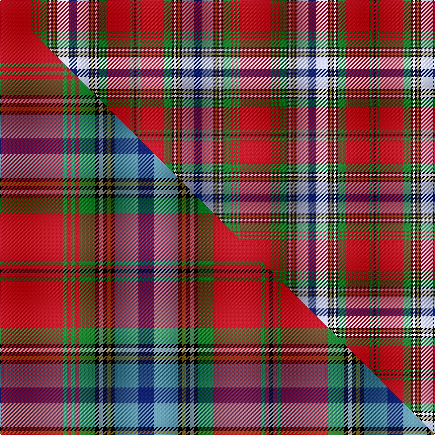

This is one **variant** — a specific cloth: this exact thread count and colourway, with its own
provenance below. It is one weaving of the [sett](/setts/r16g1r1g1r1g4k1w1k1y1k1lb6db4lb6k1y1k1w1k1g4r12g1r1k1/) (the scale-free proportion — the
same cloth at any scale or shade), whose colour order is pattern [KRGRGKWKGKWBWKGKWKGRGRGR](/stripes/krgrgkwkgkwbwkgkwkgrgrgr/).

Part of the [MacAn of Lurgyvallan](/tartans/m/ma/macan-of-lurgyvallan/) tartan — the named design grouping this sett with its other cloths.

Sourced from house-of-tartan.  It is a [24 stripe tartan](/stripes/stripes24/).

Original link [http://www.house-of-tartan.scotland.net/house/TartanViewjs.asp?colr=Def&tnam=1155](http://www.house-of-tartan.scotland.net/house/TartanViewjs.asp?colr=Def&tnam=1155)

## Provenance

Earliest known date: 1831 The portrait of 'Captain Macan of Lurgyvallan painted and presented to him by his sincere friend William MacKenzie, 24th Oct. 1831' was recently sold at auction in London. The watercolour measured 10 by 7 inches. The chief (three eagles feathers) is wearing full Highland Dress. The tartan is a sort of MacLean of Duart, in the red Stewart group, but showing the MacLean inversion. No such person or clan or tartan or chief ever existed.

2 attestations — the source records this cloth was collapsed from (oldest owns this page)

<ul>
<li>1831 — Macan of Lurgyvallan Portrait Tartan (house-of-tartan, <a href="http://www.house-of-tartan.scotland.net/house/TartanViewjs.asp?colr=Def&tnam=1155">record</a>) </li>
<li>undated — Macan, of Lurgyvallan (weddslist, <a href="http://www.weddslist.com/cgi-bin/tartans/pg.pl?source=sts">record</a>) </li>
</ul>

Dataset <small>— provenance for this record, inherited from the source manifest</small>

<dl class="dataset-prov">
<dt>source</dt><dd><a href="/sources/house-of-tartan/">House of Tartan</a></dd>
<dt>data captured from</dt><dd><a href="https://github.com/thetartan/tartan-database/blob/master/data/house-of-tartan/data.csv">https://github.com/thetartan/tartan-database/blob/master/data/house-of-tartan/data.csv</a></dd>
<dt>data date</dt><dd>1831 <small>(this record)</small></dd>
<dt>licence</dt><dd><a href="https://creativecommons.org/licenses/by-nc-nd/4.0/">CC BY-NC-ND 4.0</a></dd>
</dl>

Capture chain <small>— the hands this data passed through, oldest first; each capture carries its own licence</small>

<ol class="capture-chain">
<li><a href="http://www.house-of-tartan.scotland.net/">House of Tartan</a> <small>the weaver/retailer's database — the site is now offline; the URL is kept as the ultimate source's identity</small></li>
<li><a href="https://github.com/thetartan/tartan-database">thetartan/tartan-database</a> <small>2016-2017</small> · <a href="https://creativecommons.org/licenses/by-nc-nd/4.0/">CC BY-NC-ND 4.0</a> <small>Levko Kravets's frozen compilation — the capture we vendored, and where its CC licence text came from</small></li>
<li>this dictionary <small>captured 2026-06-10 · commit 5bf86c7566</small> <small>each re-capture is a git commit to data/sources</small></li>
</ol>

## Thread count
R/32 G2 R2 G2 R2 G8 K2 W2 K2 Y2 K2 LB12 DB8 LB12 K2 Y2 K2 W2 K2 G8 R24 G2 R2 K/2

One full sett is **242 threads**.

## Palette
<table><thead><tr><th>Colour</th><th>Shade</th><th>OKLCh</th></tr></thead><tbody><tr><td>LB</td><td><code style="background-color:#B5BBDE;">#B5BBDE</code> <small style="color:#888">#B5BBDE</small></td><td><small style="color:#888">oklch(79.9% 0.050 277.6)</small></td></tr><tr><td>DB</td><td><code style="background-color:#082077;">#082077</code> <small style="color:#888">#082077</small></td><td><small style="color:#888">oklch(30.0% 0.149 265.1)</small></td></tr><tr><td>G</td><td><code style="background-color:#008B2A;">#008B2A</code> <small style="color:#888">#008B2A</small></td><td><small style="color:#888">oklch(55.4% 0.170 145.9)</small></td></tr><tr><td>K</td><td><code style="background-color:#000000;">#000000</code> <small style="color:#888">#000000</small></td><td><small style="color:#888">oklch(0.0% 0.000 0.0)</small></td></tr><tr><td>W</td><td><code style="background-color:#F7F7F7;">#F7F7F7</code> <small style="color:#888">#F7F7F7</small></td><td><small style="color:#888">oklch(97.6% 0.000 89.9)</small></td></tr><tr><td>R</td><td><code style="background-color:#D60020;">#D60020</code> <small style="color:#888">#D60020</small></td><td><small style="color:#888">oklch(55.2% 0.224 25.5)</small></td></tr><tr><td>Y</td><td><code style="background-color:#8B6E00;">#8B6E00</code> <small style="color:#888">#8B6E00</small></td><td><small style="color:#888">oklch(55.1% 0.113 90.4)</small></td></tr></tbody></table>

# Sample pattern

## Compared to the master

This cloth is one sett of its design; the master sett (the exemplar the design is anchored on) is below for comparison.

Its **ΔTartan distance** from the master is **0.08** — the same measure the nearest-tartans table ranks by (0 is identical; a re-scale of the same cloth is near 0, a recolour or a different proportion further).

<figure class="master-compare" style="margin:0">

this sett
master sett ★

<figcaption style="color:#888;font-size:smaller">One weave of this sett against the <a href="/setts/r16g1r1g1r1g4k1lb1k1y1k1t6db4t6k1y1k1lb1k1g4r12g1r1k1/">master sett ★</a>, split on the diagonal: a shared proportion runs seamlessly across it with only the shades shifting; a different proportion breaks on it.</figcaption>
</figure>

## Nearest tartan variants

The nearest existing variants by ΔTartan distance, with this cloth at the top so the swatches line up against it.

ΔTartan

Threads

Variant

Sett

—

242

<a href="/variants/s24/r16g1r1g1r1g4k1w1k1y1k1lb6db4lb6k1y1k1w1k1g4r12g1r1k1~x2/">Macan of Lurgyvallan Portrait Tartan</a>

<a href="/ttd/edit/#slug=r16g1r1g1r1g4k1lr1k1y1k1t6db4t6k1y1k1lr1k1g4r12g1r1k1~x4~lr3200000-t2503227&amp;base=r16g1r1g1r1g4k1w1k1y1k1lb6db4lb6k1y1k1w1k1g4r12g1r1k1~x2" title="compare in the TTD">0.08</a>

484

<a href="/variants/s24/r16g1r1g1r1g4k1lb1k1y1k1t6db4t6k1y1k1lb1k1g4r12g1r1k1~x4~lb3200000-t2503227/">Macan of Lurgyvallan</a>

<a href="/ttd/edit/#slug=r24k1w1dg6w1y2r2k1r2y2w1lb6k2r3y3w1~x2&amp;base=r16g1r1g1r1g4k1w1k1y1k1lb6db4lb6k1y1k1w1k1g4r12g1r1k1~x2" title="compare in the TTD">2.63</a>

182

<a href="/variants/s16/r24k1w1dg6w1y2r2k1r2y2w1lb6k2r3y3w1~x2/">Hong Kong Police Pipe Band</a>

<a href="/ttd/edit/#slug=t3k2lr20dr2lr3dr2lr3dr4lo3dr2db4dr2k2g6k3dr2lr3~x2&amp;base=r16g1r1g1r1g4k1w1k1y1k1lb6db4lb6k1y1k1w1k1g4r12g1r1k1~x2" title="compare in the TTD">2.65</a>

252

<a href="/variants/s17/t3k2lr20dr2lr3dr2lr3dr4lo3dr2db4dr2k2g6k3dr2lr3~x2/">Innes Dress, Red (Dance)</a>

<a href="/ttd/edit/#slug=r4o2w2o23w2o2r4o2w2o2w12db6y2k4n2w2~x2&amp;base=r16g1r1g1r1g4k1w1k1y1k1lb6db4lb6k1y1k1w1k1g4r12g1r1k1~x2" title="compare in the TTD">2.70</a>

280

<a href="/variants/s16/r4o2w2o23w2o2r4o2w2o2w12db6y2k4n2w2~x2/">Palmer, General W.J.</a>

<a href="/ttd/edit/#slug=k3r1y1k2r16dp2r1y1r2db15r1k15w1g15r2y1r1g2r16k2y1r1k3~x2&amp;base=r16g1r1g1r1g4k1w1k1y1k1lb6db4lb6k1y1k1w1k1g4r12g1r1k1~x2" title="compare in the TTD">2.75</a>

408

<a href="/variants/s23/k3r1y1k2r16dp2r1y1r2db15r1k15w1g15r2y1r1g2r16k2y1r1k3~x2/">Hay, or Leith</a>

<a href="/ttd/edit/#slug=w2k1ri3db3ri3r3ri19r3ri3db3ri3db29ly3g29ri3db3ri3r3ri19r3ri3db3ri3k1w2~x4~ri2108029-r1807016&amp;base=r16g1r1g1r1g4k1w1k1y1k1lb6db4lb6k1y1k1w1k1g4r12g1r1k1~x2" title="compare in the TTD">2.84</a>

1208

<a href="/variants/s25/w2k1ri3db3ri3r3ri19r3ri3db3ri3db29ly3g29ri3db3ri3r3ri19r3ri3db3ri3k1w2~x4~ri2108029-r1807016/">Fitzgerald Dress</a>

<a href="/ttd/edit/#slug=r8k3n15k1w3k1n8k1w3k1r19k2ly2k2g2k2r2k2~x2&amp;base=r16g1r1g1r1g4k1w1k1y1k1lb6db4lb6k1y1k1w1k1g4r12g1r1k1~x2" title="compare in the TTD">2.88</a>

288

<a href="/variants/s18/r8k3n15k1w3k1n8k1w3k1r19k2ly2k2g2k2r2k2~x2/">Canadian Dental Association (Corp.)</a>

<a href="/ttd/edit/#slug=r24w1db2lb1w1lb1db2w1k1g6k1w1r2dr2g1dr2r2w1g3~x2~r1908029&amp;base=r16g1r1g1r1g4k1w1k1y1k1lb6db4lb6k1y1k1w1k1g4r12g1r1k1~x2" title="compare in the TTD">2.93</a>

166

<a href="/variants/s19/r24w1db2lb1w1lb1db2w1k1g6k1w1r2dr2g1dr2r2w1g3~x2~r1908029/">MacBean</a>

<a href="/ttd/edit/#slug=r24w1db2lb1w1lb1db2w1k1g6k1w1r2dr2g1dr2r2w1g3~r1908029&amp;base=r16g1r1g1r1g4k1w1k1y1k1lb6db4lb6k1y1k1w1k1g4r12g1r1k1~x2" title="compare in the TTD">2.93</a>

83

<a href="/variants/s19/r24w1db2lb1w1lb1db2w1k1g6k1w1r2dr2g1dr2r2w1g3~r1908029/">MacBean</a>

<a href="/ttd/edit/#slug=r8k3lb15k1w3k1lb8k1w3k1r19k2y2k2g2k2r2k2~x2&amp;base=r16g1r1g1r1g4k1w1k1y1k1lb6db4lb6k1y1k1w1k1g4r12g1r1k1~x2" title="compare in the TTD">2.94</a>

288

<a href="/variants/s18/r8k3lb15k1w3k1lb8k1w3k1r19k2y2k2g2k2r2k2~x2/">Canadian Dental Association</a>

## Neighbour map

Every grey dot is one of 13621 variants placed by the first two principal components of the ΔTartan feature space (42% of its variance). Red is this tartan; blue dots are its nearest — click one to open its page. The map is a flat projection of a many-dimensional space — [how to read it](/posts/neighbourhood-maps/).

<svg viewBox="0 0 640 380" role="img" style="max-width:100%;height:auto;border:1px solid #e0e0e0;border-radius:4px;display:block" xmlns="http://www.w3.org/2000/svg"><image href="/nn/cloud.v1.png" width="640" height="380"/><a href="/variants/s24/r16g1r1g1r1g4k1lb1k1y1k1t6db4t6k1y1k1lb1k1g4r12g1r1k1~x4~lb3200000-t2503227/"><circle cx="150.5" cy="46.2" r="4" fill="#3465a4"><title>Macan of Lurgyvallan</title></circle></a><a href="/variants/s16/r24k1w1dg6w1y2r2k1r2y2w1lb6k2r3y3w1~x2/"><circle cx="148.0" cy="27.3" r="4" fill="#3465a4"><title>Hong Kong Police Pipe Band</title></circle></a><a href="/variants/s17/t3k2lr20dr2lr3dr2lr3dr4lo3dr2db4dr2k2g6k3dr2lr3~x2/"><circle cx="107.6" cy="87.2" r="4" fill="#3465a4"><title>Innes Dress, Red (Dance)</title></circle></a><a href="/variants/s16/r4o2w2o23w2o2r4o2w2o2w12db6y2k4n2w2~x2/"><circle cx="126.9" cy="82.3" r="4" fill="#3465a4"><title>Palmer, General W.J.</title></circle></a><a href="/variants/s23/k3r1y1k2r16dp2r1y1r2db15r1k15w1g15r2y1r1g2r16k2y1r1k3~x2/"><circle cx="104.7" cy="42.6" r="4" fill="#3465a4"><title>Hay, or Leith</title></circle></a><a href="/variants/s25/w2k1ri3db3ri3r3ri19r3ri3db3ri3db29ly3g29ri3db3ri3r3ri19r3ri3db3ri3k1w2~x4~ri2108029-r1807016/"><circle cx="168.0" cy="27.0" r="4" fill="#3465a4"><title>Fitzgerald Dress</title></circle></a><a href="/variants/s18/r8k3n15k1w3k1n8k1w3k1r19k2ly2k2g2k2r2k2~x2/"><circle cx="133.8" cy="66.9" r="4" fill="#3465a4"><title>Canadian Dental Association (Corp.)</title></circle></a><a href="/variants/s19/r24w1db2lb1w1lb1db2w1k1g6k1w1r2dr2g1dr2r2w1g3~x2~r1908029/"><circle cx="218.3" cy="18.8" r="4" fill="#3465a4"><title>MacBean</title></circle></a><a href="/variants/s19/r24w1db2lb1w1lb1db2w1k1g6k1w1r2dr2g1dr2r2w1g3~r1908029/"><circle cx="218.3" cy="18.8" r="4" fill="#3465a4"><title>MacBean</title></circle></a><a href="/variants/s18/r8k3lb15k1w3k1lb8k1w3k1r19k2y2k2g2k2r2k2~x2/"><circle cx="123.3" cy="64.1" r="4" fill="#3465a4"><title>Canadian Dental Association</title></circle></a><circle cx="137.9" cy="41.4" r="5" fill="#c00000"/><text x="320" y="376" text-anchor="middle" font-size="11" fill="#999">ground</text><text x="11" y="190" text-anchor="middle" font-size="11" fill="#999" transform="rotate(-90 11 190)">complexity</text></svg>

ID: /variants/s24/r16g1r1g1r1g4k1w1k1y1k1lb6db4lb6k1y1k1w1k1g4r12g1r1k1~x2/
