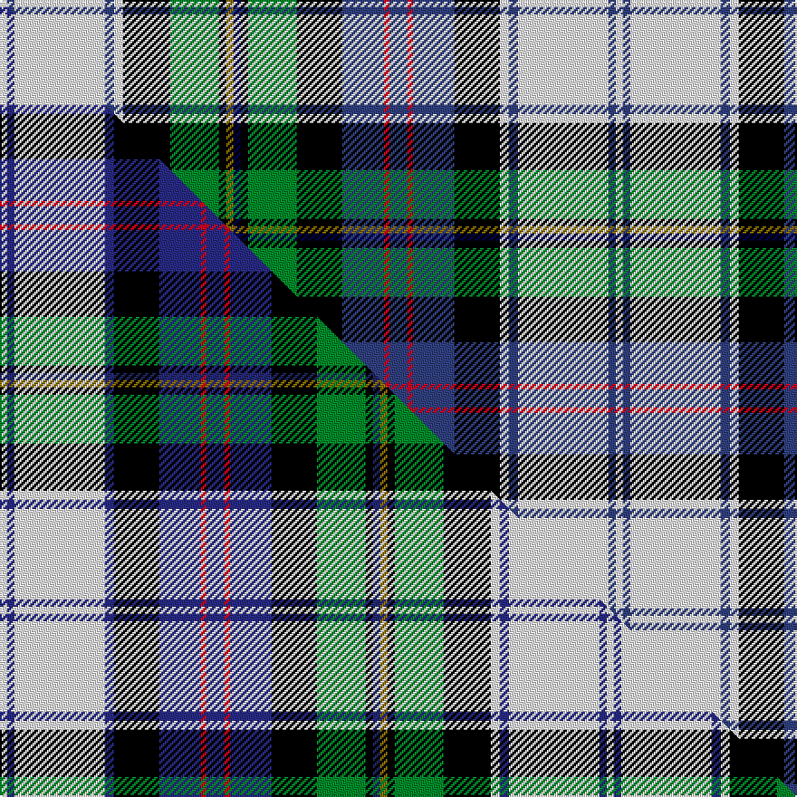

This page is one **sett** — a single exact thread-count. It belongs to the [tartan](/setts/w4dbi4w50dbi5w5k26g27k4y4db4k4g27k25dbi23r3dbi10r3dbi23k25w5dbi5w50dbi4w4/)
(the same proportion at any scale), whose colour order is pattern [WBWBWKBRBRBKGKBGKGKWBWBW](/stripes/wbwbwkbrbrbkgkbgkgkwbwbw/).

Part of the [Malcolm, Dress](/tartans/malcolm-dress-2/) tartan — the named design grouping this sett with its other cloths.

Sourced from weddslist.  It is a [24 stripe tartan](/stripes/stripes24/).

Original link http://www.weddslist.com/cgi-bin/tartans/pg.pl?source=sts

## Thread count
W/4 DBi4 W50 DBi5 W5 K26 G27 K4 Y4 DB4 K4 G27 K25 DBi23 R3 DBi10 R3 DBi23 K25 W5 DBi5 W50 DBi4 W/4

One full sett is **680 threads**.

## Palette
<table><thead><tr><th>Colour</th><th>Shade</th><th>OKLCh</th></tr></thead><tbody><tr><td>DB</td><td><code style="background-color:#304080;">#304080</code> <small style="color:#888">#304080</small></td><td><small style="color:#888">oklch(39.4% 0.109 270.2)</small></td></tr><tr><td>DB</td><td><code style="background-color:#000050;">#000050</code> <small style="color:#888">#000050</small></td><td><small style="color:#888">oklch(19.5% 0.135 264.1)</small></td></tr><tr><td>G</td><td><code style="background-color:#008B2A;">#008B2A</code> <small style="color:#888">#008B2A</small></td><td><small style="color:#888">oklch(55.4% 0.170 145.9)</small></td></tr><tr><td>K</td><td><code style="background-color:#000000;">#000000</code> <small style="color:#888">#000000</small></td><td><small style="color:#888">oklch(0.0% 0.000 0.0)</small></td></tr><tr><td>W</td><td><code style="background-color:#F7F7F7;">#F7F7F7</code> <small style="color:#888">#F7F7F7</small></td><td><small style="color:#888">oklch(97.6% 0.000 89.9)</small></td></tr><tr><td>R</td><td><code style="background-color:#D60020;">#D60020</code> <small style="color:#888">#D60020</small></td><td><small style="color:#888">oklch(55.2% 0.224 25.5)</small></td></tr><tr><td>Y</td><td><code style="background-color:#8B6E00;">#8B6E00</code> <small style="color:#888">#8B6E00</small></td><td><small style="color:#888">oklch(55.1% 0.113 90.4)</small></td></tr></tbody></table>

# Sample pattern

## Compared to the master

This cloth is one sett of its design; the master sett (the exemplar the design is anchored on) is below for comparison.

Its **ΔTartan distance** from the master is **1.02** — the same measure the nearest-tartans table ranks by (0 is identical; a re-scale of the same cloth is near 0, a recolour or a different proportion further).

<figure class="master-compare" style="margin:0">

this sett
master sett ★

<figcaption style="color:#888;font-size:smaller">One weave of this sett against the <a href="/setts/w4dbi4w50dbi5k25dbi23r3dbi10r3dbi23k25g27k4db4y4k4g27k26w5dbi5w50dbi4w4/">master sett ★</a>, split on the diagonal: a shared proportion runs seamlessly across it with only the shades shifting; a different proportion breaks on it.</figcaption>
</figure>

## Nearest tartan variants

The nearest existing variants by ΔTartan distance, with this cloth at the top so the swatches line up against it.

ΔTartan

Threads

Variant

Sett

—

680

<a href="/variants/s24/w4dbi4w50dbi5w5k26g27k4y4db4k4g27k25dbi23r3dbi10r3dbi23k25w5dbi5w50dbi4w4~dbi1604274-db0805267/">Malcolm, dress</a>

<a href="/ttd/edit/#slug=w4db4w50db5w5k26g27k4y4dt4k4g27k25db23r3db10r3db23k25w5db5w50db4w4~db1406275-dt1204274&amp;base=w4dbi4w50dbi5w5k26g27k4y4db4k4g27k25dbi23r3dbi10r3dbi23k25w5dbi5w50dbi4w4~dbi1604274-db0805267" title="compare in the TTD">0.03</a>

680

<a href="/variants/s24/w4dbi4w50dbi5w5k26g27k4y4db4k4g27k25dbi23r3dbi10r3dbi23k25w5dbi5w50dbi4w4~dbi1406275-db1204274/">Malcolm Dress Clan Tartan</a>

<a href="/ttd/edit/#slug=w4db4w50db5k25db23r3db10r3db23k25g27k4dt4y4k4g27k26w5db5w50db4w4~db1406275-dt1204274&amp;base=w4dbi4w50dbi5w5k26g27k4y4db4k4g27k25dbi23r3dbi10r3dbi23k25w5dbi5w50dbi4w4~dbi1604274-db0805267" title="compare in the TTD">1.02</a>

670

<a href="/variants/s23/w4dbi4w50dbi5k25dbi23r3dbi10r3dbi23k25g27k4db4y4k4g27k26w5dbi5w50dbi4w4~dbi1406275-db1204274/">Malcolm, Dress</a>

<a href="/ttd/edit/#slug=r3g6k1r2k1g6db4r1k4y1k1y1k3w3k3lb18k1r2k1lb6r3~x2&amp;base=w4dbi4w50dbi5w5k26g27k4y4db4k4g27k25dbi23r3dbi10r3dbi23k25w5dbi5w50dbi4w4~dbi1604274-db0805267" title="compare in the TTD">1.87</a>

272

<a href="/variants/s21/r3g6k1r2k1g6db4r1k4y1k1y1k3w3k3lb18k1r2k1lb6r3~x2/">Anderson P</a>

<a href="/ttd/edit/#slug=r4g6r2g6r3db4r1k4y1k1y1k3w3k3lb18r1k2r1lb6r3~x2&amp;base=w4dbi4w50dbi5w5k26g27k4y4db4k4g27k25dbi23r3dbi10r3dbi23k25w5dbi5w50dbi4w4~dbi1604274-db0805267" title="compare in the TTD">2.34</a>

278

<a href="/variants/s20/r4g6r2g6r3db4r1k4y1k1y1k3w3k3lb18r1k2r1lb6r3~x2/">Anderson 5</a>

<a href="/ttd/edit/#slug=db18ly4k5ly1k1w1k2g8r6k1r3w1r3k1r6g8k2w1k1ly1k5ly4db18lb2~x4&amp;base=w4dbi4w50dbi5w5k26g27k4y4db4k4g27k25dbi23r3dbi10r3dbi23k25w5dbi5w50dbi4w4~dbi1604274-db0805267" title="compare in the TTD">2.52</a>

744

<a href="/variants/s24/db18ly4k5ly1k1w1k2g8r6k1r3w1r3k1r6g8k2w1k1ly1k5ly4db18lb2~x4/">Bethune Name Tartan</a>

<a href="/ttd/edit/#slug=dy6lb12k2r3k2lb40k6w6k6y3k3y3k12r3db12r3dy14k2r3k2dy14r5&amp;base=w4dbi4w50dbi5w5k26g27k4y4db4k4g27k25dbi23r3dbi10r3dbi23k25w5dbi5w50dbi4w4~dbi1604274-db0805267" title="compare in the TTD">2.59</a>

313

<a href="/variants/s22/dy6lb12k2r3k2lb40k6w6k6y3k3y3k12r3db12r3dy14k2r3k2dy14r5/">Anderson (Paton)</a>

<a href="/ttd/edit/#slug=ly6db2lo2db1k1db1lyi4lb2lyi2db17k2lb3k8lb3k2lb17k2lb2lyi2~x2~ly3104101-lyi3407090&amp;base=w4dbi4w50dbi5w5k26g27k4y4db4k4g27k25dbi23r3dbi10r3dbi23k25w5dbi5w50dbi4w4~dbi1604274-db0805267" title="compare in the TTD">2.62</a>

300

<a href="/variants/s19/ly6db2lo2db1k1db1lyi4lb2lyi2db17k2lb3k8lb3k2lb17k2lb2lyi2~x2~ly3104101-lyi3407090/">Ferrari (Name)</a>

<a href="/ttd/edit/#slug=w16t38db2t6db2t4db4t2db6t2db12dr16k8ly8dr4ly3dr2ly16dr10&amp;base=w4dbi4w50dbi5w5k26g27k4y4db4k4g27k25dbi23r3dbi10r3dbi23k25w5dbi5w50dbi4w4~dbi1604274-db0805267" title="compare in the TTD">2.75</a>

296

<a href="/variants/s19/w16t38db2t6db2t4db4t2db6t2db12dr16k8ly8dr4ly3dr2ly16dr10/">Declaration of Scottish Independence</a>

<a href="/ttd/edit/#slug=k3dr1g2dr2w20db3w3dr7k2dr2k2dr2k7g2k2g2k2g8dy3~x4&amp;base=w4dbi4w50dbi5w5k26g27k4y4db4k4g27k25dbi23r3dbi10r3dbi23k25w5dbi5w50dbi4w4~dbi1604274-db0805267" title="compare in the TTD">2.77</a>

576

<a href="/variants/s19/k3dr1g2dr2w20db3w3dr7k2dr2k2dr2k7g2k2g2k2g8dy3~x4/">Princess Beatrice Dress (Dance)</a>

<a href="/ttd/edit/#slug=r6g10r2db2r4db2r2g10r4db8r2k8y2k4y2k4w6k6lb27r2k2r2lb10r6~x2&amp;base=w4dbi4w50dbi5w5k26g27k4y4db4k4g27k25dbi23r3dbi10r3dbi23k25w5dbi5w50dbi4w4~dbi1604274-db0805267" title="compare in the TTD">2.77</a>

508

<a href="/variants/s24/r6g10r2db2r4db2r2g10r4db8r2k8y2k4y2k4w6k6lb27r2k2r2lb10r6~x2/">Anderson (Highland Society of London)</a>

## Neighbour map

Every grey dot is one of 13620 variants placed by the first two principal components of the ΔTartan feature space (42% of its variance). Red is this tartan; blue dots are its nearest — click one to open its page.

<svg viewBox="0 0 640 380" role="img" style="max-width:100%;height:auto;border:1px solid #e0e0e0;border-radius:4px;display:block" xmlns="http://www.w3.org/2000/svg"><image href="/nn/cloud.v1.png" width="640" height="380"/><a href="/variants/s24/w4dbi4w50dbi5w5k26g27k4y4db4k4g27k25dbi23r3dbi10r3dbi23k25w5dbi5w50dbi4w4~dbi1406275-db1204274/"><circle cx="53.6" cy="63.7" r="4" fill="#3465a4"><title>Malcolm Dress Clan Tartan</title></circle></a><a href="/variants/s23/w4dbi4w50dbi5k25dbi23r3dbi10r3dbi23k25g27k4db4y4k4g27k26w5dbi5w50dbi4w4~dbi1406275-db1204274/"><circle cx="50.0" cy="66.8" r="4" fill="#3465a4"><title>Malcolm, Dress</title></circle></a><a href="/variants/s21/r3g6k1r2k1g6db4r1k4y1k1y1k3w3k3lb18k1r2k1lb6r3~x2/"><circle cx="59.4" cy="57.6" r="4" fill="#3465a4"><title>Anderson P</title></circle></a><a href="/variants/s20/r4g6r2g6r3db4r1k4y1k1y1k3w3k3lb18r1k2r1lb6r3~x2/"><circle cx="58.0" cy="66.3" r="4" fill="#3465a4"><title>Anderson 5</title></circle></a><a href="/variants/s24/db18ly4k5ly1k1w1k2g8r6k1r3w1r3k1r6g8k2w1k1ly1k5ly4db18lb2~x4/"><circle cx="68.2" cy="54.0" r="4" fill="#3465a4"><title>Bethune Name Tartan</title></circle></a><a href="/variants/s22/dy6lb12k2r3k2lb40k6w6k6y3k3y3k12r3db12r3dy14k2r3k2dy14r5/"><circle cx="58.4" cy="49.1" r="4" fill="#3465a4"><title>Anderson (Paton)</title></circle></a><a href="/variants/s19/ly6db2lo2db1k1db1lyi4lb2lyi2db17k2lb3k8lb3k2lb17k2lb2lyi2~x2~ly3104101-lyi3407090/"><circle cx="93.7" cy="80.5" r="4" fill="#3465a4"><title>Ferrari (Name)</title></circle></a><a href="/variants/s19/w16t38db2t6db2t4db4t2db6t2db12dr16k8ly8dr4ly3dr2ly16dr10/"><circle cx="89.3" cy="92.2" r="4" fill="#3465a4"><title>Declaration of Scottish Independence</title></circle></a><a href="/variants/s19/k3dr1g2dr2w20db3w3dr7k2dr2k2dr2k7g2k2g2k2g8dy3~x4/"><circle cx="67.8" cy="73.7" r="4" fill="#3465a4"><title>Princess Beatrice Dress (Dance)</title></circle></a><a href="/variants/s24/r6g10r2db2r4db2r2g10r4db8r2k8y2k4y2k4w6k6lb27r2k2r2lb10r6~x2/"><circle cx="19.9" cy="74.7" r="4" fill="#3465a4"><title>Anderson (Highland Society of London)</title></circle></a><circle cx="53.7" cy="64.3" r="5" fill="#c00000"/><text x="320" y="376" text-anchor="middle" font-size="11" fill="#999">ground</text><text x="11" y="190" text-anchor="middle" font-size="11" fill="#999" transform="rotate(-90 11 190)">complexity</text></svg>

ID: /variants/s24/w4dbi4w50dbi5w5k26g27k4y4db4k4g27k25dbi23r3dbi10r3dbi23k25w5dbi5w50dbi4w4~dbi1604274-db0805267/
