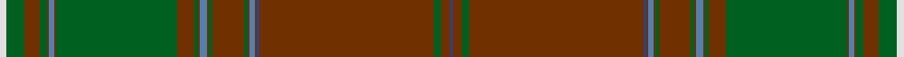

This page is one **sett** — a single exact thread-count. It belongs to the [tartan](/setts/w4g10o9g4o1t3o1g69o10g2o1t4o1g2o18g2o1t3o1db2o99g4o5db2/)
(the same proportion at any scale), whose colour order is pattern [BRGRBRBRGRGRBRGRGRBRGRGW](/stripes/brgrbrbrgrgrbrgrgrbrgrgw/).

Sourced from weddslist.  It is a [24 stripe tartan](/stripes/stripes24/).

Original link http://www.weddslist.com/cgi-bin/tartans/pg.pl?source=sts

## Thread count
LN/8 G20 T18 G8 T2 Ba6 T2 G138 T20 G4 T2 Ba8 T2 G4 T36 G4 T2 Ba6 T2 B4 T198 G8 T10 B/4

One full sett is **1020 threads**.

## Palette

Palette: <strong>Tartan Dictionary</strong> <small style="color:#888">(1 of 5 colours)</small>
<table><thead><tr><th>Colour</th><th>Threads</th><th>Shade</th><th>Base</th><th>OKLCh</th></tr></thead><tbody><tr><td>LN/</td><td style="text-align:right;font-variant-numeric:tabular-nums">8</td><td><code style="background-color:#E0E0E0;">#E0E0E0</code> <small style="color:#888">#E0E0E0</small></td><td>W <code style="background-color:#F7F7F7;">#F7F7F7</code></td><td><small style="color:#888">oklch(90.7% 0.000 89.9)</small></td></tr><tr><td>G</td><td style="text-align:right;font-variant-numeric:tabular-nums">20</td><td><code style="background-color:#006020;">#006020</code> <small style="color:#888">#006020</small></td><td>G <code style="background-color:#006100;">#006100</code></td><td><small style="color:#888">oklch(42.6% 0.126 147.3)</small></td></tr><tr><td>T</td><td style="text-align:right;font-variant-numeric:tabular-nums">18</td><td><code style="background-color:#703000;">#703000</code> <small style="color:#888">#703000</small></td><td>R <code style="background-color:#CC0000;">#CC0000</code></td><td><small style="color:#888">oklch(39.1% 0.105 49.1)</small></td></tr><tr><td>G</td><td style="text-align:right;font-variant-numeric:tabular-nums">8</td><td><code style="background-color:#006020;">#006020</code> <small style="color:#888">#006020</small></td><td>G <code style="background-color:#006100;">#006100</code></td><td><small style="color:#888">oklch(42.6% 0.126 147.3)</small></td></tr><tr><td>T</td><td style="text-align:right;font-variant-numeric:tabular-nums">2</td><td><code style="background-color:#703000;">#703000</code> <small style="color:#888">#703000</small></td><td>R <code style="background-color:#CC0000;">#CC0000</code></td><td><small style="color:#888">oklch(39.1% 0.105 49.1)</small></td></tr><tr><td>Ba</td><td style="text-align:right;font-variant-numeric:tabular-nums">6</td><td><code style="background-color:#5480B0;">#5480B0</code> <small style="color:#888">#5480B0</small></td><td>B <code style="background-color:#2A418A;">#2A418A</code></td><td><small style="color:#888">oklch(58.8% 0.089 251.5)</small></td></tr><tr><td>T</td><td style="text-align:right;font-variant-numeric:tabular-nums">2</td><td><code style="background-color:#703000;">#703000</code> <small style="color:#888">#703000</small></td><td>R <code style="background-color:#CC0000;">#CC0000</code></td><td><small style="color:#888">oklch(39.1% 0.105 49.1)</small></td></tr><tr><td>G</td><td style="text-align:right;font-variant-numeric:tabular-nums">138</td><td><code style="background-color:#006020;">#006020</code> <small style="color:#888">#006020</small></td><td>G <code style="background-color:#006100;">#006100</code></td><td><small style="color:#888">oklch(42.6% 0.126 147.3)</small></td></tr><tr><td>T</td><td style="text-align:right;font-variant-numeric:tabular-nums">20</td><td><code style="background-color:#703000;">#703000</code> <small style="color:#888">#703000</small></td><td>R <code style="background-color:#CC0000;">#CC0000</code></td><td><small style="color:#888">oklch(39.1% 0.105 49.1)</small></td></tr><tr><td>G</td><td style="text-align:right;font-variant-numeric:tabular-nums">4</td><td><code style="background-color:#006020;">#006020</code> <small style="color:#888">#006020</small></td><td>G <code style="background-color:#006100;">#006100</code></td><td><small style="color:#888">oklch(42.6% 0.126 147.3)</small></td></tr><tr><td>T</td><td style="text-align:right;font-variant-numeric:tabular-nums">2</td><td><code style="background-color:#703000;">#703000</code> <small style="color:#888">#703000</small></td><td>R <code style="background-color:#CC0000;">#CC0000</code></td><td><small style="color:#888">oklch(39.1% 0.105 49.1)</small></td></tr><tr><td>Ba</td><td style="text-align:right;font-variant-numeric:tabular-nums">8</td><td><code style="background-color:#5480B0;">#5480B0</code> <small style="color:#888">#5480B0</small></td><td>B <code style="background-color:#2A418A;">#2A418A</code></td><td><small style="color:#888">oklch(58.8% 0.089 251.5)</small></td></tr><tr><td>T</td><td style="text-align:right;font-variant-numeric:tabular-nums">2</td><td><code style="background-color:#703000;">#703000</code> <small style="color:#888">#703000</small></td><td>R <code style="background-color:#CC0000;">#CC0000</code></td><td><small style="color:#888">oklch(39.1% 0.105 49.1)</small></td></tr><tr><td>G</td><td style="text-align:right;font-variant-numeric:tabular-nums">4</td><td><code style="background-color:#006020;">#006020</code> <small style="color:#888">#006020</small></td><td>G <code style="background-color:#006100;">#006100</code></td><td><small style="color:#888">oklch(42.6% 0.126 147.3)</small></td></tr><tr><td>T</td><td style="text-align:right;font-variant-numeric:tabular-nums">36</td><td><code style="background-color:#703000;">#703000</code> <small style="color:#888">#703000</small></td><td>R <code style="background-color:#CC0000;">#CC0000</code></td><td><small style="color:#888">oklch(39.1% 0.105 49.1)</small></td></tr><tr><td>G</td><td style="text-align:right;font-variant-numeric:tabular-nums">4</td><td><code style="background-color:#006020;">#006020</code> <small style="color:#888">#006020</small></td><td>G <code style="background-color:#006100;">#006100</code></td><td><small style="color:#888">oklch(42.6% 0.126 147.3)</small></td></tr><tr><td>T</td><td style="text-align:right;font-variant-numeric:tabular-nums">2</td><td><code style="background-color:#703000;">#703000</code> <small style="color:#888">#703000</small></td><td>R <code style="background-color:#CC0000;">#CC0000</code></td><td><small style="color:#888">oklch(39.1% 0.105 49.1)</small></td></tr><tr><td>Ba</td><td style="text-align:right;font-variant-numeric:tabular-nums">6</td><td><code style="background-color:#5480B0;">#5480B0</code> <small style="color:#888">#5480B0</small></td><td>B <code style="background-color:#2A418A;">#2A418A</code></td><td><small style="color:#888">oklch(58.8% 0.089 251.5)</small></td></tr><tr><td>T</td><td style="text-align:right;font-variant-numeric:tabular-nums">2</td><td><code style="background-color:#703000;">#703000</code> <small style="color:#888">#703000</small></td><td>R <code style="background-color:#CC0000;">#CC0000</code></td><td><small style="color:#888">oklch(39.1% 0.105 49.1)</small></td></tr><tr><td>B</td><td style="text-align:right;font-variant-numeric:tabular-nums">4</td><td><code style="background-color:#304080;">#304080</code> <small style="color:#888">#304080</small></td><td>B <code style="background-color:#2A418A;">#2A418A</code></td><td><small style="color:#888">oklch(39.4% 0.109 270.2)</small></td></tr><tr><td>T</td><td style="text-align:right;font-variant-numeric:tabular-nums">198</td><td><code style="background-color:#703000;">#703000</code> <small style="color:#888">#703000</small></td><td>R <code style="background-color:#CC0000;">#CC0000</code></td><td><small style="color:#888">oklch(39.1% 0.105 49.1)</small></td></tr><tr><td>G</td><td style="text-align:right;font-variant-numeric:tabular-nums">8</td><td><code style="background-color:#006020;">#006020</code> <small style="color:#888">#006020</small></td><td>G <code style="background-color:#006100;">#006100</code></td><td><small style="color:#888">oklch(42.6% 0.126 147.3)</small></td></tr><tr><td>T</td><td style="text-align:right;font-variant-numeric:tabular-nums">10</td><td><code style="background-color:#703000;">#703000</code> <small style="color:#888">#703000</small></td><td>R <code style="background-color:#CC0000;">#CC0000</code></td><td><small style="color:#888">oklch(39.1% 0.105 49.1)</small></td></tr><tr><td>B/</td><td style="text-align:right;font-variant-numeric:tabular-nums">4</td><td><code style="background-color:#304080;">#304080</code> <small style="color:#888">#304080</small></td><td>B <code style="background-color:#2A418A;">#2A418A</code></td><td><small style="color:#888">oklch(39.4% 0.109 270.2)</small></td></tr></tbody></table>

## Nearest tartans

The nearest existing variants by ΔTartan distance, with this tartan at the top so the swatches line up against it.

ΔTartan

Tartan

Sett

—

<a href="/ttd/edit/#slug=w4g10o9g4o1t3o1g69o10g2o1t4o1g2o18g2o1t3o1db2o99g4o5db2~x2">Unidentified Plaid 1</a> <a class="nn-out" href="/variants/s24/w4g10o9g4o1t3o1g69o10g2o1t4o1g2o18g2o1t3o1db2o99g4o5db2~x2/" title="open its dictionary page">↗</a>

0.22

<a href="/ttd/edit/#slug=w4dg10dy9dg4dy1t3dy1dg69dy10dg2dy1t4dy1dg2dy18dg2dy1t3dy1db2dy99dg4dy5db2~x2&amp;base=w4g10o9g4o1t3o1g69o10g2o1t4o1g2o18g2o1t3o1db2o99g4o5db2~x2">Unidentified Plaid #14</a> <a class="nn-out" href="/variants/s24/w4dg10dy9dg4dy1t3dy1dg69dy10dg2dy1t4dy1dg2dy18dg2dy1t3dy1db2dy99dg4dy5db2~x2/" title="open its dictionary page">↗</a>

1.87

<a href="/ttd/edit/#slug=lo3k1r22k1r1k10dg1r1dg11k1r4k1dg8k1r4k1dg48k1~x2&amp;base=w4g10o9g4o1t3o1g69o10g2o1t4o1g2o18g2o1t3o1db2o99g4o5db2~x2">New House Highland (Corporate)</a> <a class="nn-out" href="/variants/s18/lo3k1r22k1r1k10dg1r1dg11k1r4k1dg8k1r4k1dg48k1~x2/" title="open its dictionary page">↗</a>

1.98

<a href="/ttd/edit/#slug=dg44r3do6dg6r2do1dg2r10dg2do1r2dg6do6r3lr1r42~x4&amp;base=w4g10o9g4o1t3o1g69o10g2o1t4o1g2o18g2o1t3o1db2o99g4o5db2~x2">Gudbrandsdalen of Mannsdrakt</a> <a class="nn-out" href="/variants/s16/dg44r3do6dg6r2do1dg2r10dg2do1r2dg6do6r3lr1r42~x4/" title="open its dictionary page">↗</a>

2.00

<a href="/ttd/edit/#slug=dg40k2ri3k2dg3k3r3k3r3k3ri5ly1ri5k3dg3k2ri3k2dg3k3~x2&amp;base=w4g10o9g4o1t3o1g69o10g2o1t4o1g2o18g2o1t3o1db2o99g4o5db2~x2">Austrian Bowhunters Hunting</a> <a class="nn-out" href="/variants/s20/dg40k2ri3k2dg3k3r3k3r3k3ri5ly1ri5k3dg3k2ri3k2dg3k3~x2/" title="open its dictionary page">↗</a>

2.04

<a href="/ttd/edit/#slug=dg29n1dg2n2dg2n3dg2n5r1k1r1n5dg2n3dg2n2dg2n1dg14lo3~x2&amp;base=w4g10o9g4o1t3o1g69o10g2o1t4o1g2o18g2o1t3o1db2o99g4o5db2~x2">Murphy and his Gang (Phoenix Arizona) (Personal)</a> <a class="nn-out" href="/variants/s20/dg29n1dg2n2dg2n3dg2n5r1k1r1n5dg2n3dg2n2dg2n1dg14lo3~x2/" title="open its dictionary page">↗</a>

2.05

<a href="/ttd/edit/#slug=g3r2b1r19g1r1g1r8g1b8r1g8r1g1r1g28ly1g2m2~x2&amp;base=w4g10o9g4o1t3o1g69o10g2o1t4o1g2o18g2o1t3o1db2o99g4o5db2~x2">Brewer</a> <a class="nn-out" href="/variants/s19/g3r2b1r19g1r1g1r8g1b8r1g8r1g1r1g28ly1g2m2~x2/" title="open its dictionary page">↗</a>

2.07

<a href="/ttd/edit/#slug=do9k8y15dy50k3r2k2dg1k2do1k1dy9~x2&amp;base=w4g10o9g4o1t3o1g69o10g2o1t4o1g2o18g2o1t3o1db2o99g4o5db2~x2">Tomatin Distillery</a> <a class="nn-out" href="/variants/s12/do9k8y15dy50k3r2k2dg1k2do1k1dy9~x2/" title="open its dictionary page">↗</a>

2.13

<a href="/ttd/edit/#slug=o68k1dg6b4dg1b12w1dg6ly1dg24ly1dg2ly3~x2&amp;base=w4g10o9g4o1t3o1g69o10g2o1t4o1g2o18g2o1t3o1db2o99g4o5db2~x2">Ellis Island</a> <a class="nn-out" href="/variants/s13/o68k1dg6b4dg1b12w1dg6ly1dg24ly1dg2ly3~x2/" title="open its dictionary page">↗</a>

2.21

<a href="/ttd/edit/#slug=dt8dy3y1dy1y39dy3o3y2dt11dy8y2dy3w2~x2&amp;base=w4g10o9g4o1t3o1g69o10g2o1t4o1g2o18g2o1t3o1db2o99g4o5db2~x2">Afghanistan Memorial</a> <a class="nn-out" href="/variants/s13/dt8dy3y1dy1y39dy3o3y2dt11dy8y2dy3w2~x2/" title="open its dictionary page">↗</a>

2.22

<a href="/ttd/edit/#slug=dg43dp3o3dp2o4r3g2dg13g2o9dg1lo2~x2&amp;base=w4g10o9g4o1t3o1g69o10g2o1t4o1g2o18g2o1t3o1db2o99g4o5db2~x2">Berry Tribute</a> <a class="nn-out" href="/variants/s12/dg43dp3o3dp2o4r3g2dg13g2o9dg1lo2~x2/" title="open its dictionary page">↗</a>

## Neighbour map

Every grey dot is one of 14360 variants placed by the first two principal components of the ΔTartan feature space (44% of its variance). Red is this tartan; blue dots are its nearest — click one to open its page.

<svg viewBox="0 0 640 380" role="img" style="max-width:100%;height:auto;border:1px solid #e0e0e0;border-radius:4px;display:block" xmlns="http://www.w3.org/2000/svg"><image href="/nn/cloud.v1.png" width="640" height="380"/><a href="/variants/s24/w4dg10dy9dg4dy1t3dy1dg69dy10dg2dy1t4dy1dg2dy18dg2dy1t3dy1db2dy99dg4dy5db2~x2/"><circle cx="486.9" cy="69.2" r="4" fill="#3465a4"><title>Unidentified Plaid #14</title></circle></a><a href="/variants/s18/lo3k1r22k1r1k10dg1r1dg11k1r4k1dg8k1r4k1dg48k1~x2/"><circle cx="437.4" cy="92.2" r="4" fill="#3465a4"><title>New House Highland (Corporate)</title></circle></a><a href="/variants/s16/dg44r3do6dg6r2do1dg2r10dg2do1r2dg6do6r3lr1r42~x4/"><circle cx="418.0" cy="113.0" r="4" fill="#3465a4"><title>Gudbrandsdalen of Mannsdrakt</title></circle></a><a href="/variants/s20/dg40k2ri3k2dg3k3r3k3r3k3ri5ly1ri5k3dg3k2ri3k2dg3k3~x2/"><circle cx="383.0" cy="84.2" r="4" fill="#3465a4"><title>Austrian Bowhunters Hunting</title></circle></a><a href="/variants/s20/dg29n1dg2n2dg2n3dg2n5r1k1r1n5dg2n3dg2n2dg2n1dg14lo3~x2/"><circle cx="484.7" cy="120.5" r="4" fill="#3465a4"><title>Murphy and his Gang (Phoenix Arizona) (Personal)</title></circle></a><a href="/variants/s19/g3r2b1r19g1r1g1r8g1b8r1g8r1g1r1g28ly1g2m2~x2/"><circle cx="363.3" cy="98.8" r="4" fill="#3465a4"><title>Brewer</title></circle></a><a href="/variants/s12/do9k8y15dy50k3r2k2dg1k2do1k1dy9~x2/"><circle cx="425.5" cy="94.4" r="4" fill="#3465a4"><title>Tomatin Distillery</title></circle></a><a href="/variants/s13/o68k1dg6b4dg1b12w1dg6ly1dg24ly1dg2ly3~x2/"><circle cx="411.5" cy="71.3" r="4" fill="#3465a4"><title>Ellis Island</title></circle></a><a href="/variants/s13/dt8dy3y1dy1y39dy3o3y2dt11dy8y2dy3w2~x2/"><circle cx="380.6" cy="107.5" r="4" fill="#3465a4"><title>Afghanistan Memorial</title></circle></a><a href="/variants/s12/dg43dp3o3dp2o4r3g2dg13g2o9dg1lo2~x2/"><circle cx="466.0" cy="100.9" r="4" fill="#3465a4"><title>Berry Tribute</title></circle></a><circle cx="481.7" cy="65.7" r="5" fill="#c00000"/></svg>

ID: /variants/s24/w4g10o9g4o1t3o1g69o10g2o1t4o1g2o18g2o1t3o1db2o99g4o5db2~x2/
