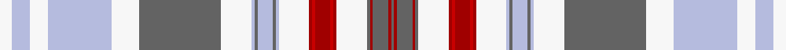

This page is one **sett** — a single exact thread-count. It belongs to the [tartan](/setts/w4lb6w6lb21w9n27w10lb1n1lb5n1lb1w10r1ri1r5ri1r1w10n1r1n5r1n1/)
(the same proportion at any scale), whose colour order is pattern [BRBRBWRRRRRWWBWBWWBWWWWW](/stripes/brbrbwrrrrrwwbwbwwbwwwww/).

Sourced from tartans-authority.  It is a [24 stripe tartan](/stripes/stripes24/).

Original link http://www.tartansauthority.com/tartan-ferret/display/10961/

## Register references

External register numbers recorded for this tartan.

- Scottish Register of Tartans: [10961](https://www.tartanregister.gov.uk/tartanDetails?ref=10961)
- Scottish Tartans Authority (ITI): 10961

## Thread count
W/8 LB12 W12 LB42 W18 N54 W20 LB2 N2 LB10 N2 LB2 W20 R2 Ri2 R10 Ri2 R2 W20 N2 R2 N10 R2 N/2

One full sett is **510 threads**.

## Palette
<table><thead><tr><th>Colour</th><th>Shade</th><th>OKLCh</th></tr></thead><tbody><tr><td>R</td><td><code style="background-color:#A00000;">#A00000</code> <small style="color:#888">#A00000</small></td><td><small style="color:#888">oklch(44.3% 0.182 29.2)</small></td></tr><tr><td>N</td><td><code style="background-color:#636363;">#636363</code> <small style="color:#888">#636363</small></td><td><small style="color:#888">oklch(50.0% 0.000 89.9)</small></td></tr><tr><td>LB</td><td><code style="background-color:#B5BBDE;">#B5BBDE</code> <small style="color:#888">#B5BBDE</small></td><td><small style="color:#888">oklch(79.9% 0.050 277.6)</small></td></tr><tr><td>R</td><td><code style="background-color:#C80000;">#C80000</code> <small style="color:#888">#C80000</small></td><td><small style="color:#888">oklch(52.3% 0.215 29.2)</small></td></tr><tr><td>W</td><td><code style="background-color:#F7F7F7;">#F7F7F7</code> <small style="color:#888">#F7F7F7</small></td><td><small style="color:#888">oklch(97.6% 0.000 89.9)</small></td></tr></tbody></table>

# Sample pattern

ID: /variants/s24/w4lb6w6lb21w9n27w10lb1n1lb5n1lb1w10r1ri1r5ri1r1w10n1r1n5r1n1~x2~r1807033-ri2109032/
