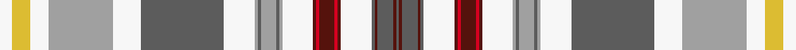

This page is one **sett** — a single exact thread-count. It belongs to the [tartan](/setts/w4ly6w6lr21w9n27w10lr1n1lr5n1lr1w10dr1r1dr5r1dr1w10n1dr1n5dr1n1/)
(the same proportion at any scale), whose colour order is pattern [BBBBBWBRBRBWYBYBYWBWYWYW](/stripes/bbbbbwbrbrbwybybywbwywyw/).

Sourced from register-of-tartans.  It is a [24 stripe tartan](/stripes/stripes24/).

Original link https://www.tartanregister.gov.uk/tartanDetails.aspx?ref=10961

## Register references

External register numbers recorded for this tartan.

- Scottish Register of Tartans: [10961](https://www.tartanregister.gov.uk/tartanDetails.aspx?ref=10961)

## Thread count
W/8 LY12 W12 LR42 W18 N54 W20 LR2 N2 LR10 N2 LR2 W20 DR2 R2 DR10 R2 DR2 W20 N2 DR2 N10 DR2 N/2

One full sett is **510 threads**.

## Palette
<table><thead><tr><th>Colour</th><th>Shade</th><th>OKLCh</th></tr></thead><tbody><tr><td>LY</td><td><code style="background-color:#DCBC32;">#DCBC32</code> <small style="color:#888">#DCBC32</small></td><td><small style="color:#888">oklch(80.0% 0.150 95.2)</small></td></tr><tr><td>LR</td><td><code style="background-color:#A0A0A0;">#A0A0A0</code> <small style="color:#888">#A0A0A0</small></td><td><small style="color:#888">oklch(70.6% 0.000 89.9)</small></td></tr><tr><td>N</td><td><code style="background-color:#5C5C5C;">#5C5C5C</code> <small style="color:#888">#5C5C5C</small></td><td><small style="color:#888">oklch(47.5% 0.000 89.9)</small></td></tr><tr><td>R</td><td><code style="background-color:#D60020;">#D60020</code> <small style="color:#888">#D60020</small></td><td><small style="color:#888">oklch(55.2% 0.224 25.5)</small></td></tr><tr><td>DR</td><td><code style="background-color:#55120C;">#55120C</code> <small style="color:#888">#55120C</small></td><td><small style="color:#888">oklch(30.0% 0.099 29.3)</small></td></tr><tr><td>W</td><td><code style="background-color:#F7F7F7;">#F7F7F7</code> <small style="color:#888">#F7F7F7</small></td><td><small style="color:#888">oklch(97.6% 0.000 89.9)</small></td></tr></tbody></table>

# Sample pattern

ID: /variants/s24/w4ly6w6lr21w9n27w10lr1n1lr5n1lr1w10dr1r1dr5r1dr1w10n1dr1n5dr1n1~x2~lr2800000-n1900000/
