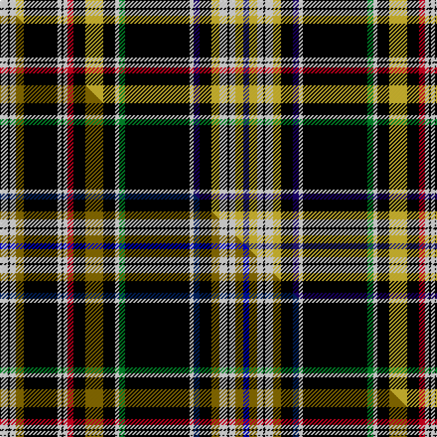

This is one **variant** — a specific cloth: this exact thread count and colourway, with its own
provenance below. It is one weaving of the [sett](/tartans/l/li/lindenwood-university/) (the scale-free proportion — the
same cloth at any scale or shade), whose colour order is pattern [BYWKWYKBWKGWKYKRWKWKYWKW](/stripes/bywkwykbwkgwkykrwkwkywkw/).

Part of the [Lindenwood University](/tartans/l/li/lindenwood-university/) tartan — the named design grouping this sett with its other cloths.

Sourced from tartans-authority.  It is a [24 stripe tartan](/stripes/stripes24/).

Original link <code>http://www.tartansauthority.com/tartan-ferret/display/10675/</code> — retired · [Internet Archive copy](https://web.archive.org/web/*/http://www.tartansauthority.com/tartan-ferret/display/10675/*)

Dataset <small>— provenance for this record, inherited from the source manifest</small>

<dl class="dataset-prov">
<dt>source</dt><dd><a href="/sources/tartans-authority/">Scottish Tartans Authority</a></dd>
<dt>data captured from</dt><dd><a href="https://github.com/thetartan/tartan-database/blob/master/data/tartans-authority/data.csv">https://github.com/thetartan/tartan-database/blob/master/data/tartans-authority/data.csv</a></dd>
<dt>data date</dt><dd>01/12/2011 <small>(this record)</small></dd>
<dt>licence</dt><dd><a href="https://creativecommons.org/licenses/by-nc-nd/4.0/">CC BY-NC-ND 4.0</a></dd>
</dl>

Capture chain <small>— the hands this data passed through, oldest first; each capture carries its own licence</small>

<ol class="capture-chain">
<li><a href="https://www.tartansauthority.com/">Scottish Tartans Authority</a> <small>the heritage body’s archive — its tartan-ferret record browser is retired; dead record links are shown unlinked, with an Internet Archive copy (ITI numbers are not SRT references)</small></li>
<li><a href="https://github.com/thetartan/tartan-database">thetartan/tartan-database</a> <small>2016-2017</small> · <a href="https://creativecommons.org/licenses/by-nc-nd/4.0/">CC BY-NC-ND 4.0</a> <small>Levko Kravets's frozen compilation — the capture we vendored, and where its CC licence text came from</small></li>
<li>this dictionary <small>captured 2026-06-10 · commit 5bf86c7566</small> <small>each re-capture is a git commit to data/sources</small></li>
</ol>

## Register references

External register numbers recorded for this tartan.

- Scottish Register of Tartans: [10675](https://www.tartanregister.gov.uk/tartanDetails?ref=10675)
- Scottish Tartans Authority (ITI): 10675

## Thread count
W/8 K2 W6 LY8 K34 W4 K2 W4 R6 K12 LY18 K12 W4 G6 K65 W4 DB6 K12 LY8 W8 K2 W6 LY8 DBi/6

One full sett is **488 threads**.

## Palette
<table><thead><tr><th>Colour</th><th>Shade</th><th>OKLCh</th></tr></thead><tbody><tr><td>DB</td><td><code style="background-color:#2C2C80;">#2C2C80</code> <small style="color:#888">#2C2C80</small></td><td><small style="color:#888">oklch(35.0% 0.138 276.6)</small></td></tr><tr><td>DB</td><td><code style="background-color:#1C0070;">#1C0070</code> <small style="color:#888">#1C0070</small></td><td><small style="color:#888">oklch(26.3% 0.162 277.1)</small></td></tr><tr><td>G</td><td><code style="background-color:#008B2A;">#008B2A</code> <small style="color:#888">#008B2A</small></td><td><small style="color:#888">oklch(55.4% 0.170 145.9)</small></td></tr><tr><td>K</td><td><code style="background-color:#000000;">#000000</code> <small style="color:#888">#000000</small></td><td><small style="color:#888">oklch(0.0% 0.000 0.0)</small></td></tr><tr><td>R</td><td><code style="background-color:#D60020;">#D60020</code> <small style="color:#888">#D60020</small></td><td><small style="color:#888">oklch(55.2% 0.224 25.5)</small></td></tr><tr><td>W</td><td><code style="background-color:#F7F7F7;">#F7F7F7</code> <small style="color:#888">#F7F7F7</small></td><td><small style="color:#888">oklch(97.6% 0.000 89.9)</small></td></tr><tr><td>LY</td><td><code style="background-color:#DCBC32;">#DCBC32</code> <small style="color:#888">#DCBC32</small></td><td><small style="color:#888">oklch(80.0% 0.150 95.2)</small></td></tr></tbody></table>

# Sample pattern

## Compared to the master

This cloth is one sett of its design; the master sett (the exemplar the design is anchored on) is below for comparison.

Its **ΔTartan distance** from the master is **0.09** — the same measure the nearest-tartans table ranks by (0 is identical; a re-scale of the same cloth is near 0, a recolour or a different proportion further).

<figure class="master-compare" style="margin:0">

this sett
master sett ★

<figcaption style="color:#888;font-size:smaller">One weave of this sett against the <a href="/setts/w8k2w6y8k34w4k2w4r6k12y18k12w4g6k65w4db6k12y8w8k2w6y8b6/">master sett ★</a>, split on the diagonal: a shared proportion runs seamlessly across it with only the shades shifting; a different proportion breaks on it.</figcaption>
</figure>

## Nearest tartan variants

The nearest existing variants by ΔTartan distance, with this cloth at the top so the swatches line up against it.

ΔTartan

Threads

Variant

Sett

—

488

<a href="/variants/s24/w8k2w6ly8k34w4k2w4r6k12ly18k12w4g6k65w4db6k12ly8w8k2w6ly8dbi6~db2616276-dbi3514276/">Lindenwood University (Corporate)</a>

<a href="/ttd/edit/#slug=w8k2w6y8k34w4k2w4r6k12y18k12w4g6k65w4db6k12y8w8k2w6y8b6~db2812261-b3826264&amp;base=w8k2w6ly8k34w4k2w4r6k12ly18k12w4g6k65w4db6k12ly8w8k2w6ly8dbi6~db2616276-dbi3514276" title="compare in the TTD">0.09</a>

488

<a href="/variants/s24/w8k2w6y8k34w4k2w4r6k12y18k12w4g6k65w4db6k12y8w8k2w6y8b6~db2812261-b3826264/">Lindenwood University</a>

<a href="/ttd/edit/#slug=k34w2k2n27g1n2k3n2y1n2r2n2y1n2k3n2g1n27k2w2k34lo2~x2&amp;base=w8k2w6ly8k34w4k2w4r6k12ly18k12w4g6k65w4db6k12ly8w8k2w6ly8dbi6~db2616276-dbi3514276" title="compare in the TTD">2.90</a>

552

<a href="/variants/s22/k34w2k2n27g1n2k3n2y1n2r2n2y1n2k3n2g1n27k2w2k34lo2~x2/">West Lothian Woolen Mill</a>

<a href="/ttd/edit/#slug=w2k32o5n3o2n3o2n3o1n6y3k2y1ly3y2k2w1~x2~o62-n47&amp;base=w8k2w6ly8k34w4k2w4r6k12ly18k12w4g6k65w4db6k12ly8w8k2w6ly8dbi6~db2616276-dbi3514276" title="compare in the TTD">3.48</a>

286

<a href="/variants/s17/w2k32o5n3o2n3o2n3o1n6y3k2y1ly3y2k2w1~x2~o62-n47/">Cornish Pascoe (Name)</a>

<a href="/ttd/edit/#slug=w5k1db2k5y2r2y2k30g3w7k4w7g2k30y2r2y2k5db2k1~x2&amp;base=w8k2w6ly8k34w4k2w4r6k12ly18k12w4g6k65w4db6k12ly8w8k2w6ly8dbi6~db2616276-dbi3514276" title="compare in the TTD">3.54</a>

452

<a href="/variants/s20/w5k1db2k5y2r2y2k30g3w7k4w7g2k30y2r2y2k5db2k1~x2/">Braddock Family (Personal)</a>

<a href="/ttd/edit/#slug=r4g3k11n3db3n30k1w4k1g3k3g3k3n12r2~x2&amp;base=w8k2w6ly8k34w4k2w4r6k12ly18k12w4g6k65w4db6k12ly8w8k2w6ly8dbi6~db2616276-dbi3514276" title="compare in the TTD">3.67</a>

332

<a href="/variants/s15/r4g3k11n3db3n30k1w4k1g3k3g3k3n12r2~x2/">Trew 40th (Personal)</a>

<a href="/ttd/edit/#slug=k4r8ly4k2ly4k40g5dp4g5k2t2w4~x2&amp;base=w8k2w6ly8k34w4k2w4r6k12ly18k12w4g6k65w4db6k12ly8w8k2w6ly8dbi6~db2616276-dbi3514276" title="compare in the TTD">3.74</a>

320

<a href="/variants/s12/k4r8ly4k2ly4k40g5dp4g5k2t2w4~x2/">MacMunn</a>

<a href="/ttd/edit/#slug=dg84r6dg8r16dg14k8db6k2db6k2db6k2dg4lb3dg16lb3dg4k6db8k3db6k3db8k10y3w3k3w6dg16r8k3r4w4r4&amp;base=w8k2w6ly8k34w4k2w4r6k12ly18k12w4g6k65w4db6k12ly8w8k2w6ly8dbi6~db2616276-dbi3514276" title="compare in the TTD">3.74</a>

488

<a href="/variants/s34/dg84r6dg8r16dg14k8db6k2db6k2db6k2dg4lb3dg16lb3dg4k6db8k3db6k3db8k10y3w3k3w6dg16r8k3r4w4r4/">Duke of Edinburgh (Fashion)</a>

<a href="/ttd/edit/#slug=w2k32lr5dt3lr2dt3lr2dt3lr1dt6y3k2y1k3y2k2w1~x2~lr75-dt28&amp;base=w8k2w6ly8k34w4k2w4r6k12ly18k12w4g6k65w4db6k12ly8w8k2w6ly8dbi6~db2616276-dbi3514276" title="compare in the TTD">3.80</a>

286

<a href="/variants/s17/w2k32lr5dt3lr2dt3lr2dt3lr1dt6y3k2y1k3y2k2w1~x2~lr75-dt28/">Cornish Pascoe, The</a>

<a href="/ttd/edit/#slug=k96db8k12dp3k3dp3k3g20r8k3r4w4~db3514276-dp4018327&amp;base=w8k2w6ly8k34w4k2w4r6k12ly18k12w4g6k65w4db6k12ly8w8k2w6ly8dbi6~db2616276-dbi3514276" title="compare in the TTD">3.81</a>

234

<a href="/variants/s12/k96db8k12dp3k3dp3k3g20r8k3r4w4~db3514276-dp4018327/">Watt</a>

<a href="/ttd/edit/#slug=dg34k1r4w1r4k1dg4k1y2k1dg7k1r3k1dg3k1r3k1dg3w1db5w1y4w2~x2&amp;base=w8k2w6ly8k34w4k2w4r6k12ly18k12w4g6k65w4db6k12ly8w8k2w6ly8dbi6~db2616276-dbi3514276" title="compare in the TTD">3.83</a>

284

<a href="/variants/s24/dg34k1r4w1r4k1dg4k1y2k1dg7k1r3k1dg3k1r3k1dg3w1db5w1y4w2~x2/">MacMaster (USA) #2</a>

## Neighbour map

Every grey dot is one of 13662 variants placed by the first two principal components of the ΔTartan feature space (42% of its variance). Red is this tartan; blue dots are its nearest — click one to open its page. The map is a flat projection of a many-dimensional space — [how to read it](/posts/neighbourhood-maps/).

<svg viewBox="0 0 640 380" role="img" style="max-width:100%;height:auto;border:1px solid #e0e0e0;border-radius:4px;display:block" xmlns="http://www.w3.org/2000/svg"><image href="/nn/cloud.v1.png" width="640" height="380"/><a href="/variants/s24/w8k2w6y8k34w4k2w4r6k12y18k12w4g6k65w4db6k12y8w8k2w6y8b6~db2812261-b3826264/"><circle cx="197.8" cy="14.0" r="4" fill="#3465a4"><title>Lindenwood University</title></circle></a><a href="/variants/s22/k34w2k2n27g1n2k3n2y1n2r2n2y1n2k3n2g1n27k2w2k34lo2~x2/"><circle cx="238.8" cy="14.0" r="4" fill="#3465a4"><title>West Lothian Woolen Mill</title></circle></a><a href="/variants/s17/w2k32o5n3o2n3o2n3o1n6y3k2y1ly3y2k2w1~x2~o62-n47/"><circle cx="204.5" cy="25.9" r="4" fill="#3465a4"><title>Cornish Pascoe (Name)</title></circle></a><a href="/variants/s20/w5k1db2k5y2r2y2k30g3w7k4w7g2k30y2r2y2k5db2k1~x2/"><circle cx="283.8" cy="25.9" r="4" fill="#3465a4"><title>Braddock Family (Personal)</title></circle></a><a href="/variants/s15/r4g3k11n3db3n30k1w4k1g3k3g3k3n12r2~x2/"><circle cx="228.5" cy="59.6" r="4" fill="#3465a4"><title>Trew 40th (Personal)</title></circle></a><a href="/variants/s12/k4r8ly4k2ly4k40g5dp4g5k2t2w4~x2/"><circle cx="209.8" cy="47.6" r="4" fill="#3465a4"><title>MacMunn</title></circle></a><a href="/variants/s34/dg84r6dg8r16dg14k8db6k2db6k2db6k2dg4lb3dg16lb3dg4k6db8k3db6k3db8k10y3w3k3w6dg16r8k3r4w4r4/"><circle cx="210.0" cy="14.0" r="4" fill="#3465a4"><title>Duke of Edinburgh (Fashion)</title></circle></a><a href="/variants/s17/w2k32lr5dt3lr2dt3lr2dt3lr1dt6y3k2y1k3y2k2w1~x2~lr75-dt28/"><circle cx="208.2" cy="27.2" r="4" fill="#3465a4"><title>Cornish Pascoe, The</title></circle></a><a href="/variants/s12/k96db8k12dp3k3dp3k3g20r8k3r4w4~db3514276-dp4018327/"><circle cx="266.2" cy="14.0" r="4" fill="#3465a4"><title>Watt</title></circle></a><a href="/variants/s24/dg34k1r4w1r4k1dg4k1y2k1dg7k1r3k1dg3k1r3k1dg3w1db5w1y4w2~x2/"><circle cx="272.2" cy="14.0" r="4" fill="#3465a4"><title>MacMaster (USA) #2</title></circle></a><circle cx="194.7" cy="14.0" r="5" fill="#c00000"/><text x="320" y="376" text-anchor="middle" font-size="11" fill="#999">ground</text><text x="11" y="190" text-anchor="middle" font-size="11" fill="#999" transform="rotate(-90 11 190)">complexity</text></svg>

ID: /variants/s24/w8k2w6ly8k34w4k2w4r6k12ly18k12w4g6k65w4db6k12ly8w8k2w6ly8dbi6~db2616276-dbi3514276/
