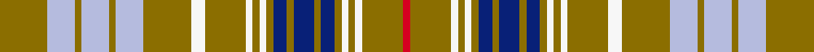
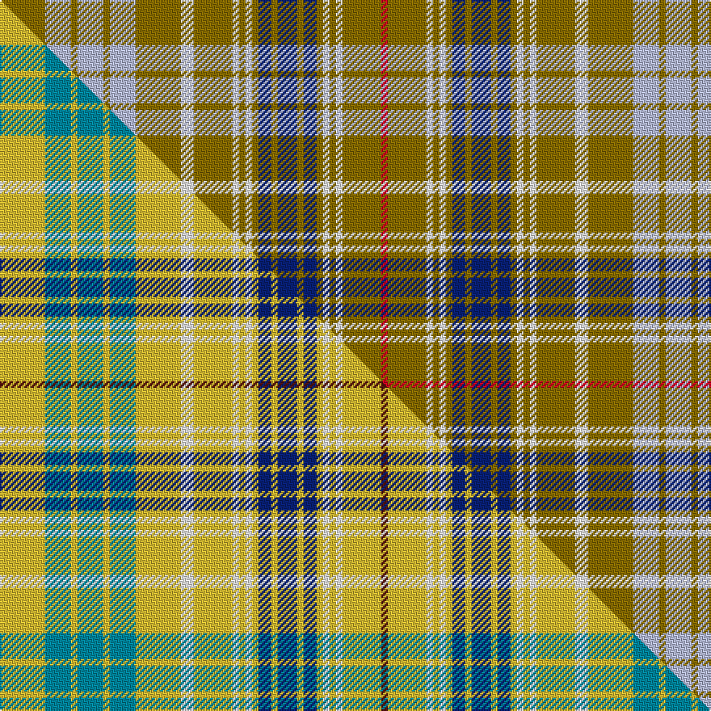

This is one **variant** — a specific cloth: this exact thread count and colourway, with its own
provenance below. It is one weaving of the [sett](/tartans/o/ot/ottawa/) (the scale-free proportion — the
same cloth at any scale or shade), whose colour order is pattern [GWGWGWGWGWGWGBGBGBGWGWGR](/stripes/gwgwgwgwgwgwgbgbgbgwgwgr/).

Part of the [Ottawa](/tartans/o/ot/ottawa/) tartan — the named design grouping this sett with its other cloths.

Sourced from weddslist.  It is a [24 stripe tartan](/stripes/stripes24/).

Original link [http://www.weddslist.com/cgi-bin/tartans/pg.pl?source=sts](http://www.weddslist.com/cgi-bin/tartans/pg.pl?source=sts)

Dataset <small>— provenance for this record, inherited from the source manifest</small>

<dl class="dataset-prov">
<dt>source</dt><dd><a href="/sources/weddslist/">Weddslist</a></dd>
<dt>data captured from</dt><dd><a href="https://github.com/thetartan/tartan-database/blob/master/data/weddslist/data.csv">https://github.com/thetartan/tartan-database/blob/master/data/weddslist/data.csv</a></dd>
<dt>data date</dt><dd>2016-11-17 <small>(dataset default)</small></dd>
<dt>licence</dt><dd><a href="https://creativecommons.org/licenses/by-nc-nd/4.0/">CC BY-NC-ND 4.0</a></dd>
</dl>

Capture chain <small>— the hands this data passed through, oldest first; each capture carries its own licence</small>

<ol class="capture-chain">
<li><a href="https://www.weddslist.com/tartans/">Weddslist</a> <small>the living privately compiled reference</small></li>
<li><a href="https://github.com/thetartan/tartan-database">thetartan/tartan-database</a> <small>2016-2017</small> · <a href="https://creativecommons.org/licenses/by-nc-nd/4.0/">CC BY-NC-ND 4.0</a> <small>Levko Kravets's frozen compilation — the capture we vendored, and where its CC licence text came from</small></li>
<li>this dictionary <small>captured 2026-06-10 · commit 5bf86c7566</small> <small>each re-capture is a git commit to data/sources</small></li>
</ol>

## Thread count
Y/28 LB16 Y4 LB16 Y4 LB16 Y28 W8 Y24 W4 Y4 W4 Y4 DB8 Y4 DB12 Y4 DB8 Y4 W4 Y4 W4 Y24 R/4

One full sett is **448 threads**.

## Palette
<table><thead><tr><th>Colour</th><th>Shade</th><th>OKLCh</th></tr></thead><tbody><tr><td>LB</td><td><code style="background-color:#B5BBDE;">#B5BBDE</code> <small style="color:#888">#B5BBDE</small></td><td><small style="color:#888">oklch(79.9% 0.050 277.6)</small></td></tr><tr><td>DB</td><td><code style="background-color:#082077;">#082077</code> <small style="color:#888">#082077</small></td><td><small style="color:#888">oklch(30.0% 0.149 265.1)</small></td></tr><tr><td>Y</td><td><code style="background-color:#8B6E00;">#8B6E00</code> <small style="color:#888">#8B6E00</small></td><td><small style="color:#888">oklch(55.1% 0.113 90.4)</small></td></tr><tr><td>W</td><td><code style="background-color:#F7F7F7;">#F7F7F7</code> <small style="color:#888">#F7F7F7</small></td><td><small style="color:#888">oklch(97.6% 0.000 89.9)</small></td></tr><tr><td>R</td><td><code style="background-color:#D60020;">#D60020</code> <small style="color:#888">#D60020</small></td><td><small style="color:#888">oklch(55.2% 0.224 25.5)</small></td></tr></tbody></table>

# Sample pattern

## Compared to the master

This cloth is one sett of its design; the master sett (the exemplar the design is anchored on) is below for comparison.

Its **ΔTartan distance** from the master is **0.21** — the same measure the nearest-tartans table ranks by (0 is identical; a re-scale of the same cloth is near 0, a recolour or a different proportion further).

<figure class="master-compare" style="margin:0">

this sett
master sett ★

<figcaption style="color:#888;font-size:smaller">One weave of this sett against the <a href="/setts/ly7t4ly1t4ly1t4ly7w2ly6w1ly1w1ly1db2ly1db3ly1db2ly1w1ly1w1ly6dr1/">master sett ★</a>, split on the diagonal: a shared proportion runs seamlessly across it with only the shades shifting; a different proportion breaks on it.</figcaption>
</figure>

## Nearest tartan variants

The nearest existing variants by ΔTartan distance, with this cloth at the top so the swatches line up against it.

ΔTartan

Threads

Variant

Sett

—

448

<a href="/variants/s24/y7lb4y1lb4y1lb4y7w2y6w1y1w1y1db2y1db3y1db2y1w1y1w1y6r1~x4/">Ottawa</a>

<a href="/ttd/edit/#slug=dy7lb4dy1lb4dy1lb4dy7w2dy6w1dy1w1dy1db2dy1db3dy1db2dy1w1dy1w1dy6r1~x4&amp;base=y7lb4y1lb4y1lb4y7w2y6w1y1w1y1db2y1db3y1db2y1w1y1w1y6r1~x4" title="compare in the TTD">0.19</a>

448

<a href="/variants/s24/dy7lb4dy1lb4dy1lb4dy7w2dy6w1dy1w1dy1db2dy1db3dy1db2dy1w1dy1w1dy6r1~x4/">Ottawa District Tartan</a>

<a href="/ttd/edit/#slug=y5g16db8g4db4g4lr38g4lr38g4db4g4db8g16y5r3~x2&amp;base=y7lb4y1lb4y1lb4y7w2y6w1y1w1y1db2y1db3y1db2y1w1y1w1y6r1~x4" title="compare in the TTD">3.71</a>

644

<a href="/variants/s16/y5g16db8g4db4g4lr38g4lr38g4db4g4db8g16y5r3~x2/">Nova Scotia Dress #2</a>

<a href="/ttd/edit/#slug=r9db1r1db2r1db1r9w1r4db11r2db11r4w1r9g2r4g2r9g5r3g4r3g3y1g3r3g6w1g6~x2&amp;base=y7lb4y1lb4y1lb4y7w2y6w1y1w1y1db2y1db3y1db2y1w1y1w1y6r1~x4" title="compare in the TTD">3.79</a>

458

<a href="/variants/s30/r9db1r1db2r1db1r9w1r4db11r2db11r4w1r9g2r4g2r9g5r3g4r3g3y1g3r3g6w1g6~x2/">Lumsden (Short)</a>

<a href="/ttd/edit/#slug=r3g3r18g6r4t3w3t18r6g18w3g3r4t6r18g3r3~x2&amp;base=y7lb4y1lb4y1lb4y7w2y6w1y1w1y1db2y1db3y1db2y1w1y1w1y6r1~x4" title="compare in the TTD">3.79</a>

476

<a href="/variants/s17/r3g3r18g6r4t3w3t18r6g18w3g3r4t6r18g3r3~x2/">Reid of Straloch (Personal)</a>

<a href="/ttd/edit/#slug=w2o14g7o1db7o1db7o1g7o14r2o14g7o1db7o1~x4&amp;base=y7lb4y1lb4y1lb4y7w2y6w1y1w1y1db2y1db3y1db2y1w1y1w1y6r1~x4" title="compare in the TTD">3.83</a>

732

<a href="/variants/s16/w2o14g7o1db7o1db7o1g7o14r2o14g7o1db7o1~x4/">Fraser, hunting</a>

<a href="/ttd/edit/#slug=w2r4lb2g8r16g2db4r2g16r6db2g2r3lb2~x2&amp;base=y7lb4y1lb4y1lb4y7w2y6w1y1w1y1db2y1db3y1db2y1w1y1w1y6r1~x4" title="compare in the TTD">3.87</a>

276

<a href="/variants/s14/w2r4lb2g8r16g2db4r2g16r6db2g2r3lb2~x2/">MacKinnon #2</a>

<a href="/ttd/edit/#slug=g4r2g14w2db14r2db14g14db2g5db2g14db14r2db14w2g14r2g4lo3~x2~db1406275&amp;base=y7lb4y1lb4y1lb4y7w2y6w1y1w1y1db2y1db3y1db2y1w1y1w1y6r1~x4" title="compare in the TTD">3.89</a>

562

<a href="/variants/s20/g4r2g14w2db14r2db14g14db2g5db2g14db14r2db14w2g14r2g4lo3~x2~db1406275/">Hunter of Hunterston</a>

<a href="/ttd/edit/#slug=g9r3g9r8g1r1g3r1g1r8g1r1g3r1g1r8w1r4db10r3db10r4w1r8g2r4g2r8g5r3g5r3g5y1g5r5g8w1g8~x2&amp;base=y7lb4y1lb4y1lb4y7w2y6w1y1w1y1db2y1db3y1db2y1w1y1w1y6r1~x4" title="compare in the TTD">3.89</a>

626

<a href="/variants/s39/g9r3g9r8g1r1g3r1g1r8g1r1g3r1g1r8w1r4db10r3db10r4w1r8g2r4g2r8g5r3g5r3g5y1g5r5g8w1g8~x2/">Lumsden</a>

<a href="/ttd/edit/#slug=lb25g3lb4g4lb5g5lb15r6lb5g19lb8g26lb4w4lb4g7lb4db21~x2&amp;base=y7lb4y1lb4y1lb4y7w2y6w1y1w1y1db2y1db3y1db2y1w1y1w1y6r1~x4" title="compare in the TTD">3.93</a>

584

<a href="/variants/s18/lb25g3lb4g4lb5g5lb15r6lb5g19lb8g26lb4w4lb4g7lb4db21~x2/">Shedor (2013)</a>

## Neighbour map

Every grey dot is one of 13656 variants placed by the first two principal components of the ΔTartan feature space (42% of its variance). Red is this tartan; blue dots are its nearest — click one to open its page. The map is a flat projection of a many-dimensional space — [how to read it](/posts/neighbourhood-maps/).

<svg viewBox="0 0 640 380" role="img" style="max-width:100%;height:auto;border:1px solid #e0e0e0;border-radius:4px;display:block" xmlns="http://www.w3.org/2000/svg"><image href="/nn/cloud.v1.png" width="640" height="380"/><a href="/variants/s24/dy7lb4dy1lb4dy1lb4dy7w2dy6w1dy1w1dy1db2dy1db3dy1db2dy1w1dy1w1dy6r1~x4/"><circle cx="212.1" cy="150.7" r="4" fill="#3465a4"><title>Ottawa District Tartan</title></circle></a><a href="/variants/s16/y5g16db8g4db4g4lr38g4lr38g4db4g4db8g16y5r3~x2/"><circle cx="228.5" cy="135.2" r="4" fill="#3465a4"><title>Nova Scotia Dress #2</title></circle></a><a href="/variants/s30/r9db1r1db2r1db1r9w1r4db11r2db11r4w1r9g2r4g2r9g5r3g4r3g3y1g3r3g6w1g6~x2/"><circle cx="215.6" cy="132.5" r="4" fill="#3465a4"><title>Lumsden (Short)</title></circle></a><a href="/variants/s17/r3g3r18g6r4t3w3t18r6g18w3g3r4t6r18g3r3~x2/"><circle cx="228.3" cy="193.5" r="4" fill="#3465a4"><title>Reid of Straloch (Personal)</title></circle></a><a href="/variants/s16/w2o14g7o1db7o1db7o1g7o14r2o14g7o1db7o1~x4/"><circle cx="261.0" cy="158.3" r="4" fill="#3465a4"><title>Fraser, hunting</title></circle></a><a href="/variants/s14/w2r4lb2g8r16g2db4r2g16r6db2g2r3lb2~x2/"><circle cx="218.3" cy="166.3" r="4" fill="#3465a4"><title>MacKinnon #2</title></circle></a><a href="/variants/s20/g4r2g14w2db14r2db14g14db2g5db2g14db14r2db14w2g14r2g4lo3~x2~db1406275/"><circle cx="223.0" cy="179.8" r="4" fill="#3465a4"><title>Hunter of Hunterston</title></circle></a><a href="/variants/s39/g9r3g9r8g1r1g3r1g1r8g1r1g3r1g1r8w1r4db10r3db10r4w1r8g2r4g2r8g5r3g5r3g5y1g5r5g8w1g8~x2/"><circle cx="197.2" cy="139.0" r="4" fill="#3465a4"><title>Lumsden</title></circle></a><a href="/variants/s18/lb25g3lb4g4lb5g5lb15r6lb5g19lb8g26lb4w4lb4g7lb4db21~x2/"><circle cx="207.4" cy="179.0" r="4" fill="#3465a4"><title>Shedor (2013)</title></circle></a><circle cx="242.6" cy="162.5" r="5" fill="#c00000"/><text x="320" y="376" text-anchor="middle" font-size="11" fill="#999">ground</text><text x="11" y="190" text-anchor="middle" font-size="11" fill="#999" transform="rotate(-90 11 190)">complexity</text></svg>

ID: /variants/s24/y7lb4y1lb4y1lb4y7w2y6w1y1w1y1db2y1db3y1db2y1w1y1w1y6r1~x4/
