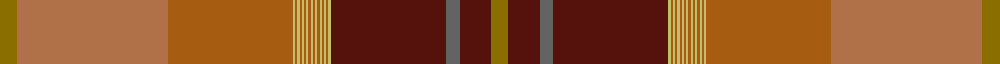

This page is one **sett** — a single exact thread-count. It belongs to the [tartan](/setts/y8oi68o56ly1o1ly1o1ly1o1ly1o1ly1o1ly1o1ly1o1ly1o1ly1dr52n6dr14y8/)
(the same proportion at any scale), whose colour order is pattern [GBBBYRYRYRYRYRYRYRYRYRRG](/stripes/gbbbyryryryryryryryryrrg/).

Sourced from tartans-authority.  It is a [24 stripe tartan](/stripes/stripes24/).

Original link [https://www.tartanregister.gov.uk/tartanDetails.aspx?ref=8240](https://www.tartanregister.gov.uk/tartanDetails.aspx?ref=8240)

Dataset <small>— provenance for this record, inherited from the source manifest</small>

<dl class="dataset-prov">
<dt>source</dt><dd><a href="/sources/tartans-authority/">Scottish Tartans Authority</a></dd>
<dt>data captured from</dt><dd><a href="https://github.com/thetartan/tartan-database/blob/master/data/tartans-authority/data.csv">https://github.com/thetartan/tartan-database/blob/master/data/tartans-authority/data.csv</a></dd>
<dt>data date</dt><dd>pre 2010 <small>(this record)</small></dd>
<dt>licence</dt><dd><a href="https://creativecommons.org/licenses/by-nc-nd/4.0/">CC BY-NC-ND 4.0</a></dd>
</dl>

Capture chain <small>— the hands this data passed through, oldest first; each capture carries its own licence</small>

<ol class="capture-chain">
<li><a href="https://www.tartansauthority.com/">Scottish Tartans Authority</a> <small>the heritage body's archive — its tartan-ferret record browser is retired (links repaired to the SRT, above)</small></li>
<li><a href="https://github.com/thetartan/tartan-database">thetartan/tartan-database</a> <small>2016-2017</small> · <a href="https://creativecommons.org/licenses/by-nc-nd/4.0/">CC BY-NC-ND 4.0</a> <small>Levko Kravets's frozen compilation — the capture we vendored, and where its CC licence text came from</small></li>
<li>this dictionary <small>captured 2026-06-10 · commit 5bf86c7566</small> <small>each re-capture is a git commit to data/sources</small></li>
</ol>

## Register references

External register numbers recorded for this tartan.

- Scottish Register of Tartans: [8240](https://www.tartanregister.gov.uk/tartanDetails?ref=8240)
- Scottish Tartans Authority (ITI): 8240

## Thread count
Y/8 Oi68 O56 LY1 O1 LY1 O1 LY1 O1 LY1 O1 LY1 O1 LY1 O1 LY1 O1 LY1 O1 LY1 DR52 N6 DR14 Y/8

One full sett is **442 threads**.

## Palette
<table><thead><tr><th>Colour</th><th>Shade</th><th>OKLCh</th></tr></thead><tbody><tr><td>O</td><td><code style="background-color:#A65C11;">#A65C11</code> <small style="color:#888">#A65C11</small></td><td><small style="color:#888">oklch(55.0% 0.125 58.3)</small></td></tr><tr><td>DR</td><td><code style="background-color:#55120C;">#55120C</code> <small style="color:#888">#55120C</small></td><td><small style="color:#888">oklch(30.0% 0.099 29.3)</small></td></tr><tr><td>LY</td><td><code style="background-color:#C4BC68;">#C4BC68</code> <small style="color:#888">#C4BC68</small></td><td><small style="color:#888">oklch(78.4% 0.107 103.7)</small></td></tr><tr><td>O</td><td><code style="background-color:#B07048;">#B07048</code> <small style="color:#888">#B07048</small></td><td><small style="color:#888">oklch(60.5% 0.098 51.9)</small></td></tr><tr><td>N</td><td><code style="background-color:#636363;">#636363</code> <small style="color:#888">#636363</small></td><td><small style="color:#888">oklch(50.0% 0.000 89.9)</small></td></tr><tr><td>Y</td><td><code style="background-color:#8B6E00;">#8B6E00</code> <small style="color:#888">#8B6E00</small></td><td><small style="color:#888">oklch(55.1% 0.113 90.4)</small></td></tr></tbody></table>

# Sample pattern

ID: /variants/s24/y8oi68o56ly1o1ly1o1ly1o1ly1o1ly1o1ly1o1ly1o1ly1o1ly1dr52n6dr14y8~oi2404058-ly3104101/
