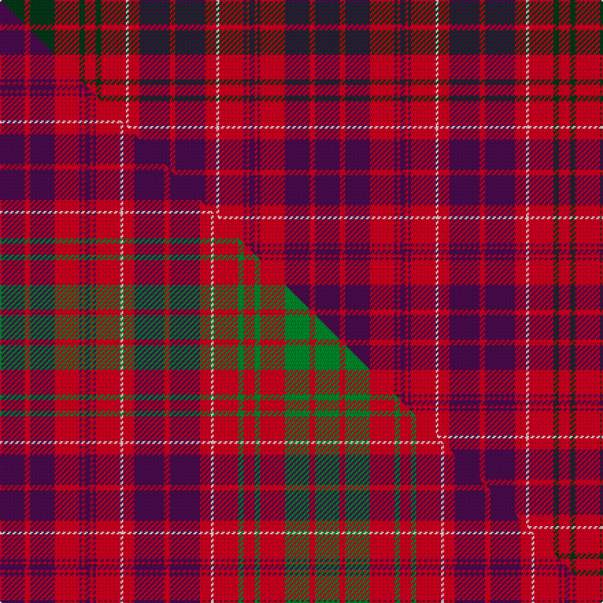

This page is one **sett** — a single exact thread-count. It belongs to the [tartan](/setts/dg9r2dg9r9dg2r4dg2r9w1r4dp11r2dp11r4w1r9dp1r1dp2r1dp1r9dp9r2dp9/)
(the same proportion at any scale), whose colour order is pattern [BRBRBRBRBRWRBRBRWRGRGRGRG](/stripes/brbrbrbrbrwrbrbrwrgrgrgrg/).

Part of the [Lumsden of Clova](/tartans/lumsden-of-clova/) tartan — the named design grouping this sett with its other cloths.

Sourced from tartans-authority.  It is a [25 stripe tartan](/stripes/stripes25/).

Original link http://www.tartansauthority.com/tartan-ferret/display/417/

## Register references

External register numbers recorded for this tartan.

- Scottish Tartans Authority (ITI): 417

## Thread count
DG/18 R4 DG18 R18 DG4 R8 DG4 R18 W2 R8 DP22 R4 DP22 R8 W2 R18 DP2 R2 DP4 R2 DP2 R18 DP18 R4 DP/18

One full sett is **460 threads**.

## Palette
<table><thead><tr><th>Colour</th><th>Shade</th><th>OKLCh</th></tr></thead><tbody><tr><td>DG</td><td><code style="background-color:#053819;">#053819</code> <small style="color:#888">#053819</small></td><td><small style="color:#888">oklch(30.0% 0.075 151.3)</small></td></tr><tr><td>W</td><td><code style="background-color:#F7F7F7;">#F7F7F7</code> <small style="color:#888">#F7F7F7</small></td><td><small style="color:#888">oklch(97.6% 0.000 89.9)</small></td></tr><tr><td>DP</td><td><code style="background-color:#4B0B4F;">#4B0B4F</code> <small style="color:#888">#4B0B4F</small></td><td><small style="color:#888">oklch(30.1% 0.125 325.4)</small></td></tr><tr><td>R</td><td><code style="background-color:#D60020;">#D60020</code> <small style="color:#888">#D60020</small></td><td><small style="color:#888">oklch(55.2% 0.224 25.5)</small></td></tr></tbody></table>

# Sample pattern

## Compared to the master

This cloth is one sett of its design; the master sett (the exemplar the design is anchored on) is below for comparison.

Its **ΔTartan distance** from the master is **0.59** — the same measure the nearest-tartans table ranks by (0 is identical; a re-scale of the same cloth is near 0, a recolour or a different proportion further).

<figure class="master-compare" style="margin:0">

this sett
master sett ★

<figcaption style="color:#888;font-size:smaller">One weave of this sett against the <a href="/setts/dp9r2dp9r9dp1r1dp2r1dp1r9w1r4dp11r2dp11r4w1r9g2r4g2r9g9r2g9/">master sett ★</a>, split on the diagonal: a shared proportion runs seamlessly across it with only the shades shifting; a different proportion breaks on it.</figcaption>
</figure>

## Nearest tartan variants

The nearest existing variants by ΔTartan distance, with this cloth at the top so the swatches line up against it.

ΔTartan

Threads

Variant

Sett

—

460

<a href="/variants/s25/dg9r2dg9r9dg2r4dg2r9w1r4dp11r2dp11r4w1r9dp1r1dp2r1dp1r9dp9r2dp9~x2/">Lumsden of Clova (Clan?)</a>

<a href="/ttd/edit/#slug=dp9r2dp9r9dp1r1dp2r1dp1r9w1r4dp11r2dp11r4w1r9g2r4g2r9g9r2g9~x2&amp;base=dg9r2dg9r9dg2r4dg2r9w1r4dp11r2dp11r4w1r9dp1r1dp2r1dp1r9dp9r2dp9~x2" title="compare in the TTD">0.00</a>

460

<a href="/variants/s25/dp9r2dp9r9dp1r1dp2r1dp1r9w1r4dp11r2dp11r4w1r9g2r4g2r9g9r2g9~x2/">Lumsden of Clova</a>

## Neighbour map

Every grey dot is one of 13620 variants placed by the first two principal components of the ΔTartan feature space (42% of its variance). Red is this tartan; blue dots are its nearest — click one to open its page.

<svg viewBox="0 0 640 380" role="img" style="max-width:100%;height:auto;border:1px solid #e0e0e0;border-radius:4px;display:block" xmlns="http://www.w3.org/2000/svg"><image href="/nn/cloud.v1.png" width="640" height="380"/><a href="/variants/s25/dp9r2dp9r9dp1r1dp2r1dp1r9w1r4dp11r2dp11r4w1r9g2r4g2r9g9r2g9~x2/"><circle cx="238.2" cy="156.8" r="4" fill="#3465a4"><title>Lumsden of Clova</title></circle></a><circle cx="251.3" cy="159.4" r="5" fill="#c00000"/><text x="320" y="376" text-anchor="middle" font-size="11" fill="#999">ground</text><text x="11" y="190" text-anchor="middle" font-size="11" fill="#999" transform="rotate(-90 11 190)">complexity</text></svg>

ID: /variants/s25/dg9r2dg9r9dg2r4dg2r9w1r4dp11r2dp11r4w1r9dp1r1dp2r1dp1r9dp9r2dp9~x2/
