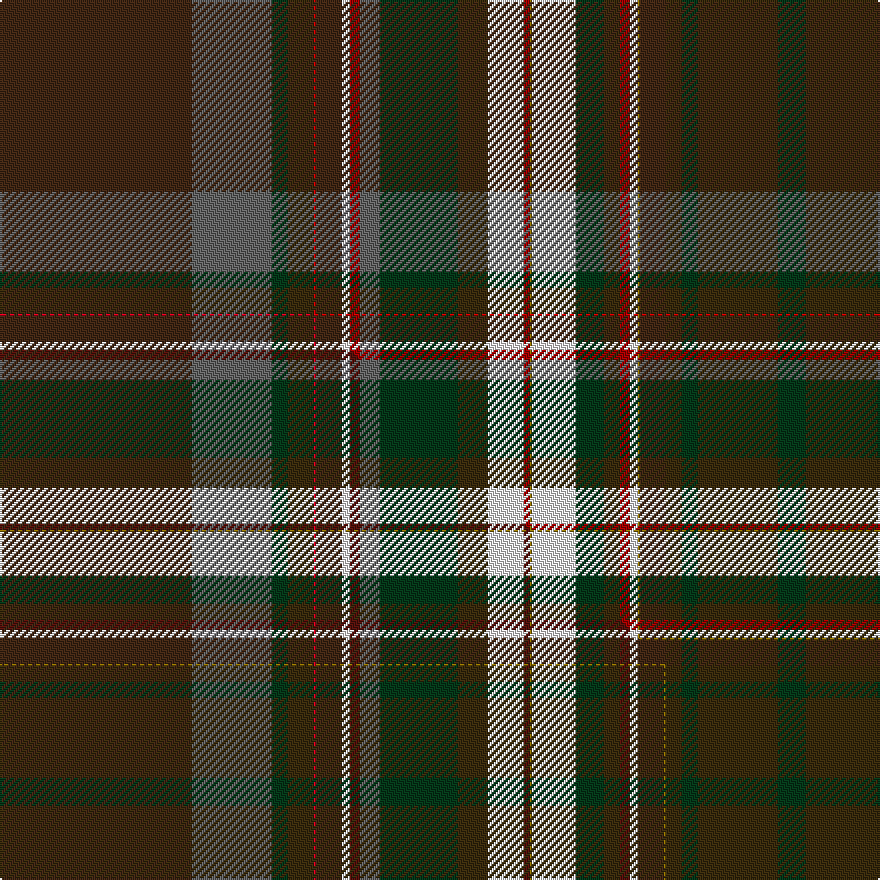

This is one **variant** — a specific cloth: this exact thread count and colourway, with its own
provenance below. It is one weaving of the [sett](/setts/do96n40dg8dy13ri1do13w4r5n10dg39dy15w18r3y1w22dg14dy8r5w4y1do13dy8dg8dy40dg14/) (the scale-free proportion — the
same cloth at any scale or shade), whose colour order is pattern [BBGGRBWRBGGWRGWGGRWGBGGGG](/stripes/bbggrbwrbggwrgwggrwgbgggg/).

Part of the [Wirth, Iwan](/tartans/w/wi/wirth-iwan/) tartan — the named design grouping this sett with its other cloths.

Sourced from tartans-authority.  It is a [25 stripe tartan](/stripes/stripes25/).

Original link [https://www.tartanregister.gov.uk/tartanDetails.aspx?ref=10963](https://www.tartanregister.gov.uk/tartanDetails.aspx?ref=10963)

Dataset <small>— provenance for this record, inherited from the source manifest</small>

<dl class="dataset-prov">
<dt>source</dt><dd><a href="/sources/tartans-authority/">Scottish Tartans Authority</a></dd>
<dt>data captured from</dt><dd><a href="https://github.com/thetartan/tartan-database/blob/master/data/tartans-authority/data.csv">https://github.com/thetartan/tartan-database/blob/master/data/tartans-authority/data.csv</a></dd>
<dt>data date</dt><dd>2013 <small>(this record)</small></dd>
<dt>licence</dt><dd><a href="https://creativecommons.org/licenses/by-nc-nd/4.0/">CC BY-NC-ND 4.0</a></dd>
</dl>

Capture chain <small>— the hands this data passed through, oldest first; each capture carries its own licence</small>

<ol class="capture-chain">
<li><a href="https://www.tartansauthority.com/">Scottish Tartans Authority</a> <small>the heritage body's archive — its tartan-ferret record browser is retired (links repaired to the SRT, above)</small></li>
<li><a href="https://github.com/thetartan/tartan-database">thetartan/tartan-database</a> <small>2016-2017</small> · <a href="https://creativecommons.org/licenses/by-nc-nd/4.0/">CC BY-NC-ND 4.0</a> <small>Levko Kravets's frozen compilation — the capture we vendored, and where its CC licence text came from</small></li>
<li>this dictionary <small>captured 2026-06-10 · commit 5bf86c7566</small> <small>each re-capture is a git commit to data/sources</small></li>
</ol>

## Register references

External register numbers recorded for this tartan.

- Scottish Register of Tartans: [10963](https://www.tartanregister.gov.uk/tartanDetails?ref=10963)
- Scottish Tartans Authority (ITI): 10963

## Thread count
DO/96 N40 DG8 DY13 Ri1 DO13 W4 R5 N10 DG39 DY15 W18 R3 Y1 W22 DG14 DY8 R5 W4 Y1 DO13 DY8 DG8 DY40 DG/14

One full sett is **696 threads**.

## Palette
<table><thead><tr><th>Colour</th><th>Shade</th><th>OKLCh</th></tr></thead><tbody><tr><td>DG</td><td><code style="background-color:#053819;">#053819</code> <small style="color:#888">#053819</small></td><td><small style="color:#888">oklch(30.0% 0.075 151.3)</small></td></tr><tr><td>DO</td><td><code style="background-color:#412714;">#412714</code> <small style="color:#888">#412714</small></td><td><small style="color:#888">oklch(30.1% 0.050 55.7)</small></td></tr><tr><td>R</td><td><code style="background-color:#A00000;">#A00000</code> <small style="color:#888">#A00000</small></td><td><small style="color:#888">oklch(44.3% 0.182 29.2)</small></td></tr><tr><td>N</td><td><code style="background-color:#636363;">#636363</code> <small style="color:#888">#636363</small></td><td><small style="color:#888">oklch(50.0% 0.000 89.9)</small></td></tr><tr><td>R</td><td><code style="background-color:#C80000;">#C80000</code> <small style="color:#888">#C80000</small></td><td><small style="color:#888">oklch(52.3% 0.215 29.2)</small></td></tr><tr><td>DY</td><td><code style="background-color:#3A2B0D;">#3A2B0D</code> <small style="color:#888">#3A2B0D</small></td><td><small style="color:#888">oklch(30.0% 0.049 82.0)</small></td></tr><tr><td>W</td><td><code style="background-color:#F7F7F7;">#F7F7F7</code> <small style="color:#888">#F7F7F7</small></td><td><small style="color:#888">oklch(97.6% 0.000 89.9)</small></td></tr><tr><td>Y</td><td><code style="background-color:#8B6E00;">#8B6E00</code> <small style="color:#888">#8B6E00</small></td><td><small style="color:#888">oklch(55.1% 0.113 90.4)</small></td></tr></tbody></table>

# Sample pattern

## Compared to the master

This cloth is one sett of its design; the master sett (the exemplar the design is anchored on) is below for comparison.

Its **ΔTartan distance** from the master is **0.61** — the same measure the nearest-tartans table ranks by (0 is identical; a re-scale of the same cloth is near 0, a recolour or a different proportion further).

<figure class="master-compare" style="margin:0">

this sett
master sett ★

<figcaption style="color:#888;font-size:smaller">One weave of this sett against the <a href="/setts/do96n40dg8dy13r1do13w4dr5n10dg39dy15w18dr3y1w22dg14dy8dr5w4do13y1dy8dg8dy40dg14/">master sett ★</a>, split on the diagonal: a shared proportion runs seamlessly across it with only the shades shifting; a different proportion breaks on it.</figcaption>
</figure>

## Nearest tartan variants

The nearest existing variants by ΔTartan distance, with this cloth at the top so the swatches line up against it.

ΔTartan

Threads

Variant

Sett

—

696

<a href="/variants/s25/do96n40dg8dy13ri1do13w4r5n10dg39dy15w18r3y1w22dg14dy8r5w4y1do13dy8dg8dy40dg14~ri2109032-r1807033/">Wirth, Iwan (Personal)</a>

<a href="/ttd/edit/#slug=do96n40dg8dy13r1do13w4dr5n10dg39dy15w18dr3y1w22dg14dy8dr5w4do13y1dy8dg8dy40dg14&amp;base=do96n40dg8dy13ri1do13w4r5n10dg39dy15w18r3y1w22dg14dy8r5w4y1do13dy8dg8dy40dg14~ri2109032-r1807033" title="compare in the TTD">0.61</a>

696

<a href="/variants/s25/do96n40dg8dy13r1do13w4dr5n10dg39dy15w18dr3y1w22dg14dy8dr5w4do13y1dy8dg8dy40dg14/">Wirth, Iwan (Personal)</a>

<a href="/ttd/edit/#slug=r16w4dy100w4db34g30y10w3g16dp12w4db16do64r26w4~dp1607327&amp;base=do96n40dg8dy13ri1do13w4r5n10dg39dy15w18r3y1w22dg14dy8r5w4y1do13dy8dg8dy40dg14~ri2109032-r1807033" title="compare in the TTD">2.03</a>

666

<a href="/variants/s15/r16w4dy100w4db34g30y10w3g16dp12w4db16do64r26w4~dp1607327/">Unnamed C18th - Prince Charles Edward</a>

<a href="/ttd/edit/#slug=r16w4o100w4db34g30y10w3g16b12w4db16do64r26w4&amp;base=do96n40dg8dy13ri1do13w4r5n10dg39dy15w18r3y1w22dg14dy8r5w4y1do13dy8dg8dy40dg14~ri2109032-r1807033" title="compare in the TTD">3.56</a>

666

<a href="/variants/s15/r16w4o100w4db34g30y10w3g16b12w4db16do64r26w4/">Stuart / Stewart, Plaid</a>

## Neighbour map

Every grey dot is one of 13621 variants placed by the first two principal components of the ΔTartan feature space (42% of its variance). Red is this tartan; blue dots are its nearest — click one to open its page.

<svg viewBox="0 0 640 380" role="img" style="max-width:100%;height:auto;border:1px solid #e0e0e0;border-radius:4px;display:block" xmlns="http://www.w3.org/2000/svg"><image href="/nn/cloud.v1.png" width="640" height="380"/><a href="/variants/s25/do96n40dg8dy13r1do13w4dr5n10dg39dy15w18dr3y1w22dg14dy8dr5w4do13y1dy8dg8dy40dg14/"><circle cx="151.6" cy="32.1" r="4" fill="#3465a4"><title>Wirth, Iwan (Personal)</title></circle></a><a href="/variants/s15/r16w4dy100w4db34g30y10w3g16dp12w4db16do64r26w4~dp1607327/"><circle cx="123.9" cy="48.6" r="4" fill="#3465a4"><title>Unnamed C18th - Prince Charles Edward</title></circle></a><a href="/variants/s15/r16w4o100w4db34g30y10w3g16b12w4db16do64r26w4/"><circle cx="130.9" cy="68.7" r="4" fill="#3465a4"><title>Stuart / Stewart, Plaid</title></circle></a><circle cx="149.3" cy="30.8" r="5" fill="#c00000"/><text x="320" y="376" text-anchor="middle" font-size="11" fill="#999">ground</text><text x="11" y="190" text-anchor="middle" font-size="11" fill="#999" transform="rotate(-90 11 190)">complexity</text></svg>

ID: /variants/s25/do96n40dg8dy13ri1do13w4r5n10dg39dy15w18r3y1w22dg14dy8r5w4y1do13dy8dg8dy40dg14~ri2109032-r1807033/
