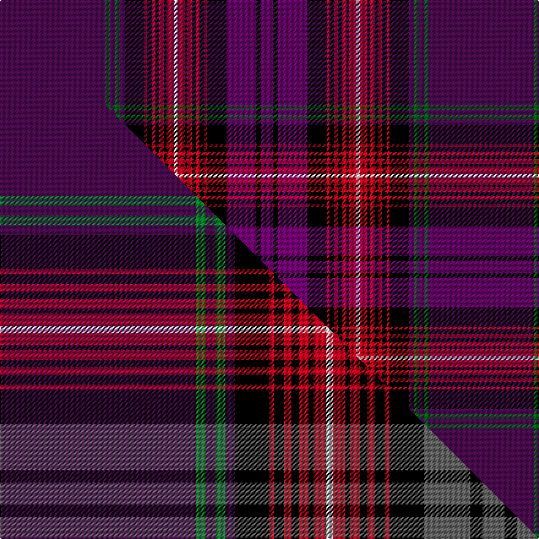

This is one **variant** — a specific cloth: this exact thread count and colourway, with its own
provenance below. It is one weaving of the [sett](/setts/dp86dg4dp4dg4dp4k16r2k4r3k3r4k2r6w3r6k2r4k3r3k4r2k16dpi24k4dpi10/) (the scale-free proportion — the
same cloth at any scale or shade), whose colour order is pattern [BGBGBKRKRKRKRWRKRKRKRKBKB](/stripes/bgbgbkrkrkrkrwrkrkrkrkbkb/).

Part of the [Arran](/tartans/arran/) tartan — the named design grouping this sett with its other cloths.

Sourced from tartans-authority.  It is a [25 stripe tartan](/stripes/stripes25/).

Original link [https://www.tartanregister.gov.uk/tartanDetails.aspx?ref=381](https://www.tartanregister.gov.uk/tartanDetails.aspx?ref=381)

Dataset <small>— provenance for this record, inherited from the source manifest</small>

<dl class="dataset-prov">
<dt>source</dt><dd><a href="/sources/tartans-authority/">Scottish Tartans Authority</a></dd>
<dt>data captured from</dt><dd><a href="https://github.com/thetartan/tartan-database/blob/master/data/tartans-authority/data.csv">https://github.com/thetartan/tartan-database/blob/master/data/tartans-authority/data.csv</a></dd>
<dt>data date</dt><dd>pre 1981 <small>(this record)</small></dd>
<dt>licence</dt><dd><a href="https://creativecommons.org/licenses/by-nc-nd/4.0/">CC BY-NC-ND 4.0</a></dd>
</dl>

Capture chain <small>— the hands this data passed through, oldest first; each capture carries its own licence</small>

<ol class="capture-chain">
<li><a href="https://www.tartansauthority.com/">Scottish Tartans Authority</a> <small>the heritage body's archive — its tartan-ferret record browser is retired (links repaired to the SRT, above)</small></li>
<li><a href="https://github.com/thetartan/tartan-database">thetartan/tartan-database</a> <small>2016-2017</small> · <a href="https://creativecommons.org/licenses/by-nc-nd/4.0/">CC BY-NC-ND 4.0</a> <small>Levko Kravets's frozen compilation — the capture we vendored, and where its CC licence text came from</small></li>
<li>this dictionary <small>captured 2026-06-10 · commit 5bf86c7566</small> <small>each re-capture is a git commit to data/sources</small></li>
</ol>

## Register references

External register numbers recorded for this tartan.

- Scottish Tartans Authority (ITI): 381

## Thread count
DP/86 DG4 DP4 DG4 DP4 K16 R2 K4 R3 K3 R4 K2 R6 W3 R6 K2 R4 K3 R3 K4 R2 K16 DPi24 K4 DPi/10

One full sett is **350 threads**.

## Palette
<table><thead><tr><th>Colour</th><th>Shade</th><th>OKLCh</th></tr></thead><tbody><tr><td>K</td><td><code style="background-color:#000000;">#000000</code> <small style="color:#888">#000000</small></td><td><small style="color:#888">oklch(0.0% 0.000 0.0)</small></td></tr><tr><td>DG</td><td><code style="background-color:#006818;">#006818</code> <small style="color:#888">#006818</small></td><td><small style="color:#888">oklch(45.0% 0.142 145.0)</small></td></tr><tr><td>W</td><td><code style="background-color:#F7F7F7;">#F7F7F7</code> <small style="color:#888">#F7F7F7</small></td><td><small style="color:#888">oklch(97.6% 0.000 89.9)</small></td></tr><tr><td>DP</td><td><code style="background-color:#780078;">#780078</code> <small style="color:#888">#780078</small></td><td><small style="color:#888">oklch(40.2% 0.185 328.4)</small></td></tr><tr><td>DP</td><td><code style="background-color:#4B0B4F;">#4B0B4F</code> <small style="color:#888">#4B0B4F</small></td><td><small style="color:#888">oklch(30.1% 0.125 325.4)</small></td></tr><tr><td>R</td><td><code style="background-color:#D60020;">#D60020</code> <small style="color:#888">#D60020</small></td><td><small style="color:#888">oklch(55.2% 0.224 25.5)</small></td></tr></tbody></table>

# Sample pattern

## Compared to the master

This cloth is one sett of its design; the master sett (the exemplar the design is anchored on) is below for comparison.

Its **ΔTartan distance** from the master is **2.31** — the same measure the nearest-tartans table ranks by (0 is identical; a re-scale of the same cloth is near 0, a recolour or a different proportion further).

<figure class="master-compare" style="margin:0">

this sett
master sett ★

<figcaption style="color:#888;font-size:smaller">One weave of this sett against the <a href="/setts/dp80g4dp4g4dp4k14r2k4r3k3r4k2r5w3r5k2r4k3r3k4r2k14n19k5n9/">master sett ★</a>, split on the diagonal: a shared proportion runs seamlessly across it with only the shades shifting; a different proportion breaks on it.</figcaption>
</figure>

## Nearest tartan variants

The nearest existing variants by ΔTartan distance, with this cloth at the top so the swatches line up against it.

ΔTartan

Threads

Variant

Sett

—

350

<a href="/variants/s25/dp86dg4dp4dg4dp4k16r2k4r3k3r4k2r6w3r6k2r4k3r3k4r2k16dpi24k4dpi10~dg1806142-dpi1607327/">Arran - 1978 (Fashion)</a>

<a href="/ttd/edit/#slug=dp80g4dp4g4dp4k14r2k4r3k3r4k2r5w3r5k2r4k3r3k4r2k14n19k5n9~x2&amp;base=dp86dg4dp4dg4dp4k16r2k4r3k3r4k2r6w3r6k2r4k3r3k4r2k16dpi24k4dpi10~dg1806142-dpi1607327" title="compare in the TTD">2.31</a>

646

<a href="/variants/s25/dp80g4dp4g4dp4k14r2k4r3k3r4k2r5w3r5k2r4k3r3k4r2k14n19k5n9~x2/">Arran</a>

<a href="/ttd/edit/#slug=dp40g2dp2g2dp2k7r1k2r2k2r2k1r3w2r3k1r2k2r2k2r1k7n10k2n4~x2&amp;base=dp86dg4dp4dg4dp4k16r2k4r3k3r4k2r6w3r6k2r4k3r3k4r2k16dpi24k4dpi10~dg1806142-dpi1607327" title="compare in the TTD">2.32</a>

336

<a href="/variants/s25/dp40g2dp2g2dp2k7r1k2r2k2r2k1r3w2r3k1r2k2r2k2r1k7n10k2n4~x2/">Isle of Arran (Lochcarron) (Fashion)</a>

<a href="/ttd/edit/#slug=dp90n5dp5n5dp5k16r3k5r4k4r5k3r6w4r6k3r5k4r4k5r3k16n22k5&amp;base=dp86dg4dp4dg4dp4k16r2k4r3k3r4k2r6w3r6k2r4k3r3k4r2k16dpi24k4dpi10~dg1806142-dpi1607327" title="compare in the TTD">2.71</a>

371

<a href="/variants/s24/dp90n5dp5n5dp5k16r3k5r4k4r5k3r6w4r6k3r5k4r4k5r3k16n22k5/">Arran District Tartan</a>

<a href="/ttd/edit/#slug=dp86n4dp4n4dp4k16dr2k4dr3k3dr4k2dr6w3dr6k2dr4k3dr3k4dr2k16n24k4n10~x2&amp;base=dp86dg4dp4dg4dp4k16r2k4r3k3r4k2r6w3r6k2r4k3r3k4r2k16dpi24k4dpi10~dg1806142-dpi1607327" title="compare in the TTD">2.82</a>

700

<a href="/variants/s25/dp86n4dp4n4dp4k16dr2k4dr3k3dr4k2dr6w3dr6k2dr4k3dr3k4dr2k16n24k4n10~x2/">Arran, Isle of (Strathmore)</a>

<a href="/ttd/edit/#slug=dp96g10dp8g8dp10k34r1k6r4k4r6k2r7w3r7k2r6k4r4k6r1k34lb36k6lb18~x2&amp;base=dp86dg4dp4dg4dp4k16r2k4r3k3r4k2r6w3r6k2r4k3r3k4r2k16dpi24k4dpi10~dg1806142-dpi1607327" title="compare in the TTD">3.43</a>

1064

<a href="/variants/s25/dp96g10dp8g8dp10k34r1k6r4k4r6k2r7w3r7k2r6k4r4k6r1k34lb36k6lb18~x2/">Unidentified #52</a>

<a href="/ttd/edit/#slug=lr6k2dr40k16db6k2db4k2n4k2lb2k2n4db7k2n6db1dr4~x2&amp;base=dp86dg4dp4dg4dp4k16r2k4r3k3r4k2r6w3r6k2r4k3r3k4r2k16dpi24k4dpi10~dg1806142-dpi1607327" title="compare in the TTD">3.47</a>

428

<a href="/variants/s18/lr6k2dr40k16db6k2db4k2n4k2lb2k2n4db7k2n6db1dr4~x2/">Breeding (Name)</a>

<a href="/ttd/edit/#slug=dp42dt3g1dt2dpi1dt2dp2k20dt1dpi2dt3g1dt2dpi1dt2dp2g3dt1g2ly1g2k2~x2~dp1105325-dt1204274-g1903114-dpi1607327&amp;base=dp86dg4dp4dg4dp4k16r2k4r3k3r4k2r6w3r6k2r4k3r3k4r2k16dpi24k4dpi10~dg1806142-dpi1607327" title="compare in the TTD">3.65</a>

304

<a href="/variants/s22/dp42db3g1db2dpi1db2dp2k20db1dpi2db3g1db2dpi1db2dp2g3db1g2ly1g2k2~x2~dp1105325-db1204274-g1903114-dpi1607327/">Monarch of the Glen Fashion Tartan</a>

<a href="/ttd/edit/#slug=lr6k2dr40k16db6k2db4k2n4k2lb2k2n4db7k2n6db1dr4~x2~db1404245&amp;base=dp86dg4dp4dg4dp4k16r2k4r3k3r4k2r6w3r6k2r4k3r3k4r2k16dpi24k4dpi10~dg1806142-dpi1607327" title="compare in the TTD">3.74</a>

428

<a href="/variants/s18/lr6k2dr40k16db6k2db4k2n4k2lb2k2n4db7k2n6db1dr4~x2~db1404245/">Breeding</a>

<a href="/ttd/edit/#slug=db20y1dy1db3k1o2k1r10k1o2r4~x2~o2500000&amp;base=dp86dg4dp4dg4dp4k16r2k4r3k3r4k2r6w3r6k2r4k3r3k4r2k16dpi24k4dpi10~dg1806142-dpi1607327" title="compare in the TTD">3.98</a>

136

<a href="/variants/s11/db20y1dy1db3k1o2k1r10k1o2r4~x2~o2500000/">Blais Family Tartan</a>

## Neighbour map

Every grey dot is one of 13621 variants placed by the first two principal components of the ΔTartan feature space (42% of its variance). Red is this tartan; blue dots are its nearest — click one to open its page.

<svg viewBox="0 0 640 380" role="img" style="max-width:100%;height:auto;border:1px solid #e0e0e0;border-radius:4px;display:block" xmlns="http://www.w3.org/2000/svg"><image href="/nn/cloud.v1.png" width="640" height="380"/><a href="/variants/s25/dp80g4dp4g4dp4k14r2k4r3k3r4k2r5w3r5k2r4k3r3k4r2k14n19k5n9~x2/"><circle cx="213.3" cy="14.0" r="4" fill="#3465a4"><title>Arran</title></circle></a><a href="/variants/s25/dp40g2dp2g2dp2k7r1k2r2k2r2k1r3w2r3k1r2k2r2k2r1k7n10k2n4~x2/"><circle cx="202.6" cy="14.0" r="4" fill="#3465a4"><title>Isle of Arran (Lochcarron) (Fashion)</title></circle></a><a href="/variants/s24/dp90n5dp5n5dp5k16r3k5r4k4r5k3r6w4r6k3r5k4r4k5r3k16n22k5/"><circle cx="226.5" cy="26.3" r="4" fill="#3465a4"><title>Arran District Tartan</title></circle></a><a href="/variants/s25/dp86n4dp4n4dp4k16dr2k4dr3k3dr4k2dr6w3dr6k2dr4k3dr3k4dr2k16n24k4n10~x2/"><circle cx="269.4" cy="25.9" r="4" fill="#3465a4"><title>Arran, Isle of (Strathmore)</title></circle></a><a href="/variants/s25/dp96g10dp8g8dp10k34r1k6r4k4r6k2r7w3r7k2r6k4r4k6r1k34lb36k6lb18~x2/"><circle cx="128.7" cy="14.0" r="4" fill="#3465a4"><title>Unidentified #52</title></circle></a><a href="/variants/s18/lr6k2dr40k16db6k2db4k2n4k2lb2k2n4db7k2n6db1dr4~x2/"><circle cx="200.7" cy="40.3" r="4" fill="#3465a4"><title>Breeding (Name)</title></circle></a><a href="/variants/s22/dp42db3g1db2dpi1db2dp2k20db1dpi2db3g1db2dpi1db2dp2g3db1g2ly1g2k2~x2~dp1105325-db1204274-g1903114-dpi1607327/"><circle cx="304.9" cy="19.3" r="4" fill="#3465a4"><title>Monarch of the Glen Fashion Tartan</title></circle></a><a href="/variants/s18/lr6k2dr40k16db6k2db4k2n4k2lb2k2n4db7k2n6db1dr4~x2~db1404245/"><circle cx="203.4" cy="41.8" r="4" fill="#3465a4"><title>Breeding</title></circle></a><a href="/variants/s11/db20y1dy1db3k1o2k1r10k1o2r4~x2~o2500000/"><circle cx="170.9" cy="56.4" r="4" fill="#3465a4"><title>Blais Family Tartan</title></circle></a><circle cx="226.1" cy="14.0" r="5" fill="#c00000"/><text x="320" y="376" text-anchor="middle" font-size="11" fill="#999">ground</text><text x="11" y="190" text-anchor="middle" font-size="11" fill="#999" transform="rotate(-90 11 190)">complexity</text></svg>

ID: /variants/s25/dp86dg4dp4dg4dp4k16r2k4r3k3r4k2r6w3r6k2r4k3r3k4r2k16dpi24k4dpi10~dg1806142-dpi1607327/
