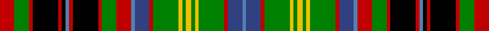

This page is one **sett** — a single exact thread-count. It belongs to the [tartan](/setts/r8g8r2k14r2k2t2r2k14r2g8r8t2db8r2g14ly2g2ly3g2ly2g14r2db8t2/)
(the same proportion at any scale), whose colour order is pattern [BBRGYGYGYGRBBRGRKRBKRKRGR](/stripes/bbrgygygygrbbrgrkrbkrkrgr/).

Part of the [Gordonstoun](/tartans/gordonstoun/) tartan — the named design grouping this sett with its other cloths.

Sourced from weddslist.  It is a [25 stripe tartan](/stripes/stripes25/).

Original link http://www.weddslist.com/cgi-bin/tartans/pg.pl?source=sts

## Also known as

This cloth is also recorded under:

- Gordonstoun #2
- Gordonstoun #3

## Thread count
R/16 G16 R4 K28 R4 K4 Ba4 R4 K28 R4 G16 R16 Ba4 B16 R4 G28 Y4 G4 Y6 G4 Y4 G28 R4 B16 Ba/4

One full sett is **520 threads**.

## Palette

Palette: <strong>Ingles Buchan</strong> <small style="color:#888">(1 of 6 colours)</small>
<table><thead><tr><th>Colour</th><th>Threads</th><th>Shade</th><th>Base</th><th>OKLCh</th></tr></thead><tbody><tr><td>R/</td><td style="text-align:right;font-variant-numeric:tabular-nums">16</td><td><code style="background-color:#C00000;">#C00000</code> <small style="color:#888">#C00000</small></td><td>R <code style="background-color:#CC0000;">#CC0000</code></td><td><small style="color:#888">oklch(50.7% 0.208 29.2)</small></td></tr><tr><td>G</td><td style="text-align:right;font-variant-numeric:tabular-nums">16</td><td><code style="background-color:#008000;">#008000</code> <small style="color:#888">#008000</small></td><td>G <code style="background-color:#006100;">#006100</code></td><td><small style="color:#888">oklch(52.0% 0.177 142.5)</small></td></tr><tr><td>R</td><td style="text-align:right;font-variant-numeric:tabular-nums">4</td><td><code style="background-color:#C00000;">#C00000</code> <small style="color:#888">#C00000</small></td><td>R <code style="background-color:#CC0000;">#CC0000</code></td><td><small style="color:#888">oklch(50.7% 0.208 29.2)</small></td></tr><tr><td>K</td><td style="text-align:right;font-variant-numeric:tabular-nums">28</td><td><code style="background-color:#000000;">#000000</code> <small style="color:#888">#000000</small></td><td>K <code style="background-color:#000000;">#000000</code></td><td><small style="color:#888">oklch(0.0% 0.000 0.0)</small></td></tr><tr><td>R</td><td style="text-align:right;font-variant-numeric:tabular-nums">4</td><td><code style="background-color:#C00000;">#C00000</code> <small style="color:#888">#C00000</small></td><td>R <code style="background-color:#CC0000;">#CC0000</code></td><td><small style="color:#888">oklch(50.7% 0.208 29.2)</small></td></tr><tr><td>K</td><td style="text-align:right;font-variant-numeric:tabular-nums">4</td><td><code style="background-color:#000000;">#000000</code> <small style="color:#888">#000000</small></td><td>K <code style="background-color:#000000;">#000000</code></td><td><small style="color:#888">oklch(0.0% 0.000 0.0)</small></td></tr><tr><td>Ba</td><td style="text-align:right;font-variant-numeric:tabular-nums">4</td><td><code style="background-color:#5480B0;">#5480B0</code> <small style="color:#888">#5480B0</small></td><td>B <code style="background-color:#2A418A;">#2A418A</code></td><td><small style="color:#888">oklch(58.8% 0.089 251.5)</small></td></tr><tr><td>R</td><td style="text-align:right;font-variant-numeric:tabular-nums">4</td><td><code style="background-color:#C00000;">#C00000</code> <small style="color:#888">#C00000</small></td><td>R <code style="background-color:#CC0000;">#CC0000</code></td><td><small style="color:#888">oklch(50.7% 0.208 29.2)</small></td></tr><tr><td>K</td><td style="text-align:right;font-variant-numeric:tabular-nums">28</td><td><code style="background-color:#000000;">#000000</code> <small style="color:#888">#000000</small></td><td>K <code style="background-color:#000000;">#000000</code></td><td><small style="color:#888">oklch(0.0% 0.000 0.0)</small></td></tr><tr><td>R</td><td style="text-align:right;font-variant-numeric:tabular-nums">4</td><td><code style="background-color:#C00000;">#C00000</code> <small style="color:#888">#C00000</small></td><td>R <code style="background-color:#CC0000;">#CC0000</code></td><td><small style="color:#888">oklch(50.7% 0.208 29.2)</small></td></tr><tr><td>G</td><td style="text-align:right;font-variant-numeric:tabular-nums">16</td><td><code style="background-color:#008000;">#008000</code> <small style="color:#888">#008000</small></td><td>G <code style="background-color:#006100;">#006100</code></td><td><small style="color:#888">oklch(52.0% 0.177 142.5)</small></td></tr><tr><td>R</td><td style="text-align:right;font-variant-numeric:tabular-nums">16</td><td><code style="background-color:#C00000;">#C00000</code> <small style="color:#888">#C00000</small></td><td>R <code style="background-color:#CC0000;">#CC0000</code></td><td><small style="color:#888">oklch(50.7% 0.208 29.2)</small></td></tr><tr><td>Ba</td><td style="text-align:right;font-variant-numeric:tabular-nums">4</td><td><code style="background-color:#5480B0;">#5480B0</code> <small style="color:#888">#5480B0</small></td><td>B <code style="background-color:#2A418A;">#2A418A</code></td><td><small style="color:#888">oklch(58.8% 0.089 251.5)</small></td></tr><tr><td>B</td><td style="text-align:right;font-variant-numeric:tabular-nums">16</td><td><code style="background-color:#304080;">#304080</code> <small style="color:#888">#304080</small></td><td>B <code style="background-color:#2A418A;">#2A418A</code></td><td><small style="color:#888">oklch(39.4% 0.109 270.2)</small></td></tr><tr><td>R</td><td style="text-align:right;font-variant-numeric:tabular-nums">4</td><td><code style="background-color:#C00000;">#C00000</code> <small style="color:#888">#C00000</small></td><td>R <code style="background-color:#CC0000;">#CC0000</code></td><td><small style="color:#888">oklch(50.7% 0.208 29.2)</small></td></tr><tr><td>G</td><td style="text-align:right;font-variant-numeric:tabular-nums">28</td><td><code style="background-color:#008000;">#008000</code> <small style="color:#888">#008000</small></td><td>G <code style="background-color:#006100;">#006100</code></td><td><small style="color:#888">oklch(52.0% 0.177 142.5)</small></td></tr><tr><td>Y</td><td style="text-align:right;font-variant-numeric:tabular-nums">4</td><td><code style="background-color:#F0C000;">#F0C000</code> <small style="color:#888">#F0C000</small></td><td>Y <code style="background-color:#F2BF00;">#F2BF00</code></td><td><small style="color:#888">oklch(82.7% 0.169 90.5)</small></td></tr><tr><td>G</td><td style="text-align:right;font-variant-numeric:tabular-nums">4</td><td><code style="background-color:#008000;">#008000</code> <small style="color:#888">#008000</small></td><td>G <code style="background-color:#006100;">#006100</code></td><td><small style="color:#888">oklch(52.0% 0.177 142.5)</small></td></tr><tr><td>Y</td><td style="text-align:right;font-variant-numeric:tabular-nums">6</td><td><code style="background-color:#F0C000;">#F0C000</code> <small style="color:#888">#F0C000</small></td><td>Y <code style="background-color:#F2BF00;">#F2BF00</code></td><td><small style="color:#888">oklch(82.7% 0.169 90.5)</small></td></tr><tr><td>G</td><td style="text-align:right;font-variant-numeric:tabular-nums">4</td><td><code style="background-color:#008000;">#008000</code> <small style="color:#888">#008000</small></td><td>G <code style="background-color:#006100;">#006100</code></td><td><small style="color:#888">oklch(52.0% 0.177 142.5)</small></td></tr><tr><td>Y</td><td style="text-align:right;font-variant-numeric:tabular-nums">4</td><td><code style="background-color:#F0C000;">#F0C000</code> <small style="color:#888">#F0C000</small></td><td>Y <code style="background-color:#F2BF00;">#F2BF00</code></td><td><small style="color:#888">oklch(82.7% 0.169 90.5)</small></td></tr><tr><td>G</td><td style="text-align:right;font-variant-numeric:tabular-nums">28</td><td><code style="background-color:#008000;">#008000</code> <small style="color:#888">#008000</small></td><td>G <code style="background-color:#006100;">#006100</code></td><td><small style="color:#888">oklch(52.0% 0.177 142.5)</small></td></tr><tr><td>R</td><td style="text-align:right;font-variant-numeric:tabular-nums">4</td><td><code style="background-color:#C00000;">#C00000</code> <small style="color:#888">#C00000</small></td><td>R <code style="background-color:#CC0000;">#CC0000</code></td><td><small style="color:#888">oklch(50.7% 0.208 29.2)</small></td></tr><tr><td>B</td><td style="text-align:right;font-variant-numeric:tabular-nums">16</td><td><code style="background-color:#304080;">#304080</code> <small style="color:#888">#304080</small></td><td>B <code style="background-color:#2A418A;">#2A418A</code></td><td><small style="color:#888">oklch(39.4% 0.109 270.2)</small></td></tr><tr><td>Ba/</td><td style="text-align:right;font-variant-numeric:tabular-nums">4</td><td><code style="background-color:#5480B0;">#5480B0</code> <small style="color:#888">#5480B0</small></td><td>B <code style="background-color:#2A418A;">#2A418A</code></td><td><small style="color:#888">oklch(58.8% 0.089 251.5)</small></td></tr></tbody></table>

## Compared to the master

This cloth is one sett of its design; the master sett (the exemplar the design is anchored on) is below for comparison.

<figure style="margin:0"><figcaption style="color:#888;font-size:smaller">this sett</figcaption></figure>
<figure style="margin:0"><figcaption style="color:#888;font-size:smaller"><a href="/setts/k2r2k20r2g11r11lb2t11r2g19ly5g19r2t11lb2r11g11r2k20r2k2lb2/">master sett →</a></figcaption></figure>

## Nearest tartans

The nearest existing variants by ΔTartan distance, with this tartan at the top so the swatches line up against it.

ΔTartan

Tartan

Sett

—

<a href="/ttd/edit/#slug=r8g8r2k14r2k2t2r2k14r2g8r8t2db8r2g14ly2g2ly3g2ly2g14r2db8t2~x2">Gordonstoun</a> <a class="nn-out" href="/variants/s25/r8g8r2k14r2k2t2r2k14r2g8r8t2db8r2g14ly2g2ly3g2ly2g14r2db8t2~x2/" title="open its dictionary page">↗</a>

0.69

<a href="/ttd/edit/#slug=dbi6ly1dbi1g1dbi1g1dbi1g5k1g1k1g1k1g1k1g6r5dbi2r2db1r5~x4&amp;base=r8g8r2k14r2k2t2r2k14r2g8r8t2db8r2g14ly2g2ly3g2ly2g14r2db8t2~x2">Recovery</a> <a class="nn-out" href="/variants/s21/dbi6ly1dbi1g1dbi1g1dbi1g5k1g1k1g1k1g1k1g6r5dbi2r2db1r5~x4/" title="open its dictionary page">↗</a>

0.71

<a href="/ttd/edit/#slug=r4g4r1k7r1k1t1r1k7r1g4r4t1db4r1g7ly1g7r1db4t1~x4&amp;base=r8g8r2k14r2k2t2r2k14r2g8r8t2db8r2g14ly2g2ly3g2ly2g14r2db8t2~x2">Gordonstoun</a> <a class="nn-out" href="/variants/s21/r4g4r1k7r1k1t1r1k7r1g4r4t1db4r1g7ly1g7r1db4t1~x4/" title="open its dictionary page">↗</a>

0.86

<a href="/ttd/edit/#slug=db16k16dg2k2dg2k2dg16k2dg2k2dg2k16ly16k2db2r2k2ly16k16db16k2w3k2~x2&amp;base=r8g8r2k14r2k2t2r2k14r2g8r8t2db8r2g14ly2g2ly3g2ly2g14r2db8t2~x2">Ferrazza in Guidonia, Rome (Personal)</a> <a class="nn-out" href="/variants/s23/db16k16dg2k2dg2k2dg16k2dg2k2dg2k16ly16k2db2r2k2ly16k16db16k2w3k2~x2/" title="open its dictionary page">↗</a>

0.96

<a href="/ttd/edit/#slug=db16k16g2k2g2k2g16k2g2k2g2k16ly16k2db2r2k2ly16k16db16k2w3k2~x2&amp;base=r8g8r2k14r2k2t2r2k14r2g8r8t2db8r2g14ly2g2ly3g2ly2g14r2db8t2~x2">Ferrazza (Personal)</a> <a class="nn-out" href="/variants/s23/db16k16g2k2g2k2g16k2g2k2g2k16ly16k2db2r2k2ly16k16db16k2w3k2~x2/" title="open its dictionary page">↗</a>

1.03

<a href="/ttd/edit/#slug=r8dg8r2k14r2k2t2r2k14r2dg8r8t2db8r2dg14ly2dg2ly3dg2ly2dg14r2db8t2~x2&amp;base=r8g8r2k14r2k2t2r2k14r2g8r8t2db8r2g14ly2g2ly3g2ly2g14r2db8t2~x2">Gordonstoun (1957)</a> <a class="nn-out" href="/variants/s25/r8dg8r2k14r2k2t2r2k14r2dg8r8t2db8r2dg14ly2dg2ly3dg2ly2dg14r2db8t2~x2/" title="open its dictionary page">↗</a>

1.10

<a href="/ttd/edit/#slug=k12g2k2g2k2g16k3w3k3r12g6lo2g6r12k3w3k3g16k2g2k2g2k12lp2~x2&amp;base=r8g8r2k14r2k2t2r2k14r2g8r8t2db8r2g14ly2g2ly3g2ly2g14r2db8t2~x2">Kapasi (Personal)</a> <a class="nn-out" href="/variants/s24/k12g2k2g2k2g16k3w3k3r12g6lo2g6r12k3w3k3g16k2g2k2g2k12lp2~x2/" title="open its dictionary page">↗</a>

1.18

<a href="/ttd/edit/#slug=o16r2o2r2o2k16dg2b2dg2b2dg10r2g10b2g2b2g2k16o15r2o2~x2&amp;base=r8g8r2k14r2k2t2r2k14r2g8r8t2db8r2g14ly2g2ly3g2ly2g14r2db8t2~x2">Cherry Valley New York</a> <a class="nn-out" href="/variants/s21/o16r2o2r2o2k16dg2b2dg2b2dg10r2g10b2g2b2g2k16o15r2o2~x2/" title="open its dictionary page">↗</a>

1.20

<a href="/ttd/edit/#slug=k14g2t14g3t14g2k14g14w2g14k14r2g2r10ly4r10g2r2~x2&amp;base=r8g8r2k14r2k2t2r2k14r2g8r8t2db8r2g14ly2g2ly3g2ly2g14r2db8t2~x2">Langston (Personal)</a> <a class="nn-out" href="/variants/s18/k14g2t14g3t14g2k14g14w2g14k14r2g2r10ly4r10g2r2~x2/" title="open its dictionary page">↗</a>

1.29

<a href="/ttd/edit/#slug=p47k6r6k6p6k19g19k6g19ly6g19k6g19k19p6k6w6k6~x2&amp;base=r8g8r2k14r2k2t2r2k14r2g8r8t2db8r2g14ly2g2ly3g2ly2g14r2db8t2~x2">Unidentified, fragment</a> <a class="nn-out" href="/variants/s18/p47k6r6k6p6k19g19k6g19ly6g19k6g19k19p6k6w6k6~x2/" title="open its dictionary page">↗</a>

1.36

<a href="/ttd/edit/#slug=db6r2db7r2db7r2k7g8r2g3r2g5w2g5r2g3r2g8k9w15k9r2~x2&amp;base=r8g8r2k14r2k2t2r2k14r2g8r8t2db8r2g14ly2g2ly3g2ly2g14r2db8t2~x2">MacDonell of Glengarry, dress</a> <a class="nn-out" href="/variants/s22/db6r2db7r2db7r2k7g8r2g3r2g5w2g5r2g3r2g8k9w15k9r2~x2/" title="open its dictionary page">↗</a>

## Neighbour map

Every grey dot is one of 14360 variants placed by the first two principal components of the ΔTartan feature space (44% of its variance). Red is this tartan; blue dots are its nearest — click one to open its page.

<svg viewBox="0 0 640 380" role="img" style="max-width:100%;height:auto;border:1px solid #e0e0e0;border-radius:4px;display:block" xmlns="http://www.w3.org/2000/svg"><image href="/nn/cloud.v1.png" width="640" height="380"/><a href="/variants/s21/dbi6ly1dbi1g1dbi1g1dbi1g5k1g1k1g1k1g1k1g6r5dbi2r2db1r5~x4/"><circle cx="82.9" cy="132.1" r="4" fill="#3465a4"><title>Recovery</title></circle></a><a href="/variants/s21/r4g4r1k7r1k1t1r1k7r1g4r4t1db4r1g7ly1g7r1db4t1~x4/"><circle cx="71.4" cy="136.9" r="4" fill="#3465a4"><title>Gordonstoun</title></circle></a><a href="/variants/s23/db16k16dg2k2dg2k2dg16k2dg2k2dg2k16ly16k2db2r2k2ly16k16db16k2w3k2~x2/"><circle cx="108.9" cy="112.1" r="4" fill="#3465a4"><title>Ferrazza in Guidonia, Rome (Personal)</title></circle></a><a href="/variants/s23/db16k16g2k2g2k2g16k2g2k2g2k16ly16k2db2r2k2ly16k16db16k2w3k2~x2/"><circle cx="104.2" cy="107.3" r="4" fill="#3465a4"><title>Ferrazza (Personal)</title></circle></a><a href="/variants/s25/r8dg8r2k14r2k2t2r2k14r2dg8r8t2db8r2dg14ly2dg2ly3dg2ly2dg14r2db8t2~x2/"><circle cx="91.3" cy="129.4" r="4" fill="#3465a4"><title>Gordonstoun (1957)</title></circle></a><a href="/variants/s24/k12g2k2g2k2g16k3w3k3r12g6lo2g6r12k3w3k3g16k2g2k2g2k12lp2~x2/"><circle cx="126.9" cy="114.7" r="4" fill="#3465a4"><title>Kapasi (Personal)</title></circle></a><a href="/variants/s21/o16r2o2r2o2k16dg2b2dg2b2dg10r2g10b2g2b2g2k16o15r2o2~x2/"><circle cx="75.6" cy="108.9" r="4" fill="#3465a4"><title>Cherry Valley New York</title></circle></a><a href="/variants/s18/k14g2t14g3t14g2k14g14w2g14k14r2g2r10ly4r10g2r2~x2/"><circle cx="59.9" cy="150.1" r="4" fill="#3465a4"><title>Langston (Personal)</title></circle></a><a href="/variants/s18/p47k6r6k6p6k19g19k6g19ly6g19k6g19k19p6k6w6k6~x2/"><circle cx="84.2" cy="131.8" r="4" fill="#3465a4"><title>Unidentified, fragment</title></circle></a><a href="/variants/s22/db6r2db7r2db7r2k7g8r2g3r2g5w2g5r2g3r2g8k9w15k9r2~x2/"><circle cx="32.6" cy="144.7" r="4" fill="#3465a4"><title>MacDonell of Glengarry, dress</title></circle></a><circle cx="64.3" cy="118.2" r="5" fill="#c00000"/></svg>

ID: /variants/s25/r8g8r2k14r2k2t2r2k14r2g8r8t2db8r2g14ly2g2ly3g2ly2g14r2db8t2~x2/
