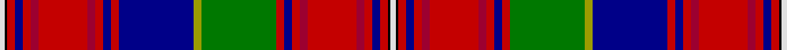

This page is one **sett** — a single exact thread-count. It belongs to the [tartan](/setts/w2k1r3db3r3ri3r19ri3r3db3r3db29ly3g29r3db3r3ri3r19ri3r3db3r3k1w2/)
(the same proportion at any scale), whose colour order is pattern [WKRBRRRRRBRBYGRBRRRRRBRKW](/stripes/wkrbrrrrrbrbygrbrrrrrbrkw/).

Part of the [Fitzgerald Dress](/tartans/fitzgerald-dress/) tartan — the named design grouping this sett with its other cloths.

Sourced from register-of-tartans.  It is a [25 stripe tartan](/stripes/stripes25/).

Original link https://www.tartanregister.gov.uk/tartanDetails.aspx?ref=1195

## Also known as

This cloth is also recorded under:

- Fitzgerald dress

## Register references

External register numbers recorded for this tartan.

- Scottish Register of Tartans: [1195](https://www.tartanregister.gov.uk/tartanDetails.aspx?ref=1195)
- Scottish Tartans Authority (ITI): 1818
- Scottish Tartans World Register: 1818

## Thread count
LN/8 K4 R12 DB12 R12 DR12 R76 DR12 R12 DB12 R12 DB116 LG12 G116 R12 DB12 R12 DR12 R76 DR12 R12 DB12 R12 K4 LN/8

One full sett is **1208 threads**.

## Palette

Palette: <strong>Tartan Register</strong> <small style="color:#888">(4 of 7 colours)</small>
<table><thead><tr><th>Colour</th><th>Threads</th><th>Shade</th><th>Base</th><th>OKLCh</th></tr></thead><tbody><tr><td>LN/</td><td style="text-align:right;font-variant-numeric:tabular-nums">8</td><td><code style="background-color:#E0E0E0;">#E0E0E0</code> <small style="color:#888">#E0E0E0</small></td><td>W <code style="background-color:#F7F7F7;">#F7F7F7</code></td><td><small style="color:#888">oklch(90.7% 0.000 89.9)</small></td></tr><tr><td>K</td><td style="text-align:right;font-variant-numeric:tabular-nums">4</td><td><code style="background-color:#000000;">#000000</code> <small style="color:#888">#000000</small></td><td>K <code style="background-color:#000000;">#000000</code></td><td><small style="color:#888">oklch(0.0% 0.000 0.0)</small></td></tr><tr><td>R</td><td style="text-align:right;font-variant-numeric:tabular-nums">12</td><td><code style="background-color:#C40000;">#C40000</code> <small style="color:#888">#C40000</small></td><td>R <code style="background-color:#CC0000;">#CC0000</code></td><td><small style="color:#888">oklch(51.5% 0.211 29.2)</small></td></tr><tr><td>DB</td><td style="text-align:right;font-variant-numeric:tabular-nums">12</td><td><code style="background-color:#000088;">#000088</code> <small style="color:#888">#000088</small></td><td>B <code style="background-color:#2A418A;">#2A418A</code></td><td><small style="color:#888">oklch(28.3% 0.196 264.1)</small></td></tr><tr><td>R</td><td style="text-align:right;font-variant-numeric:tabular-nums">12</td><td><code style="background-color:#C40000;">#C40000</code> <small style="color:#888">#C40000</small></td><td>R <code style="background-color:#CC0000;">#CC0000</code></td><td><small style="color:#888">oklch(51.5% 0.211 29.2)</small></td></tr><tr><td>DR</td><td style="text-align:right;font-variant-numeric:tabular-nums">12</td><td><code style="background-color:#9C0030;">#9C0030</code> <small style="color:#888">#9C0030</small></td><td>R <code style="background-color:#CC0000;">#CC0000</code></td><td><small style="color:#888">oklch(44.0% 0.176 15.7)</small></td></tr><tr><td>R</td><td style="text-align:right;font-variant-numeric:tabular-nums">76</td><td><code style="background-color:#C40000;">#C40000</code> <small style="color:#888">#C40000</small></td><td>R <code style="background-color:#CC0000;">#CC0000</code></td><td><small style="color:#888">oklch(51.5% 0.211 29.2)</small></td></tr><tr><td>DR</td><td style="text-align:right;font-variant-numeric:tabular-nums">12</td><td><code style="background-color:#9C0030;">#9C0030</code> <small style="color:#888">#9C0030</small></td><td>R <code style="background-color:#CC0000;">#CC0000</code></td><td><small style="color:#888">oklch(44.0% 0.176 15.7)</small></td></tr><tr><td>R</td><td style="text-align:right;font-variant-numeric:tabular-nums">12</td><td><code style="background-color:#C40000;">#C40000</code> <small style="color:#888">#C40000</small></td><td>R <code style="background-color:#CC0000;">#CC0000</code></td><td><small style="color:#888">oklch(51.5% 0.211 29.2)</small></td></tr><tr><td>DB</td><td style="text-align:right;font-variant-numeric:tabular-nums">12</td><td><code style="background-color:#000088;">#000088</code> <small style="color:#888">#000088</small></td><td>B <code style="background-color:#2A418A;">#2A418A</code></td><td><small style="color:#888">oklch(28.3% 0.196 264.1)</small></td></tr><tr><td>R</td><td style="text-align:right;font-variant-numeric:tabular-nums">12</td><td><code style="background-color:#C40000;">#C40000</code> <small style="color:#888">#C40000</small></td><td>R <code style="background-color:#CC0000;">#CC0000</code></td><td><small style="color:#888">oklch(51.5% 0.211 29.2)</small></td></tr><tr><td>DB</td><td style="text-align:right;font-variant-numeric:tabular-nums">116</td><td><code style="background-color:#000088;">#000088</code> <small style="color:#888">#000088</small></td><td>B <code style="background-color:#2A418A;">#2A418A</code></td><td><small style="color:#888">oklch(28.3% 0.196 264.1)</small></td></tr><tr><td>LG</td><td style="text-align:right;font-variant-numeric:tabular-nums">12</td><td><code style="background-color:#9C9C00;">#9C9C00</code> <small style="color:#888">#9C9C00</small></td><td>Y <code style="background-color:#F2BF00;">#F2BF00</code></td><td><small style="color:#888">oklch(67.1% 0.146 109.8)</small></td></tr><tr><td>G</td><td style="text-align:right;font-variant-numeric:tabular-nums">116</td><td><code style="background-color:#007800;">#007800</code> <small style="color:#888">#007800</small></td><td>G <code style="background-color:#006100;">#006100</code></td><td><small style="color:#888">oklch(49.6% 0.169 142.5)</small></td></tr><tr><td>R</td><td style="text-align:right;font-variant-numeric:tabular-nums">12</td><td><code style="background-color:#C40000;">#C40000</code> <small style="color:#888">#C40000</small></td><td>R <code style="background-color:#CC0000;">#CC0000</code></td><td><small style="color:#888">oklch(51.5% 0.211 29.2)</small></td></tr><tr><td>DB</td><td style="text-align:right;font-variant-numeric:tabular-nums">12</td><td><code style="background-color:#000088;">#000088</code> <small style="color:#888">#000088</small></td><td>B <code style="background-color:#2A418A;">#2A418A</code></td><td><small style="color:#888">oklch(28.3% 0.196 264.1)</small></td></tr><tr><td>R</td><td style="text-align:right;font-variant-numeric:tabular-nums">12</td><td><code style="background-color:#C40000;">#C40000</code> <small style="color:#888">#C40000</small></td><td>R <code style="background-color:#CC0000;">#CC0000</code></td><td><small style="color:#888">oklch(51.5% 0.211 29.2)</small></td></tr><tr><td>DR</td><td style="text-align:right;font-variant-numeric:tabular-nums">12</td><td><code style="background-color:#9C0030;">#9C0030</code> <small style="color:#888">#9C0030</small></td><td>R <code style="background-color:#CC0000;">#CC0000</code></td><td><small style="color:#888">oklch(44.0% 0.176 15.7)</small></td></tr><tr><td>R</td><td style="text-align:right;font-variant-numeric:tabular-nums">76</td><td><code style="background-color:#C40000;">#C40000</code> <small style="color:#888">#C40000</small></td><td>R <code style="background-color:#CC0000;">#CC0000</code></td><td><small style="color:#888">oklch(51.5% 0.211 29.2)</small></td></tr><tr><td>DR</td><td style="text-align:right;font-variant-numeric:tabular-nums">12</td><td><code style="background-color:#9C0030;">#9C0030</code> <small style="color:#888">#9C0030</small></td><td>R <code style="background-color:#CC0000;">#CC0000</code></td><td><small style="color:#888">oklch(44.0% 0.176 15.7)</small></td></tr><tr><td>R</td><td style="text-align:right;font-variant-numeric:tabular-nums">12</td><td><code style="background-color:#C40000;">#C40000</code> <small style="color:#888">#C40000</small></td><td>R <code style="background-color:#CC0000;">#CC0000</code></td><td><small style="color:#888">oklch(51.5% 0.211 29.2)</small></td></tr><tr><td>DB</td><td style="text-align:right;font-variant-numeric:tabular-nums">12</td><td><code style="background-color:#000088;">#000088</code> <small style="color:#888">#000088</small></td><td>B <code style="background-color:#2A418A;">#2A418A</code></td><td><small style="color:#888">oklch(28.3% 0.196 264.1)</small></td></tr><tr><td>R</td><td style="text-align:right;font-variant-numeric:tabular-nums">12</td><td><code style="background-color:#C40000;">#C40000</code> <small style="color:#888">#C40000</small></td><td>R <code style="background-color:#CC0000;">#CC0000</code></td><td><small style="color:#888">oklch(51.5% 0.211 29.2)</small></td></tr><tr><td>K</td><td style="text-align:right;font-variant-numeric:tabular-nums">4</td><td><code style="background-color:#000000;">#000000</code> <small style="color:#888">#000000</small></td><td>K <code style="background-color:#000000;">#000000</code></td><td><small style="color:#888">oklch(0.0% 0.000 0.0)</small></td></tr><tr><td>LN/</td><td style="text-align:right;font-variant-numeric:tabular-nums">8</td><td><code style="background-color:#E0E0E0;">#E0E0E0</code> <small style="color:#888">#E0E0E0</small></td><td>W <code style="background-color:#F7F7F7;">#F7F7F7</code></td><td><small style="color:#888">oklch(90.7% 0.000 89.9)</small></td></tr></tbody></table>

## Nearest tartans

The nearest existing variants by ΔTartan distance, with this tartan at the top so the swatches line up against it.

ΔTartan

Tartan

Sett

—

<a href="/ttd/edit/#slug=w2k1r3db3r3ri3r19ri3r3db3r3db29ly3g29r3db3r3ri3r19ri3r3db3r3k1w2~x4">Fitzgerald Dress</a> <a class="nn-out" href="/variants/s25/w2k1r3db3r3ri3r19ri3r3db3r3db29ly3g29r3db3r3ri3r19ri3r3db3r3k1w2~x4/" title="open its dictionary page">↗</a>

1.09

<a href="/variants/s24/r34w1db10dg10w1ly1dg2t2w1db2t10r6w1~x2/">Holyrood (Chair)</a>

1.21

<a href="/ttd/edit/#slug=r16g1r1g1r1g4k1w1k1ly1k1t6db4t6k1ly1k1w1k1g4r12g1r1k1~x2&amp;base=w2k1r3db3r3ri3r19ri3r3db3r3db29ly3g29r3db3r3ri3r19ri3r3db3r3k1w2~x4">Macan, of Lurgyvallan</a> <a class="nn-out" href="/variants/s24/r16g1r1g1r1g4k1w1k1ly1k1t6db4t6k1ly1k1w1k1g4r12g1r1k1~x2/" title="open its dictionary page">↗</a>

1.21

<a href="/ttd/edit/#slug=r40p5k26r4p10db14p10r5k2r5k2r5k2r5lr2dg26lb6lr2&amp;base=w2k1r3db3r3ri3r19ri3r3db3r3db29ly3g29r3db3r3ri3r19ri3r3db3r3k1w2~x4">Unnamed C18th - Hynde Cotton Jacket</a> <a class="nn-out" href="/variants/s18/r40p5k26r4p10db14p10r5k2r5k2r5k2r5lr2dg26lb6lr2/" title="open its dictionary page">↗</a>

1.23

<a href="/variants/s22/dy63k4lb9ly2db4ly2db4dy11r8lb2r4w5~x2/">Sellers/Sillars</a>

1.23

<a href="/ttd/edit/#slug=db41r2k42w2dg41r3ly2r3dg3r31k3ly2r3k5r3ly2k3r31db3r3ly2r3~x2&amp;base=w2k1r3db3r3ri3r19ri3r3db3r3db29ly3g29r3db3r3ri3r19ri3r3db3r3k1w2~x4">Hay or Leith</a> <a class="nn-out" href="/variants/s22/db41r2k42w2dg41r3ly2r3dg3r31k3ly2r3k5r3ly2k3r31db3r3ly2r3~x2/" title="open its dictionary page">↗</a>

1.31

<a href="/ttd/edit/#slug=r16g1r1g1r1g4k1lb1k1ly1k1t6db4t6k1ly1k1lb1k1g4r12g1r1k1~x4&amp;base=w2k1r3db3r3ri3r19ri3r3db3r3db29ly3g29r3db3r3ri3r19ri3r3db3r3k1w2~x4">Macan of Lurgyvallan</a> <a class="nn-out" href="/variants/s24/r16g1r1g1r1g4k1lb1k1ly1k1t6db4t6k1ly1k1lb1k1g4r12g1r1k1~x4/" title="open its dictionary page">↗</a>

1.32

<a href="/ttd/edit/#slug=w2r3k2r8g16k2w2k2ly1k10t6r32t6k10ly1k2w2k2g16r8k2r3w1~x4&amp;base=w2k1r3db3r3ri3r19ri3r3db3r3db29ly3g29r3db3r3ri3r19ri3r3db3r3k1w2~x4">Stewart</a> <a class="nn-out" href="/variants/s23/w2r3k2r8g16k2w2k2ly1k10t6r32t6k10ly1k2w2k2g16r8k2r3w1~x4/" title="open its dictionary page">↗</a>

1.36

<a href="/ttd/edit/#slug=k10r3ly3k6r48dg6r2ly2r6dg40w2k38r2dp40r6ly2r2dp6r48k6ly2r3k10&amp;base=w2k1r3db3r3ri3r19ri3r3db3r3db29ly3g29r3db3r3ri3r19ri3r3db3r3k1w2~x4">Hay &amp; Leith - 1800 (Clan)</a> <a class="nn-out" href="/variants/s23/k10r3ly3k6r48dg6r2ly2r6dg40w2k38r2dp40r6ly2r2dp6r48k6ly2r3k10/" title="open its dictionary page">↗</a>

1.37

<a href="/ttd/edit/#slug=k3r1ly1k2r16g2r1ly1r2g15w1k15r1db15r2ly1r1p2r16k2ly1r1k3~x2&amp;base=w2k1r3db3r3ri3r19ri3r3db3r3db29ly3g29r3db3r3ri3r19ri3r3db3r3k1w2~x4">Hay, or Leith</a> <a class="nn-out" href="/variants/s23/k3r1ly1k2r16g2r1ly1r2g15w1k15r1db15r2ly1r1p2r16k2ly1r1k3~x2/" title="open its dictionary page">↗</a>

1.38

<a href="/ttd/edit/#slug=k4w2k2w1t6r6g6w1g27w1db4t4dy3w1dy3t4db4w1r36db3t2w1t2db3~x2&amp;base=w2k1r3db3r3ri3r19ri3r3db3r3db29ly3g29r3db3r3ri3r19ri3r3db3r3k1w2~x4">Ross Wedding Dress</a> <a class="nn-out" href="/variants/s24/k4w2k2w1t6r6g6w1g27w1db4t4dy3w1dy3t4db4w1r36db3t2w1t2db3~x2/" title="open its dictionary page">↗</a>

## Neighbour map

Every grey dot is one of 14360 variants placed by the first two principal components of the ΔTartan feature space (44% of its variance). Red is this tartan; blue dots are its nearest — click one to open its page.

<svg viewBox="0 0 640 380" role="img" style="max-width:100%;height:auto;border:1px solid #e0e0e0;border-radius:4px;display:block" xmlns="http://www.w3.org/2000/svg"><image href="/nn/cloud.v1.png" width="640" height="380"/><a href="/variants/s24/r34w1db10dg10w1ly1dg2t2w1db2t10r6w1~x2/"><circle cx="177.3" cy="28.6" r="4" fill="#3465a4"><title>Holyrood (Chair)</title></circle></a><a href="/variants/s24/r16g1r1g1r1g4k1w1k1ly1k1t6db4t6k1ly1k1w1k1g4r12g1r1k1~x2/"><circle cx="168.7" cy="37.1" r="4" fill="#3465a4"><title>Macan, of Lurgyvallan</title></circle></a><a href="/variants/s18/r40p5k26r4p10db14p10r5k2r5k2r5k2r5lr2dg26lb6lr2/"><circle cx="141.3" cy="58.7" r="4" fill="#3465a4"><title>Unnamed C18th - Hynde Cotton Jacket</title></circle></a><a href="/variants/s22/dy63k4lb9ly2db4ly2db4dy11r8lb2r4w5~x2/"><circle cx="248.2" cy="14.0" r="4" fill="#3465a4"><title>Sellers/Sillars</title></circle></a><a href="/variants/s22/db41r2k42w2dg41r3ly2r3dg3r31k3ly2r3k5r3ly2k3r31db3r3ly2r3~x2/"><circle cx="171.5" cy="50.9" r="4" fill="#3465a4"><title>Hay or Leith</title></circle></a><a href="/variants/s24/r16g1r1g1r1g4k1lb1k1ly1k1t6db4t6k1ly1k1lb1k1g4r12g1r1k1~x4/"><circle cx="185.3" cy="43.8" r="4" fill="#3465a4"><title>Macan of Lurgyvallan</title></circle></a><a href="/variants/s23/w2r3k2r8g16k2w2k2ly1k10t6r32t6k10ly1k2w2k2g16r8k2r3w1~x4/"><circle cx="186.8" cy="42.0" r="4" fill="#3465a4"><title>Stewart</title></circle></a><a href="/variants/s23/k10r3ly3k6r48dg6r2ly2r6dg40w2k38r2dp40r6ly2r2dp6r48k6ly2r3k10/"><circle cx="204.6" cy="51.3" r="4" fill="#3465a4"><title>Hay &amp; Leith - 1800 (Clan)</title></circle></a><a href="/variants/s23/k3r1ly1k2r16g2r1ly1r2g15w1k15r1db15r2ly1r1p2r16k2ly1r1k3~x2/"><circle cx="135.4" cy="42.1" r="4" fill="#3465a4"><title>Hay, or Leith</title></circle></a><a href="/variants/s24/k4w2k2w1t6r6g6w1g27w1db4t4dy3w1dy3t4db4w1r36db3t2w1t2db3~x2/"><circle cx="164.0" cy="14.0" r="4" fill="#3465a4"><title>Ross Wedding Dress</title></circle></a><circle cx="184.6" cy="19.7" r="5" fill="#c00000"/></svg>

ID: /variants/s25/w2k1r3db3r3ri3r19ri3r3db3r3db29ly3g29r3db3r3ri3r19ri3r3db3r3k1w2~x4/
