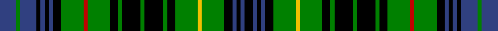

This page is one **sett** — a single exact thread-count. It belongs to the [tartan](/setts/db8g2db8k2db2k2db2k4g11r2g11k4g2k9g2k9g2k4g11ly2g11k4db2k2db2k4/)
(the same proportion at any scale), whose colour order is pattern [BGBKBKBKGRGKGKGKGKGYGKBKBK](/stripes/bgbkbkbkgrgkgkgkgkgygkbkbk/).

Part of the [Stewart Hunting](/tartans/stewart-hunting/) tartan — the named design grouping this sett with its other cloths.

Sourced from weddslist.  It is a [26 stripe tartan](/stripes/stripes26/).

Original link http://www.weddslist.com/cgi-bin/tartans/pg.pl?source=sts

## Also known as

This cloth is also recorded under:

- Stewart Htg
- Stewart hunting
- Stewart hunting, Plaid

## Thread count
B/16 G4 B16 K4 B4 K4 B4 K8 G22 R4 G22 K8 G4 K18 G4 K18 G4 K8 G22 Y4 G22 K8 B4 K4 B4 K/8

One full sett is **472 threads**.

## Palette

Palette: <strong>Ingles Buchan</strong> <small style="color:#888">(1 of 5 colours)</small>
<table><thead><tr><th>Colour</th><th>Threads</th><th>Shade</th><th>Base</th><th>OKLCh</th></tr></thead><tbody><tr><td>B/</td><td style="text-align:right;font-variant-numeric:tabular-nums">16</td><td><code style="background-color:#304080;">#304080</code> <small style="color:#888">#304080</small></td><td>B <code style="background-color:#2A418A;">#2A418A</code></td><td><small style="color:#888">oklch(39.4% 0.109 270.2)</small></td></tr><tr><td>G</td><td style="text-align:right;font-variant-numeric:tabular-nums">4</td><td><code style="background-color:#008000;">#008000</code> <small style="color:#888">#008000</small></td><td>G <code style="background-color:#006100;">#006100</code></td><td><small style="color:#888">oklch(52.0% 0.177 142.5)</small></td></tr><tr><td>B</td><td style="text-align:right;font-variant-numeric:tabular-nums">16</td><td><code style="background-color:#304080;">#304080</code> <small style="color:#888">#304080</small></td><td>B <code style="background-color:#2A418A;">#2A418A</code></td><td><small style="color:#888">oklch(39.4% 0.109 270.2)</small></td></tr><tr><td>K</td><td style="text-align:right;font-variant-numeric:tabular-nums">4</td><td><code style="background-color:#000000;">#000000</code> <small style="color:#888">#000000</small></td><td>K <code style="background-color:#000000;">#000000</code></td><td><small style="color:#888">oklch(0.0% 0.000 0.0)</small></td></tr><tr><td>B</td><td style="text-align:right;font-variant-numeric:tabular-nums">4</td><td><code style="background-color:#304080;">#304080</code> <small style="color:#888">#304080</small></td><td>B <code style="background-color:#2A418A;">#2A418A</code></td><td><small style="color:#888">oklch(39.4% 0.109 270.2)</small></td></tr><tr><td>K</td><td style="text-align:right;font-variant-numeric:tabular-nums">4</td><td><code style="background-color:#000000;">#000000</code> <small style="color:#888">#000000</small></td><td>K <code style="background-color:#000000;">#000000</code></td><td><small style="color:#888">oklch(0.0% 0.000 0.0)</small></td></tr><tr><td>B</td><td style="text-align:right;font-variant-numeric:tabular-nums">4</td><td><code style="background-color:#304080;">#304080</code> <small style="color:#888">#304080</small></td><td>B <code style="background-color:#2A418A;">#2A418A</code></td><td><small style="color:#888">oklch(39.4% 0.109 270.2)</small></td></tr><tr><td>K</td><td style="text-align:right;font-variant-numeric:tabular-nums">8</td><td><code style="background-color:#000000;">#000000</code> <small style="color:#888">#000000</small></td><td>K <code style="background-color:#000000;">#000000</code></td><td><small style="color:#888">oklch(0.0% 0.000 0.0)</small></td></tr><tr><td>G</td><td style="text-align:right;font-variant-numeric:tabular-nums">22</td><td><code style="background-color:#008000;">#008000</code> <small style="color:#888">#008000</small></td><td>G <code style="background-color:#006100;">#006100</code></td><td><small style="color:#888">oklch(52.0% 0.177 142.5)</small></td></tr><tr><td>R</td><td style="text-align:right;font-variant-numeric:tabular-nums">4</td><td><code style="background-color:#C00000;">#C00000</code> <small style="color:#888">#C00000</small></td><td>R <code style="background-color:#CC0000;">#CC0000</code></td><td><small style="color:#888">oklch(50.7% 0.208 29.2)</small></td></tr><tr><td>G</td><td style="text-align:right;font-variant-numeric:tabular-nums">22</td><td><code style="background-color:#008000;">#008000</code> <small style="color:#888">#008000</small></td><td>G <code style="background-color:#006100;">#006100</code></td><td><small style="color:#888">oklch(52.0% 0.177 142.5)</small></td></tr><tr><td>K</td><td style="text-align:right;font-variant-numeric:tabular-nums">8</td><td><code style="background-color:#000000;">#000000</code> <small style="color:#888">#000000</small></td><td>K <code style="background-color:#000000;">#000000</code></td><td><small style="color:#888">oklch(0.0% 0.000 0.0)</small></td></tr><tr><td>G</td><td style="text-align:right;font-variant-numeric:tabular-nums">4</td><td><code style="background-color:#008000;">#008000</code> <small style="color:#888">#008000</small></td><td>G <code style="background-color:#006100;">#006100</code></td><td><small style="color:#888">oklch(52.0% 0.177 142.5)</small></td></tr><tr><td>K</td><td style="text-align:right;font-variant-numeric:tabular-nums">18</td><td><code style="background-color:#000000;">#000000</code> <small style="color:#888">#000000</small></td><td>K <code style="background-color:#000000;">#000000</code></td><td><small style="color:#888">oklch(0.0% 0.000 0.0)</small></td></tr><tr><td>G</td><td style="text-align:right;font-variant-numeric:tabular-nums">4</td><td><code style="background-color:#008000;">#008000</code> <small style="color:#888">#008000</small></td><td>G <code style="background-color:#006100;">#006100</code></td><td><small style="color:#888">oklch(52.0% 0.177 142.5)</small></td></tr><tr><td>K</td><td style="text-align:right;font-variant-numeric:tabular-nums">18</td><td><code style="background-color:#000000;">#000000</code> <small style="color:#888">#000000</small></td><td>K <code style="background-color:#000000;">#000000</code></td><td><small style="color:#888">oklch(0.0% 0.000 0.0)</small></td></tr><tr><td>G</td><td style="text-align:right;font-variant-numeric:tabular-nums">4</td><td><code style="background-color:#008000;">#008000</code> <small style="color:#888">#008000</small></td><td>G <code style="background-color:#006100;">#006100</code></td><td><small style="color:#888">oklch(52.0% 0.177 142.5)</small></td></tr><tr><td>K</td><td style="text-align:right;font-variant-numeric:tabular-nums">8</td><td><code style="background-color:#000000;">#000000</code> <small style="color:#888">#000000</small></td><td>K <code style="background-color:#000000;">#000000</code></td><td><small style="color:#888">oklch(0.0% 0.000 0.0)</small></td></tr><tr><td>G</td><td style="text-align:right;font-variant-numeric:tabular-nums">22</td><td><code style="background-color:#008000;">#008000</code> <small style="color:#888">#008000</small></td><td>G <code style="background-color:#006100;">#006100</code></td><td><small style="color:#888">oklch(52.0% 0.177 142.5)</small></td></tr><tr><td>Y</td><td style="text-align:right;font-variant-numeric:tabular-nums">4</td><td><code style="background-color:#F0C000;">#F0C000</code> <small style="color:#888">#F0C000</small></td><td>Y <code style="background-color:#F2BF00;">#F2BF00</code></td><td><small style="color:#888">oklch(82.7% 0.169 90.5)</small></td></tr><tr><td>G</td><td style="text-align:right;font-variant-numeric:tabular-nums">22</td><td><code style="background-color:#008000;">#008000</code> <small style="color:#888">#008000</small></td><td>G <code style="background-color:#006100;">#006100</code></td><td><small style="color:#888">oklch(52.0% 0.177 142.5)</small></td></tr><tr><td>K</td><td style="text-align:right;font-variant-numeric:tabular-nums">8</td><td><code style="background-color:#000000;">#000000</code> <small style="color:#888">#000000</small></td><td>K <code style="background-color:#000000;">#000000</code></td><td><small style="color:#888">oklch(0.0% 0.000 0.0)</small></td></tr><tr><td>B</td><td style="text-align:right;font-variant-numeric:tabular-nums">4</td><td><code style="background-color:#304080;">#304080</code> <small style="color:#888">#304080</small></td><td>B <code style="background-color:#2A418A;">#2A418A</code></td><td><small style="color:#888">oklch(39.4% 0.109 270.2)</small></td></tr><tr><td>K</td><td style="text-align:right;font-variant-numeric:tabular-nums">4</td><td><code style="background-color:#000000;">#000000</code> <small style="color:#888">#000000</small></td><td>K <code style="background-color:#000000;">#000000</code></td><td><small style="color:#888">oklch(0.0% 0.000 0.0)</small></td></tr><tr><td>B</td><td style="text-align:right;font-variant-numeric:tabular-nums">4</td><td><code style="background-color:#304080;">#304080</code> <small style="color:#888">#304080</small></td><td>B <code style="background-color:#2A418A;">#2A418A</code></td><td><small style="color:#888">oklch(39.4% 0.109 270.2)</small></td></tr><tr><td>K/</td><td style="text-align:right;font-variant-numeric:tabular-nums">8</td><td><code style="background-color:#000000;">#000000</code> <small style="color:#888">#000000</small></td><td>K <code style="background-color:#000000;">#000000</code></td><td><small style="color:#888">oklch(0.0% 0.000 0.0)</small></td></tr></tbody></table>

## Compared to the master

This cloth is one sett of its design; the master sett (the exemplar the design is anchored on) is below for comparison.

<figure style="margin:0"><figcaption style="color:#888;font-size:smaller">this sett</figcaption></figure>
<figure style="margin:0"><figcaption style="color:#888;font-size:smaller"><a href="/setts/db9dg4db9k3db3k3db3k8dg27r4dg27k8dg5k13dg4k13dg5k8dg27ly4dg27k8db3k3db3k3/">master sett →</a></figcaption></figure>

## Nearest tartans

The nearest existing variants by ΔTartan distance, with this tartan at the top so the swatches line up against it.

ΔTartan

Tartan

Sett

—

<a href="/ttd/edit/#slug=db8g2db8k2db2k2db2k4g11r2g11k4g2k9g2k9g2k4g11ly2g11k4db2k2db2k4~x2">Stewart hunting</a> <a class="nn-out" href="/variants/s26/db8g2db8k2db2k2db2k4g11r2g11k4g2k9g2k9g2k4g11ly2g11k4db2k2db2k4~x2/" title="open its dictionary page">↗</a>

1.09

<a href="/ttd/edit/#slug=db1k1db8k8g8k1w2k1g8k8db1k1db1k1db8k1db1k1db1k8g8k1ly2k1g8k8db8k1db1~x2&amp;base=db8g2db8k2db2k2db2k4g11r2g11k4g2k9g2k9g2k4g11ly2g11k4db2k2db2k4~x2">Campbell of Argyll</a> <a class="nn-out" href="/variants/s29/db1k1db8k8g8k1w2k1g8k8db1k1db1k1db8k1db1k1db1k8g8k1ly2k1g8k8db8k1db1~x2/" title="open its dictionary page">↗</a>

1.24

<a href="/ttd/edit/#slug=g2r2g12k4db11r2db11k4db2k9db2k9db2k4db11ly2db11k4g12r2g2~x2&amp;base=db8g2db8k2db2k2db2k4g11r2g11k4g2k9g2k9g2k4g11ly2g11k4db2k2db2k4~x2">Allen, Christopher Holler</a> <a class="nn-out" href="/variants/s21/g2r2g12k4db11r2db11k4db2k9db2k9db2k4db11ly2db11k4g12r2g2~x2/" title="open its dictionary page">↗</a>

1.32

<a href="/variants/s28/dt12w2dt2r2dt2k10g12k2g4k2g12k10dt12k2r3~x2/">Scotland's National</a>

1.36

<a href="/ttd/edit/#slug=dt4g1dt1g6k1g6dt1g1dt4w1k4g1k4ly2~x4&amp;base=db8g2db8k2db2k2db2k4g11r2g11k4g2k9g2k9g2k4g11ly2g11k4db2k2db2k4~x2">MacAlpine</a> <a class="nn-out" href="/variants/s14/dt4g1dt1g6k1g6dt1g1dt4w1k4g1k4ly2~x4/" title="open its dictionary page">↗</a>

1.41

<a href="/ttd/edit/#slug=dt16k16dg2k2dg2k2dg16k2dg2k2dg2k16ly8k2dt2k2ly8k16dt16k2r5k2~x2&amp;base=db8g2db8k2db2k2db2k4g11r2g11k4g2k9g2k9g2k4g11ly2g11k4db2k2db2k4~x2">Lamquet (2015)</a> <a class="nn-out" href="/variants/s22/dt16k16dg2k2dg2k2dg16k2dg2k2dg2k16ly8k2dt2k2ly8k16dt16k2r5k2~x2/" title="open its dictionary page">↗</a>

1.44

<a href="/ttd/edit/#slug=db9g3db9k4g10r4g10k6g2k7g2k7g2k6g10ly4g10k8~x2&amp;base=db8g2db8k2db2k2db2k4g11r2g11k4g2k9g2k9g2k4g11ly2g11k4db2k2db2k4~x2">Stewart hunting, Plaid</a> <a class="nn-out" href="/variants/s18/db9g3db9k4g10r4g10k6g2k7g2k7g2k6g10ly4g10k8~x2/" title="open its dictionary page">↗</a>

1.47

<a href="/ttd/edit/#slug=k1b8k8g8k1w2k1g8k8b1k1b1k1b8k1b1k1b1k8g8k1ly2k1g8k8b8k1b1~x2&amp;base=db8g2db8k2db2k2db2k4g11r2g11k4g2k9g2k9g2k4g11ly2g11k4db2k2db2k4~x2">Campbell of Argyll #2</a> <a class="nn-out" href="/variants/s28/k1b8k8g8k1w2k1g8k8b1k1b1k1b8k1b1k1b1k8g8k1ly2k1g8k8b8k1b1~x2/" title="open its dictionary page">↗</a>

1.47

<a href="/ttd/edit/#slug=k1b8k8g8w2g8k8b1k1b1k1b8k1b1k1b1k8g8ly2g8k8b8k1b1~x2&amp;base=db8g2db8k2db2k2db2k4g11r2g11k4g2k9g2k9g2k4g11ly2g11k4db2k2db2k4~x2">Campbell of Argyll (no guards)</a> <a class="nn-out" href="/variants/s24/k1b8k8g8w2g8k8b1k1b1k1b8k1b1k1b1k8g8ly2g8k8b8k1b1~x2/" title="open its dictionary page">↗</a>

1.51

<a href="/ttd/edit/#slug=dg11k2dg3k2dg11k8g2g2g2w2g11g2g2g2k8dg11k2dg3k2dg11g12w11g3~x2&amp;base=db8g2db8k2db2k2db2k4g11r2g11k4g2k9g2k9g2k4g11ly2g11k4db2k2db2k4~x2">Scottish National, dress</a> <a class="nn-out" href="/variants/s23/dg11k2dg3k2dg11k8g2g2g2w2g11g2g2g2k8dg11k2dg3k2dg11g12w11g3~x2/" title="open its dictionary page">↗</a>

1.52

<a href="/ttd/edit/#slug=k4lb1k4dg1k1dg6k1dg6db1dg1db4ly1k4dg1~x2&amp;base=db8g2db8k2db2k2db2k4g11r2g11k4g2k9g2k9g2k4g11ly2g11k4db2k2db2k4~x2">MacAlpine D</a> <a class="nn-out" href="/variants/s14/k4lb1k4dg1k1dg6k1dg6db1dg1db4ly1k4dg1~x2/" title="open its dictionary page">↗</a>

## Neighbour map

Every grey dot is one of 14360 variants placed by the first two principal components of the ΔTartan feature space (44% of its variance). Red is this tartan; blue dots are its nearest — click one to open its page.

<svg viewBox="0 0 640 380" role="img" style="max-width:100%;height:auto;border:1px solid #e0e0e0;border-radius:4px;display:block" xmlns="http://www.w3.org/2000/svg"><image href="/nn/cloud.v1.png" width="640" height="380"/><a href="/variants/s29/db1k1db8k8g8k1w2k1g8k8db1k1db1k1db8k1db1k1db1k8g8k1ly2k1g8k8db8k1db1~x2/"><circle cx="128.2" cy="131.7" r="4" fill="#3465a4"><title>Campbell of Argyll</title></circle></a><a href="/variants/s21/g2r2g12k4db11r2db11k4db2k9db2k9db2k4db11ly2db11k4g12r2g2~x2/"><circle cx="123.9" cy="171.9" r="4" fill="#3465a4"><title>Allen, Christopher Holler</title></circle></a><a href="/variants/s28/dt12w2dt2r2dt2k10g12k2g4k2g12k10dt12k2r3~x2/"><circle cx="108.4" cy="165.4" r="4" fill="#3465a4"><title>Scotland's National</title></circle></a><a href="/variants/s14/dt4g1dt1g6k1g6dt1g1dt4w1k4g1k4ly2~x4/"><circle cx="111.4" cy="185.9" r="4" fill="#3465a4"><title>MacAlpine</title></circle></a><a href="/variants/s22/dt16k16dg2k2dg2k2dg16k2dg2k2dg2k16ly8k2dt2k2ly8k16dt16k2r5k2~x2/"><circle cx="161.4" cy="140.7" r="4" fill="#3465a4"><title>Lamquet (2015)</title></circle></a><a href="/variants/s18/db9g3db9k4g10r4g10k6g2k7g2k7g2k6g10ly4g10k8~x2/"><circle cx="93.3" cy="209.6" r="4" fill="#3465a4"><title>Stewart hunting, Plaid</title></circle></a><a href="/variants/s28/k1b8k8g8k1w2k1g8k8b1k1b1k1b8k1b1k1b1k8g8k1ly2k1g8k8b8k1b1~x2/"><circle cx="148.5" cy="142.7" r="4" fill="#3465a4"><title>Campbell of Argyll #2</title></circle></a><a href="/variants/s24/k1b8k8g8w2g8k8b1k1b1k1b8k1b1k1b1k8g8ly2g8k8b8k1b1~x2/"><circle cx="135.1" cy="156.1" r="4" fill="#3465a4"><title>Campbell of Argyll (no guards)</title></circle></a><a href="/variants/s23/dg11k2dg3k2dg11k8g2g2g2w2g11g2g2g2k8dg11k2dg3k2dg11g12w11g3~x2/"><circle cx="114.2" cy="172.3" r="4" fill="#3465a4"><title>Scottish National, dress</title></circle></a><a href="/variants/s14/k4lb1k4dg1k1dg6k1dg6db1dg1db4ly1k4dg1~x2/"><circle cx="150.8" cy="195.1" r="4" fill="#3465a4"><title>MacAlpine D</title></circle></a><circle cx="119.9" cy="165.1" r="5" fill="#c00000"/></svg>

ID: /variants/s26/db8g2db8k2db2k2db2k4g11r2g11k4g2k9g2k9g2k4g11ly2g11k4db2k2db2k4~x2/
