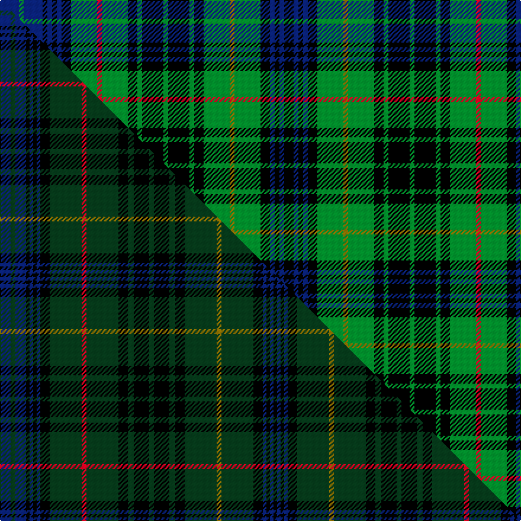

This is one **variant** — a specific cloth: this exact thread count and colourway, with its own
provenance below. It is one weaving of the [sett](/setts/db8g2db8k2db2k2db2k4g11r2g11k4g2k9g2k9g2k4g11y2g11k4db2k2db2k4/) (the scale-free proportion — the
same cloth at any scale or shade), whose colour order is pattern [BGBKBKBKGRGKGKGKGKGGGKBKBK](/stripes/bgbkbkbkgrgkgkgkgkgggkbkbk/).

Part of the [Stewart Hunting](/tartans/stewart-hunting-2/) tartan — the named design grouping this sett with its other cloths.

Sourced from register-of-tartans.  It is a [26 stripe tartan](/stripes/stripes26/).

Original link [https://www.tartanregister.gov.uk/tartanDetails.aspx?ref=4006](https://www.tartanregister.gov.uk/tartanDetails.aspx?ref=4006)

2 attestations — the source records this cloth was collapsed from (oldest owns this page)

<ul>
<li>undated — Stuart/Stewart Hunting #3 (register-of-tartans, <a href="https://www.tartanregister.gov.uk/tartanDetails.aspx?ref=4006">record</a>)  <em>The J.T. Dunbar collection is found in the Scottish Tartans Society archive.</em></li>
<li>undated — Stewart hunting (weddslist, <a href="http://www.weddslist.com/cgi-bin/tartans/pg.pl?source=sts">record</a>) </li>
</ul>

Dataset <small>— provenance for this record, inherited from the source manifest</small>

<dl class="dataset-prov">
<dt>source</dt><dd><a href="/sources/register-of-tartans/">Scottish Register of Tartans</a></dd>
<dt>data captured from</dt><dd><a href="https://github.com/thetartan/tartan-database/blob/master/data/register-of-tartans/data.csv">https://github.com/thetartan/tartan-database/blob/master/data/register-of-tartans/data.csv</a></dd>
<dt>data date</dt><dd>2017-01-06 <small>(dataset default)</small></dd>
<dt>licence</dt><dd><a href="https://www.tartanregister.gov.uk/copyright">Crown copyright</a></dd>
</dl>

Capture chain <small>— the hands this data passed through, oldest first; each capture carries its own licence</small>

<ol class="capture-chain">
<li><a href="https://www.tartanregister.gov.uk/">Scottish Register of Tartans</a> · <a href="https://www.tartanregister.gov.uk/copyright">Crown copyright</a> <small>the living register — still published by National Records of Scotland</small></li>
<li><a href="https://github.com/thetartan/tartan-database">thetartan/tartan-database</a> <small>2016-2017</small> · <a href="https://creativecommons.org/licenses/by-nc-nd/4.0/">CC BY-NC-ND 4.0</a> <small>Levko Kravets's frozen compilation — the capture we vendored, and where its CC licence text came from</small></li>
<li>this dictionary <small>captured 2026-06-10 · commit 5bf86c7566</small> <small>each re-capture is a git commit to data/sources</small></li>
</ol>

## Register references

External register numbers recorded for this tartan.

- Scottish Register of Tartans: [4006](https://www.tartanregister.gov.uk/tartanDetails.aspx?ref=4006)
- Scottish Tartans World Register: 1917

## Thread count
DB/16 G4 DB16 K4 DB4 K4 DB4 K8 G22 R4 G22 K8 G4 K18 G4 K18 G4 K8 G22 Y4 G22 K8 DB4 K4 DB4 K/8

One full sett is **472 threads**.

## Palette
<table><thead><tr><th>Colour</th><th>Shade</th><th>OKLCh</th></tr></thead><tbody><tr><td>DB</td><td><code style="background-color:#082077;">#082077</code> <small style="color:#888">#082077</small></td><td><small style="color:#888">oklch(30.0% 0.149 265.1)</small></td></tr><tr><td>G</td><td><code style="background-color:#008B2A;">#008B2A</code> <small style="color:#888">#008B2A</small></td><td><small style="color:#888">oklch(55.4% 0.170 145.9)</small></td></tr><tr><td>K</td><td><code style="background-color:#000000;">#000000</code> <small style="color:#888">#000000</small></td><td><small style="color:#888">oklch(0.0% 0.000 0.0)</small></td></tr><tr><td>R</td><td><code style="background-color:#D60020;">#D60020</code> <small style="color:#888">#D60020</small></td><td><small style="color:#888">oklch(55.2% 0.224 25.5)</small></td></tr><tr><td>Y</td><td><code style="background-color:#8B6E00;">#8B6E00</code> <small style="color:#888">#8B6E00</small></td><td><small style="color:#888">oklch(55.1% 0.113 90.4)</small></td></tr></tbody></table>

# Sample pattern

## Compared to the master

This cloth is one sett of its design; the master sett (the exemplar the design is anchored on) is below for comparison.

Its **ΔTartan distance** from the master is **0.61** — the same measure the nearest-tartans table ranks by (0 is identical; a re-scale of the same cloth is near 0, a recolour or a different proportion further).

<figure class="master-compare" style="margin:0">

this sett
master sett ★

<figcaption style="color:#888;font-size:smaller">One weave of this sett against the <a href="/setts/db9dg4db9k3db3k3db3k8dg27r4dg27k8dg5k13dg4k13dg5k8dg27y4dg27k8db3k3db3k3/">master sett ★</a>, split on the diagonal: a shared proportion runs seamlessly across it with only the shades shifting; a different proportion breaks on it.</figcaption>
</figure>

## Nearest tartan variants

The nearest existing variants by ΔTartan distance, with this cloth at the top so the swatches line up against it.

ΔTartan

Threads

Variant

Sett

—

472

<a href="/variants/s26/db8g2db8k2db2k2db2k4g11r2g11k4g2k9g2k9g2k4g11y2g11k4db2k2db2k4~x2/">Stuart/Stewart Hunting #3</a>

<a href="/ttd/edit/#slug=g2db7k1db1k1db1k3g11r2g11k3g2k6g2k6g2k3g11y2g11k3db1k1db1k1db7g2~x2&amp;base=db8g2db8k2db2k2db2k4g11r2g11k4g2k9g2k9g2k4g11y2g11k4db2k2db2k4~x2" title="compare in the TTD">1.68</a>

408

<a href="/variants/s27/g2db7k1db1k1db1k3g11r2g11k3g2k6g2k6g2k3g11y2g11k3db1k1db1k1db7g2~x2/">Stewart Hunting</a>

<a href="/ttd/edit/#slug=g2db8k1db1k1db1k2g11r2g11k3g2k6g2k6g2k3g11y2g11k2db1k1db1k1db8g2&amp;base=db8g2db8k2db2k2db2k4g11r2g11k4g2k9g2k9g2k4g11y2g11k4db2k2db2k4~x2" title="compare in the TTD">1.72</a>

204

<a href="/variants/s27/g2db8k1db1k1db1k2g11r2g11k3g2k6g2k6g2k3g11y2g11k2db1k1db1k1db8g2/">Stewart Hunting</a>

<a href="/ttd/edit/#slug=g2db7k1db1k1db1k3g11r4g11k3g2k6g4k6g2k3g11y4g11k3db1k1db1k1db7g2&amp;base=db8g2db8k2db2k2db2k4g11r2g11k4g2k9g2k9g2k4g11y2g11k4db2k2db2k4~x2" title="compare in the TTD">1.72</a>

216

<a href="/variants/s27/g2db7k1db1k1db1k3g11r4g11k3g2k6g4k6g2k3g11y4g11k3db1k1db1k1db7g2/">Stewart Hunting</a>

<a href="/ttd/edit/#slug=db14k3db3k3db3k14g14k3w3k3g14k14db14k3r3k3db14k14g14k3w3k3g14k14db3k3db3k3db7~x4&amp;base=db8g2db8k2db2k2db2k4g11r2g11k4g2k9g2k9g2k4g11y2g11k4db2k2db2k4~x2" title="compare in the TTD">1.97</a>

1612

<a href="/variants/s29/db14k3db3k3db3k14g14k3w3k3g14k14db14k3r3k3db14k14g14k3w3k3g14k14db3k3db3k3db7~x4/">MacKenzie</a>

<a href="/ttd/edit/#slug=k1t8k8g8w2g8k8t1k1t1k1t8k1t1k1t1k8g8y2g8k8t8k1t1~x2~w4000000&amp;base=db8g2db8k2db2k2db2k4g11r2g11k4g2k9g2k9g2k4g11y2g11k4db2k2db2k4~x2" title="compare in the TTD">1.97</a>

408

<a href="/variants/s24/k1t8k8g8w2g8k8t1k1t1k1t8k1t1k1t1k8g8y2g8k8t8k1t1~x2~w4000000/">Campbell of Argyll (no guards)</a>

<a href="/ttd/edit/#slug=k1t8k8g8k1w2k1g8k8t1k1t1k1t8k1t1k1t1k8g8k1y2k1g8k8t8k1t1~x2~w4000000&amp;base=db8g2db8k2db2k2db2k4g11r2g11k4g2k9g2k9g2k4g11y2g11k4db2k2db2k4~x2" title="compare in the TTD">1.98</a>

424

<a href="/variants/s28/k1t8k8g8k1w2k1g8k8t1k1t1k1t8k1t1k1t1k8g8k1y2k1g8k8t8k1t1~x2~w4000000/">Campbell of Argyll #2</a>

<a href="/ttd/edit/#slug=k1g6k6db1k1db1k1db7k1db1k1db1k6g6k1r1k1g6k6db6k1db1k1db6k6g6k1ly1~x4&amp;base=db8g2db8k2db2k2db2k4g11r2g11k4g2k9g2k9g2k4g11y2g11k4db2k2db2k4~x2" title="compare in the TTD">2.02</a>

664

<a href="/variants/s28/k1g6k6db1k1db1k1db7k1db1k1db1k6g6k1r1k1g6k6db6k1db1k1db6k6g6k1ly1~x4/">MacEwen (Clans Originaux)</a>

<a href="/ttd/edit/#slug=db4k1db1k1db1k8g8k1w2k1g8k8db8k1db1k1db8k8g8k1ly2k1g8k8db1k1db1k1db4~x8&amp;base=db8g2db8k2db2k2db2k4g11r2g11k4g2k9g2k9g2k4g11y2g11k4db2k2db2k4~x2" title="compare in the TTD">2.18</a>

1648

<a href="/variants/s29/db4k1db1k1db1k8g8k1w2k1g8k8db8k1db1k1db8k8g8k1ly2k1g8k8db1k1db1k1db4~x8/">Campbell</a>

<a href="/ttd/edit/#slug=k8g8k1y2k1g8k8db8k1db1k1db8k8g8k1w2k1g8k8db1k1db1k1db8k1db1k1db1~x2&amp;base=db8g2db8k2db2k2db2k4g11r2g11k4g2k9g2k9g2k4g11y2g11k4db2k2db2k4~x2" title="compare in the TTD">2.21</a>

410

<a href="/variants/s28/k8g8k1y2k1g8k8db8k1db1k1db8k8g8k1w2k1g8k8db1k1db1k1db8k1db1k1db1~x2/">Campbell of Argyll Clan Tartan</a>

<a href="/ttd/edit/#slug=t8k1t1k1t1k5g6k1g6k5db3t1dr1t1~x4~t2405244&amp;base=db8g2db8k2db2k2db2k4g11r2g11k4g2k9g2k9g2k4g11y2g11k4db2k2db2k4~x2" title="compare in the TTD">2.23</a>

292

<a href="/variants/s14/t8k1t1k1t1k5g6k1g6k5db3t1dr1t1~x4~t2405244/">Gemmell Clan/Family Tartan</a>

## Neighbour map

Every grey dot is one of 13621 variants placed by the first two principal components of the ΔTartan feature space (42% of its variance). Red is this tartan; blue dots are its nearest — click one to open its page.

<svg viewBox="0 0 640 380" role="img" style="max-width:100%;height:auto;border:1px solid #e0e0e0;border-radius:4px;display:block" xmlns="http://www.w3.org/2000/svg"><image href="/nn/cloud.v1.png" width="640" height="380"/><a href="/variants/s27/g2db7k1db1k1db1k3g11r2g11k3g2k6g2k6g2k3g11y2g11k3db1k1db1k1db7g2~x2/"><circle cx="180.3" cy="115.2" r="4" fill="#3465a4"><title>Stewart Hunting</title></circle></a><a href="/variants/s27/g2db8k1db1k1db1k2g11r2g11k3g2k6g2k6g2k3g11y2g11k2db1k1db1k1db8g2/"><circle cx="182.4" cy="113.6" r="4" fill="#3465a4"><title>Stewart Hunting</title></circle></a><a href="/variants/s27/g2db7k1db1k1db1k3g11r4g11k3g2k6g4k6g2k3g11y4g11k3db1k1db1k1db7g2/"><circle cx="167.2" cy="120.6" r="4" fill="#3465a4"><title>Stewart Hunting</title></circle></a><a href="/variants/s29/db14k3db3k3db3k14g14k3w3k3g14k14db14k3r3k3db14k14g14k3w3k3g14k14db3k3db3k3db7~x4/"><circle cx="83.2" cy="155.5" r="4" fill="#3465a4"><title>MacKenzie</title></circle></a><a href="/variants/s24/k1t8k8g8w2g8k8t1k1t1k1t8k1t1k1t1k8g8y2g8k8t8k1t1~x2~w4000000/"><circle cx="94.6" cy="142.1" r="4" fill="#3465a4"><title>Campbell of Argyll (no guards)</title></circle></a><a href="/variants/s28/k1t8k8g8k1w2k1g8k8t1k1t1k1t8k1t1k1t1k8g8k1y2k1g8k8t8k1t1~x2~w4000000/"><circle cx="103.5" cy="126.8" r="4" fill="#3465a4"><title>Campbell of Argyll #2</title></circle></a><a href="/variants/s28/k1g6k6db1k1db1k1db7k1db1k1db1k6g6k1r1k1g6k6db6k1db1k1db6k6g6k1ly1~x4/"><circle cx="112.1" cy="133.8" r="4" fill="#3465a4"><title>MacEwen (Clans Originaux)</title></circle></a><a href="/variants/s29/db4k1db1k1db1k8g8k1w2k1g8k8db8k1db1k1db8k8g8k1ly2k1g8k8db1k1db1k1db4~x8/"><circle cx="108.3" cy="125.3" r="4" fill="#3465a4"><title>Campbell</title></circle></a><a href="/variants/s28/k8g8k1y2k1g8k8db8k1db1k1db8k8g8k1w2k1g8k8db1k1db1k1db8k1db1k1db1~x2/"><circle cx="112.0" cy="126.5" r="4" fill="#3465a4"><title>Campbell of Argyll Clan Tartan</title></circle></a><a href="/variants/s14/t8k1t1k1t1k5g6k1g6k5db3t1dr1t1~x4~t2405244/"><circle cx="83.2" cy="136.8" r="4" fill="#3465a4"><title>Gemmell Clan/Family Tartan</title></circle></a><circle cx="106.2" cy="157.5" r="5" fill="#c00000"/><text x="320" y="376" text-anchor="middle" font-size="11" fill="#999">ground</text><text x="11" y="190" text-anchor="middle" font-size="11" fill="#999" transform="rotate(-90 11 190)">complexity</text></svg>

ID: /variants/s26/db8g2db8k2db2k2db2k4g11r2g11k4g2k9g2k9g2k4g11y2g11k4db2k2db2k4~x2/
