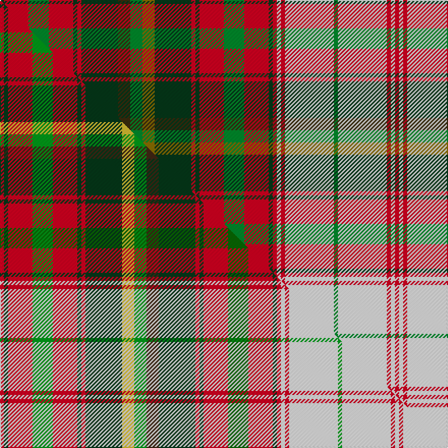

This page is one **sett** — a single exact thread-count. It belongs to the [tartan](/setts/dg1r6g5r6dg1r1dg9dy3g3y3dg9r1dg1r6g5r6dg1r1w1r1w12g1w12r1w1r1/)
(the same proportion at any scale), whose colour order is pattern [GRGRGRGGGGGRGRGRGRWRWGWRWR](/stripes/grgrgrgggggrgrgrgrwrwgwrwr/).

Part of the [Maple Leaf Dress](/tartans/maple-leaf-dress/) tartan — the named design grouping this sett with its other cloths.

Sourced from house-of-tartan.  It is a [26 stripe tartan](/stripes/stripes26/).

Original link http://www.house-of-tartan.scotland.net/house/TartanViewjs.asp?colr=Def&tnam=2033

## Provenance

Earliest known date: pre 1992 In creating the Maple Leaf Tartan fabric, David Weiser captured the natural phenomena of these leaves turning from summer into autumn. (The Office of the High Commissioner for Canada.) This is a dress version of the Maple Leaf tartan.

## Thread count
DG/4 R24 G20 R24 DG4 R4 DG36 DY12 G12 Y12 DG36 R4 DG4 R24 G20 R24 DG4 R4 W4 R4 W48 G4 W48 R4 W4 R/4

One full sett is **776 threads**.

## Palette
<table><thead><tr><th>Colour</th><th>Shade</th><th>OKLCh</th></tr></thead><tbody><tr><td>DG</td><td><code style="background-color:#053819;">#053819</code> <small style="color:#888">#053819</small></td><td><small style="color:#888">oklch(30.0% 0.075 151.3)</small></td></tr><tr><td>G</td><td><code style="background-color:#008B2A;">#008B2A</code> <small style="color:#888">#008B2A</small></td><td><small style="color:#888">oklch(55.4% 0.170 145.9)</small></td></tr><tr><td>W</td><td><code style="background-color:#F7F7F7;">#F7F7F7</code> <small style="color:#888">#F7F7F7</small></td><td><small style="color:#888">oklch(97.6% 0.000 89.9)</small></td></tr><tr><td>R</td><td><code style="background-color:#D60020;">#D60020</code> <small style="color:#888">#D60020</small></td><td><small style="color:#888">oklch(55.2% 0.224 25.5)</small></td></tr><tr><td>DY</td><td><code style="background-color:#3A2B0D;">#3A2B0D</code> <small style="color:#888">#3A2B0D</small></td><td><small style="color:#888">oklch(30.0% 0.049 82.0)</small></td></tr><tr><td>Y</td><td><code style="background-color:#8B6E00;">#8B6E00</code> <small style="color:#888">#8B6E00</small></td><td><small style="color:#888">oklch(55.1% 0.113 90.4)</small></td></tr></tbody></table>

# Sample pattern

## Compared to the master

This cloth is one sett of its design; the master sett (the exemplar the design is anchored on) is below for comparison.

Its **ΔTartan distance** from the master is **0.85** — the same measure the nearest-tartans table ranks by (0 is identical; a re-scale of the same cloth is near 0, a recolour or a different proportion further).

<figure class="master-compare" style="margin:0">

this sett
master sett ★

<figcaption style="color:#888;font-size:smaller">One weave of this sett against the <a href="/setts/r1dg1r6g5r6dg1r1dg9ly3g3do3dg9r1dg1r6dgi5r6dg1r1w1r1w12g1w12r1w1/">master sett ★</a>, split on the diagonal: a shared proportion runs seamlessly across it with only the shades shifting; a different proportion breaks on it.</figcaption>
</figure>

## Nearest variants

The nearest existing variants by ΔTartan distance, with this cloth at the top so the swatches line up against it.

ΔTartan

Threads

Variant

Sett

—

776

<a href="/variants/s26/dg1r6g5r6dg1r1dg9dy3g3y3dg9r1dg1r6g5r6dg1r1w1r1w12g1w12r1w1r1~x4/">Maple Leaf Dress District Tartan</a>

<a href="/ttd/edit/#slug=r1dg1r6g5r6dg1r1dg9ly3g3do3dg9r1dg1r6dgi5r6dg1r1w1r1w12g1w12r1w1~x4~g2408144-dgi1806142&amp;base=dg1r6g5r6dg1r1dg9dy3g3y3dg9r1dg1r6g5r6dg1r1w1r1w12g1w12r1w1r1~x4" title="compare in the TTD">1.20</a>

776

<a href="/variants/s26/r1dg1r6g5r6dg1r1dg9ly3g3do3dg9r1dg1r6dgi5r6dg1r1w1r1w12g1w12r1w1~x4~g2408144-dgi1806142/">Maple Leaf Dress (Lumsden)</a>

<a href="/ttd/edit/#slug=dg1r6g5r6dg1r1dg9o3dg3gi3dg9r1dg1r6g5r6dg1r1w1r1w12g1w12r1w1r1~x4~dg1104144-gi2104115&amp;base=dg1r6g5r6dg1r1dg9dy3g3y3dg9r1dg1r6g5r6dg1r1w1r1w12g1w12r1w1r1~x4" title="compare in the TTD">2.50</a>

776

<a href="/variants/s26/dg1r6g5r6dg1r1dg9o3dg3gi3dg9r1dg1r6g5r6dg1r1w1r1w12g1w12r1w1r1~x4~dg1104144-gi2104115/">Maple Leaf, dress</a>

## Neighbour map

Every grey dot is one of 13620 variants placed by the first two principal components of the ΔTartan feature space (42% of its variance). Red is this tartan; blue dots are its nearest — click one to open its page.

<svg viewBox="0 0 640 380" role="img" style="max-width:100%;height:auto;border:1px solid #e0e0e0;border-radius:4px;display:block" xmlns="http://www.w3.org/2000/svg"><image href="/nn/cloud.v1.png" width="640" height="380"/><a href="/variants/s26/r1dg1r6g5r6dg1r1dg9ly3g3do3dg9r1dg1r6dgi5r6dg1r1w1r1w12g1w12r1w1~x4~g2408144-dgi1806142/"><circle cx="63.8" cy="95.7" r="4" fill="#3465a4"><title>Maple Leaf Dress (Lumsden)</title></circle></a><a href="/variants/s26/dg1r6g5r6dg1r1dg9o3dg3gi3dg9r1dg1r6g5r6dg1r1w1r1w12g1w12r1w1r1~x4~dg1104144-gi2104115/"><circle cx="84.2" cy="108.4" r="4" fill="#3465a4"><title>Maple Leaf, dress</title></circle></a><circle cx="84.6" cy="109.6" r="5" fill="#c00000"/><text x="320" y="376" text-anchor="middle" font-size="11" fill="#999">ground</text><text x="11" y="190" text-anchor="middle" font-size="11" fill="#999" transform="rotate(-90 11 190)">complexity</text></svg>

ID: /variants/s26/dg1r6g5r6dg1r1dg9dy3g3y3dg9r1dg1r6g5r6dg1r1w1r1w12g1w12r1w1r1~x4/
