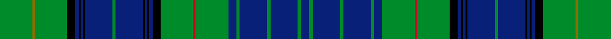

This is one **variant** — a specific cloth: this exact thread count and colourway, with its own
provenance below. It is one weaving of the [sett](/setts/g37y3g37k9db4k2db3k2db31g4db31k2db3k2db4k9g37r3g37db9g4db31g4db31g4db9/) (the scale-free proportion — the
same cloth at any scale or shade), whose colour order is pattern [BGBGBGBGRGKBKBKBGBKBKBKGGG](/stripes/bgbgbgbgrgkbkbkbgbkbkbkggg/).

Sourced from register-of-tartans.  It is a [26 stripe tartan](/stripes/stripes26/).

Original link [https://www.tartanregister.gov.uk/tartanDetails.aspx?ref=4004](https://www.tartanregister.gov.uk/tartanDetails.aspx?ref=4004)

2 attestations — the source records this cloth was collapsed from (oldest owns this page)

<ul>
<li>undated — Stuart/Stewart Hunting (register-of-tartans, <a href="https://www.tartanregister.gov.uk/tartanDetails.aspx?ref=4004">record</a>)  <em>Quarter actual count for display purposes. Wilsons of Bannockburn a weaving firm founded c1770 near Stirling. The Pattern books are in the National Museum of Antiquities, Edinburgh. Copys of the Pattern books and letters in the Scottish Tartans Society archive.</em></li>
<li>undated — Stewart Hunting (weddslist, <a href="http://www.weddslist.com/cgi-bin/tartans/pg.pl?source=sts">record</a>) </li>
</ul>

Dataset <small>— provenance for this record, inherited from the source manifest</small>

<dl class="dataset-prov">
<dt>source</dt><dd><a href="/sources/register-of-tartans/">Scottish Register of Tartans</a></dd>
<dt>data captured from</dt><dd><a href="https://github.com/thetartan/tartan-database/blob/master/data/register-of-tartans/data.csv">https://github.com/thetartan/tartan-database/blob/master/data/register-of-tartans/data.csv</a></dd>
<dt>data date</dt><dd>2017-01-06 <small>(dataset default)</small></dd>
<dt>licence</dt><dd><a href="https://www.tartanregister.gov.uk/copyright">Crown copyright</a></dd>
</dl>

Capture chain <small>— the hands this data passed through, oldest first; each capture carries its own licence</small>

<ol class="capture-chain">
<li><a href="https://www.tartanregister.gov.uk/">Scottish Register of Tartans</a> · <a href="https://www.tartanregister.gov.uk/copyright">Crown copyright</a> <small>the living register — still published by National Records of Scotland</small></li>
<li><a href="https://github.com/thetartan/tartan-database">thetartan/tartan-database</a> <small>2016-2017</small> · <a href="https://creativecommons.org/licenses/by-nc-nd/4.0/">CC BY-NC-ND 4.0</a> <small>Levko Kravets's frozen compilation — the capture we vendored, and where its CC licence text came from</small></li>
<li>this dictionary <small>captured 2026-06-10 · commit 5bf86c7566</small> <small>each re-capture is a git commit to data/sources</small></li>
</ol>

## Register references

External register numbers recorded for this tartan.

- Scottish Register of Tartans: [4004](https://www.tartanregister.gov.uk/tartanDetails.aspx?ref=4004)
- Scottish Tartans World Register: 1910

## Thread count
G/37 Y3 G37 K9 DB4 K2 DB3 K2 DB31 G4 DB31 K2 DB3 K2 DB4 K9 G37 R3 G37 DB9 G4 DB31 G4 DB31 G4 DB/9

One full sett is **658 threads**.

## Palette
<table><thead><tr><th>Colour</th><th>Shade</th><th>OKLCh</th></tr></thead><tbody><tr><td>DB</td><td><code style="background-color:#082077;">#082077</code> <small style="color:#888">#082077</small></td><td><small style="color:#888">oklch(30.0% 0.149 265.1)</small></td></tr><tr><td>G</td><td><code style="background-color:#008B2A;">#008B2A</code> <small style="color:#888">#008B2A</small></td><td><small style="color:#888">oklch(55.4% 0.170 145.9)</small></td></tr><tr><td>K</td><td><code style="background-color:#000000;">#000000</code> <small style="color:#888">#000000</small></td><td><small style="color:#888">oklch(0.0% 0.000 0.0)</small></td></tr><tr><td>R</td><td><code style="background-color:#D60020;">#D60020</code> <small style="color:#888">#D60020</small></td><td><small style="color:#888">oklch(55.2% 0.224 25.5)</small></td></tr><tr><td>Y</td><td><code style="background-color:#8B6E00;">#8B6E00</code> <small style="color:#888">#8B6E00</small></td><td><small style="color:#888">oklch(55.1% 0.113 90.4)</small></td></tr></tbody></table>

# Sample pattern

## Nearest tartan variants

The nearest existing variants by ΔTartan distance, with this cloth at the top so the swatches line up against it.

ΔTartan

Threads

Variant

Sett

—

658

<a href="/variants/s26/g37y3g37k9db4k2db3k2db31g4db31k2db3k2db4k9g37r3g37db9g4db31g4db31g4db9/">Stuart/Stewart Hunting</a>

<a href="/ttd/edit/#slug=db18k2db2k2db2k6g18w2g18k6db18k1db4k1db18k6g18r2g18k6db2k2db2k2~x2&amp;base=g37y3g37k9db4k2db3k2db31g4db31k2db3k2db4k9g37r3g37db9g4db31g4db31g4db9" title="compare in the TTD">2.28</a>

664

<a href="/variants/s24/db18k2db2k2db2k6g18w2g18k6db18k1db4k1db18k6g18r2g18k6db2k2db2k2~x2/">MacKenzie (Vestiarium Scoticum)</a>

<a href="/ttd/edit/#slug=k6g18w2g18k6db18k1db4k1db18k6g18r2g18k6db2k2db2k2db18k2db2k2db2~x2&amp;base=g37y3g37k9db4k2db3k2db31g4db31k2db3k2db4k9g37r3g37db9g4db31g4db31g4db9" title="compare in the TTD">2.28</a>

688

<a href="/variants/s24/k6g18w2g18k6db18k1db4k1db18k6g18r2g18k6db2k2db2k2db18k2db2k2db2~x2/">MacKenzie, Bailey</a>

<a href="/ttd/edit/#slug=db21k1db1k1db1k10g22r2g22k10db16k1db2k1db16k10g22y2g22k10db1k1db1k1db7~x2&amp;base=g37y3g37k9db4k2db3k2db31g4db31k2db3k2db4k9g37r3g37db9g4db31g4db31g4db9" title="compare in the TTD">2.33</a>

760

<a href="/variants/s25/db21k1db1k1db1k10g22r2g22k10db16k1db2k1db16k10g22y2g22k10db1k1db1k1db7~x2/">Farquharson</a>

<a href="/ttd/edit/#slug=g4r1db24t4k2g24r1db10t4db2t4db10r1g24k2t4db24r1g4t4~x2~db1406275-t2405244&amp;base=g37y3g37k9db4k2db3k2db31g4db31k2db3k2db4k9g37r3g37db9g4db31g4db31g4db9" title="compare in the TTD">2.90</a>

600

<a href="/variants/s20/g4r1db24t4k2g24r1db10t4db2t4db10r1g24k2t4db24r1g4t4~x2~db1406275-t2405244/">Coopers &amp; Lybrand Corporate Commem. Tartan</a>

<a href="/ttd/edit/#slug=r4db2g7db15g3db3g3db7g28k7g6k2~x2&amp;base=g37y3g37k9db4k2db3k2db31g4db31k2db3k2db4k9g37r3g37db9g4db31g4db31g4db9" title="compare in the TTD">2.98</a>

336

<a href="/variants/s12/r4db2g7db15g3db3g3db7g28k7g6k2~x2/">Walker Hunting</a>

<a href="/ttd/edit/#slug=db30lo2db2lo2db5g5k15db5g20dr2k3dr2g20db5k15g5db20lo2db2~x2~db1403246&amp;base=g37y3g37k9db4k2db3k2db31g4db31k2db3k2db4k9g37r3g37db9g4db31g4db31g4db9" title="compare in the TTD">3.03</a>

584

<a href="/variants/s19/db30lo2db2lo2db5g5k15db5g20dr2k3dr2g20db5k15g5db20lo2db2~x2~db1403246/">Pennsylvania American District Tartan</a>

<a href="/ttd/edit/#slug=t30y2t2y2t5g5k15t5g20dr2k3dr2g20t5k15g5t20y2t2~x2&amp;base=g37y3g37k9db4k2db3k2db31g4db31k2db3k2db4k9g37r3g37db9g4db31g4db31g4db9" title="compare in the TTD">3.11</a>

584

<a href="/variants/s19/t30y2t2y2t5g5k15t5g20dr2k3dr2g20t5k15g5t20y2t2~x2/">Pennsylvania (District)</a>

<a href="/ttd/edit/#slug=g6db4y2db17g2db2g2db8g26db6g4k2g4w6~x2&amp;base=g37y3g37k9db4k2db3k2db31g4db31k2db3k2db4k9g37r3g37db9g4db31g4db31g4db9" title="compare in the TTD">3.20</a>

340

<a href="/variants/s14/g6db4y2db17g2db2g2db8g26db6g4k2g4w6~x2/">Hay Hunting</a>

<a href="/ttd/edit/#slug=k14g12dr2g12k14db20k2db4k2db20g12lo3g3lo1k3dr2k3lo1g3lo3g12db4k2db4k2db22k2db4k2db4~x2&amp;base=g37y3g37k9db4k2db3k2db31g4db31k2db3k2db4k9g37r3g37db9g4db31g4db31g4db9" title="compare in the TTD">3.22</a>

740

<a href="/variants/s30/k14g12dr2g12k14db20k2db4k2db20g12lo3g3lo1k3dr2k3lo1g3lo3g12db4k2db4k2db22k2db4k2db4~x2/">Dundee Discovery (Corporate)</a>

<a href="/ttd/edit/#slug=k20y3db10g3db5g25k1g1w3g1k1g25db5g3db10y1db2~x4&amp;base=g37y3g37k9db4k2db3k2db31g4db31k2db3k2db4k9g37r3g37db9g4db31g4db31g4db9" title="compare in the TTD">3.24</a>

864

<a href="/variants/s17/k20y3db10g3db5g25k1g1w3g1k1g25db5g3db10y1db2~x4/">Blairgowrie</a>

## Neighbour map

Every grey dot is one of 13621 variants placed by the first two principal components of the ΔTartan feature space (42% of its variance). Red is this tartan; blue dots are its nearest — click one to open its page.

<svg viewBox="0 0 640 380" role="img" style="max-width:100%;height:auto;border:1px solid #e0e0e0;border-radius:4px;display:block" xmlns="http://www.w3.org/2000/svg"><image href="/nn/cloud.v1.png" width="640" height="380"/><a href="/variants/s24/db18k2db2k2db2k6g18w2g18k6db18k1db4k1db18k6g18r2g18k6db2k2db2k2~x2/"><circle cx="167.8" cy="101.9" r="4" fill="#3465a4"><title>MacKenzie (Vestiarium Scoticum)</title></circle></a><a href="/variants/s24/k6g18w2g18k6db18k1db4k1db18k6g18r2g18k6db2k2db2k2db18k2db2k2db2~x2/"><circle cx="167.8" cy="101.9" r="4" fill="#3465a4"><title>MacKenzie, Bailey</title></circle></a><a href="/variants/s25/db21k1db1k1db1k10g22r2g22k10db16k1db2k1db16k10g22y2g22k10db1k1db1k1db7~x2/"><circle cx="180.9" cy="88.4" r="4" fill="#3465a4"><title>Farquharson</title></circle></a><a href="/variants/s20/g4r1db24t4k2g24r1db10t4db2t4db10r1g24k2t4db24r1g4t4~x2~db1406275-t2405244/"><circle cx="249.3" cy="100.6" r="4" fill="#3465a4"><title>Coopers &amp; Lybrand Corporate Commem. Tartan</title></circle></a><a href="/variants/s12/r4db2g7db15g3db3g3db7g28k7g6k2~x2/"><circle cx="260.7" cy="129.4" r="4" fill="#3465a4"><title>Walker Hunting</title></circle></a><a href="/variants/s19/db30lo2db2lo2db5g5k15db5g20dr2k3dr2g20db5k15g5db20lo2db2~x2~db1403246/"><circle cx="177.6" cy="118.9" r="4" fill="#3465a4"><title>Pennsylvania American District Tartan</title></circle></a><a href="/variants/s19/t30y2t2y2t5g5k15t5g20dr2k3dr2g20t5k15g5t20y2t2~x2/"><circle cx="172.0" cy="121.1" r="4" fill="#3465a4"><title>Pennsylvania (District)</title></circle></a><a href="/variants/s14/g6db4y2db17g2db2g2db8g26db6g4k2g4w6~x2/"><circle cx="224.1" cy="133.9" r="4" fill="#3465a4"><title>Hay Hunting</title></circle></a><a href="/variants/s30/k14g12dr2g12k14db20k2db4k2db20g12lo3g3lo1k3dr2k3lo1g3lo3g12db4k2db4k2db22k2db4k2db4~x2/"><circle cx="165.0" cy="83.4" r="4" fill="#3465a4"><title>Dundee Discovery (Corporate)</title></circle></a><a href="/variants/s17/k20y3db10g3db5g25k1g1w3g1k1g25db5g3db10y1db2~x4/"><circle cx="216.2" cy="88.3" r="4" fill="#3465a4"><title>Blairgowrie</title></circle></a><circle cx="230.2" cy="98.3" r="5" fill="#c00000"/><text x="320" y="376" text-anchor="middle" font-size="11" fill="#999">ground</text><text x="11" y="190" text-anchor="middle" font-size="11" fill="#999" transform="rotate(-90 11 190)">complexity</text></svg>

ID: /variants/s26/g37y3g37k9db4k2db3k2db31g4db31k2db3k2db4k9g37r3g37db9g4db31g4db31g4db9/
