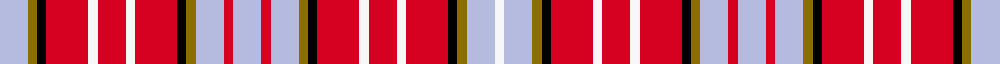

This is one **variant** — a specific cloth: this exact thread count and colourway, with its own
provenance below. It is one weaving of the [sett](/setts/lb6y2k2r9w2r6w2r9k2y2lb6r2lb6r2lb6y2k2r9w2r6w2r9k2y2lb6w2/) (the scale-free proportion — the
same cloth at any scale or shade), whose colour order is pattern [WGKRWRWRKGWRWRWGKRWRWRKGWW](/stripes/wgkrwrwrkgwrwrwgkrwrwrkgww/).

Sourced from register-of-tartans.  It is a [26 stripe tartan](/stripes/stripes26/).

Original link [https://www.tartanregister.gov.uk/tartanDetails.aspx?ref=3227](https://www.tartanregister.gov.uk/tartanDetails.aspx?ref=3227)

Dataset <small>— provenance for this record, inherited from the source manifest</small>

<dl class="dataset-prov">
<dt>source</dt><dd><a href="/sources/register-of-tartans/">Scottish Register of Tartans</a></dd>
<dt>data captured from</dt><dd><a href="https://github.com/thetartan/tartan-database/blob/master/data/register-of-tartans/data.csv">https://github.com/thetartan/tartan-database/blob/master/data/register-of-tartans/data.csv</a></dd>
<dt>data date</dt><dd>1812 <small>(this record)</small></dd>
<dt>licence</dt><dd><a href="https://www.tartanregister.gov.uk/copyright">Crown copyright</a></dd>
</dl>

Capture chain <small>— the hands this data passed through, oldest first; each capture carries its own licence</small>

<ol class="capture-chain">
<li><a href="https://www.tartanregister.gov.uk/">Scottish Register of Tartans</a> · <a href="https://www.tartanregister.gov.uk/copyright">Crown copyright</a> <small>the living register — still published by National Records of Scotland</small></li>
<li><a href="https://github.com/thetartan/tartan-database">thetartan/tartan-database</a> <small>2016-2017</small> · <a href="https://creativecommons.org/licenses/by-nc-nd/4.0/">CC BY-NC-ND 4.0</a> <small>Levko Kravets's frozen compilation — the capture we vendored, and where its CC licence text came from</small></li>
<li>this dictionary <small>captured 2026-06-10 · commit 5bf86c7566</small> <small>each re-capture is a git commit to data/sources</small></li>
</ol>

## Register references

External register numbers recorded for this tartan.

- Scottish Register of Tartans: [3227](https://www.tartanregister.gov.uk/tartanDetails.aspx?ref=3227)
- Scottish Tartans Authority (ITI): 6093

## Thread count
LB/12 Y4 K4 R18 W4 R12 W4 R18 K4 Y4 LB12 R4 LB12 R4 LB12 Y4 K4 R18 W4 R12 W4 R18 K4 Y4 LB12 W/4

One full sett is **416 threads**.

## Palette
<table><thead><tr><th>Colour</th><th>Shade</th><th>OKLCh</th></tr></thead><tbody><tr><td>K</td><td><code style="background-color:#000000;">#000000</code> <small style="color:#888">#000000</small></td><td><small style="color:#888">oklch(0.0% 0.000 0.0)</small></td></tr><tr><td>LB</td><td><code style="background-color:#B5BBDE;">#B5BBDE</code> <small style="color:#888">#B5BBDE</small></td><td><small style="color:#888">oklch(79.9% 0.050 277.6)</small></td></tr><tr><td>R</td><td><code style="background-color:#D60020;">#D60020</code> <small style="color:#888">#D60020</small></td><td><small style="color:#888">oklch(55.2% 0.224 25.5)</small></td></tr><tr><td>W</td><td><code style="background-color:#F7F7F7;">#F7F7F7</code> <small style="color:#888">#F7F7F7</small></td><td><small style="color:#888">oklch(97.6% 0.000 89.9)</small></td></tr><tr><td>Y</td><td><code style="background-color:#8B6E00;">#8B6E00</code> <small style="color:#888">#8B6E00</small></td><td><small style="color:#888">oklch(55.1% 0.113 90.4)</small></td></tr></tbody></table>

# Sample pattern

## Nearest tartan variants

The nearest existing variants by ΔTartan distance, with this cloth at the top so the swatches line up against it.

ΔTartan

Threads

Variant

Sett

—

416

<a href="/variants/s26/lb6y2k2r9w2r6w2r9k2y2lb6r2lb6r2lb6y2k2r9w2r6w2r9k2y2lb6w2~x2/">Ogilvie (D.C. Stewart) #2</a>

<a href="/ttd/edit/#slug=lb4r1lb4y1k1r6w1r4w1r6k1y1lb4w1~x2&amp;base=lb6y2k2r9w2r6w2r9k2y2lb6r2lb6r2lb6y2k2r9w2r6w2r9k2y2lb6w2~x2" title="compare in the TTD">3.04</a>

134

<a href="/variants/s14/lb4r1lb4y1k1r6w1r4w1r6k1y1lb4w1~x2/">Ogilvy D</a>

<a href="/ttd/edit/#slug=w4r1w4y1k1r6w1r4w1r6k1y1w4g1~x2&amp;base=lb6y2k2r9w2r6w2r9k2y2lb6r2lb6r2lb6y2k2r9w2r6w2r9k2y2lb6w2~x2" title="compare in the TTD">3.48</a>

134

<a href="/variants/s14/w4r1w4y1k1r6w1r4w1r6k1y1w4g1~x2/">Ogilvy D</a>

<a href="/ttd/edit/#slug=w2r2ri2r16k2r2w6r7dg6ri2r2ri2k6r3w2r3w2r3w16r2ri2w2~x2~r2109032-ri2806019&amp;base=lb6y2k2r9w2r6w2r9k2y2lb6r2lb6r2lb6y2k2r9w2r6w2r9k2y2lb6w2~x2" title="compare in the TTD">3.51</a>

360

<a href="/variants/s22/w2r2ri2r16k2r2w6r7dg6ri2r2ri2k6r3w2r3w2r3w16r2ri2w2~x2~r2109032-ri2806019/">MacDougal (Dress)</a>

<a href="/ttd/edit/#slug=k1r4g8r2g1r2db4r2w1r1w1r2g4r3g4r1k1r8w1~x2&amp;base=lb6y2k2r9w2r6w2r9k2y2lb6r2lb6r2lb6y2k2r9w2r6w2r9k2y2lb6w2~x2" title="compare in the TTD">3.86</a>

200

<a href="/variants/s19/k1r4g8r2g1r2db4r2w1r1w1r2g4r3g4r1k1r8w1~x2/">MacDougall #6</a>

## Neighbour map

Every grey dot is one of 13621 variants placed by the first two principal components of the ΔTartan feature space (42% of its variance). Red is this tartan; blue dots are its nearest — click one to open its page.

<svg viewBox="0 0 640 380" role="img" style="max-width:100%;height:auto;border:1px solid #e0e0e0;border-radius:4px;display:block" xmlns="http://www.w3.org/2000/svg"><image href="/nn/cloud.v1.png" width="640" height="380"/><a href="/variants/s14/lb4r1lb4y1k1r6w1r4w1r6k1y1lb4w1~x2/"><circle cx="169.7" cy="169.0" r="4" fill="#3465a4"><title>Ogilvy D</title></circle></a><a href="/variants/s14/w4r1w4y1k1r6w1r4w1r6k1y1w4g1~x2/"><circle cx="161.9" cy="163.7" r="4" fill="#3465a4"><title>Ogilvy D</title></circle></a><a href="/variants/s22/w2r2ri2r16k2r2w6r7dg6ri2r2ri2k6r3w2r3w2r3w16r2ri2w2~x2~r2109032-ri2806019/"><circle cx="132.7" cy="113.6" r="4" fill="#3465a4"><title>MacDougal (Dress)</title></circle></a><a href="/variants/s19/k1r4g8r2g1r2db4r2w1r1w1r2g4r3g4r1k1r8w1~x2/"><circle cx="181.3" cy="142.7" r="4" fill="#3465a4"><title>MacDougall #6</title></circle></a><circle cx="128.6" cy="162.9" r="5" fill="#c00000"/><text x="320" y="376" text-anchor="middle" font-size="11" fill="#999">ground</text><text x="11" y="190" text-anchor="middle" font-size="11" fill="#999" transform="rotate(-90 11 190)">complexity</text></svg>

ID: /variants/s26/lb6y2k2r9w2r6w2r9k2y2lb6r2lb6r2lb6y2k2r9w2r6w2r9k2y2lb6w2~x2/
