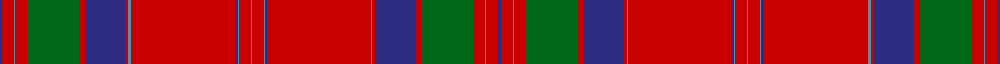

This is one **variant** — a specific cloth: this exact thread count and colourway, with its own
provenance below. It is one weaving of the [sett](/tartans/m/ma/macgillivray/) (the scale-free proportion — the
same cloth at any scale or shade), whose colour order is pattern [BRBRGRBRBRBBRBRBBRBRBRGRBRB](/stripes/brbrgrbrbrbbrbrbbrbrbrgrbrb/).

Part of the [MacGillivray](/tartans/m/ma/macgillivray/) tartan — the named design grouping this sett with its other cloths.

Sourced from logan-1831.  It is a [27 stripe tartan](/stripes/stripes27/).

Original link [/posts/logans-scottish-gael/](/posts/logans-scottish-gael/)

## Provenance

<figure class="logan-scan">

<figcaption>Logan, The Scottish Gaël (1831), vol. II p. 405 — page-scan crop (547,2031)–(802,2122), (814,476)–(1070,1357)</figcaption>
</figure>

James Logan recorded the **MacGillivray** sett in 1831, on page 405 of the *Table of Clan Tartans* in *The Scottish Gaël* — the earliest systematic published collection of clan setts. Logan gives the stripe widths in eighths of an inch, measured across the cloth and reflected about each end (a half-sett):

> ½ blue · 2 red · ¼ azure · 2 red · 9 green · 1 red · 7 blue · ½ red · ¼ azure · 18 red · ¼ blue · ¼ azure · 2 red · ¼ azure · 2 red · ¼ azure · ½ blue · 18 red · ½ azure · ½ red · 7 blue · 1 red · 9 green · 2 red · ¼ azure · 2 red · ½ blue

Rendered at 8 threads to the eighth-inch that is `B/4 R16 A2 R16 G72 R8 B56 R4 A2 R144 B2 A2 R16 A2 R16 A2 B4 R144 A4 R4 B56 R8 G72 R16 A2 R16 B/4` — the eighths are the captured data, and the threadcount is derived from them at that stated factor. How many threads an eighth of cloth held depends on the weave's density, so the factor is a display calibration, not Logan's count; the sett's identity lives in the proportions, which the eighths record directly. Logan named his colours rather than dyeing to a standard, so the palette here is the Dictionary's modern reading of his names.

See [Logan's Scottish Gaël](/posts/logans-scottish-gael/) for the full table and method.

## Related setts

Later records of the **MacGillivray** name adjusted Logan's counts: [MacGillivray](/variants/s13/r6lb1dt1r57lb2r2dt23r4g30r6lb1r6dt2~x2/); [MacGillivray #2](/variants/s13/k6lb1dp1r57lb2r2dp23r4g30r6lb1r6dp2~x2/); [MacGillivray #3](/variants/s14/g19r7g7r7g7r14db3r3g19r3db3r66db7r14~x2/); [MacGillivray Hunting](/variants/s14/dg8o5dg5o5dg5o6db1o2dg8o2db1o24db4o6~x2~dg1806142-o2005046/). Compare their thread counts with Logan's above.

Dataset <small>— provenance for this record, inherited from the source manifest</small>

<dl class="dataset-prov">
<dt>source</dt><dd><a href="/sources/logan-1831/">Logan, The Scottish Gaël (1831)</a></dd>
<dt>data captured from</dt><dd><a href="https://archive.org/details/scotishgalorcel02logagoog">https://archive.org/details/scotishgalorcel02logagoog</a></dd>
<dt>data date</dt><dd>1831 <small>(this record)</small></dd>
<dt>licence</dt><dd>Public domain</dd>
</dl>

Capture chain <small>— the hands this data passed through, oldest first; each capture carries its own licence</small>

<ol class="capture-chain">
<li>James Logan, The Scottish Gaël (first edition) <small>1831</small> · Public domain <small>the printed Table of Clan Tartans, vol. II pp. 401-408, plus the Duke of Sussex plate</small></li>
<li><a href="https://archive.org/details/scotishgalorcel02logagoog">Internet Archive scan</a> <small>the digitised first edition the transcription was made from, cross-checked against the OCR</small></li>
<li><a href="/posts/logans-scottish-gael/">Tartan Dictionary transcription — Logan's Scottish Gaël</a> <small>2026-06</small> · <a href="https://creativecommons.org/licenses/by-sa/4.0/">CC BY-SA 4.0</a> <small>by-eye transcription of the Table of Clan Tartans and the Duke of Sussex plate — depths in eighths of an inch, rendered at 8 threads per eighth (a display calibration anchored by the Register's Abercrombie ×8 stripe-for-stripe match); method and match report in the linked post</small></li>
<li>this dictionary <small>each re-capture is a git commit to data/sources</small></li>
</ol>

## Thread count
DB/4 R16 T2 R16 G72 R8 DB56 R4 T4 R144 DB4 T2 R16 T2 R16 T2 DB2 R144 T2 R4 DB56 R8 G72 R16 T2 R16 DB/4

One full sett is **1380 threads**.

## Palette
<table><thead><tr><th>Colour</th><th>Shade</th><th>OKLCh</th></tr></thead><tbody><tr><td>T</td><td><code style="background-color:#00879F;">#00879F</code> <small style="color:#888">#00879F</small></td><td><small style="color:#888">oklch(57.4% 0.102 216.1)</small></td></tr><tr><td>DB</td><td><code style="background-color:#082077;">#082077</code> <small style="color:#888">#082077</small></td><td><small style="color:#888">oklch(30.0% 0.149 265.1)</small></td></tr><tr><td>G</td><td><code style="background-color:#008B2A;">#008B2A</code> <small style="color:#888">#008B2A</small></td><td><small style="color:#888">oklch(55.4% 0.170 145.9)</small></td></tr><tr><td>R</td><td><code style="background-color:#D60020;">#D60020</code> <small style="color:#888">#D60020</small></td><td><small style="color:#888">oklch(55.2% 0.224 25.5)</small></td></tr></tbody></table>

# Sample pattern

## Nearest tartan variants

The nearest existing variants by ΔTartan distance, with this cloth at the top so the swatches line up against it.

ΔTartan

Threads

Variant

Sett

—

1380

<a href="/variants/s27/db2r8t1r8g36r4db28r2t2r72db2t1r8t1r8t1db1r72t1r2db28r4g36r8t1r8db2~x2/">MacGillivray</a>

<a href="/ttd/edit/#slug=r40w2db1r3g31r3db1w2r3db8r3w2db1r34g4r4g4~x2&amp;base=db2r8t1r8g36r4db28r2t2r72db2t1r8t1r8t1db1r72t1r2db28r4g36r8t1r8db2~x2" title="compare in the TTD">2.67</a>

496

<a href="/variants/s17/r40w2db1r3g31r3db1w2r3db8r3w2db1r34g4r4g4~x2/">Dalziel #1</a>

<a href="/ttd/edit/#slug=r10db2r1db2r72t1r2db20r4dg2r4dg84r2db2r10db2r2dg84r4dg2r4db20r2t1r72db2r2db1r5~x2&amp;base=db2r8t1r8g36r4db28r2t2r72db2t1r8t1r8t1db1r72t1r2db28r4g36r8t1r8db2~x2" title="compare in the TTD">2.85</a>

1654

<a href="/variants/s29/r10db2r1db2r72t1r2db20r4dg2r4dg84r2db2r10db2r2dg84r4dg2r4db20r2t1r72db2r2db1r5~x2/">Forsythe-Grant of Ecclesgreig</a>

<a href="/ttd/edit/#slug=r24w1db2r4g32r4db2w1r4db6r4w1db2r32g2r3g6~x2&amp;base=db2r8t1r8g36r4db28r2t2r72db2t1r8t1r8t1db1r72t1r2db28r4g36r8t1r8db2~x2" title="compare in the TTD">2.89</a>

460

<a href="/variants/s17/r24w1db2r4g32r4db2w1r4db6r4w1db2r32g2r3g6~x2/">Dalzell</a>

<a href="/ttd/edit/#slug=r6db2r2g24r2db2r2db8r2w1r32db2r2db1r6~x2&amp;base=db2r8t1r8g36r4db28r2t2r72db2t1r8t1r8t1db1r72t1r2db28r4g36r8t1r8db2~x2" title="compare in the TTD">3.03</a>

352

<a href="/variants/s15/r6db2r2g24r2db2r2db8r2w1r32db2r2db1r6~x2/">Grant</a>

<a href="/ttd/edit/#slug=r6db2r2g24r2g2r2db8r2lb1r32db2r2db1r6~x2&amp;base=db2r8t1r8g36r4db28r2t2r72db2t1r8t1r8t1db1r72t1r2db28r4g36r8t1r8db2~x2" title="compare in the TTD">3.07</a>

352

<a href="/variants/s15/r6db2r2g24r2g2r2db8r2lb1r32db2r2db1r6~x2/">Grant, or Drummond</a>

<a href="/ttd/edit/#slug=r32g8r4g8r8db8r12w1r1g18r1w1r32w1r1g18r1w1r12g6r1w1r4~x2&amp;base=db2r8t1r8g36r4db28r2t2r72db2t1r8t1r8t1db1r72t1r2db28r4g36r8t1r8db2~x2" title="compare in the TTD">3.09</a>

648

<a href="/variants/s23/r32g8r4g8r8db8r12w1r1g18r1w1r32w1r1g18r1w1r12g6r1w1r4~x2/">MacAlister CC</a>

<a href="/ttd/edit/#slug=r6db2r2g24r2g2r2db8r2lb2r32db2r2db1r6~x2&amp;base=db2r8t1r8g36r4db28r2t2r72db2t1r8t1r8t1db1r72t1r2db28r4g36r8t1r8db2~x2" title="compare in the TTD">3.09</a>

356

<a href="/variants/s15/r6db2r2g24r2g2r2db8r2lb2r32db2r2db1r6~x2/">Grant or Drummond Clan Tartan</a>

<a href="/ttd/edit/#slug=r32g8r4g8r8db8r12lb1r1g18r1lb1r32lb1r1g18r1lb1r12g6r1lb1r4~x2&amp;base=db2r8t1r8g36r4db28r2t2r72db2t1r8t1r8t1db1r72t1r2db28r4g36r8t1r8db2~x2" title="compare in the TTD">3.12</a>

648

<a href="/variants/s23/r32g8r4g8r8db8r12lb1r1g18r1lb1r32lb1r1g18r1lb1r12g6r1lb1r4~x2/">MacAlister (Cockburn Collection 1810-20)</a>

<a href="/ttd/edit/#slug=r26db2r6db6r126lb6r6db38r6dg6r6dg130r19db6r18~r2109032-db0906265-lb3203246-dg1405139&amp;base=db2r8t1r8g36r4db28r2t2r72db2t1r8t1r8t1db1r72t1r2db28r4g36r8t1r8db2~x2" title="compare in the TTD">3.23</a>

770

<a href="/variants/s15/r26db2r6db6r126lb6r6db38r6dg6r6dg130r19db6r18~r2109032-db0906265-lb3203246-dg1405139/">Drummond of Megginch - 1820 Plaid</a>

<a href="/ttd/edit/#slug=r55w1ri1g2r2g49ri2g2r2db15r2g2ri2r53g2r2ri2g10~x4~r2209032-ri2806019&amp;base=db2r8t1r8g36r4db28r2t2r72db2t1r8t1r8t1db1r72t1r2db28r4g36r8t1r8db2~x2" title="compare in the TTD">3.23</a>

1388

<a href="/variants/s18/r55w1ri1g2r2g49ri2g2r2db15r2g2ri2r53g2r2ri2g10~x4~r2209032-ri2806019/">Dalriada</a>

## Neighbour map

Every grey dot is one of 13656 variants placed by the first two principal components of the ΔTartan feature space (42% of its variance). Red is this tartan; blue dots are its nearest — click one to open its page. The map is a flat projection of a many-dimensional space — [how to read it](/posts/neighbourhood-maps/).

<svg viewBox="0 0 640 380" role="img" style="max-width:100%;height:auto;border:1px solid #e0e0e0;border-radius:4px;display:block" xmlns="http://www.w3.org/2000/svg"><image href="/nn/cloud.v1.png" width="640" height="380"/><a href="/variants/s17/r40w2db1r3g31r3db1w2r3db8r3w2db1r34g4r4g4~x2/"><circle cx="401.6" cy="74.3" r="4" fill="#3465a4"><title>Dalziel #1</title></circle></a><a href="/variants/s29/r10db2r1db2r72t1r2db20r4dg2r4dg84r2db2r10db2r2dg84r4dg2r4db20r2t1r72db2r2db1r5~x2/"><circle cx="343.6" cy="36.5" r="4" fill="#3465a4"><title>Forsythe-Grant of Ecclesgreig</title></circle></a><a href="/variants/s17/r24w1db2r4g32r4db2w1r4db6r4w1db2r32g2r3g6~x2/"><circle cx="371.0" cy="90.3" r="4" fill="#3465a4"><title>Dalzell</title></circle></a><a href="/variants/s15/r6db2r2g24r2db2r2db8r2w1r32db2r2db1r6~x2/"><circle cx="365.9" cy="88.2" r="4" fill="#3465a4"><title>Grant</title></circle></a><a href="/variants/s15/r6db2r2g24r2g2r2db8r2lb1r32db2r2db1r6~x2/"><circle cx="371.7" cy="89.9" r="4" fill="#3465a4"><title>Grant, or Drummond</title></circle></a><a href="/variants/s23/r32g8r4g8r8db8r12w1r1g18r1w1r32w1r1g18r1w1r12g6r1w1r4~x2/"><circle cx="380.8" cy="87.9" r="4" fill="#3465a4"><title>MacAlister CC</title></circle></a><a href="/variants/s15/r6db2r2g24r2g2r2db8r2lb2r32db2r2db1r6~x2/"><circle cx="365.1" cy="90.9" r="4" fill="#3465a4"><title>Grant or Drummond Clan Tartan</title></circle></a><a href="/variants/s23/r32g8r4g8r8db8r12lb1r1g18r1lb1r32lb1r1g18r1lb1r12g6r1lb1r4~x2/"><circle cx="388.0" cy="90.3" r="4" fill="#3465a4"><title>MacAlister (Cockburn Collection 1810-20)</title></circle></a><a href="/variants/s15/r26db2r6db6r126lb6r6db38r6dg6r6dg130r19db6r18~r2109032-db0906265-lb3203246-dg1405139/"><circle cx="366.7" cy="72.2" r="4" fill="#3465a4"><title>Drummond of Megginch - 1820 Plaid</title></circle></a><a href="/variants/s18/r55w1ri1g2r2g49ri2g2r2db15r2g2ri2r53g2r2ri2g10~x4~r2209032-ri2806019/"><circle cx="377.1" cy="46.6" r="4" fill="#3465a4"><title>Dalriada</title></circle></a><circle cx="380.9" cy="45.2" r="5" fill="#c00000"/><text x="320" y="376" text-anchor="middle" font-size="11" fill="#999">ground</text><text x="11" y="190" text-anchor="middle" font-size="11" fill="#999" transform="rotate(-90 11 190)">complexity</text></svg>

ID: /variants/s27/db2r8t1r8g36r4db28r2t2r72db2t1r8t1r8t1db1r72t1r2db28r4g36r8t1r8db2~x2/
