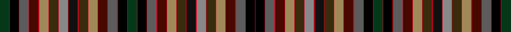

This page is one **sett** — a single exact thread-count. It belongs to the [tartan](/setts/dg18r1k18r1n18r1dr18r1ly18r1dy18r1ki18r1o18r1dy18r1ly18r1dr18r1n18r1k18r1dg18/)
(the same proportion at any scale), whose colour order is pattern [GRKRBRBRYRGRRRKRGRYRBRBRKRGRKRBRBRYRGRKRRRGRYRBRBRKR](/stripes/grkrbrbryrgrrrkrgryrbrbrkrgrkrbrbryrgrkrrrgryrbrbrkr/).

Sourced from tartans-authority.  It is a [52 stripe tartan](/stripes/stripes52/).

Original link http://www.tartansauthority.com/tartan-ferret/display/2037/

## Register references

External register numbers recorded for this tartan.

- Scottish Tartans Authority (ITI): 2037

## Thread count
DG/36 R2 K36 R2 N36 R2 DR36 R2 LY36 R2 DY36 R2 O36 R2 Ki36 R2 DY36 R2 LY36 R2 DR36 R2 N36 R2 K36 R2 DG36 R2 K36 R2 N36 R2 DR36 R2 LY36 R2 DY36 R2 Ki36 R2 O36 R2 DY36 R2 LY36 R2 DR36 R2 N36 R2 K36 R/2

One full sett is **1938 threads**.

## Palette
<table><thead><tr><th>Colour</th><th>Shade</th><th>OKLCh</th></tr></thead><tbody><tr><td>DR</td><td><code style="background-color:#480800;">#480800</code> <small style="color:#888">#480800</small></td><td><small style="color:#888">oklch(26.1% 0.096 33.1)</small></td></tr><tr><td>G</td><td><code style="background-color:#000000;">#000000</code> <small style="color:#888">#000000</small></td><td><small style="color:#888">oklch(0.0% 0.000 0.0)</small></td></tr><tr><td>K</td><td><code style="background-color:#D60020;">#D60020</code> <small style="color:#888">#D60020</small></td><td><small style="color:#888">oklch(55.2% 0.224 25.5)</small></td></tr><tr><td>Ka</td><td><code style="background-color:#101010;">#101010</code> <small style="color:#888">#101010</small></td><td><small style="color:#888">oklch(17.3% 0.000 89.9)</small></td></tr><tr><td>LT</td><td><code style="background-color:#A08858;">#A08858</code> <small style="color:#888">#A08858</small></td><td><small style="color:#888">oklch(63.7% 0.071 84.0)</small></td></tr><tr><td>N</td><td><code style="background-color:#5C5C5C;">#5C5C5C</code> <small style="color:#888">#5C5C5C</small></td><td><small style="color:#888">oklch(47.5% 0.000 89.9)</small></td></tr><tr><td>Na</td><td><code style="background-color:#888888;">#888888</code> <small style="color:#888">#888888</small></td><td><small style="color:#888">oklch(62.7% 0.000 89.9)</small></td></tr><tr><td>Nb</td><td><code style="background-color:#053819;">#053819</code> <small style="color:#888">#053819</small></td><td><small style="color:#888">oklch(30.0% 0.075 151.3)</small></td></tr><tr><td>T</td><td><code style="background-color:#3A2B0D;">#3A2B0D</code> <small style="color:#888">#3A2B0D</small></td><td><small style="color:#888">oklch(30.0% 0.049 82.0)</small></td></tr></tbody></table>

# Sample pattern

ID: /variants/s27/dg18r1k18r1n18r1dr18r1ly18r1dy18r1ki18r1o18r1dy18r1ly18r1dr18r1n18r1k18r1dg18~x2~n1900000-dr1004029-ly2503076-ki0700000-o2500000/
