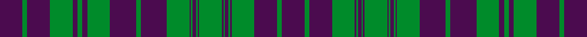

This page is one **sett** — a single exact thread-count. It belongs to the [tartan](/setts/dp14g3dp14g14dp3g3dp3g14dp16g3dp16g14dp1g1dp2g1dp1g14dp1g1dp2g1dp1g14dp14g3dp14/)
(the same proportion at any scale), whose colour order is pattern [BGBGBGBGBGBGBGBGBGBGBGBGBGB](/stripes/bgbgbgbgbgbgbgbgbgbgbgbgbgb/).

Sourced from register-of-tartans.  It is a [27 stripe tartan](/stripes/stripes27/).

Original link https://www.tartanregister.gov.uk/tartanDetails.aspx?ref=2741

2 attestations — the source records this cloth was collapsed from (oldest owns this page)

<ul>
<li>undated — MacRae (Rae) (register-of-tartans, <a href="https://www.tartanregister.gov.uk/tartanDetails.aspx?ref=2741">record</a>)  <em>Wilson's of Bannockburn made two patterns, 'Rae' and 'MacCrae'; Rae was Ross with green for red and all the other stripes in purple; in MacCrae the same treatment was applied to the red MacRae tartan except for the white overchecks which remained. (Scarlett-1990). Wilsons of Bannockburn a weaving firm founded c1770 near Stirling. The Pattern books are in the National Museum of Antiquities, Edinburgh. Copies of the Pattern books and letters are in the Scottish Tartans Society archive.</em></li>
<li>undated — MacRae, (Rae) (weddslist, <a href="http://www.weddslist.com/cgi-bin/tartans/pg.pl?source=sts">record</a>) </li>
</ul>

## Register references

External register numbers recorded for this tartan.

- Scottish Register of Tartans: [2741](https://www.tartanregister.gov.uk/tartanDetails.aspx?ref=2741)
- Scottish Tartans World Register: 100

## Thread count
DP/28 G6 DP28 G28 DP6 G6 DP6 G28 DP32 G6 DP32 G28 DP2 G2 DP4 G2 DP2 G28 DP2 G2 DP4 G2 DP2 G28 DP28 G6 DP/28

One full sett is **696 threads**.

## Palette
<table><thead><tr><th>Colour</th><th>Shade</th><th>OKLCh</th></tr></thead><tbody><tr><td>G</td><td><code style="background-color:#008B2A;">#008B2A</code> <small style="color:#888">#008B2A</small></td><td><small style="color:#888">oklch(55.4% 0.170 145.9)</small></td></tr><tr><td>DP</td><td><code style="background-color:#4B0B4F;">#4B0B4F</code> <small style="color:#888">#4B0B4F</small></td><td><small style="color:#888">oklch(30.1% 0.125 325.4)</small></td></tr></tbody></table>

# Sample pattern

## Nearest tartan variants

The nearest existing variants by ΔTartan distance, with this cloth at the top so the swatches line up against it.

ΔTartan

Threads

Variant

Sett

—

696

<a href="/variants/s27/dp14g3dp14g14dp3g3dp3g14dp16g3dp16g14dp1g1dp2g1dp1g14dp1g1dp2g1dp1g14dp14g3dp14~x2/">MacRae (Rae)</a>

<a href="/ttd/edit/#slug=dp27g6dp27g28dp5g7dp5g28dp31g6dp31g28dp2g2dp4g2dp2g28dp2g2dp4g2dp2g28dp27g6dp27~x2&amp;base=dp14g3dp14g14dp3g3dp3g14dp16g3dp16g14dp1g1dp2g1dp1g14dp1g1dp2g1dp1g14dp14g3dp14~x2" title="compare in the TTD">0.06</a>

1368

<a href="/variants/s27/dp27g6dp27g28dp5g7dp5g28dp31g6dp31g28dp2g2dp4g2dp2g28dp2g2dp4g2dp2g28dp27g6dp27~x2/">MacRae/Rae</a>

<a href="/ttd/edit/#slug=dp25g6dp25g26dp5g7dp5g26w3g7dp29g6dp29g7w3g26dp2g2dp4g2dp2g26dp2g2dp4g2dp2g26dp25g6dp25~x2&amp;base=dp14g3dp14g14dp3g3dp3g14dp16g3dp16g14dp1g1dp2g1dp1g14dp1g1dp2g1dp1g14dp14g3dp14~x2" title="compare in the TTD">2.59</a>

1368

<a href="/variants/s31/dp25g6dp25g26dp5g7dp5g26w3g7dp29g6dp29g7w3g26dp2g2dp4g2dp2g26dp2g2dp4g2dp2g26dp25g6dp25~x2/">MacRae (MacCrae)</a>

## Neighbour map

Every grey dot is one of 13620 variants placed by the first two principal components of the ΔTartan feature space (42% of its variance). Red is this tartan; blue dots are its nearest — click one to open its page.

<svg viewBox="0 0 640 380" role="img" style="max-width:100%;height:auto;border:1px solid #e0e0e0;border-radius:4px;display:block" xmlns="http://www.w3.org/2000/svg"><image href="/nn/cloud.v1.png" width="640" height="380"/><a href="/variants/s27/dp27g6dp27g28dp5g7dp5g28dp31g6dp31g28dp2g2dp4g2dp2g28dp2g2dp4g2dp2g28dp27g6dp27~x2/"><circle cx="374.8" cy="180.4" r="4" fill="#3465a4"><title>MacRae/Rae</title></circle></a><a href="/variants/s31/dp25g6dp25g26dp5g7dp5g26w3g7dp29g6dp29g7w3g26dp2g2dp4g2dp2g26dp2g2dp4g2dp2g26dp25g6dp25~x2/"><circle cx="331.7" cy="161.3" r="4" fill="#3465a4"><title>MacRae (MacCrae)</title></circle></a><circle cx="380.3" cy="178.7" r="5" fill="#c00000"/><text x="320" y="376" text-anchor="middle" font-size="11" fill="#999">ground</text><text x="11" y="190" text-anchor="middle" font-size="11" fill="#999" transform="rotate(-90 11 190)">complexity</text></svg>

ID: /variants/s27/dp14g3dp14g14dp3g3dp3g14dp16g3dp16g14dp1g1dp2g1dp1g14dp1g1dp2g1dp1g14dp14g3dp14~x2/
