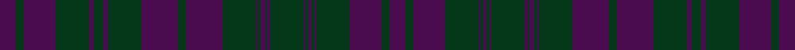

This is one **variant** — a specific cloth: this exact thread count and colourway, with its own
provenance below. It is one weaving of the [sett](/setts/dp27dg12dp54dg56dp10dg14dp10dg56dp62dg12dp62dg56dp4dg4dp8dg4dp4dg56dp4dg4dp8dg4dp4dg56dp54dg12dp27/) (the scale-free proportion — the
same cloth at any scale or shade), whose colour order is pattern [BGBGBGBGBGBGBGBGBGBGBGBGBGB](/stripes/bgbgbgbgbgbgbgbgbgbgbgbgbgb/).

Sourced from tartans-authority.  It is a [27 stripe tartan](/stripes/stripes27/).

Original link [https://www.tartanregister.gov.uk/tartanDetails.aspx?ref=100](https://www.tartanregister.gov.uk/tartanDetails.aspx?ref=100)

Dataset <small>— provenance for this record, inherited from the source manifest</small>

<dl class="dataset-prov">
<dt>source</dt><dd><a href="/sources/tartans-authority/">Scottish Tartans Authority</a></dd>
<dt>data captured from</dt><dd><a href="https://github.com/thetartan/tartan-database/blob/master/data/tartans-authority/data.csv">https://github.com/thetartan/tartan-database/blob/master/data/tartans-authority/data.csv</a></dd>
<dt>data date</dt><dd>1819 <small>(this record)</small></dd>
<dt>licence</dt><dd><a href="https://creativecommons.org/licenses/by-nc-nd/4.0/">CC BY-NC-ND 4.0</a></dd>
</dl>

Capture chain <small>— the hands this data passed through, oldest first; each capture carries its own licence</small>

<ol class="capture-chain">
<li><a href="https://www.tartansauthority.com/">Scottish Tartans Authority</a> <small>the heritage body's archive — its tartan-ferret record browser is retired (links repaired to the SRT, above)</small></li>
<li><a href="https://github.com/thetartan/tartan-database">thetartan/tartan-database</a> <small>2016-2017</small> · <a href="https://creativecommons.org/licenses/by-nc-nd/4.0/">CC BY-NC-ND 4.0</a> <small>Levko Kravets's frozen compilation — the capture we vendored, and where its CC licence text came from</small></li>
<li>this dictionary <small>captured 2026-06-10 · commit 5bf86c7566</small> <small>each re-capture is a git commit to data/sources</small></li>
</ol>

## Register references

External register numbers recorded for this tartan.

- Scottish Tartans Authority (ITI): 100

## Thread count
DP/27 DG12 DP54 DG56 DP10 DG14 DP10 DG56 DP62 DG12 DP62 DG56 DP4 DG4 DP8 DG4 DP4 DG56 DP4 DG4 DP8 DG4 DP4 DG56 DP54 DG12 DP/27

One full sett is **1314 threads**.

## Palette
<table><thead><tr><th>Colour</th><th>Shade</th><th>OKLCh</th></tr></thead><tbody><tr><td>DP</td><td><code style="background-color:#4B0B4F;">#4B0B4F</code> <small style="color:#888">#4B0B4F</small></td><td><small style="color:#888">oklch(30.1% 0.125 325.4)</small></td></tr><tr><td>DG</td><td><code style="background-color:#053819;">#053819</code> <small style="color:#888">#053819</small></td><td><small style="color:#888">oklch(30.0% 0.075 151.3)</small></td></tr></tbody></table>

# Sample pattern

ID: /variants/s27/dp27dg12dp54dg56dp10dg14dp10dg56dp62dg12dp62dg56dp4dg4dp8dg4dp4dg56dp4dg4dp8dg4dp4dg56dp54dg12dp27/
