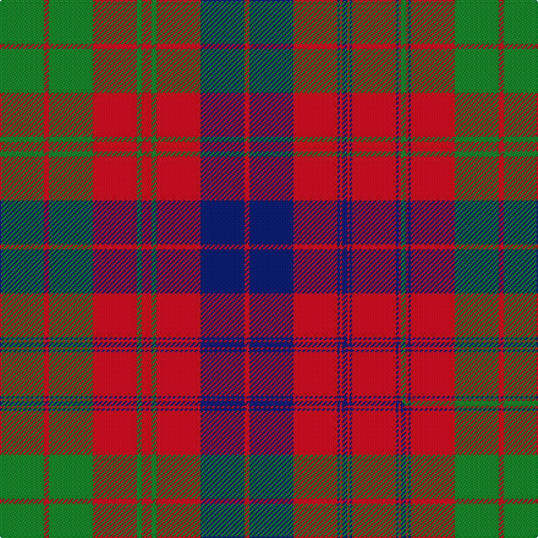

This is one **variant** — a specific cloth: this exact thread count and colourway, with its own
provenance below. It is one weaving of the [sett](/setts/g18r2g18r18g2r4g2r18db18r2db18r18db1r1db2r1db1r18db1r1g2r1db1r18g18r2g18/) (the scale-free proportion — the
same cloth at any scale or shade), whose colour order is pattern [GRGRBRGRBRBRBRBRBRBRGRGRGRG](/stripes/grgrbrgrbrbrbrbrbrbrgrgrgrg/).

Part of the [Ross](/tartans/r/ro/ross-3/) tartan — the named design grouping this sett with its other cloths.

Sourced from tartans-authority.  It is a [27 stripe tartan](/stripes/stripes27/).

Original link [https://www.tartanregister.gov.uk/tartanDetails.aspx?ref=883](https://www.tartanregister.gov.uk/tartanDetails.aspx?ref=883)

2 attestations — the source records this cloth was collapsed from (oldest owns this page)

<ul>
<li>1819 — Ross (Clan) (tartans-authority, <a href="https://www.tartanregister.gov.uk/tartanDetails.aspx?ref=883">record</a>)  <em>There are very many strange/incomplete/errorneous counts for Ross but this is the version usually available in the shops and the count is taken from James Scarlett's "Tartan the Highland Textile" P154 entry No. 374.</em></li>
<li>01/01/2002 — Ross #6 (register-of-tartans, <a href="https://www.tartanregister.gov.uk/tartanDetails.aspx?ref=3557">record</a>)  <em>Many odd thread counts here - may have been halved for display purposes. There is a sample at the Scottish Tartans Society in the MacGregor-Hastie collection. This is the version of Ross tartan usually available in the the shops.</em></li>
</ul>

Dataset <small>— provenance for this record, inherited from the source manifest</small>

<dl class="dataset-prov">
<dt>source</dt><dd><a href="/sources/tartans-authority/">Scottish Tartans Authority</a></dd>
<dt>data captured from</dt><dd><a href="https://github.com/thetartan/tartan-database/blob/master/data/tartans-authority/data.csv">https://github.com/thetartan/tartan-database/blob/master/data/tartans-authority/data.csv</a></dd>
<dt>data date</dt><dd>1819 <small>(this record)</small></dd>
<dt>licence</dt><dd><a href="https://creativecommons.org/licenses/by-nc-nd/4.0/">CC BY-NC-ND 4.0</a></dd>
</dl>

Capture chain <small>— the hands this data passed through, oldest first; each capture carries its own licence</small>

<ol class="capture-chain">
<li><a href="https://www.tartansauthority.com/">Scottish Tartans Authority</a> <small>the heritage body's archive — its tartan-ferret record browser is retired (links repaired to the SRT, above)</small></li>
<li><a href="https://github.com/thetartan/tartan-database">thetartan/tartan-database</a> <small>2016-2017</small> · <a href="https://creativecommons.org/licenses/by-nc-nd/4.0/">CC BY-NC-ND 4.0</a> <small>Levko Kravets's frozen compilation — the capture we vendored, and where its CC licence text came from</small></li>
<li>this dictionary <small>captured 2026-06-10 · commit 5bf86c7566</small> <small>each re-capture is a git commit to data/sources</small></li>
</ol>

## Register references

External register numbers recorded for this tartan.

- Scottish Register of Tartans: [3557](https://www.tartanregister.gov.uk/tartanDetails.aspx?ref=3557)
- Scottish Tartans Authority (ITI): 883
- Scottish Tartans World Register: 883

## Thread count
G/36 R4 G36 R36 G4 R8 G4 R36 DB36 R4 DB36 R36 DB2 R2 DB4 R2 DB2 R36 DB2 R2 G4 R2 DB2 R36 G36 R4 G/36

One full sett is **824 threads**.

## Palette
<table><thead><tr><th>Colour</th><th>Shade</th><th>OKLCh</th></tr></thead><tbody><tr><td>DB</td><td><code style="background-color:#082077;">#082077</code> <small style="color:#888">#082077</small></td><td><small style="color:#888">oklch(30.0% 0.149 265.1)</small></td></tr><tr><td>G</td><td><code style="background-color:#008B2A;">#008B2A</code> <small style="color:#888">#008B2A</small></td><td><small style="color:#888">oklch(55.4% 0.170 145.9)</small></td></tr><tr><td>R</td><td><code style="background-color:#D60020;">#D60020</code> <small style="color:#888">#D60020</small></td><td><small style="color:#888">oklch(55.2% 0.224 25.5)</small></td></tr></tbody></table>

# Sample pattern

## Compared to the master

This cloth is one sett of its design; the master sett (the exemplar the design is anchored on) is below for comparison.

Its **ΔTartan distance** from the master is **1.01** — the same measure the nearest-tartans table ranks by (0 is identical; a re-scale of the same cloth is near 0, a recolour or a different proportion further).

<figure class="master-compare" style="margin:0">

this sett
master sett ★

<figcaption style="color:#888;font-size:smaller">One weave of this sett against the <a href="/setts/g18r2g18r18g2r4g2r18db18r2db18r18db1r1db2r1db1r18db1r1db2r1db1r18g18r2g18/">master sett ★</a>, split on the diagonal: a shared proportion runs seamlessly across it with only the shades shifting; a different proportion breaks on it.</figcaption>
</figure>

## Nearest tartan variants

The nearest existing variants by ΔTartan distance, with this cloth at the top so the swatches line up against it.

ΔTartan

Threads

Variant

Sett

—

824

<a href="/variants/s27/g18r2g18r18g2r4g2r18db18r2db18r18db1r1db2r1db1r18db1r1g2r1db1r18g18r2g18~x2/">Ross (Clan)</a>

<a href="/ttd/edit/#slug=g18r2g18r18g2r4g2r18db18r2db18r18db1r1db2r1db1r18db1r1db2r1db1r18g18r2g18~x2&amp;base=g18r2g18r18g2r4g2r18db18r2db18r18db1r1db2r1db1r18db1r1g2r1db1r18g18r2g18~x2" title="compare in the TTD">1.01</a>

824

<a href="/variants/s27/g18r2g18r18g2r4g2r18db18r2db18r18db1r1db2r1db1r18db1r1db2r1db1r18g18r2g18~x2/">Ross Clan Tartan</a>

<a href="/ttd/edit/#slug=g18r2g18r18g2r4g2r18db18r2db18r18db1r1db2r1db1r18db1r1db2r1db1r18g18r2g18&amp;base=g18r2g18r18g2r4g2r18db18r2db18r18db1r1db2r1db1r18db1r1g2r1db1r18g18r2g18~x2" title="compare in the TTD">1.01</a>

412

<a href="/variants/s27/g18r2g18r18g2r4g2r18db18r2db18r18db1r1db2r1db1r18db1r1db2r1db1r18g18r2g18/">Ross</a>

<a href="/ttd/edit/#slug=db18r2db18r18g2r4g2r18g18r2g18r2g18r18db1r1db2r1db1r18~x2&amp;base=g18r2g18r18g2r4g2r18db18r2db18r18db1r1db2r1db1r18db1r1g2r1db1r18g18r2g18~x2" title="compare in the TTD">1.49</a>

656

<a href="/variants/s20/db18r2db18r18g2r4g2r18g18r2g18r2g18r18db1r1db2r1db1r18~x2/">Ross</a>

<a href="/ttd/edit/#slug=g8r1g8r8db1r1db2r1db1r8db1r1db2r1db1r8db8r1db8r8g1r2g1r8g8r1g8~x2&amp;base=g18r2g18r18g2r4g2r18db18r2db18r18db1r1db2r1db1r18db1r1g2r1db1r18g18r2g18~x2" title="compare in the TTD">1.55</a>

396

<a href="/variants/s27/g8r1g8r8db1r1db2r1db1r8db1r1db2r1db1r8db8r1db8r8g1r2g1r8g8r1g8~x2/">Ross</a>

<a href="/ttd/edit/#slug=r1g17r2db2r17g2r2g2r17db2r2g17r2db17r2g2r17g2r2g2r17g2r2g17r2g17r2db2r17g2r1~x4&amp;base=g18r2g18r18g2r4g2r18db18r2db18r18db1r1db2r1db1r18db1r1g2r1db1r18g18r2g18~x2" title="compare in the TTD">1.66</a>

1672

<a href="/variants/s31/r1g17r2db2r17g2r2g2r17db2r2g17r2db17r2g2r17g2r2g2r17g2r2g17r2g17r2db2r17g2r1~x4/">Robertson</a>

<a href="/ttd/edit/#slug=g8r4g1r1g1r24db8g4r1g1r1g4r8g1r1g1r1db8g8r2g4&amp;base=g18r2g18r18g2r4g2r18db18r2db18r18db1r1db2r1db1r18db1r1g2r1db1r18g18r2g18~x2" title="compare in the TTD">1.89</a>

172

<a href="/variants/s21/g8r4g1r1g1r24db8g4r1g1r1g4r8g1r1g1r1db8g8r2g4/">Matheson</a>

<a href="/ttd/edit/#slug=g8r4g1r1g1r24db8g4r1g1r1g4r8g1r1g1r1db8g8r2g4~x2&amp;base=g18r2g18r18g2r4g2r18db18r2db18r18db1r1db2r1db1r18db1r1g2r1db1r18g18r2g18~x2" title="compare in the TTD">1.89</a>

344

<a href="/variants/s21/g8r4g1r1g1r24db8g4r1g1r1g4r8g1r1g1r1db8g8r2g4~x2/">Matheson</a>

<a href="/ttd/edit/#slug=g8r4g1r1g1r14db8g4r1g1r1g4r8g1r1g1r1db8g8r2g4~x4&amp;base=g18r2g18r18g2r4g2r18db18r2db18r18db1r1db2r1db1r18db1r1g2r1db1r18g18r2g18~x2" title="compare in the TTD">1.95</a>

608

<a href="/variants/s21/g8r4g1r1g1r14db8g4r1g1r1g4r8g1r1g1r1db8g8r2g4~x4/">Matheson (Clan)</a>

<a href="/ttd/edit/#slug=db10r1db1r1g10r13g2r13g10db10r1db1~x2&amp;base=g18r2g18r18g2r4g2r18db18r2db18r18db1r1db2r1db1r18db1r1g2r1db1r18g18r2g18~x2" title="compare in the TTD">1.97</a>

270

<a href="/variants/s12/db10r1db1r1g10r13g2r13g10db10r1db1~x2/">Inverness Fencibles</a>

<a href="/ttd/edit/#slug=db10r1db1r1g10r13g2r13g10db10r1db1r1db10g10r13g2r13g10r1db1r1db5~x4&amp;base=g18r2g18r18g2r4g2r18db18r2db18r18db1r1db2r1db1r18db1r1g2r1db1r18g18r2g18~x2" title="compare in the TTD">2.18</a>

1060

<a href="/variants/s23/db10r1db1r1g10r13g2r13g10db10r1db1r1db10g10r13g2r13g10r1db1r1db5~x4/">Fraser</a>

## Neighbour map

Every grey dot is one of 13621 variants placed by the first two principal components of the ΔTartan feature space (42% of its variance). Red is this tartan; blue dots are its nearest — click one to open its page.

<svg viewBox="0 0 640 380" role="img" style="max-width:100%;height:auto;border:1px solid #e0e0e0;border-radius:4px;display:block" xmlns="http://www.w3.org/2000/svg"><image href="/nn/cloud.v1.png" width="640" height="380"/><a href="/variants/s27/g18r2g18r18g2r4g2r18db18r2db18r18db1r1db2r1db1r18db1r1db2r1db1r18g18r2g18~x2/"><circle cx="275.8" cy="134.2" r="4" fill="#3465a4"><title>Ross Clan Tartan</title></circle></a><a href="/variants/s27/g18r2g18r18g2r4g2r18db18r2db18r18db1r1db2r1db1r18db1r1db2r1db1r18g18r2g18/"><circle cx="275.8" cy="134.2" r="4" fill="#3465a4"><title>Ross</title></circle></a><a href="/variants/s20/db18r2db18r18g2r4g2r18g18r2g18r2g18r18db1r1db2r1db1r18~x2/"><circle cx="273.4" cy="151.9" r="4" fill="#3465a4"><title>Ross</title></circle></a><a href="/variants/s27/g8r1g8r8db1r1db2r1db1r8db1r1db2r1db1r8db8r1db8r8g1r2g1r8g8r1g8~x2/"><circle cx="236.8" cy="173.3" r="4" fill="#3465a4"><title>Ross</title></circle></a><a href="/variants/s31/r1g17r2db2r17g2r2g2r17db2r2g17r2db17r2g2r17g2r2g2r17g2r2g17r2g17r2db2r17g2r1~x4/"><circle cx="306.4" cy="125.8" r="4" fill="#3465a4"><title>Robertson</title></circle></a><a href="/variants/s21/g8r4g1r1g1r24db8g4r1g1r1g4r8g1r1g1r1db8g8r2g4/"><circle cx="307.4" cy="119.4" r="4" fill="#3465a4"><title>Matheson</title></circle></a><a href="/variants/s21/g8r4g1r1g1r24db8g4r1g1r1g4r8g1r1g1r1db8g8r2g4~x2/"><circle cx="307.4" cy="119.4" r="4" fill="#3465a4"><title>Matheson</title></circle></a><a href="/variants/s21/g8r4g1r1g1r14db8g4r1g1r1g4r8g1r1g1r1db8g8r2g4~x4/"><circle cx="248.8" cy="160.5" r="4" fill="#3465a4"><title>Matheson (Clan)</title></circle></a><a href="/variants/s12/db10r1db1r1g10r13g2r13g10db10r1db1~x2/"><circle cx="241.2" cy="166.4" r="4" fill="#3465a4"><title>Inverness Fencibles</title></circle></a><a href="/variants/s23/db10r1db1r1g10r13g2r13g10db10r1db1r1db10g10r13g2r13g10r1db1r1db5~x4/"><circle cx="231.3" cy="165.7" r="4" fill="#3465a4"><title>Fraser</title></circle></a><circle cx="277.2" cy="134.5" r="5" fill="#c00000"/><text x="320" y="376" text-anchor="middle" font-size="11" fill="#999">ground</text><text x="11" y="190" text-anchor="middle" font-size="11" fill="#999" transform="rotate(-90 11 190)">complexity</text></svg>

ID: /variants/s27/g18r2g18r18g2r4g2r18db18r2db18r18db1r1db2r1db1r18db1r1g2r1db1r18g18r2g18~x2/
